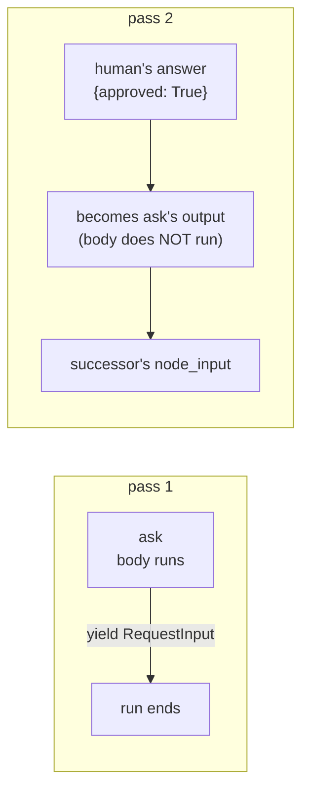

# 4.2 — Where the answer lands when the run comes back

## One-line answer

By default the human's answer does **not** go back into the node that asked — the asking node's body
never runs again, and the answer is handed forward to its successor as that node's input, which is
why the next node is the one that has to read it.

## The story

You are at a small restaurant and you tell the waiter, twice, no chilli. The child cannot eat it.

He nods and goes away. He does not come back to confirm that he has told the cook. He does not
return to your table to say *the cook has agreed to your request*. What comes back, later, is food.

If the food arrives without chilli, the message got through. If it arrives with chilli, it did not.
Either way the check happens **at the plate**, not at the waiter's return trip, because there is no
return trip. The instruction went forward into the kitchen and the only place its effect becomes
visible is at the next step.

This trips people up when they complain. They say "but I *told* him", and that is true and beside the
point. Telling him was one step, and the thing that decides what you eat is a different step,
downstream, performed by somebody who was never at your table.

## The idea in plain language

Part [4.1](4.1-a-node-that-stops-and-asks.md) left the run paused: the `ask` node yielded a
`RequestInput` and the process ended. Now the shift lead answers and a second run resumes the
invocation.

The obvious mental model is that the answer goes back to the node that asked — that `ask` wakes up
where it left off, holding the reply. **That is not what happens by default**, and building on the
wrong model produces a gate that does nothing, which is part
[4.3](4.3-the-human-said-no-and-the-reply-went-anyway.md).

What actually happens is stated on `adk.dev/graphs/dynamic/`, fetched 2026-09-06. When
`rerun_on_resume` is false — the default — *"the resume payload is routed to the node's successor as
input, bypassing the interrupted node."*

Three consequences follow, and they are the whole part:

- **The asking node's body does not run a second time.** Whatever it would have done with the answer,
  it does not do.
- **The answer becomes the asking node's output.** From the graph's point of view, `ask` is a node
  that produced a value; the value just happens to have come from a person rather than from code.
- **The successor receives it as its `node_input`.** So the node immediately downstream of the pause
  is the one holding the human's decision, whether or not it was written to expect one.

That last consequence is the design constraint. The node that reads the answer is not the node that
asked the question, and if the successor was written by somebody who did not know a human had been
inserted upstream, it will receive a dict it does not look at.

One term, defined once: **`resume_inputs`** is a mapping on the node context from interrupt id to the
answer that arrived. It is how a node reads a reply *when it does run again* — which, by default, it
does not. Part [4.4](4.4-asking-the-same-person-twice.md) is about the setting that changes this and
what it costs.

## Why Sutra needs it

Day 58's triage graph is a chain of stations, and part
[6.1](../06-wiring-the-desk/6.1-the-sixth-station.md) inserts the gate into it. Getting this
mechanism right decides where the guard clause goes: if the answer lands on the successor, then the
successor — the node that actually sends the reply — is where the decision has to be honoured.

Put it in the wrong place and you get a graph that pauses correctly, asks a real person, records a
real answer, and sends the email regardless. That is measured in the next part, and it is the sharpest
failure of this whole day.

## The mechanism

`rerun.py` exists to answer exactly one question: what ran, and what did the successor see?

```bash
cd days/day-64-approval-gates-build/lab
uv run python rerun.py
```

**Line by line:**

- `BODY_RUNS` is a module-level list that the `ask` node appends to every time its body executes.
  Counting executions is the only way to answer "did it run again" without guessing.
- The graph is `ask -> after`, where `after(node_input)` returns `{"successor_saw": node_input}`. It
  does nothing but report what it was handed, which is the measurement.
- Pass 1 runs the graph and captures the invocation id. Pass 2 sends
  `create_request_input_response(INTERRUPT, {"approved": True, "by": "shift_lead"})` against that
  same id — the framework's own helper for constructing a reply to an interrupt.
- The default arm passes neither `--rerun` nor `--aware`, so `rerun_on_resume` is unset and the node
  does not consult `resume_inputs`.

Measured on 2026-09-06:

```text
rerun_on_resume=False   node reads resume_inputs=False

  ask body executed   1 time(s)
  asked again         no
  output              {'approved': True, 'by': 'shift_lead'}
  output              {'successor_saw': {'approved': True, 'by': 'shift_lead'}}
```

Four lines, and each is a separate fact.

**`ask body executed 1 time(s)`** — across both passes. The node ran once, in pass 1, and never
again. Any code you write inside `ask` after the `yield` is code that will not execute on the resume.

**`asked again no`** — no second `RequestInput` was emitted. The run did not loop back and re-ask.

**`output {'approved': True, 'by': 'shift_lead'}`** — this is the interesting one. That dict is what
*the shift lead sent*, and it is being reported as an **output of the `ask` node**. The framework has
taken the human's reply and made it the node's result. The waiter did not come back; the instruction
went forward.

**`output {'successor_saw': {...}}`** — and `after` received it as its `node_input`. The successor is
holding the decision.



Note what this buys, because it is not an accident of implementation. A node that only asks needs no
state, no re-entrancy and no memory of where it was. It is a pure question. All the complexity of
"what do we do with the answer" lives in one place downstream, and that place is an ordinary node
that can be tested by calling it with a dict.

## When it breaks

The break is a successor that was not written for this, and it surfaces as a validation error rather
than a wrong answer — which is the lucky version.

Day 58's stations are typed: each declares the shape it accepts, and ADK coerces the incoming
`node_input` into that type at the seam, before the body runs. Put a pause in front of a typed node
and the human's answer — a dict with `approved` and `by` — arrives where a drafted reply was expected:

```bash
cd days/day-64-approval-gates-build/lab
uv run python -c "
import asyncio
import warnings

warnings.filterwarnings('ignore', message=r'.*EXPERIMENTAL.*')
import rerun
from google.adk import Workflow
from google.adk.apps import App
from google.adk.apps.app import ResumabilityConfig
from google.adk.runners import InMemoryRunner
from google.adk.workflow.utils._workflow_hitl_utils import create_request_input_response
from google.genai import types


def send(node_input: str):
    return {'sent': node_input}


async def main():
    wf = Workflow(name='typed', edges=[('START', rerun.build(False, False), send)])
    app = App(
        name='typed',
        root_agent=wf,
        resumability_config=ResumabilityConfig(is_resumable=True),
    )
    runner = InMemoryRunner(app=app)
    s = await runner.session_service.create_session(app_name='typed', user_id='u')
    inv = None
    async for e in runner.run_async(
        user_id='u',
        session_id=s.id,
        new_message=types.Content(role='user', parts=[types.Part(text='go')]),
    ):
        inv = e.invocation_id
    reply = create_request_input_response(rerun.INTERRUPT, {'approved': True, 'by': 'shift_lead'})
    async for e in runner.run_async(
        user_id='u',
        session_id=s.id,
        new_message=types.Content(role='user', parts=[reply]),
        invocation_id=inv,
    ):
        pass


asyncio.run(main())
"
```

**Line by line:**

- `send(node_input: str)` is the successor, annotated `str` — a perfectly reasonable signature for a
  node that expects a drafted reply, and the shape Day 58's stations use.
- `rerun.build(False, False)` reuses the asking node at its default setting, so this is the exact
  mechanism measured above with one thing changed: the successor's type.
- The answer sent is a dict, because that is what an approval is.

Measured on 2026-09-06:

```traceback
pydantic_core._pydantic_core.ValidationError: 1 validation error for str
  Input should be a valid string [type=string_type, input_value={'approved': True, 'by': 'shift_lead'}, input_type=dict]
    For further information visit https://errors.pydantic.dev/2.13/v/string_type
```

Read `input_value={'approved': True, 'by': 'shift_lead'}`. That is the human's answer, arriving at a
node that expected a draft. The error is loud and it names the offending value, which makes it a good
failure — you find it the first time you run the graph.

Note what the error does **not** say: it names `str`, not `send`. The validation happens at the seam
where the input is coerced into the annotated type, so the message tells you the type that was
violated and not the node that violated it. On a graph with several typed stations you will be
matching `input_value` against your own nodes to work out where you are.

The dangerous version is a successor annotated loosely, or not at all. Then the dict arrives, nothing
raises, and the node carries on doing whatever it does with an input it does not understand. That is
part [4.3](4.3-the-human-said-no-and-the-reply-went-anyway.md).

## In production

**What a professional writes instead.** They do not put the pause directly in front of a working
node. They insert a small **decision node** between them whose only job is to receive the answer,
validate it, and route: approved goes one way, refused goes another. Then the working node keeps its
own signature and knows nothing about humans, and the graph shows the decision as a visible fork
rather than as an argument hidden in somebody's `node_input`. Part
[6.1](../06-wiring-the-desk/6.1-the-sixth-station.md) builds the desk that way.

**What degrades at scale.** The answer travels as the node's output, which means it goes into the
event stream and is stored. Everything the approver's client sends is now in the session, for ever —
including any free-text reason they typed. Decide what belongs in the reply payload before you ship,
because you cannot un-store it, and Day 69's data boundaries apply to it.

**The failure mode that only appears with real traffic.** The successor gets the answer *and nothing
else*. Whatever the asking node was holding — the drafted reply, the ticket, the classification — is
not in the successor's `node_input` any more, because the answer replaced it. If the send node needs
both the decision and the draft, it must read the draft from the shared state rather than from its
input, and the first version of every graph built this way gets that wrong.

**The review comment a senior engineer leaves:** *"The send node's `node_input` is the approval, not
the draft. It is reading `node_input['body']` and that key does not exist after a resume — pull the
draft from state and use `node_input` only for the decision."*

**The interview question:** *"When your paused workflow resumes, where does the human's answer go?"*
An honest answer: *"Not back into the node that asked — by default that node's body never runs again.
The reply becomes that node's output and is handed to its successor as input, so the node downstream
is the one holding the decision. I measured it: the asking node's body ran once across both passes,
and the successor saw the approval dict. It matters because people put the guard clause in the asking
node, where it can never run, and then the graph pauses, asks a real person, and proceeds regardless
of the answer."*

## Check yourself

```bash
cd days/day-64-approval-gates-build/lab
uv run python rerun.py
```

Add a `print("after the yield")` line at the end of the `ask` function in `rerun.py` and re-run both
passes. Say why it never appears.

**Out loud, without scrolling up:** the shift lead's answer becomes the output of which node, and
arrives as the input of which node?

**Next:** [4.3 — The human said no and the reply went anyway](4.3-the-human-said-no-and-the-reply-went-anyway.md).
