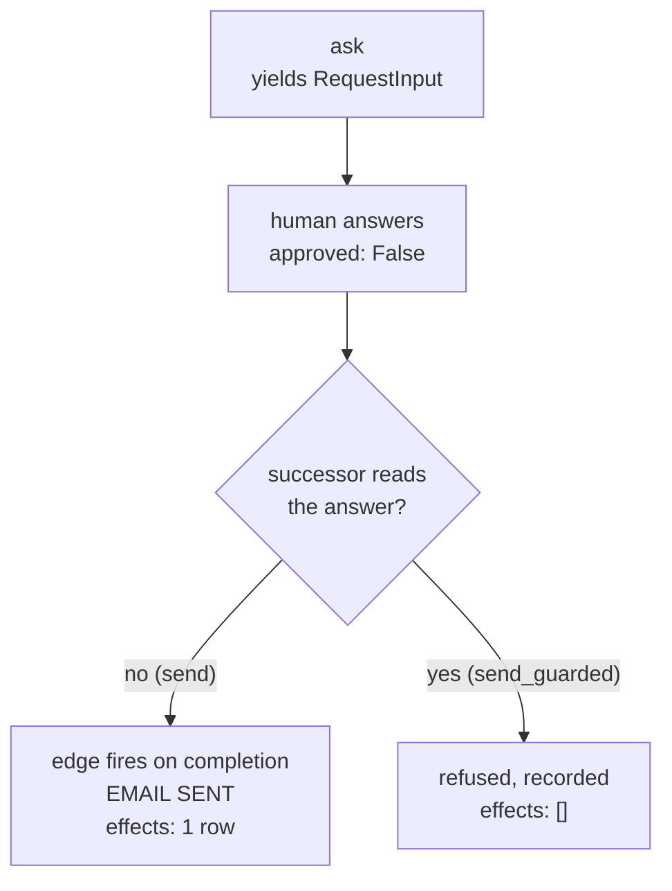

# 4.3 — The human said no and the reply went anyway

## One-line answer

A graph that pauses, asks a real person and receives a real rejection will still run the next node,
because **an edge fires on completion and not on approval** — the refund email goes out with
`approved: False` sitting in the node's own input, and the fix is one line in the successor.

## The story

A school has a rule that a child may only leave early if a parent comes for them.

A boy's uncle turns up at the gate at two o'clock. The guard does the right thing: he does not open
the gate, he phones the office, and he asks. The office says no — the mother has not authorised
anybody else today.

While that call is happening, the bell for games rings, the side field gate is opened the way it is
opened every afternoon, and the boy walks out through it with the rest of his class.

Nobody disobeyed anybody. The guard asked. The office answered. The answer was correct and it was
*no*. And the thing the answer was supposed to prevent happened anyway, on a schedule that had never
been told about the phone call, because the school's routine did not have a step in it that said
*wait for the office before the two o'clock bell*.

Asking is not stopping. Asking is only stopping if something downstream is waiting on the answer.

## The idea in plain language

Part [4.2](4.2-where-the-answer-lands.md) established the mechanism: the human's answer becomes the
asking node's output, and is handed to the successor as its input.

Now put that next to how a graph works. Day 53 established it: an **edge** says what happens next
([`days/day-53-graph-workflow-runtime/`](../../../day-53-graph-workflow-runtime/LESSON.md)). An edge
from `ask` to `send` means *when `ask` finishes, run `send`*. It does not mean *when `ask` succeeds*,
and it certainly does not mean *when the human says yes* — the graph has no idea what a human is.

So a pause on its own is not a gate. It is a **delay with a question attached**. The graph stopped,
somebody was asked, and when the answer arrived the graph did the only thing an edge can do: it
continued.

That leaves exactly two ways to make a rejection mean something, and this day builds one of each:

- **The successor reads the answer.** One conditional at the top of the node that does the work. It
  is the smallest possible fix and it is what this part measures.
- **The edge is routed.** The decision node emits a route, and approved and refused go to different
  nodes. Part [6.1](../06-wiring-the-desk/6.1-the-sixth-station.md) builds the desk this way, because
  a fork you can see in the graph beats a conditional you have to open a file to find.

One term, defined once: **fail-open** describes a control that, when something goes wrong or is
overlooked, lets the action through. Its opposite is fail-closed. A pause with an unguarded successor
is the worst kind of fail-open, because it looks like a control from every angle — there is a pause,
there is a question, there is a real human, there is an audit record with the word *rejected* in it —
and the action happens.

## Why Sutra needs it

Phase 9's gate is *a human approved the write*, and Day 65 audits it by trying to break it. This is
the failure that audit is looking for.

It is also the one that would survive every test in this repository up to now. The graph pauses:
green. A human is asked: green. The answer is stored in the session: green. The audit trail shows a
rejection: green. Every check passes and the customer received the refund email that a shift lead
declined. Only a check that asserts on the **effect** catches it, which is why part
[6.3](../06-wiring-the-desk/6.3-the-check-that-goes-red-when-the-gate-goes.md) is written the way it
is.

## The mechanism

`nodegate.py` has two tail nodes and they differ by one conditional. Here they are together:

```python
def send(node_input):
    """Send the reply. Note what this node does and does not look at."""
    return _actions.send_reply("4655", "email", "Your refund is on its way.")


def send_guarded(node_input):
    """The same node, with the one line that turns a pause into a gate."""
    if not (isinstance(node_input, dict) and node_input.get("approved") is True):
        return {"refused": "4655", "because": node_input}
    return _actions.send_reply("4655", "email", "Your refund is on its way.")
```

**Line by line:**

- `send` takes `node_input` and never reads it. This is not a strawman — it is the natural way to
  write a node that sends a fixed drafted reply, and it was correct until somebody put a pause in
  front of it.
- `send_guarded` checks `node_input.get("approved") is True` before doing anything.
- `is True` rather than truthiness is deliberate. A missing key gives `None`, a malformed payload
  might give the string `"false"`, and both are truthy-adjacent traps; requiring the actual boolean
  `True` means anything unexpected fails closed.
- `isinstance(node_input, dict)` guards the case where the successor is reached by a path that did
  not come through the pause at all — on a bigger graph that is a real path, and `.get` on a string
  would raise.
- The refusal **returns a value** rather than raising. A rejection is a normal outcome, not an error
  — that is part [2.3](../02-the-tool-gate/2.3-a-rejection-is-not-a-failure.md)'s distinction, and
  raising here would surface a declined refund as a crashed run.

Now run the unguarded graph and tell the shift lead to say no:

```bash
cd days/day-64-approval-gates-build/lab
uv run python nodegate.py --reject
```

**Line by line:**

- `--reject` makes the second pass send `{"approved": False, ...}` instead of `True`. Everything else
  is identical.
- Without `--guarded`, the tail node is `send` — the one that does not look.

Measured on 2026-09-06:

```text
graph: ask -> send    human says: no

  pass 1 - the run starts
    paused: adk_request_input id=approval:4655
            message: Send the refund reply for ticket 4655 to the customer by email?
    effects after pass 1: []

  pass 2 - the answer comes back
    reply_gate output: {'approved': False, 'by': 'shift_lead', 'at': '2026-09-05T21:40:00Z'}
    reply_gate output: {'sent': '4655', 'channel': 'email', 'chars': '26'}

    effects after pass 2: [('send_reply', '4655', 'email')]
    reply left the building: True
```

Read those two `reply_gate output` lines one after the other, because they are two events in the same
stream, in order.

The first says **`'approved': False`**. The shift lead refused. That is in the session, permanently,
and any audit trail built from these events will correctly report a rejection.

The second says **`'sent': '4655'`**. The email went.

`reply left the building: True`. A person said no and the customer got the refund confirmation
anyway, and there is no error anywhere — the run completed successfully, exit code zero.

Now the same rejection through the guarded tail:

```bash
cd days/day-64-approval-gates-build/lab
uv run python nodegate.py --guarded --reject
```

**Line by line:**

- `--guarded` swaps the tail node to `send_guarded`. The graph shape, the pause, the interrupt id and
  the answer are unchanged.
- This is a one-node substitution, which is the point: nothing about the *gate* changed, because the
  gate was never the thing that was missing.

Measured on 2026-09-06:

```text
graph: ask -> send_guarded    human says: no

  pass 2 - the answer comes back
    reply_gate output: {'approved': False, 'by': 'shift_lead', 'at': '2026-09-05T21:40:00Z'}
    reply_gate output: {'refused': '4655', 'because': {'approved': False, 'by': 'shift_lead', 'at': '2026-09-05T21:40:00Z'}}

    effects after pass 2: []
    reply left the building: False
```

`effects after pass 2: []`. And the second output now carries `because`, so the refusal records *what
it was refusing on* — the whole answer, not a boolean, which is what makes the trail in part
[5.1](../05-the-record/5.1-the-decision-is-already-written-down.md) worth reading.



## When it breaks

The guard is there and it still fails open, because it was written with truthiness instead of
identity. Watch four answers go past both versions:

```bash
cd days/day-64-approval-gates-build/lab
uv run python -c "
import _actions
import nodegate


def send_loose(node_input):
    if not node_input.get('approved'):
        return {'refused': '4655'}
    return _actions.send_reply('4655', 'email', 'Your refund is on its way.')


answers = [
    ('a clean rejection', {'approved': False}),
    ('the string false', {'approved': 'false'}),
    ('a missing key', {'reason': 'not today'}),
    ('a clean approval', {'approved': True}),
]
for label, answer in answers:
    _actions.reset()
    send_loose(answer)
    loose = len(_actions.EFFECTS)
    _actions.reset()
    nodegate.send_guarded(answer)
    strict = len(_actions.EFFECTS)
    print(f'  {label:<20} loose sent: {loose}   strict sent: {strict}')
"
```

**Line by line:**

- `send_loose` is the guard as most people write it first: `if not node_input.get('approved')`. It
  reads the answer, which already puts it ahead of `send`.
- The four answers are the shapes that actually arrive: a proper rejection, a client that serialised
  the boolean as a string, a payload where the field is absent, and a proper approval.
- Both versions are called on the same answer with the ledger reset in between, so the two numbers
  are directly comparable.

Measured on 2026-09-06:

```text
  a clean rejection    loose sent: 0   strict sent: 0
  the string false     loose sent: 1   strict sent: 0
  a missing key        loose sent: 0   strict sent: 0
  a clean approval     loose sent: 1   strict sent: 1
```

`the string false` is the row that matters. `'false'` is a non-empty string, so `not 'false'` is
`False`, so the loose guard treats a rejection as an approval and sends the email. The strict guard
requires the boolean `True` and refuses.

This is not hypothetical: a client that renders the answer into a form field, or a queue that carries
JSON through a string-typed column, produces exactly `'false'`. The guard is present, the code review
passed it, and it inverts a human's decision on one class of input.

## In production

**What a professional writes instead.** They do not let a raw payload reach the guard. The reply is
parsed into a typed object at the boundary — ADK's `RequestInput` has a `response_schema` field for
exactly this, verified on the installed package — so `'false'` is rejected as malformed at the seam
rather than being interpreted downstream. A decision is too important to be inferred from
truthiness, and a schema is how you stop inferring.

**What degrades at scale.** Every node downstream of a pause needs the guard, not just the first one.
A graph where the approved path is five nodes long has five places somebody can add a sixth node that
does not check — and the guard is invisible in the graph's shape, so a reviewer looking at the
diagram cannot see which nodes are protected. That is the argument for routing the edge instead: a
fork is visible, a conditional is not.

**The failure mode that only appears with real traffic.** The rejection arrives for a run that has
already been resumed by something else — a retry, a duplicate delivery, an operator clicking resume.
The guard runs, sees the approval from the first resume, and sends; the rejection lands afterwards
and refuses a thing that has already happened. Order matters, and part
[3.4](../03-binding-the-answer/3.4-one-approval-delivered-twice.md)'s idempotency key is what makes
"already happened" detectable.

**The review comment a senior engineer leaves:** *"The graph pauses for approval and then the send
node runs unconditionally. An edge fires when the previous node finishes, not when a human agrees —
right now a rejection produces an audit record saying 'refused' and an email in the customer's inbox.
Either guard the node or route the edge, and add a test that asserts on the effect rather than on the
event."*

**The interview question:** *"You added a human approval step to a workflow. How do you know it
works?"* An honest answer: *"By making the human say no and then checking that the effect did not
happen — not that the pause happened. The bug I have actually shipped is a graph that paused, asked,
recorded a rejection, and sent the email anyway, because the edge to the next node fires on
completion rather than on approval. Everything downstream of a pause has to read the answer, or the
edge has to be routed so a rejection goes somewhere else. And the check has to be `is True`, because
a client that sends the string `'false'` gets through a truthiness test."*

## Check yourself

```bash
cd days/day-64-approval-gates-build/lab
uv run python nodegate.py --reject
uv run python nodegate.py --guarded --reject
```

Compare the last line of each. Then run the loose-guard snippet above and say which of the four rows
would have reached a real customer.

**Out loud, without scrolling up:** the graph paused, a human was asked, and the answer was recorded
as `approved: False`. Why did the email still go out?

**Next:** [4.4 — Asking the same person the same question twice](4.4-asking-the-same-person-twice.md).
