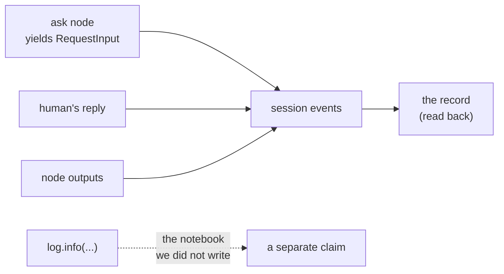

# 5.1 — The decision is already written down

## One-line answer

You do not write an audit log for an approval — the pause, the payload and the answer are all
**already events in the session**, so the record is something you read back out, and a trail you have
to write separately is a trail that can disagree with what happened.

## The story

The passbook is a small booklet and the bank updates it from a printer at the counter.

You do not write in it. There is no line where you record what you think happened. You hand it over,
the machine chatters, and it comes back with rows added — date, particulars, withdrawal, deposit,
balance. Every row is a thing the bank did, printed by the system that did it.

That is why it settles arguments. If you kept your own notebook of transactions, and the notebook
disagreed with the bank, the notebook would prove nothing except that somebody wrote in it. Your
notebook is a claim. The passbook is a **printout of the ledger**, and the ledger is the thing that
actually moved the money.

The distinction is worth being precise about, because it is easy to build the notebook by accident.
A record is trustworthy when the act of doing the thing and the act of recording it are the same act.
The moment they are two acts, they can differ, and the one you will discover is different is the one
you needed.

## The idea in plain language

At every point in this day, something has been stored — not because anybody wrote logging code, but
because that is how the runtime works.

Day 60 established the foundation: the event log **is** the run
([`days/day-60-durable-execution/`](../../../day-60-durable-execution/LESSON.md)). A session is a
sequence of events, the runtime appends to it as things happen, and resuming a run means reading it
back. Every mechanism in sections 2 to 4 rode on that:

| What happened | The event it left |
| --- | --- |
| The node asked | a function call, `adk_request_input`, carrying the message and payload |
| The human answered | a function response, carrying the reply |
| The next node ran | its output |

So the four questions an approval audit asks — **what was proposed, what was the approver shown, who
answered, and what happened next** — all have answers sitting in the session already. Reconstructing
the record is a read, not a write.

This is worth insisting on because the alternative is so natural. You add an approval gate, somebody
asks for an audit trail, and you write `log.info("approval granted", ...)` next to the code that
grants it. That line is a notebook. It runs only if that path runs, it says what its author believed
rather than what the runtime did, and the first time somebody edits the code around it without
editing it, it starts lying.

One term, defined once: a **derived record** is one computed from primary data rather than written
alongside it. Its correctness is a property of the derivation, which you can test, rather than of
every call site remembering to do the right thing, which you cannot.

## Why Sutra needs it

Day 65's gate asks the desk to answer *who approved what, on what evidence, when*. It asks that of a
run that has already finished, possibly on a different day, from a repository that was not watching
at the time.

If the answer requires a log line that somebody remembered to write, the gate is auditing the
diligence of whoever wrote the code. If the answer is read back out of the session, the gate is
auditing what happened. Part [5.2](5.2-what-the-record-has-to-answer.md) is about what has to be in
it for that reading to be worth anything.

## The paper behind it

> **Principles of transaction-oriented database recovery** · `doi:10.1145/289.291` · 1983 ·
> <https://doi.org/10.1145/289.291>

Its claim, in one sentence: a system survives failure by keeping a **log of what it did** that is
written durably as the work happens, so that after a crash the log is the authority on which effects
occurred.

Day 47 teaches it:
[`papers/01-transaction-oriented-recovery.md`](../../../day-47-persistent-sessions/papers/01-transaction-oriented-recovery.md).
The idea this part takes is that the log is not a report *about* the work — it is the record the work
itself produces, which is exactly why it can be trusted to reconstruct state afterwards. An audit
trail derived from the event log inherits that property; one written beside it does not.

## The mechanism

`trail.py` runs the gated graph and then reads the record back out of the session afterwards. Nothing
in it writes an audit entry.

```bash
cd days/day-64-approval-gates-build/lab
uv run python trail.py
```

**Line by line:**

- The `ask` node's `payload` carries the proposal **and** `policy_version` from `_policy.version()`.
  That is the one piece of deliberate design: the record must say which version of the policy
  produced the question, or a later reader cannot tell whether a decision was correct under the rules
  of the day.
- After both passes, the script walks `session.events` and pulls out the request, the response and
  the outputs. `REQUEST_INPUT_FUNCTION_CALL_NAME` is ADK's own constant for the pause's call name, so
  the reader matches on the framework's identifier rather than on a hard-coded string.
- The four keys of the printed record — `asked`, `shown`, `answered`, `then` — are the four audit
  questions, in order.

Measured on 2026-09-06:

```text
events stored in the session: 10

the approval record, read back out of them:

  {
    "asked": "Send the refund reply for ticket 4655 to the customer by email?",
    "shown": {
      "ticket": "4655",
      "channel": "email",
      "resolution": "refund",
      "policy_version": 3
    },
    "answered": {
      "approved": true,
      "by": "shift_lead",
      "at": "2026-09-05T21:40:00Z"
    },
    "then": [
      {
        "approved": true,
        "by": "shift_lead",
        "at": "2026-09-05T21:40:00Z"
      },
      {
        "sent": "4655",
        "channel": "email",
        "chars": "26"
      }
    ]
  }

  effects: [('send_reply', '4655', 'email')]
```

Ten events, and none of them was written by audit code.

**`asked`** is the exact sentence the approver saw, recovered from the pause event. Not a
reconstruction of what the sentence would have been — the string that was actually sent.

**`shown`** is the payload, including `policy_version: 3`. A year from now, when the policy file has
been edited twice, this row still says which rules were in force.

**`answered`** carries the decision, the decider and the moment. Part
[3.5](../03-binding-the-answer/3.5-the-key-names-the-decision.md) built the idempotency key from the
first three of these for the same reason they are the three an auditor wants: they are what identifies
a decision.

**`then`** is what the graph did next, in order — the decision flowing forward as the node's output
(part [4.2](../04-the-node-gate/4.2-where-the-answer-lands.md)), and then the send. The causal chain
is visible without anybody having asserted it.

Now the rejection arm, which is where a derived record earns its keep:

```bash
cd days/day-64-approval-gates-build/lab
uv run python trail.py --reject
```

**Line by line:**

- `--reject` changes one value in the reply payload. No other code path differs.
- The same reader runs over the same event types; nothing about the extraction is conditional on the
  answer.

Measured on 2026-09-06, the two keys that changed:

```text
    "answered": {
      "approved": false,
      "by": "shift_lead",
      "at": "2026-09-05T21:40:00Z"
    },
    "then": [
      {
        "approved": false,
        "by": "shift_lead",
        "at": "2026-09-05T21:40:00Z"
      },
      {
        "refused": "4655"
      }
    ]

  effects: []
```

`answered.approved: false`, `then` ends in `refused`, and `effects: []`. The record and the world
agree, and they agree because they came from the same place. Nobody had to remember to log the
rejection path — the rejection path produced events for the same reason the approval path did.



## When it breaks

The derived record breaks when the events do not contain what you need, and that is discovered late —
at the audit, not at the write.

The clearest case is the one this lab had to design around. Run the same reader against a session
whose `ask` node carried no payload and the `shown` key comes back empty: the approver was shown a
sentence and the record can prove only the sentence. If the sentence was *"Send this refund reply?"*
with the details rendered client-side, then what the approver actually saw is not recoverable at all,
and the audit question *on what evidence* has no answer.

There is no error text for this. The reader runs, the JSON prints, and one field is `{}`. That is the
characteristic failure shape of derived records: they do not crash, they come back thin.

The second break is trusting the derivation without testing it. A reader that matches events by
position — "the second function call is the approval" — works until a graph has two pauses, and then
silently attributes one decision to another question. Match on the framework's own identifiers, as
`trail.py` does with `REQUEST_INPUT_FUNCTION_CALL_NAME` and the interrupt id, and treat "found no
matching request" as a loud failure rather than an empty result.

## In production

**What a professional writes instead.** They keep the derivation but do not run it at audit time.
A small projection runs as events are appended and maintains an approvals table — one row per
proposal, with the state machine from part
[2.3](../02-the-tool-gate/2.3-a-rejection-is-not-a-failure.md) — so the operational questions
(*what is pending?*) are a query rather than a scan of every session. The session stays the
authority; the table is a cache, and it can be rebuilt from the events, which is the test that it is
still correct.

**What degrades at scale.** Reconstructing a record means reading a session's events, and sessions
grow. Ten events here; a real triage run with a research fan-out and a critic loop is hundreds. Do
not scan them per query — that is what the projection is for — and do not put the approval reader on
a request path.

**The failure mode that only appears with real traffic.** Retention. The audit question arrives
months after the run, and by then the session may have been trimmed by whatever policy governs
session storage. The trail's lifetime is the session's lifetime unless you deliberately give it a
longer one, and nobody discovers this until the first time somebody asks about an old decision.
Day 69's data boundaries pull the other way — customer text should not be kept for ever — so the
resolution is to project the approval record into a store with its own retention and keep less of the
payload there.

**The review comment a senior engineer leaves:** *"There is a `log.info('approval granted')` next to
the send. Delete it — it duplicates the event stream and it will drift the first time somebody adds a
path that does not go through this line. Derive the record from the events and write a test that
rebuilds it."*

**The interview question:** *"How do you produce an audit trail for a human approval step?"* An
honest answer: *"By reading it back rather than writing it. The pause, the payload the approver was
shown, their reply and what the workflow did next are all already events in the session, because that
is how the runtime resumes the run in the first place. So the trail is a projection over the event
log, and its correctness is one function I can test, rather than a log line at every call site that
somebody has to remember. The thing to design deliberately is what goes into the payload — including
the policy version — because the events will faithfully record whatever you did or did not put in
front of the human."*

## Check yourself

```bash
cd days/day-64-approval-gates-build/lab
uv run python trail.py
uv run python trail.py --reject
```

Now remove `policy_version` from the `ask` node's payload, re-run, and say which audit question stops
having an answer.

**Out loud, without scrolling up:** name the four questions the record answers, and say where each
answer comes from.

**Next:** [5.2 — What the record has to answer](5.2-what-the-record-has-to-answer.md).
