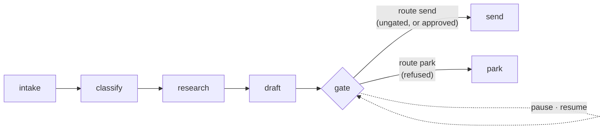

# 6.1 — The sixth station

## One-line answer

The gate joins Day 58's triage graph as **one node with two routed edges**, so an ungated ticket runs
straight through and disturbs nobody, and a gated one stops at the same node that later decides —
measured, six stations and zero humans for a portal note, seven and one for a refund by email.

## The story

The tailor takes your measurements, cuts, stitches, and then — before anything is folded and put in a
bag — he has you put the shirt on and stand in front of the mirror.

Most of the time this takes a moment. The shoulders sit right, you nod, he nods, it goes in the bag.
For a plain shirt he barely looks up.

But for the one you are having made for a wedding, he walks round you, pins the side, and says come
back once more. That garment does not go in the bag today.

The fitting is not a separate shop. It is a step in the same sequence, in the same room, done by the
same man, and its cost when nothing is wrong is almost zero. What makes it valuable is that it sits
**between the stitching and the bag** — after the work is done and before it leaves. Put it earlier
and there is nothing to look at. Put it later and the shirt is already on its way to you.

## The idea in plain language

Day 58 built the desk's triage graph: intake, classify, research, draft, review — five stations, from
a ticket in the archive to a drafted reply
([`days/day-58-triage-graph-v1/`](../../../day-58-triage-graph-v1/LESSON.md)). It stops at the draft,
because Phase 8 had nowhere safe to put the send.

The sixth station is the send, and the gate goes immediately before it. That position is forced by
the same logic as the fitting: the gate needs the drafted reply to exist (so it cannot be earlier),
and it must run before the reply leaves (so it cannot be later).

Two design choices remain, and both were argued for in section 4:

**One node or two?** The gate is *one* node. It runs twice — once on the way in, asking the policy and
pausing if the answer is yes; once on the resume, receiving the human's answer. That means it needs
`rerun_on_resume=True` and it must be re-entrant, reading `resume_inputs` before it asks, exactly as
part [4.4](../04-the-node-gate/4.4-asking-the-same-person-twice.md) required. The alternative — a
separate ask node and a separate decide node — works too and costs an extra node; one node is chosen
here because the two halves share the proposal.

**A guard or a route?** A **route**. Part
[4.3](../04-the-node-gate/4.3-the-human-said-no-and-the-reply-went-anyway.md) showed the two ways to
honour a rejection: a conditional inside the successor, or two edges out of the gate. The route wins
for the reason that part gave — a fork is visible in the graph, a conditional is not — so the gate
emits `send` or `park`, and rejection has somewhere to go that is not "the send node, but it chose
not to".

One term, defined once: a **route** is a label a node attaches to its output that decides which of
several outgoing edges fires. Day 53 established them as the way a graph expresses a branch
([`days/day-53-graph-workflow-runtime/`](../../../day-53-graph-workflow-runtime/LESSON.md)), and this
is the first time the desk has needed one.

## Why Sutra needs it

This node is the thing Phase 9's gate is about. Day 65 will start the graph on a real ticket, kill
the process at four different moments, and check that a human's approval was required and honoured
every time. There has to be a graph for it to kill.

It is also where the day's parts stop being separate. The policy from section 1 decides; the pause
from section 4 stops the run; the record from section 5 falls out of the events; and part
[6.3](6.3-the-check-that-goes-red-when-the-gate-goes.md) is the check that goes red if any of them is
removed.

## The mechanism

The graph is Day 58's five stations plus a gate and two exits:

```
intake -> classify -> research -> draft --> gate --route send--> send
                                                \--route park--> park
```

The gate node is the whole of the new logic:

```python
@node(rerun_on_resume=True)
def gate(ctx: Context, node_input):
    """The only station that decides whether a human must look."""
    STATIONS.append("gate")
    proposal = node_input
    interrupt = f"approval:{proposal['id']}"

    if not _policy.needs_approval("send_reply", {"channel": proposal["channel"]}):
        yield Event(output={**proposal, "decision": "auto"}, route="send")
        return

    answer = ctx.resume_inputs.get(interrupt)
    if answer is None:
        yield RequestInput(
            interrupt_id=interrupt,
            message=f"Send this {proposal['resolution']} reply for {proposal['id']} by "
            f"{proposal['channel']}?",
            payload={**proposal, "policy_version": _policy.version()},
        )
        return

    # `is True` and not truthiness: a client that sends the string 'false' would pass a truthy
    # test and invert the shift lead's decision. Measured in part 4.3.
    approved = answer.get("approved") is True
    decided = {**proposal, "decision": "approved" if approved else "refused"}
    decided["by"] = answer.get("by")
    yield Event(output=decided, route="send" if approved else "park")
```

**Line by line:**

- `@node(rerun_on_resume=True)` — the node must run again on the resume, because the second half of
  its job is to decide. Part [4.4](../04-the-node-gate/4.4-asking-the-same-person-twice.md) measured
  what this setting costs and what it buys.
- `interrupt = f"approval:{proposal['id']}"` derives the id from the proposal rather than hard-coding
  it, which is part [3.1](../03-binding-the-answer/3.1-the-question-has-to-be-written-down.md)'s rule.
  It is computed **once** and used for both publishing and reading, so the two cannot disagree — the
  failure in *When it breaks* is what happens when they do.
- The **policy check comes first**, before `resume_inputs`. An ungated proposal leaves immediately
  with `route="send"`: no pause, no record, no human. Most tickets take this branch, and the gate
  costs them one function call.
- `ctx.resume_inputs.get(interrupt)` is the re-entrancy check that part 4.4 requires. On the first
  pass it returns `None` and the node asks; on the resume it returns the answer and the node decides.
  A node with `rerun_on_resume=True` that asks without checking here re-asks for ever.
- `payload={**proposal, "policy_version": _policy.version()}` is part
  [5.2](../05-the-record/5.2-what-the-record-has-to-answer.md)'s checklist, satisfied at the only
  place it can be.
- `answer.get("approved") is True` is the strict comparison part
  [4.3](../04-the-node-gate/4.3-the-human-said-no-and-the-reply-went-anyway.md) measured the need for
  — a client sending the string `'false'` passes a truthy test and would invert the decision.
- Both exits `yield Event(..., route=...)`. The route is the entire branching mechanism; the node
  does not call `send` or `park` itself and does not know they exist.

Run it on a ticket the policy does not gate:

```bash
cd days/day-64-approval-gates-build/lab
uv run python desk.py
```

**Line by line:**

- With no arguments the script runs ticket `4610`, whose resolution is a note delivered over the
  portal. `policy.json` gates `send_reply` only for the `email` and `sms` channels.
- `STATIONS` is appended to by every station, so the printed sequence is what actually ran rather than
  what the diagram says.

Measured on 2026-09-06:

```text
ticket 4610  (note by portal)

  stations run    intake -> classify -> research -> draft -> gate -> send
  humans asked    0
  effects         [('send_reply', '4610', 'portal')]
```

Six stations, **zero humans**, reply sent. The gate ran and got out of the way. This is the row that
matters most operationally and it is the one demonstrations usually skip: the cost of a gate is paid
by every ticket, and most tickets are this one.

Now a refund by email:

```bash
cd days/day-64-approval-gates-build/lab
uv run python desk.py --ticket 4655
```

**Line by line:**

- Ticket `4655` is a double charge, resolved as a refund, over email — gated on the channel.
- The script drives both passes itself, supplying the approval, so the whole round trip is one
  command.

Measured on 2026-09-06:

```text
ticket 4655  (refund by email)

  paused for a human: Send this refund reply for 4655 by email?
  stations run    intake -> classify -> research -> draft -> gate -> gate -> send
  humans asked    1
  effects         [('send_reply', '4655', 'email')]
```

`gate -> gate` — the node appears twice in the sequence, which is `rerun_on_resume=True` visible in
the output. The message is the sentence a shift lead reads, built from the proposal.

And the rejection:

```bash
cd days/day-64-approval-gates-build/lab
uv run python desk.py --ticket 4655 --reject
```

**Line by line:**

- `--reject` makes the supplied answer `{"approved": False, ...}`. Nothing else changes.

Measured on 2026-09-06:

```text
  stations run    intake -> classify -> research -> draft -> gate -> gate -> park
  humans asked    1
  effects         []
```

The sequence ends in `park` rather than `send`, and `effects` is empty. The fork is in the trace,
which means an operator reading a run's history can see the decision without knowing anything about
the code.



## When it breaks

Take `rerun_on_resume=True` off this node. Part
[4.2](../04-the-node-gate/4.2-where-the-answer-lands.md) says the body will not run again and the
answer will be handed to the successor instead — which, on a graph wired with a guard rather than a
route, is the fail-open of part
[4.3](../04-the-node-gate/4.3-the-human-said-no-and-the-reply-went-anyway.md). Here it is worth
measuring rather than assuming, because this graph is routed:

```bash
cd days/day-64-approval-gates-build/lab
uv run python norerun.py --plain
```

**Line by line:**

- `norerun.py` holds `gate_body`, which is `desk.gate`'s body copied verbatim. Only the decorator
  differs: `node(gate_body)` instead of `node(gate_body, rerun_on_resume=True)`.
- The graph is rebuilt with the same six stations and the same two routed edges, so the single
  variable is the setting.
- The resume supplies an **approval**, not a rejection. That matters: this run should send.

Measured on 2026-09-06:

```text
Node 'gate_body' has conditional/DEFAULT edges but none were matched by the emitted route(s): None. The branch will end.
--plain (no rerun_on_resume)

  answered            approval:4655
  stations run        intake -> classify -> research -> draft -> gate
  effects             []
```

**It stalls rather than sending.** One `gate` in the trace, no `send`, no `park`, and an empty effects
list. The reason is the routing: at the default setting the node does not run again, so it emits no
route on the resume, and a node with only conditional edges and no matched route has nowhere to go.
The runtime says so in a warning and the branch ends.

That is a better failure than the guarded version's, and it is an argument for routing that part 4.3
could not make yet: **a routed gate fails closed when its node stops deciding, and a guarded one fails
open.** Note the shape of the warning, though — it is a log line, not an exception, and the process
exits zero. Fail-closed and silent is still an incident, just a cheaper one.

The second break is the interrupt id used in two spellings. Publish `approval:4655` and read
`approval:9999` — or derive one and hard-code the other — and the answer matches nothing:

```bash
cd days/day-64-approval-gates-build/lab
uv run python norerun.py --mismatch
```

**Line by line:**

- This arm uses the **real** `desk.gate`, `rerun_on_resume` and all. Nothing is wrong with the node.
- The only change is that the reply is addressed to `approval:9999` instead of the id the gate
  published, which is what a queue delivering to the wrong subscriber, or an operator resuming the
  wrong ticket, produces.

Measured on 2026-09-06:

```text
--mismatch (wrong interrupt id)

  answered            approval:9999
  stations run        intake -> classify -> research -> draft -> gate
  effects             []
```

Identical trace, identical empty effects, and this time **no warning at all**. The gate did not run a
second time, because the resume matched no pending interrupt for it.

So from the outside, three different situations produce the same observable result — a run that
stopped after `gate` with nothing sent:

| What happened | Trace | Warning | Correct? |
| --- | --- | --- | --- |
| The shift lead refused | `... gate -> gate -> park` | none | yes |
| `rerun_on_resume` was removed | `... gate` | one line | no |
| The answer had the wrong id | `... gate` | none | no |

Only the first is right, and the two wrong ones are distinguished from it by the trace rather than by
any error. That is why part [6.3](6.3-the-check-that-goes-red-when-the-gate-goes.md) checks the
approval path end to end — asserting that a pause happened would pass in all three rows.

## In production

**What a professional writes instead.** They put the gate node in front of *every* station that
leaves the building, not just the one that exists today. On this desk there is one write; the moment a
second one appears — a webhook, a ticket-system update, an SMS — the graph needs the same node again,
and the temptation is to inline the check into the new station. Make the gate a reusable node that
takes the action name, so adding a write means adding an edge rather than repeating a decision.

**What degrades at scale.** The gated path is two graph passes rather than one, and the second pass
re-enters the run from the top of the workflow's resume machinery. That is cheap here because the
stations before the gate are not re-executed — the resume lands at the interrupted node — but it does
mean a gated ticket occupies a session for as long as the approver takes, and sessions in flight are
the resource part [7.1](../07-in-production/7.1-the-queue-in-front-of-the-approver.md) counts.

**The failure mode that only appears with real traffic.** The draft changes between the pause and the
resume. The gate's payload is a snapshot (part
[5.2](../05-the-record/5.2-what-the-record-has-to-answer.md)), and the desk may have re-run intake for
the same ticket after the customer replied. The approver approved a refund reply for a ticket whose
state has since moved, and the graph will send the *stored* draft, which is the correct thing to send
given what was approved and possibly the wrong thing to send given what is now true.

**The review comment a senior engineer leaves:** *"The gate reads `resume_inputs` and then calls the
policy — good — but `park` is a terminal node that logs and stops. Nothing tells the agent, the
ticket or the shift lead that this reply was refused and is now nobody's job. A parked proposal needs
an owner."*

**The interview question:** *"Where in your workflow does the human approval step go?"* An honest
answer: *"Immediately before the first irreversible action, and expressed as a node with routed edges
rather than a check inside the node that acts. On our triage graph that is between the drafted reply
and the send. The node runs twice — once to ask the policy and pause, once to decide on the answer —
so it needs `rerun_on_resume` and it has to read `resume_inputs` before it asks or it re-asks for
ever. And the ungated path costs one function call: most tickets are not gated, and a gate that taxes
them is a gate people route around."*

## Check yourself

```bash
cd days/day-64-approval-gates-build/lab
uv run python desk.py
uv run python desk.py --ticket 4655
uv run python desk.py --ticket 4655 --reject
```

Compare the three `stations run` lines. Say which word appears twice and why, and which run had a
`park` in it.

**Out loud, without scrolling up:** why must the gate sit after `draft` and before `send`, and what
would break if it sat before `draft`?

**Next:** [6.2 — Three roads to one function](6.2-three-roads-to-one-function.md).
