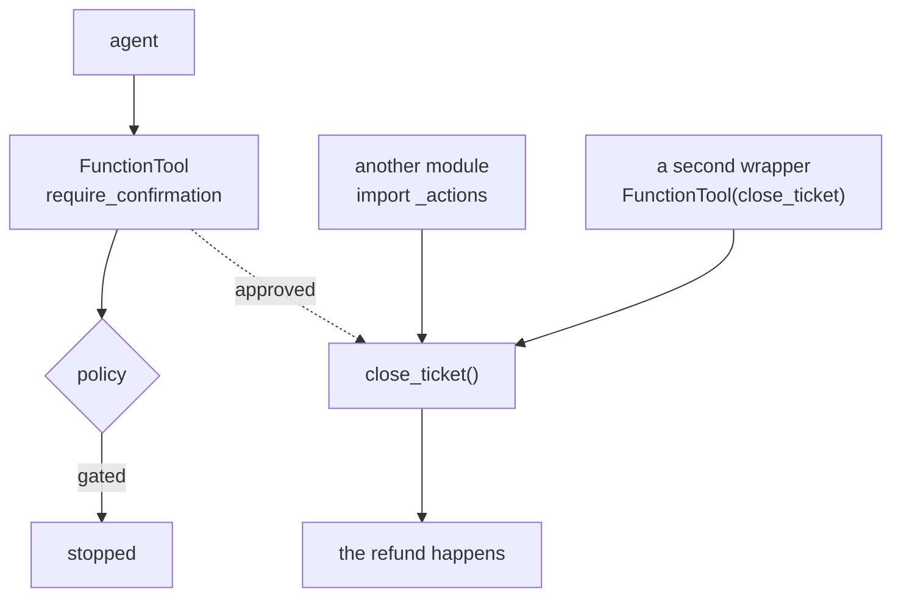

# 6.2 — Three roads to one function

## One-line answer

The gate lives in the **wrapper**, not in the function, so every other route to the same function is
ungated — measured, three ways to reach `close_ticket` and **one of three** honours a policy that
says this call needs a human.

## The story

The building has one water tank on the roof and three taps fed from it.

The one in the kitchen has a candle filter fitted under the sink — a proper one, changed every few
months, and the family drinks from that tap only. Everybody knows the rule and everybody follows it.

There is a tap in the bathroom, and there is one on the terrace for washing the floor.

Same tank. Same water. The filter is not a property of the water; it is a property of one tap. On the
day a workman is thirsty and drinks from the terrace tap, nothing about the system stops him, and
nothing about the system notices. The family will tell you their water is filtered, and they are
describing their habit rather than their plumbing.

The way you fix this is not by putting up a sign at the terrace tap. It is by moving the filter to
where the water leaves the tank, so that there is no route to the water that does not pass through
it.

## The idea in plain language

Section 2 put the gate on a `FunctionTool`. That was the right move and part
[1.4](../01-the-policy-is-data/1.4-the-guard-that-was-only-added-in-three-places.md) explained why:
the wrapper is the one place a model must pass through, so the policy is consulted once instead of at
every call site.

"A model must pass through it" is doing a lot of work in that sentence, and it is true. What is not
true is that *everything* must pass through it. The wrapper wraps a function, and the function is
still a function:

- The agent calls the tool. Gated.
- Some other code in the repository imports the module and calls `close_ticket(...)` directly. Not
  gated — there is no wrapper involved.
- Somebody builds a second `FunctionTool` around the same function for a different agent, a batch
  job, or an evaluation harness, and does not know a policy exists. Not gated.

The third is the one that actually happens. Nobody sets out to bypass a control. Somebody needs the
same action somewhere else, finds the function, wraps it the ordinary way, and ships. The policy is
not violated so much as **not consulted**, because nothing about `close_ticket` announces that it has
a policy.

This has a precise name in the security literature, and it is the standard this part is measured
against: **complete mediation** — every access to a protected resource goes through the check, with
no path that reaches it another way. A control that mediates one path out of three is not a weak
control. It is a control with a documented exception that nobody documented.

One term, defined once: the **choke point** is the single place all access must traverse. Choosing a
choke point is the whole design; a check placed anywhere else is a convention, and conventions are
what part 1.2's housing-society watchmen had.

## Why Sutra needs it

Sutra's `sutra/` package is written by the learner, day by day, and this is exactly the repository
shape in which the third road appears. `close_ticket` will be needed by the triage graph, and later
by an evaluation harness in Phase 12, and later by a scheduled job in Phase 11. Each of those is a
different author on a different day.

Day 65's gate asks whether the approval gate can be bypassed **on any path**. This part is the
measurement that answers it, and the answer today is no better than one in three.

## The paper behind it

> **The protection of information in computer systems** · `doi:10.1109/PROC.1975.9939` · 1975 ·
> <https://doi.org/10.1109/PROC.1975.9939>

Its claim, in one sentence: a protection mechanism must enforce **complete mediation** — every access
to every object is checked, with no unmediated path — and must grant the **least privilege** the job
requires.

Day 40 teaches it:
[`papers/01-protection-of-information.md`](../../../day-40-filtering-and-allowlists/papers/01-protection-of-information.md).
Complete mediation is the sentence this part measures a violation of, fifty years later, in a Python
module. Part [1.1](../01-the-policy-is-data/1.1-a-gate-is-a-decision-about-one-action.md) promised
this measurement; here it is.

## The mechanism

`bypass.py` reaches the same effect three ways and prints the ledger each time.

```bash
cd days/day-64-approval-gates-build/lab
uv run python bypass.py
```

**Line by line:**

- All three routes use the **same arguments**: `{"ticket_id": "4655", "resolution": "refund"}` — the
  call `policy.json` gates, and the one the whole day has been stopping.
- `gated` is `FunctionTool(_actions.close_ticket, require_confirmation=gate_close)`, exactly as part
  [2.1](../02-the-tool-gate/2.1-one-argument-turns-a-tool-into-a-gate.md) built it.
- `ungated` is `FunctionTool(_actions.close_ticket)` — the same function, wrapped the ordinary way.
  This is not a contrived object; it is what somebody writes when they need the tool and have not
  read this day.
- The direct call is `_actions.close_ticket(**REFUND)`, which is what any module in the repository
  can do after an import.
- The ledger is reset between routes so each line reports only its own route.

Measured on 2026-09-06:

```text
one function, three routes to it. No human is asked in any of these runs.

  through the gated tool     effects: []
  calling the function       effects: [('close_ticket', '4655', 'refund')]
  through a second wrapper   effects: [('close_ticket', '4655', 'refund')]

  the policy's answer for these arguments: True
  routes that honoured it:  1 of 3
```

Read the last two lines together. **The policy says `True`** — this call needs a human — and **one of
three routes acted on it**.

The first route is the whole of sections 1 to 3 working correctly: `effects: []`, nothing happened,
a confirmation was requested. Everything this day has built is in that empty list.

The second and third rows are the refund going out, twice, with nobody asked. No error, no warning,
no log line saying a policy was skipped. From the ledger's point of view these are three calls to
`close_ticket` and two of them succeeded.



The diagram is the point: the policy sits on one of the three arrows into `close_ticket`.

## When it breaks

The break is not a crash — it is the audit, and it comes out wrong in a way that reads as reassuring.

Part [5.1](../05-the-record/5.1-the-decision-is-already-written-down.md) derives the approval record
from the session's events. Routes two and three produce **no** approval events, because no approval
was requested. So the record for those runs does not say *"refund sent without approval"*. It says
nothing at all — the effect simply does not appear in any approval trail, and a report counting
approvals against approved-and-executed actions balances perfectly.

You can only see the gap by counting from the other side, and that is worth doing once:

```bash
cd days/day-64-approval-gates-build/lab
uv run python -c "
import asyncio

import _actions
import bypass


async def main():
    await bypass.main()
    print()
    print(f'  effects recorded by the ledger:      {len(_actions.EFFECTS)}')
    print('  approval requests in those runs:     0')
    print('  gated calls the policy identified:   1 per route, 3 total')


asyncio.run(main())
"
```

**Line by line:**

- Re-running `bypass.main()` leaves the ledger holding only the **last** route's effects, because the
  script resets between routes — so `len(_actions.EFFECTS)` is 1, not 2. That is a deliberate reading
  of what the ledger can and cannot tell you, not a count of the damage.
- The other two numbers are stated rather than computed, because there is nothing to compute them
  from: no approval request was ever made on those routes, so no event exists to count.

Measured on 2026-09-06:

```text
  effects recorded by the ledger:      1
  approval requests in those runs:     0
  gated calls the policy identified:   1 per route, 3 total
```

Zero approval requests against three calls the policy would have gated. The absence is the finding,
and an absence is exactly what no dashboard shows you.

## In production

**What a professional writes instead.** They move the choke point into the function's own module, so
there is no unmediated road. Two shapes work: the effectful function becomes private (`_close_ticket`)
and the only public name is one that consults the policy first; or the policy check is the first line
of `close_ticket` itself, and the tool wrapper does nothing but expose it. Both make the check a
property of the tank rather than of one tap. The cost is that the policy is now a dependency of the
action module, which is the trade this day's section 1 argued was acceptable when the policy is data
and pure.

**What degrades at scale.** Roads multiply faster than reviews. Every new agent, harness, migration
script and scheduled job is a candidate third road, and none of them looks like a security change in
a pull request — they look like a new feature that happens to import an existing helper. Counting
roads is a job for a test, not for a reviewer: enumerate the callers of the effectful function and
assert that the set is exactly the mediated one.

**The failure mode that only appears with real traffic.** The unmediated road is usually the one under
load. Batch jobs, backfills and retries are precisely the paths written quickly and reviewed lightly,
and precisely the ones that touch thousands of records. The gated interactive path handles ten refunds
a shift; the backfill that "just reuses the existing function" handles ten thousand.

**The review comment a senior engineer leaves:** *"This adds a second `FunctionTool` around
`close_ticket` without `require_confirmation`. The other wrapper has a policy on it. Either route
through the gated one or make `close_ticket` private and expose a single gated entry point — right
now whether a refund needs a human depends on which import you reached for."*

**The interview question:** *"You put an approval check on a tool. How do you know there is no way
around it?"* An honest answer: *"By counting the roads to the effect rather than looking at the check.
On our desk I measured three ways to reach the function that closes a ticket — the gated tool, a
direct import, and a second wrapper somebody added for another flow — and one of the three consulted
the policy. That is complete mediation failing, and the giveaway is that the audit trail looks clean:
the ungated routes produce no approval events, so nothing is missing from any report. The fix is to
move the check inside the function's module so the unmediated road does not exist, and to have a test
that enumerates callers."*

## Check yourself

```bash
cd days/day-64-approval-gates-build/lab
uv run python bypass.py
```

Now grep the lab for every call site of `close_ticket` and count them. Say which ones are mediated.

**Out loud, without scrolling up:** the policy said this call needs a human and the refund happened
twice. Where was the check, and where should it have been?

**Next:** [6.3 — The check that goes red when the gate goes](6.3-the-check-that-goes-red-when-the-gate-goes.md).
