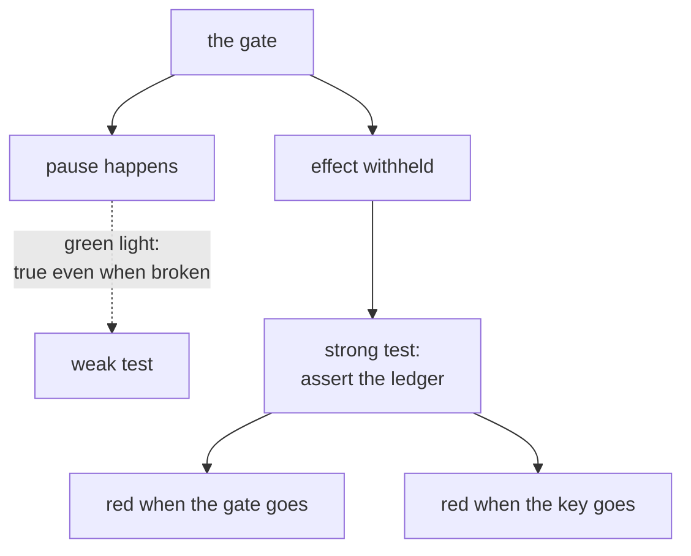

# 6.3 — The check that goes red when the gate goes

## One-line answer

A test that asserts the gate **paused** passes in three situations where the desk is broken, so the
day's eval asserts on the **effect** instead — six checks, red until `sutra/approval.py` exists, and
red again the moment the gate or the idempotency key is removed.

## The story

The smoke detector in the corridor has a small green light and a button.

The green light tells you it has power. That is all it tells you. A detector whose sensor chamber is
full of dust, or whose sensitivity has drifted, or which was painted over when the corridor was
redone, shows exactly the same steady green as one that works.

The button is different. You hold it and the thing shrieks. Everybody in the flat looks up, the baby
wakes, and you feel foolish for a moment. But you now know something the green light could never tell
you: **that the alarm can actually happen.**

The building rule says test it monthly, and the reason for the rule is that the failure being guarded
against is rare and the failure of the guard is silent. Between two fires, a working detector and a
dead one are indistinguishable unless somebody presses the button.

## The idea in plain language

Principle 11 says evals are tests, and every day ends with a check that can go RED. This part is
about writing the *right* one, because for an approval gate the obvious test is the green light.

The obvious test asserts the pause: run the graph on a gated ticket, assert that a `RequestInput` was
emitted. It is easy to write and it passes. Part
[6.1](6.1-the-sixth-station.md) measured three situations in which the desk is broken and the pause
still happens:

| Situation | Pause happens? | Reply correctly withheld? |
| --- | --- | --- |
| The shift lead refused | yes | yes — correct |
| `rerun_on_resume` removed | yes | yes, but by accident: the run stalls |
| The answer had the wrong id | yes | yes, but by accident: nothing matched |
| The successor ignores the answer (part 4.3) | yes | **no — the email goes out** |

The pause is the green light. It is on in every row, including the row where a rejected refund reaches
the customer.

So the check has to assert the thing the gate exists to control, which is the **effect**:

- an **ungated** action happens without anybody being asked;
- a **gated** action does not happen until somebody has said yes;
- a **rejected** action does not happen at all;
- a **duplicated** approval does not make it happen twice.

Those four are the button. Each of them can only be satisfied by machinery that actually works, and
each goes red if a specific piece is removed — which is the property that makes an eval worth having
rather than merely present.

One term, defined once: a **regression test with a known trigger** is one where you can name, in
advance, the change that makes it fail. If you cannot name that change, the test is documentation
rather than a guard. Every check below has its trigger written next to it.

## Why Sutra needs it

Day 65 is the Phase 9 gate, and it will try to break this desk on purpose: kill it mid-run at four
different moments and check that a human's approval was required and honoured every time. It needs
something to run after each kill that gives a trustworthy answer.

Today's eval is also the thing that stays behind afterwards. Phase 10 adds guardrails on top of this
desk, Phase 11 runs it on a schedule, and every one of those changes is a chance to remove the gate
without noticing. The check is what notices.

## The mechanism

`gate.py` is the day's eval. It tests the module the hub's §4 asks you to write —
`sutra/approval.py` — which does not exist yet, so it is red before any work is done.

```bash
cd days/day-64-approval-gates-build/lab
uv run python gate.py; echo "exit: $?"
```

**Line by line:**

- `load()` imports `sutra.approval` and reports a finding rather than raising if it is missing. An
  eval that crashes tells you less than one that reports, because a crash stops the other five checks
  from running.
- Checks 3 and 4 call `needs_approval` with an ungated and a gated action. They are section 1's
  policy, asserted from outside.
- Check 5 calls `decide({"approved": False}, ...)` and requires the answer `"refused"`. Its trigger
  is part [4.3](../04-the-node-gate/4.3-the-human-said-no-and-the-reply-went-anyway.md): remove the
  line that reads the answer and this goes red.
- Check 6 calls `decide` **twice with the same interrupt id** and requires the second call not to
  repeat the effect. Its trigger is part
  [3.5](../03-binding-the-answer/3.5-the-key-names-the-decision.md): remove the idempotency key and
  this goes red.
- Check 2 asserts `sutra/approval_policy.json` exists on disk — the policy must be **data**, which is
  part [1.2](../01-the-policy-is-data/1.2-the-policy-is-a-file-not-a-habit.md)'s claim turned into a
  check that a chain of `if` statements cannot satisfy.
- The exit code is `1` when there are findings, so `./m check` and Day 65 can both consume it.

Measured on 2026-09-06:

```text
day 64 gate: 0/6 checks pass

  RED  1. sutra/approval.py does not import: No module named 'sutra.approval'
  RED  2. policy file check skipped - no module
  RED  3. ungated-action check skipped - no module
  RED  4. gated-action check skipped - no module
  RED  5. rejection check skipped - no module
  RED  6. double-delivery check skipped - no module
exit: 1
```

Zero of six, exit 1. That is the correct state at the start of the day: the build brief has not been
done, and the eval says so specifically rather than failing to import.

Note the shape of checks 2 to 6 here. They are reported as *skipped* rather than as passing or
failing, because a check that cannot run has not passed. An eval that reports five silent passes and
one failure when the whole module is missing is an eval that will one day report six passes for a
module that is gone.

Now the part that makes the four assertions above real. The desk's own behaviour, which
`sutra/approval.py` will be written to reproduce, already satisfies them — and each can be watched
going red:

| Check | What makes it green | The change that turns it red |
| --- | --- | --- |
| 3 ungated | `policy.json` says `read_ticket` is not gated | gate everything (part 7.2's naive policy) |
| 4 gated | `send_reply` over email is gated | remove the `when` clause from the rule |
| 5 rejection | the gate routes to `park` on a refusal | drop the answer check (part 4.3) |
| 6 duplicate | the idempotency key names the decision | add a timestamp to the key (part 3.5) |

Every trigger in that right-hand column is a change somebody could make in good faith. That is the
test for whether an eval is worth its line count: not *does it pass*, but *can I name the innocent
edit that breaks it*.



## When it breaks

The way this breaks is that somebody writes the weak test, it passes, and everybody believes it. So
it is worth running the weak test against a broken desk once, to watch it pass.

The weak assertion is *"a human was asked"*. `norerun.py` gives a genuinely broken desk — the gate
without `rerun_on_resume`, from part [6.1](6.1-the-sixth-station.md) — and an approval that should
result in a sent reply:

```bash
cd days/day-64-approval-gates-build/lab
uv run python -c "
import asyncio

import _actions
import desk
import norerun

asyncio.run(norerun.run(plain=True, mismatch=False))
asked = 'gate' in desk.STATIONS
sent = any(e[0] == 'send_reply' for e in _actions.EFFECTS)
print()
print(f'  weak assertion   - a human was asked:      {asked}')
print(f'  strong assertion - the approved reply went: {sent}')
"
```

**Line by line:**

- `norerun.run(plain=True, ...)` is the desk with one setting removed and nothing else changed. The
  approval supplied is `{"approved": True}`, so a working desk sends the reply.
- `asked` is the weak assertion in its most generous form: did the run reach the gate and pause at
  all.
- `sent` is the strong one: did the approved effect actually happen.

Measured on 2026-09-06:

```text
Node 'gate_body' has conditional/DEFAULT edges but none were matched by the emitted route(s): None. The branch will end.
--plain (no rerun_on_resume)

  answered            approval:4655
  stations run        intake -> classify -> research -> draft -> gate
  effects             []

  weak assertion   - a human was asked:      True
  strong assertion - the approved reply went: False
```

`True` and `False` on the same run. A test suite built on the first line is green against a desk that
silently drops every approved reply on the floor, and a customer whose refund was approved by a
shift lead never hears anything.

Note also that this failure direction is the *safe* one — nothing was sent that should not have been.
The weak test is not merely useless here; it is actively reassuring about a desk that has stopped
working. Both directions matter, and only the effect assertion sees either.

The deeper break has no output, because it is an absence: an eval whose checks have never been watched
going red is a set of assertions about the code as it is, not constraints on the code as it will be.
That is why the table above names a trigger for every check, and why the exercise below asks you to
pull one.

## In production

**What a professional writes instead.** They keep the eval's checks in the same file as the triggers
that break them — a table like the one above, in the test module, so the next person changing the
policy can see which check they are about to turn red and why it exists. And they run the eval against
a **deliberately broken** build in continuous integration: a job that removes the gate and asserts the
eval fails. A test suite that has never been proved capable of failing is a suite nobody should trust.

**What degrades at scale.** These six checks are fast because everything they touch is in memory. The
moment `sutra/approval.py` reads a real store, the eval becomes an integration test and stops running
on every commit. Keep the policy pure and the store injectable, so the four assertions can be made
against a fake and the real store is exercised separately.

**The failure mode that only appears with real traffic.** The eval passes and the gate is bypassed
anyway, by the third road of part [6.2](6.2-three-roads-to-one-function.md). Nothing in `gate.py`
enumerates the callers of the effectful function, so a new ungated wrapper does not turn any of the
six checks red. That gap is real and is written down here rather than hidden: the check that would
close it is a caller enumeration, and it belongs with the module the learner writes.

**The review comment a senior engineer leaves:** *"The approval test asserts that a confirmation was
requested. That is true even when the successor ignores the answer and sends anyway — I have seen it.
Assert on the side effect: reject, then check nothing was sent. And add a case that delivers the same
approval twice."*

**The interview question:** *"How do you test a human-approval gate?"* An honest answer: *"By making
a human say no and asserting the effect did not happen, not by asserting that the system paused. The
pause is true in every broken case I have measured — a stalled run, a mismatched interrupt id, and a
successor that ignores the answer all pause correctly, and only one of those withholds the action for
the right reason. So the checks are: ungated things happen without asking, gated things do not happen
until approved, rejections never happen, and a duplicate approval does not act twice. And for each one
I can name the innocent code change that turns it red — if I cannot, it is documentation, not a
test."*

## Check yourself

```bash
cd days/day-64-approval-gates-build/lab
uv run python gate.py; echo "exit: $?"
uv run python desk.py --ticket 4655 --reject
```

Now open `policy.json`, delete the `when` clause from the `send_reply` rule so every reply is gated,
and re-run `desk.py` with no arguments. Say which of the six checks that edit would turn red, and put
the clause back.

**Out loud, without scrolling up:** name a situation in which the gate pauses correctly and the desk
is still broken, and say which of the six checks catches it.

**Next:** [7.1 — The queue in front of the approver](../07-in-production/7.1-the-queue-in-front-of-the-approver.md).
