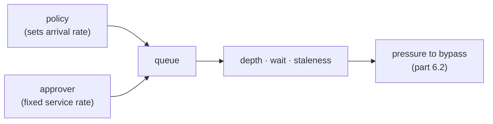

# 7.1 — The queue in front of the approver

## One-line answer

An approver is a queue with a service rate, not a function call, and the policy decides the arrival
rate — measured over one shift, the real policy queues **4 of 24** calls with a peak depth of 2 and
nothing left waiting, while gating every write queues **14**, peaks at 5, and ends the shift with 2
still unanswered.

## The story

The clinic near the market gives out tokens.

You arrive, take a paper slip with a number, and sit on the bench. There is one doctor. She sees
people at whatever rate she sees them, and the board on the wall shows the number currently inside.

If eight people come in the morning it works beautifully. You glance at your token, glance at the
board, and know roughly where you stand.

On the day after a holiday, forty people come. Nothing about the room has changed — same doctor,
same bench, same tokens. But the bench is full, people are standing in the corridor, and the ones
who took a token at eleven are still there in the afternoon. Some of them leave and come back
tomorrow, which pushes the problem into tomorrow.

The doctor has not slowed down. The arrival rate went up and the service rate did not, and everything
you can see from the corridor — the crowd, the waiting, the people giving up — follows from those two
numbers and nothing else.

## The idea in plain language

Every part of this day so far has treated the approver as something that eventually returns an
answer. This part treats them as what they are: **a resource with a finite rate**.

That reframes the policy. Day 63 chose which actions to gate on the basis of blast radius and
reversibility, which is the right basis. But the policy also sets the **arrival rate** at a queue you
did not model, and a policy that is correct about risk can still be unusable.

Three numbers describe the system, and none of them is in the policy file:

- **Arrival rate** — how many proposals the policy sends to a human per shift. You control this,
  indirectly, by what you gate.
- **Service rate** — how many the approver clears, and *when*. People do not answer continuously;
  they look at the queue when they look at it, and clear a batch.
- **Queue depth** — what accumulates in between. This is the number that hurts, because a proposal
  sitting in a queue is a customer waiting.

The trap is that the arrival rate is decided by an engineer reading a risk table, and the service rate
is a property of a person who was never consulted. Gate one more action and you have given somebody
more work without telling them.

This is also where part [6.2](../06-wiring-the-desk/6.2-three-roads-to-one-function.md)'s failure gets
its motive. Nobody bypasses a control because they enjoy risk. They bypass it because the queue in
front of it is full and there is a ticket to close.

One term, defined once: a **slot** here is one arrival — one call the desk makes, in order. The lab
measures waiting in slots rather than in clock time deliberately, because a wait of "three arrivals"
is a fact about the system's shape, while a wait measured on a clock would be a fact about one
particular day's traffic.

## Why Sutra needs it

Day 63 produced a policy table. This part is the other half of the argument for it, and it is the
half that would otherwise be made by an operations team six weeks after launch.

Day 65's gate asks whether the desk's request budget is real and measured. There is a second budget
alongside it, denominated in a person's attention, and this is where it gets counted.

## The mechanism

`latency.py` replays one shift of the desk's calls through the policy and simulates an approver who
clears the queue in bursts.

```bash
cd days/day-64-approval-gates-build/lab
uv run python latency.py
```

**Line by line:**

- `decide.SHIFT` is the same twenty-four-call shift part
  [1.3](../01-the-policy-is-data/1.3-the-arguments-decide-not-the-tool.md) used, so the arrival
  pattern is not invented for this part — it is the desk's own traffic.
- `CHECKPOINTS = (6, 12, 18, 24)` and `CAPACITY = 3`: the approver looks at the queue four times in
  the shift and clears up to three each time. That is the *"they look when they look"* model, and it
  is closer to reality than a steady drain.
- `DEADLINE = 8` marks a proposal stale after eight arrival slots — the point at which the customer
  has waited too long, defined once so part [7.2](7.2-the-deadline-the-approval-must-beat.md) can
  measure against it.
- `gated_slots` asks `_policy.needs_approval` per call, so the arrival rate is genuinely produced by
  `policy.json` and not by a constant.

Measured on 2026-09-06:

```text
policy: policy.json
gated proposals: 4 of 24 calls
approver clears up to 3 at slots (6, 12, 18, 24)

  peak queue depth        2
  answered in the shift   4
  still pending at end    0
  longest wait            4 slots
  mean wait               3.0 slots
  past the 8-slot deadline  0
```

**4 of 24.** Six sevenths of the desk's work never touches a human, which is what makes the gate
affordable. Peak depth 2, everything answered, nothing stale.

This is what a well-chosen policy looks like from the queue's side, and it is worth noticing that no
part of `policy.json` was tuned for it. The rule *"gate what leaves the building and what moves
money"* happens to select a small fraction of traffic, because most of what an agent does is read,
search and think.

Now the policy somebody reaches for when they are nervous — gate every write:

```bash
cd days/day-64-approval-gates-build/lab
uv run python latency.py --all-writes
```

**Line by line:**

- `--all-writes` swaps the policy for `decide.NAIVE_WRITES`, a set of every action that changes
  anything. Nothing else about the shift, the approver or the deadline changes.
- This is not a strawman policy. It is the defensible-sounding rule *"a human approves anything that
  writes"*, which is what a risk review often asks for.

Measured on 2026-09-06:

```text
policy: gate every write
gated proposals: 14 of 24 calls
approver clears up to 3 at slots (6, 12, 18, 24)

  peak queue depth        5
  answered in the shift   12
  still pending at end    2
  longest wait            8 slots
  mean wait               3.7 slots
  past the 8-slot deadline  2
```

Arrival rate went from 4 to 14 — three and a half times. Watch what the other numbers do:

| | policy.json | gate every write |
| --- | --- | --- |
| gated | 4 of 24 | 14 of 24 |
| peak depth | 2 | 5 |
| answered in the shift | 4 | 12 |
| **still pending at end** | **0** | **2** |
| longest wait | 4 slots | 8 slots |
| past the deadline | 0 | **2** |

The service rate never changed — the approver clears three, four times, so twelve is the most that can
ever be answered in this shift. Fourteen arrive. **The queue does not drain**, and two proposals are
carried into the next shift, where fourteen more will arrive.

That is the important shape and it is not linear: the system is fine until arrivals exceed capacity,
and then it does not degrade gracefully, it accumulates. Longest wait doubled from 4 slots to 8, and
two proposals crossed the staleness line that nothing crossed before.



## When it breaks

The break is that nothing in the code notices. Run the naive arm again and read the line the desk
would never print in production:

```text
  still pending at end    2
```

There is no alarm attached to that number, no exception, and no line in any log that says a proposal
was abandoned. Two customers are waiting on a reply that a shift lead never got to, and the desk's own
eval — part [6.3](../06-wiring-the-desk/6.3-the-check-that-goes-red-when-the-gate-goes.md) — is green,
because every check it makes is about correctness and none is about throughput.

That is the honest gap in this day's work, and it is worth stating plainly rather than leaving as an
exercise: **the gate is correct and the desk can still fail its customers**, and correctness tests
cannot see it. The measurement above is the only thing that can, which is why it is a lab script and
not a paragraph.

The second break is what happens next, and it is human rather than technical. An approver facing a
queue that never empties does not work faster — they start approving without reading, because the
only way to clear five items is to spend less attention on each. At that point the gate is still
present in every diagram and has stopped being a control, and the audit trail from part
[5.1](../05-the-record/5.1-the-decision-is-already-written-down.md) will faithfully record informed
approvals that were nothing of the kind.

## In production

**What a professional writes instead.** They put the queue depth on a dashboard next to the error
rate, and they alert on **age** rather than on depth — a queue of twenty that drains in a burst is
healthy, and a queue of two where one item is a day old is not. And they treat a policy change as a
capacity change: adding a gated action means asking who is going to answer it and whether they have
room, before shipping.

**What degrades at scale.** Approvers do not scale the way servers do. Doubling traffic means doubling
gated proposals, and the response is either more approvers — expensive, and each one is a person who
must be trained and authorised, which is part
[7.3](7.3-who-is-allowed-to-say-yes.md)'s problem — or a narrower policy. Most teams discover this by
adding approvers until somebody notices the cost, and then narrowing the policy under pressure, which
is the worst moment to be making a risk decision.

**The failure mode that only appears with real traffic.** Arrivals are not uniform. The lab's shift
spreads four gated calls across twenty-four slots; real traffic arrives in bursts — a bad deploy, a
billing run, a Monday. A queue that copes with the mean fails on the burst, and the burst is exactly
when the proposals are most likely to be genuinely risky. Model the peak, not the average.

**The review comment a senior engineer leaves:** *"This adds `write_memory` to the gated list. That
takes us from four gated calls a shift to eleven, and one shift lead clears about twelve. We would be
running at the edge of capacity on an average day and over it on a Monday. Who is answering these,
and what happens to the ones they do not reach?"*

**The interview question:** *"What is the cost of an approval gate?"* An honest answer: *"Latency for
the customer and attention from a person, and the second one is the constraint. The approver is a
queue with a service rate that you do not control, and the policy sets the arrival rate. I measured
our desk: the real policy gates four calls in a twenty-four-call shift and the queue never goes above
two, and the defensible-sounding 'gate every write' gates fourteen — more than the approver can clear
— so the queue stops draining and proposals carry over. Nothing in the code notices that, because it
is not a correctness failure. And the human consequence is worse than the delay: a queue that never
empties turns approvals into clicks."*

## Check yourself

```bash
cd days/day-64-approval-gates-build/lab
uv run python latency.py
uv run python latency.py --all-writes
```

Now change `CAPACITY` to `4` and re-run the naive arm. Say what happens to *still pending at end* and
whether that makes the naive policy acceptable.

**Out loud, without scrolling up:** the policy went from gating 4 calls to gating 14 and the approver
did not change. Which number in the output tells you the queue stopped draining?

**Next:** [7.2 — The deadline the approval must beat](7.2-the-deadline-the-approval-must-beat.md).
