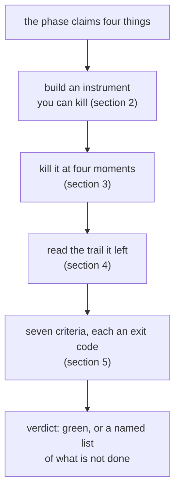

# 1.1 — A gate is a drill, not a review

## One-line answer

A phase gate is not a meeting where you look at the work and agree it is finished; it is the
afternoon you break the thing on purpose, and Phase 9's break is a real process killed at four
different moments while it is carrying a real ticket.

## The story

Your office has a fire plan. It is a laminated sheet by the lift with arrows on it, and once a year
somebody from the building sends round an e-mail asking everyone to read it. Everyone reads it. The
arrows point at the stairs. It is a good plan.

Then one Tuesday the alarm goes off for real, and four things happen that the sheet did not
mention. The door at the bottom of the north stairwell has been locked from the inside since the
builders were in. Nobody on the second floor can hear the alarm over the air conditioning. The
muster point is in the car park, and the car park is now a building site. And the person whose job
it is to check the toilets left the company in March.

Nothing was wrong with the plan. The *building* moved, quietly, one small change at a time, and the
plan stayed where it was. The only thing that could have told you was walking down the stairs.

## The idea in plain language

A **phase** in this curriculum is a run of days that build one capability together. Phase 9 is days
60 to 65, and its capability is *durability with a human in it*: a run that survives its own process
dying, and a write that a person had to allow.

A **phase gate** is the day at the end that decides whether the phase is finished. The plan states
each gate as one sentence, and Phase 9's sentence is:

> Kill it mid-run; it resumes; a human approved the write.

Read that again, because it is unusual. Most acceptance criteria are things you *check*. This one is
a thing you *do*. It contains a verb aimed at your own system — kill it — and the only way to satisfy
it is to go and do the killing.

That is deliberate, and it is the whole subject of this day. There are two ways to decide a phase is
finished, and they are not equally good:

- **Review.** Read the code, read the tests, look at the green ticks, agree that it works. This is
  cheap, it is what everyone does, and it finds the problems that are *visible in the parts*.
- **Drill.** Run the whole chain, end to end, and break it somewhere on purpose. This is more work,
  almost nobody does it, and it finds the problems that live *between* the parts.

Phase 9's chain runs across five separate things: the graph that does the work, the log that
records it, the store that holds a pending decision, the operator who answers it, and the write that
finally changes something. Every one of those has its own tests. **Nothing tests the joins.** The
joins are where the locked stairwell door is.

There is a word for what the drill produces that a review cannot: **evidence**. A review produces an
opinion held by the people who were in the room. A drill produces an exit code, a row in a file and
a count, and those survive the room.

## Why Sutra needs it

Days 60 to 64 each made a promise, and each of them tested its own promise in its own lab.

Day 60 promised that a run is not its process, and that a step which ran once will not run twice.
Day 61 promised that a paused run costs nothing while it waits. Day 62 promised that a human can
answer late, twice or never without breaking anything. Days 63 and 64 promised that nothing
customer-visible happens without a decision, and that the decision is recorded.

Each promise is believable on its own. What nobody has done is **hold all five at the same time in
one run** and then knock the table. That is what Phase 10 is about to build on: the injection
defences of Day 66 and the guardrails of Day 67 assume that a suspended run resumes correctly,
because a guardrail that can be dodged by crashing the process is not a guardrail. A promise you
never drilled is a dependency you hand downstream untested.

## The mechanism

The drill this day runs is four kills, and the whole thing is one command:

```bash
cd days/day-65-kill-it-mid-run/lab
uv run python drill.py
```

**Line by line:**

- `drill.py` takes each of the four kill points in turn, and for each one it starts a run in a **real
  child process**, kills it, restarts it, has an operator decide the pending approval, and restarts
  it again.
- It resets the state directory before every kill, so each kill is an independent experiment rather
  than one long story where the third result depends on the second.
- It prints, per kill, the final exit code and **how many times the ticket was actually closed**. One
  is the only right answer. Zero and two are both failures, and they are different failures.

The shape of the whole day, before any of the detail:



## When it breaks

The way a gate day breaks is that it finds nothing, and everybody is pleased.

Here is the tell. A gate whose criteria are all statements about things the same person built that
same week will pass, because the person wrote the criteria with the implementation in front of them.
The criteria and the code agree because they came out of the same head an hour apart.

The drill in this day is written to break that pattern in one specific way: it kills the process
**from outside**, in a place the runner does not know about. Part 3.3 is the clearest case — the
signal is sent by a different process, and the run has no code path for receiving it:

```text
=== K3: killed while parked, waiting for the human ===
start  k3: ticket 4588
  intake    ran        ticket=4588 text=Password reset e-mail never arrives. T...
  classify  ran        label=auth
  research  ran        neighbour=4610
  draft     ran        draft=Ticket 4588: classified auth. See tick...
  review    ran        verdict=needs-approval rubric=v1
  parked    awaiting appr-k3
  -> exit 1   [killed from outside]
```

`exit 1` is what this platform reports when one process terminates another. There is no traceback,
no `finally`, no last log line, because the process was not asked to stop — it was stopped. That is
the honest shape of a container being shut down, and a run that only survives the endings it was
told about has not been tested.

## In production

**What a professional writes instead.** They do not write a gate document at all; they write a
**runbook** and then execute it, and the gate is the record of that execution. The difference
matters because a runbook has a second life: when the same failure happens for real at an
unsociable hour, the runbook is the thing the on-call engineer follows. A gate that produces a
reusable procedure has paid for itself twice. Part 1.3 writes ours.

**What changes at scale.** One process on one laptop is the easy case. In a real deployment the
question "was it killed?" stops having a single answer: some instances drained cleanly, some were
killed hard, and one is still running an old version of the code. Part 6.1 is about that difference,
and the short version is that **you must test the hard kill**, because the clean shutdown is the one
your framework already handles.

**The failure that only appears with real traffic.** Drills are run on quiet systems by people who
have time. The real kill arrives during the busiest hour, when there are two hundred runs in flight
rather than one, and the resume path that works for a single run now has two hundred processes
racing to claim the same work. Nothing in this day tests that, and the honest thing is to say so
here rather than let the reader believe otherwise.

**The review comment a senior engineer leaves:** *"This says the system is resumable and links four
unit tests. Unit tests cover links; they do not cover welds. Show me the run where you killed the
process between the approval and the write, and show me the count of rows in the effects table
afterwards. If that experiment does not exist, the durability claim is a design intention, not a
property."*

**The interview question:** *"How do you know your durability actually works?"* An answer worth
giving: *"Because I kill it on purpose, at rotating points, and count effects rather than reading
logs. On my own system the four points are mid-stage, after a checkpoint, while parked for a human,
and inside the window between the decision and the write. Only the last one is interesting: the
first three are the framework's job and they pass. The fourth one is mine, and depending on which
order I write the effect and the record, the same kill gives me two closes or zero — and the version
that gives zero also prints `replayed` and exits zero, which is the dangerous one."*

## Check yourself

```bash
cd days/day-65-kill-it-mid-run/lab
uv run python drill.py --kill K3
```

Watch the third block: the process is started, it parks, and something outside it ends it. Then find
the exit code that the killed process reported and say whether your operating system chose that
number or the program did.

**Out loud, without scrolling up:** give one problem a code review will find and a drill will not,
and one problem a drill will find and a code review will not.

**Next:** [1.2 — A criterion ends in an exit code](1.2-a-criterion-ends-in-an-exit-code.md).
