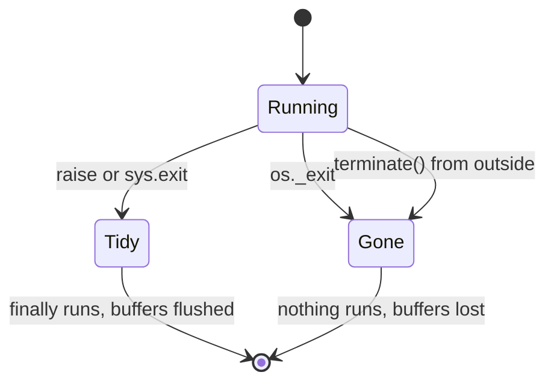

# 2.2 — A process you can actually kill

## One-line answer

An exception is not a crash, so the drill runs the work in a real child process and stops it with
`os._exit`, which skips every `finally` and loses every buffered byte — measured here as `finally`
running in two cases out of three and nothing at all reaching the file in the third.

## The story

The washing machine is halfway through a cycle when the power goes.

It does not beep, or finish the rinse, or drain politely first. The drum stops where it is, the door
stays locked, and there is a load of wet clothes sitting in grey water behind glass. When the power
comes back twenty minutes later the machine does not carry on from where it was. It shows the time
of day, cheerfully, as though nothing happened, and the clothes are still in there.

Now think about the other way it could have ended. You could have pressed the cancel button. Press
cancel and the machine drains, unlocks the door, and stops in a state somebody designed. Same
outcome from the outside — the wash did not finish — and completely different from the inside. One
of those endings the manufacturer thought about. The other one just happened.

Testing your system by pressing cancel tells you nothing about the power cut.

## The idea in plain language

There are three ways a program can stop, and only one of them is a crash.

**It raises.** An exception travels up through the program. Every `finally` block on the way runs,
every file gets closed, every buffer gets written out. The program stops, but it stops *tidily*,
because raising is a thing the language knows about.

**It calls `sys.exit`.** Almost the same picture. `sys.exit` raises a particular exception that
nothing normally catches, so `finally` blocks still run and buffers still drain. The exit code is
whatever you asked for.

**It is killed.** `os._exit`, or a signal from another process, or the machine losing power. The
process stops **now**. No `finally`, no closing, no draining. Anything that had been written into a
buffer but not yet pushed to the disk is gone, and it is gone silently, because there is nobody left
to complain.

Two terms. A **buffer** is memory where writes are collected so they can be sent to the disk in one
efficient batch instead of a byte at a time; the write "happened" from the program's point of view
and has not reached the disk. A **child process** is a separate program your program started, with
its own memory, which is why killing it can be total in a way that killing a function call never is.

The drill needs the third kind. A test that ends a run by raising an exception has tested a program
that had a chance to tidy up, and the tidying is exactly what a real crash removes.

## Why Sutra needs it

Everything Phase 9 claims is a claim about what is on disk at the instant the process stops. Part
2.1 was careful to `fsync` every checkpoint precisely because a buffered checkpoint is not a
checkpoint. If the drill then stops the process in a way that flushes the buffers, it has quietly
made those `fsync` calls irrelevant and will report the system as durable whether or not it is.

The four kills in section 3 are only meaningful if the kill is total. That is why this part comes
before them: the instrument has to be trustworthy before the measurement means anything.

## The mechanism

Three deaths, side by side, measured rather than described:

```bash
cd days/day-65-kill-it-mid-run/lab
uv run python deaths.py
```

**Line by line:**

- `deaths.py` starts a **child process** three times. Each child opens a file, writes a line into it
  without flushing, and then stops in one of the three ways.
- Each child also has a `finally` block that writes a second line. Whether that line appears is the
  test: `finally` running means the ending was orderly.
- The parent reads the file afterwards and prints what survived. It reads the file rather than
  asking the child, because the child is not available for questions.

Measured on 2026-09-05:

```text
how it stopped   exit  what reached the file
raise            1     wrote-but-not-flushed finally-ran
sysexit          9     wrote-but-not-flushed finally-ran
oshard           137   (nothing)

Only the last row is what a crash looks like.
```

Read the third column. In the first two rows **both** lines reached the file — including the one
that was written before any flush, because closing the file on the way out flushed it. In the third
row nothing reached the file at all. The write happened, from the program's point of view. It simply
never left the buffer, and there was no `finally` to close the handle.

That is why the runner stops like this:

```python
def _die(where: str) -> None:
    """Stop the process the way a crash stops it: no unwinding, no `finally`, no flush."""
    print(f"  [killed at {where}]", flush=True)
    os._exit(KILLED)
```

**Line by line:**

- `os._exit` rather than `sys.exit`, for the reason the table just measured. This is the single most
  important line in the instrument, and using the wrong one would make every result in section 3
  optimistic.
- `KILLED` is `137`, which is the conventional number for a process killed by signal 9 — 128 plus
  the signal number. It is chosen so the drill's output reads like a real kill to anyone who has
  seen one, and nothing in the code depends on the value.
- `print(..., flush=True)` is the exception that proves the rule: this one line is explicitly flushed
  so the reader can see *where* the kill landed. Without `flush=True` the message itself would be
  lost, since `os._exit` on the next line takes the buffer with it.

The other kill does not come from inside the process at all:

```python
child = subprocess.Popen(
    [PY, "runner.py", "start", ticket, "--run-id", run_id, "--wait"],
    cwd=HERE,
    stdout=subprocess.PIPE,
    text=True,
    encoding="utf-8",
)
lines = []
for line in child.stdout:
    lines.append(line.rstrip())
    if "waiting" in line:
        child.terminate()
        break
child.wait(timeout=30)
```

**Line by line:**

- `Popen` rather than `subprocess.run` because the parent needs the child to still be alive while it
  decides to kill it. `run` waits for the child to finish, which is the opposite of what is wanted.
- `stdout=subprocess.PIPE` lets the parent read the child's output as it appears, so the kill can be
  timed against something the child actually says rather than against a guess.
- `if "waiting" in line` is the trigger. The child prints that word once it has parked and is holding
  itself open, so the kill is guaranteed to land while the run is waiting for a human, and not a
  moment before.
- `child.terminate()` asks the operating system to stop the process. The child has no handler for
  it and no code path that knows it is coming, which is the point: this is the container-stopped
  case, not the graceful-shutdown case.
- `child.wait(timeout=30)` makes sure the process is really gone before the drill continues, rather
  than racing the resume against a child that is still holding the log file open.



## When it breaks

The instrument breaks by being too gentle, and the symptom is a drill that passes on a system that
would not survive a real crash.

Swap `os._exit(137)` for `sys.exit(137)` in `_die` and every kill in section 3 still reports the
same exit code and the same headline. The difference hides in the log: with `sys.exit`, the buffered
checkpoint of the stage that was in flight gets flushed on the way out, so the resumed process finds
a checkpoint the real crash would not have left it, and part 3.1's re-run of the research stage
disappears. The drill reports a cheaper, cleaner system than you have.

There is a second, less obvious version. `child.terminate()` on this platform is not a signal the
process can catch, which is what makes the K3 kill honest. On a system where `terminate` sends a
catchable signal, a program with a shutdown handler would tidy up — and the same drill would then be
testing the graceful path while claiming to test the hard one. The exit code is the tell:

```text
  parked    awaiting appr-k3
  -> exit 1   [killed from outside]
```

`1` here is what this platform reports for an externally terminated process. It is not the runner's
choice — the runner has no code that returns `1` — and if you ever see the runner's own `PARKED`
code of `2` after a terminate, the kill was caught and handled somewhere and the test is no longer
the test you think it is.

## In production

**What a professional writes instead.** They test both endings and keep them separate, because both
happen and they fail differently. The graceful path — drain, finish what is in flight, refuse new
work, exit — is what a deployment does forty times a week. The hard kill is what happens when a node
dies or a memory limit is hit. A system that only handles the first will lose work every time the
second occurs, and the second occurs on the worst day. Part 6.1 goes into the difference.

**What degrades at scale.** A single child process is easy to kill and easy to observe. A real
service is a process tree — a supervisor, workers, maybe a sidecar — and killing "it" becomes a
question about which part. Killing the supervisor and killing a worker produce different survivors,
and the interesting bugs live in the case where the supervisor is gone and a worker is still
writing.

**The failure mode that only appears with real traffic.** In this drill the process is killed while
doing exactly one thing. In production it is killed while doing forty things, and the forty are at
forty different points. The failure that shows up is never the one you drilled; it is the
combination — a process killed while one run was mid-write and another was mid-resume, leaving one
torn line and one half-claimed run.

**The review comment a senior engineer leaves:** *"This test raises an exception and calls it a
crash. Exceptions run `finally`; crashes do not. Either kill a child process for real or rename the
test to say it covers the orderly path, because right now the name promises something the code does
not do."*

**The interview question:** *"What is the difference between `sys.exit` and `os._exit`, and when
would you ever want the second one?"* The answer that shows it has been used in anger: *"`sys.exit`
raises, so `finally` blocks run and buffers flush; `os._exit` stops the process immediately and
takes both with it. You want the second one almost never in real code — and always in a durability
test, because a crash does not run your cleanup and a test that does has quietly tested a different
program."*

## Check yourself

```bash
cd days/day-65-kill-it-mid-run/lab
uv run python deaths.py
```

Change `os._exit(137)` to `sys.exit(137)` in the `CHILD` source inside `deaths.py`, run it again,
and write down which cell of the table changed.

**Out loud, without scrolling up:** why would a durability test that stops the process by raising an
exception report a system as more durable than it is?

**Next:** [2.3 — Four moments](2.3-four-moments.md).
