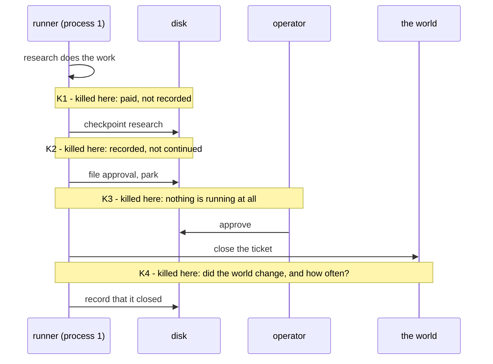

# 2.3 — Four moments, and why the moment is the experiment

## One-line answer

"Kill it mid-run" is not one test but four, because the interesting thing about a crash is never
that it happened — it is which two writes it landed between, and the four gaps in this system fail
in four different ways.

## The story

Sports day, the relay. Four runners, one baton, and the whole race is decided in the handovers.

If a runner drops the baton in the middle of her leg, it is bad but it is simple: she stops, picks it
up, carries on. She lost a couple of seconds and nothing else changed. Everyone can see what
happened and everyone knows what to do.

The handover is different. There is a moment when the baton is touching two hands, and a moment
just before when it is touching one, and a moment just after when it is touching the other. If it
goes down *there*, neither girl is sure whose it is. Both reach. Sometimes both run on, one of them
without it. Sometimes neither does. And the thing that decides which of those you get is not how
hard anyone was trying — it is exactly where in that half-second the baton left the hand.

Nobody practises dropping it in the middle of a leg. Everybody practises the handover.

## The idea in plain language

A run is a sequence of writes. Stage finished — write. Stage finished — write. Approval filed —
write. Ticket closed — write.

Between any two writes there is a gap, and the process can die in it. That is what "mid-run" means,
and the reason a single test of it is not enough is that the gaps are not interchangeable. Each gap
leaves the world in a different half-finished state, and each of those states poses a different
question to the process that comes along next.

The four gaps in this system, and the question each one asks:

| Kill | Lands between | The question it asks |
| --- | --- | --- |
| **K1** | a stage's work and its checkpoint | is work that was paid for and lost repeated correctly? |
| **K2** | a checkpoint and the next stage | is completed work skipped rather than repeated? |
| **K3** | parking and the human answering | does waiting cost anything, and does it survive? |
| **K4** | the decision and the effect | does the outside world change exactly once? |

Read the right-hand column and notice that no two rows are asking the same thing. K1 and K2 are
about *work*, and they pull in opposite directions: K1 asks whether you repeat enough, K2 asks
whether you repeat too much. K3 is about *cost*, and it is the only one where the correct answer is
that nothing happened at all. K4 is about *the world*, and it is the only one where getting it wrong
is visible to a customer.

There is a term for what the first three have in common and the fourth does not. K1, K2 and K3 all
happen inside a boundary you own: the run's own state, in your own files. K4 crosses the boundary —
it is the moment your system stops thinking and starts *doing*. Everything before it is reversible
by deleting a file. Nothing after it is.

That is why the drill runs all four and why part 3.4 is the long one.

## Why Sutra needs it

The plan's gate sentence for Phase 9 is *"kill it mid-run; it resumes; a human approved the write"*,
and a reader in a hurry will satisfy it with one kill in a convenient place. K1 is the convenient
place: it is the easiest to arrange, it passes, and it demonstrates a resume.

It also happens to be the kill that the framework handles for you. Day 60 measured what ADK 2.7.1
does on resume and found the behaviour is already decided at the framework level. Passing K1 is
evidence about `google-adk`, not about Sutra.

K4 is the one that is Sutra's own problem, because the effect — closing a ticket — is code this
curriculum writes rather than code it imports. A gate that only runs K1 has tested somebody else's
work and signed off on its own.

## The mechanism

The four moments as they sit in one run:



The kill points are strings the runner understands, so the drill chooses the moment and the process
obeys:

```python
for stage in _desk.STAGES:
    if stage in done:
        print(f"  {stage:9s} reinstated")
        continue
    if kill_at == stage:
        _die(stage)
    produced = _desk.STAGE_FN[stage](ticket, state, meter)
    meter.charge(stage)
    _store.append_event(run_id, "spent", stage=stage, cost=_desk.STAGE_COST[stage])
    if kill_at == f"during-{stage}":
        _die(f"during-{stage}")
    state.update(produced)
    _store.append_event(run_id, "stage", stage=stage, produced=produced)
    print(f"  {stage:9s} ran        {_short(produced)}")
    if kill_at == f"after-{stage}":
        _die(f"after-{stage}")
```

**Line by line:**

- `if stage in done` is the resume: a stage named in the log is not re-run, it is announced as
  `reinstated`. `done` came from folding the log, so this is the only place the log turns back into
  behaviour.
- Three kill points hang off one stage, and they are deliberately not the same: `--kill-at research`
  is *before* the work, `--kill-at during-research` is after the work and before the checkpoint, and
  `--kill-at after-research` is after the checkpoint. Only the middle one is interesting, and having
  all three available is what lets you prove that.
- The `spent` event is appended **before** the `during-` kill and the `stage` event **after** it.
  That ordering is the entire content of K1: the cost is durable, the result is not, and the gap
  between those two lines is where the crash goes.
- `state.update(produced)` happens after the kill point too, so a killed process never gets to use
  the result it did not manage to record. Updating the in-memory state first would make no
  difference to this process, but it would make the code lie about the order of events.
- `_short(produced)` trims each printed value, because the drill is read as a table and an intake
  stage that prints a whole ticket pushes everything else off the screen.

## When it breaks

The way this breaks is choosing the moment by hand, which quietly turns four experiments into one.

Suppose the drill killed the process by starting it and terminating it after a fixed pause. That is
how most people first write it, and it does test *a* moment — whichever one the pause happened to
land in. Run it again on a slower machine and it lands somewhere else. Run it in a suite and it
lands in a third place. The test is now a random sample of one, and the day it goes red you will not
know which gap it found.

Here is what that looks like when the moment is not chosen. Killing the process before the stage
runs instead of after it:

```bash
cd days/day-65-kill-it-mid-run/lab
uv run python -c "import _store; _store.reset()"
uv run python runner.py start 4610 --run-id m1 --kill-at research; echo "exit: $?"
uv run python -c "import _store; print('spend:', _store.spend('m1'))"
```

**Line by line:**

- `--kill-at research` is the *before* variant: `_die` fires ahead of the stage function, so the
  research request is never made.
- `_store.spend` reads the durable cost out of the log, which is the only place it survives.

Measured on 2026-09-05:

```text
start  m1: ticket 4610
  intake    ran        ticket=4610 text=Signed out mid-form. The customer fill...
  classify  ran        label=auth
  [killed at research]
exit: 137
spend: 1
```

One request, not two: nothing was paid for and lost, because the kill landed before the work rather
than after it. The run looks almost identical from the outside — same exit code, same two stages
reinstated on resume — and it is measuring a completely different thing. That is the whole argument
for naming the moment.

## In production

**What a professional writes instead.** The kill points get names in the code — a small set of
labelled fault-injection sites — rather than being arranged by timing. That is the difference
between a chaos test and a flaky test. Real systems do it with a fault-injection flag that is
compiled out or gated behind an environment variable in production, and the discipline is that a new
write across a boundary comes with a new named kill point in the same commit.

**What degrades at scale.** Four moments is a complete enumeration here because this run has four
gaps. A real graph with fifteen nodes and three external calls has dozens, and enumerating them
stops being possible. What survives is the rule rather than the list: **kill on both sides of every
boundary crossing**, and treat the inside-your-own-state gaps as one class you sample rather than
one test each.

**The failure mode that only appears with real traffic.** The gaps get wider under load. K4's window
in this drill is microseconds; in a real system the effect is an HTTP call that takes hundreds of
milliseconds, and the probability of a crash landing inside it goes up by orders of magnitude. Teams
are often surprised that a race they "never see" starts happening daily after a traffic increase.
Nothing changed except how long the window is open.

**The review comment a senior engineer leaves:** *"The test kills the worker after a fixed pause. That
is a coin toss dressed as a test. Name the points where you cross a boundary and kill at each of
them by name, so that when this goes red I know which boundary broke rather than which machine was
busy."*

**The interview question:** *"You say you test crash recovery. Where exactly do you kill it?"* The
weak answer is "in the middle". The strong one names boundaries: *"On both sides of every write that
leaves my own state. In our triage run that is four points, and only one of them is genuinely ours —
the gap between the human's decision and the external write. The other three are the framework's
resume behaviour and I test them to catch regressions, not because I expect them to fail."*

## Check yourself

```bash
cd days/day-65-kill-it-mid-run/lab
uv run python -c "import _store; _store.reset()"
uv run python runner.py start 4610 --run-id m1 --kill-at research
uv run python -c "import _store; print('spend:', _store.spend('m1'))"
uv run python -c "import _store; _store.reset()"
uv run python runner.py start 4610 --run-id m2 --kill-at during-research
uv run python -c "import _store; print('spend:', _store.spend('m2'))"
```

Two kills, one stage apart. Write down both spend numbers and say which one is the moment the drill
actually cares about.

**Out loud, without scrolling up:** name the four gaps and say which one is the only one whose
failure a customer can see.

**Next:** [3.1 — Killed before the checkpoint](../03-four-kills/3.1-killed-before-the-checkpoint.md).
