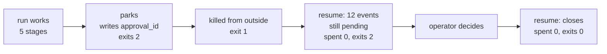

# 3.3 — K3: killed while parked, waiting for the human

## One-line answer

A run waiting for a person is the easiest thing in the world to kill correctly, because it is not
holding anything — and the drill proves that by killing it from **outside**, with a signal the run
has no code path for, and watching the resume cost zero requests.

## The story

You take the car to a garage with a noise in the front wheel. They put it up on the ramp, look at
it, and ring you: it is a wheel bearing, it will be a hundred and forty, do you want it done?

You are in a meeting. You do not answer.

At six o'clock the mechanic goes home. He does not stand next to your car until you call back. He
writes the quote on the job card, clips the card to the windscreen, and walks out. The garage is
locked and dark and your car sits on the ramp all night.

You ring back at nine the next morning and say yes. A **different** mechanic reads the card, sees
the quote, sees that you approved it, and fits the bearing. Nobody had to have been there. The whole
conversation survived a locked building and a change of staff, because it was on the card and not in
anyone's head.

Now imagine the garage that works the other way: the mechanic stays on the phone line, holding, until
you answer. That garage can serve one customer at a time and stops working entirely at six.

## The idea in plain language

A run is **parked** when it has done everything it can and is waiting for a decision only a person
can make. Day 62 is the day about the shapes that decision can take; this part needs only the
mechanical fact that the run has stopped and is not coming back on its own.

The crucial property is that **parking is a state on disk, not a process holding still**. When the
triage run in this day parks, it writes one line into its log:

```text
{"approval_id": "appr-k3", "kind": "parked"}
```

and then the process **exits**, with code `2`. It does not sleep. It does not poll. There is nothing
left running.

That is why this kill is different from the two before it. K1 and K2 killed a process that was in
the middle of work and losing something. K3 kills a process that is, by construction, holding nothing
worth losing — and the interesting question is not *did it survive* but *can we prove it survived
for the right reason*.

So this kill is administered differently. The other three kills are self-inflicted: the runner is
told `--kill-at` and stops itself at that point. Here the drill starts the run with a `--wait` flag
that makes it hold the process open after parking, and then a **different process** terminates it.
The run has no handler for that signal. It is not asked to stop; it is stopped.

One term, defined once. A **signal** is a message the operating system delivers to a process from
outside it — the thing that happens when you press Ctrl+C, when a container is shut down, or when a
supervisor decides a process has had long enough. The receiving program does not call anything to
make it happen and, unless it has specifically arranged otherwise, cannot decline it.

## Why Sutra needs it

Every deployment shape this curriculum is heading for kills processes from outside as a matter of
routine. A container is stopped on a deploy. A machine is drained. A supervisor restarts a worker
that has been up too long. None of those are errors, and none of them ask permission.

If the desk's runs only survive the endings they were told about, then the first ordinary deploy
during business hours loses every run that happened to be in flight. Part 6.1 is where that lands in
a real system; this part is where the drill first sends a signal the run cannot see coming.

## The mechanism

The kill itself, from `drill.py`:

```python
def kill_while_parked(run_id: str, ticket: str) -> tuple[int, str]:
    """Start a run that holds itself open once parked, then terminate it from outside.

    This is the one kill the drill does not administer to the process from within: the
    signal arrives from another process, the way it does when a container is stopped.
    """
    child = subprocess.Popen(
        [PY, "runner.py", "start", ticket, "--run-id", run_id, "--wait"],
        cwd=HERE,
        stdout=subprocess.PIPE,
        text=True,
        encoding="utf-8",
    )
    lines = []
    for line in child.stdout:
        lines.append(line.rstrip())
        if "waiting" in line:
            child.terminate()
            break
    child.wait(timeout=30)
    return child.returncode, "\n".join(lines)
```

**Line by line:**

- `subprocess.Popen` rather than `subprocess.run`, because `run` waits for the child to finish and
  this drill needs the child **alive** so it can be killed. `Popen` hands back a handle to a process
  that is still going.
- `--wait` is the flag that makes the runner hold the process open once it has parked. Without it the
  run would exit cleanly on its own and there would be nothing to terminate — you cannot kill a
  process that has already left.
- `for line in child.stdout` reads the child's output as it arrives. The drill is watching for a
  specific line rather than waiting a fixed amount, because waiting a fixed amount is the flakiest
  thing you can put in a test: too short and the kill lands before the run has parked, too long and
  every run of the drill is slower for no reason.
- `if "waiting" in line` is the synchronisation point. The runner prints `waiting (holding the
  process open so it can be killed)` immediately after parking, so that line arriving is proof the
  park is on disk and the kill is about to land in exactly the right place.
- `child.terminate()` sends the signal **from this process to that one**. This is the line the whole
  part exists for: the run does not stop itself, and has no code that runs in response.
- `child.wait(timeout=30)` collects the exit code afterwards. The timeout is a guard, not a pace: if
  the child somehow ignores the signal the drill fails loudly instead of hanging for ever.

Run the kill on its own:

```bash
cd days/day-65-kill-it-mid-run/lab
uv run python drill.py --kill K3
```

**Line by line:**

- `--kill K3` runs this one experiment from a clean state directory, so nothing here depends on K1
  or K2 having run first.
- The drill prints all three phases — the killed process, the resume that parks again, and the resume
  after the operator decides — because the middle one is the part people assume and do not check.

Measured on 2026-09-06:

```text
=== K3: killed while parked, waiting for the human ===
start  k3: ticket 4588
  intake    ran        ticket=4588 text=Password reset e-mail never arrives. T...
  classify  ran        label=auth
  research  ran        neighbour=4610
  draft     ran        draft=Ticket 4588: classified auth. See tick...
  review    ran        verdict=needs-approval rubric=v1
  parked    awaiting appr-k3
  -> exit 1   [killed from outside]
resume k3: 12 events on disk, stages done ['intake', 'classify', 'research', 'draft', 'review']
  intake    reinstated
  classify  reinstated
  research  reinstated
  draft     reinstated
  review    reinstated
  spent     0 requests
  -> exit 2   [parks]
  appr-k3 approved by operator-a
resume k3: 12 events on disk, stages done ['intake', 'classify', 'research', 'draft', 'review']
  intake    reinstated
  classify  reinstated
  research  reinstated
  draft     reinstated
  review    reinstated
  close     applied (key k3:appr-k3)
  spent     0 requests
  -> exit 0   [recovered]
  closes for this intent: 1
```

Three things in that output are worth stopping on.

**`exit 1`, and no traceback.** There is no `finally`, no last log line, no goodbye. Part 2.2
measured the three ways a process can stop and this is the third one: the run was not asked. What is
printed above the exit line is everything that reached the terminal before the signal arrived.

**`spent 0 requests` on the first resume.** This is the number that proves the claim. The resume
re-read twelve events, reinstated five stages, and paid for nothing, because every stage's result was
already on disk. Compare K1, where the same line read `spent 3 requests` — there the crash landed
between a stage's cost and its result, and the work had to be redone.

**`12 events on disk` before and after.** The first resume adds nothing to the log. It reads, finds
the approval still pending, prints `spent 0`, and exits `2` — the same state it started in. A resume
that finds nothing to do is allowed to do nothing, and this is what that looks like.



## When it breaks

The break is the garage that stays on the phone, and it is what the `--wait` flag actually is: a
deliberately wrong runner, kept so the failure can be run rather than described.

Look at what `--wait` does in the runner:

```python
if wait:
    print("  waiting   (holding the process open so it can be killed)", flush=True)
    while True:
        pass
```

**Line by line:**

- `while True: pass` is a **busy wait**: a loop that does nothing, as fast as the processor can do
  nothing. It is the crudest possible version of "hold the process open", and it is here because the
  drill needs a process to exist so that it can be terminated.
- `flush=True` forces the line out immediately rather than letting it sit in a buffer, because the
  drill is reading the child's output to decide when to send the signal. Without it the kill would
  land at an unpredictable moment and the experiment would not be the experiment.

That loop is what a HITL step looks like when someone implements waiting as *waiting*. It burns a
processor core, it occupies a process for as long as the human takes, and if the process dies the
run dies with it. The version this day ships instead is the one above: park, write the state, exit,
and let a later process pick it up.

The distinction is worth stating sharply, because it is the single most common mistake in this area:

| | Waiting as a process | Waiting as a state |
| --- | --- | --- |
| What holds the run | a live process | a file |
| Cost while waiting | a core, a container, a slot | nothing |
| Survives a deploy | no | yes |
| Two people answering at once | undefined | one write wins, and you can see which |
| How you find pending work | you cannot | list the directory |

There is also a quiet break that this kill does **not** catch, and it is stated here rather than
discovered later. Nothing in this drill stops two processes resuming `k3` at the same time. Both
would read twelve events, both would find the approval decided, and both would try to close. The
effect key in part 3.4 makes that survivable rather than correct — the second one is *replayed*
rather than refused — and a real system needs a lease on the run. This instrument does not have one.

## In production

**What a professional writes instead.** The parked run is a row in a work queue with a status, and
the thing that notices the approval is a worker that polls the queue or a callback fired by the
approval UI. Nobody starts a process and hopes it lives long enough. The park writes an
`awaiting_approval` row with the approval id; the resume is triggered by the decision, not by a
timer; and the `--wait` shape does not exist anywhere in the codebase.

**What degrades at scale.** Parked runs accumulate. Every one is a row nobody has answered, and the
number only goes up until someone measures it. The queue depth of pending approvals is the number
that tells you whether the gate is working or whether it has quietly become a backlog, and it is
almost never on the first dashboard anyone builds. Day 63 argues about which actions deserve a gate
at all, and this number is the evidence for that argument.

**The failure mode that only appears with real traffic.** A run parks, the deploy happens, and the
new code has a different set of stages. The resume reads a log written by the old code and reinstates
stages the new graph does not have — or, worse, finds a stage missing from the log that the new graph
requires and re-runs it against state that has moved on. This is the version-stamp problem, and it
appears the first time a run parks over a deploy, which on a real system is the first busy Friday.

**The review comment a senior engineer leaves:** *"There is no timeout on this park and no owner. If
nobody ever approves `appr-k3`, what happens? Right now the answer is 'it sits there for ever and
nothing tells anyone', and that is a decision you have made by not making it."*

**The interview question:** *"Your agent needs a human to approve something. What is your process
doing while it waits?"* The answer that shows experience is *"nothing, because it exited"*: *"Waiting
is a state, not a pause. The run writes what it needs to be resumed from and exits, and a later
process picks it up when the decision lands. I tested it by killing the process from outside while it
was parked — a real signal, not an exception — and the resume cost zero model requests because
everything it needed was already on disk. If I had held the process open, a routine deploy would
have destroyed every run that happened to be waiting."*

## Check yourself

```bash
cd days/day-65-kill-it-mid-run/lab
uv run python drill.py --kill K3
cat state/runs/k3.log
```

Count the lines in `k3.log` and compare with the `12 events on disk` the resume printed. Then find
the single line that is the whole reason the resume knew what to wait for.

**Out loud, without scrolling up:** explain why the first resume printed `spent 0 requests` while
K1's printed `spent 3`, without using the word "checkpoint".

**Next:** [3.4 — K4: killed inside the effect window](3.4-killed-inside-the-effect-window.md).
