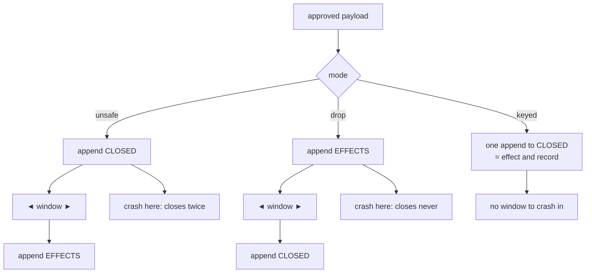

# 3.4 — K4: killed inside the effect window

## One-line answer

Between doing a thing and recording that you did it there is a gap, and a crash in that gap is
unrecoverable in principle — so the only fix is to make the doing and the recording **one write**,
which is what this drill's `keyed` mode is and why K4 is the kill that decides the phase.

## The story

You buy a fridge from a shop. You hand over the cash and the man behind the counter takes it, puts
it in the till, and turns round to write the sale in the book.

The lights go out.

You are standing there with no fridge, no cash, and no line in the book. Tomorrow you come back and
say you paid. He looks in the book and there is nothing. Neither of you is lying. The money moved
and the record of the money moving did not, and there is no amount of care either of you could have
taken yesterday that would settle it today.

Now the same shop, done differently. The man does not write in a book. He rings it into the till,
and the till prints two copies of a slip — one for you, one that stays in the drawer. The printing of
the slip **is** the sale. There is no moment where the money has moved and the slip has not, because
they are the same action, and if the lights go out halfway through you either have a slip or you have
your cash back.

## The idea in plain language

Everything a run does inside itself is recoverable. If the process dies, the work is redone, and
redoing it costs a request and changes nothing else. Parts 3.1 to 3.3 were all versions of that.

Then there are the things that reach outside: sending the reply, closing the ticket, charging the
card. Those are **effects**, and an effect has a property nothing inside the run has — it cannot be
undone by forgetting about it.

The **effect window** is the gap between an effect happening and the system knowing it happened. It
exists whenever those are two separate writes, and it is where K4 kills.

There are only three possible orders, and each one is a different bet:

| Order | What a crash in the window costs | The bet you are making |
| --- | --- | --- |
| do it, then record it (`unsafe`) | the effect happens **again** on resume | duplicates are cheaper than misses |
| record it, then do it (`drop`) | the effect **never** happens | misses are cheaper than duplicates |
| one write that is both (`keyed`) | nothing — there is no window | you can make them one write |

The first two are not bugs. They are the two honest answers available to you when the effect and the
record genuinely cannot be the same write — closing a ticket in someone else's system, sending an
e-mail, calling a payment API. Real systems choose one deliberately and say which.

The third is available more often than people think, and it is the one this desk uses. The trick is
to stop treating `closed.jsonl` as a *record* that the ticket was closed and to make it the ticket
**being** closed. Part 2.1 introduced that distinction and deferred the argument to here: this is the
argument.

One term, defined once. An **idempotency key** is a value that names *the intention*, not the
attempt — so that two attempts carrying the same key are recognised as the same intended action and
the second one does nothing. Here the key is `<run_id>:<approval_id>`, which says *this run, closing
under this decision*. Day 60 built idempotency by hand and its part on the subject is the deeper
treatment; this part needs the key to have exactly one job.

## Why Sutra needs it

The Phase 9 gate says *a human approved the write*. The write is the whole point of the phase, and it
is the one action in the triage flow that a customer can see. Everything Days 60 to 64 built exists
to make that one write happen exactly once, after a person said yes, no matter what kills the process.

If K4 fails, the phase fails, and it fails in the way that reaches a customer: a ticket closed twice
with two replies sent, or a ticket the operator approved that was never closed at all. Part 3.5 runs
both of those on purpose.

## The mechanism

The three orders, in one function:

```python
def apply_effect(key: str, ticket: str, text: str, mode: str = "keyed", die=None) -> str:
    """Close a ticket, in one of three orders. `die` is called in the window between the
    two writes, so the drill can kill the process at exactly the moment that matters.

    unsafe - do it, then record it. A kill in the window repeats the effect on resume.
    drop   - record it, then do it. A kill in the window loses the effect for ever.
    keyed  - one append that is both the effect and the record. There is no window.
    """
    if applied(key, mode):
        return "replayed"

    if mode == "unsafe":
        _durable_append(CLOSED, {"key": key, "ticket": ticket, "text": text})
        if die is not None:
            die()
        _durable_append(EFFECTS, {"key": key, "ticket": ticket})
        return "applied"
```

**Line by line:**

- `key` is the first parameter because it is the identity of the intention. Everything else in the
  signature describes *this attempt*; the key is what makes two attempts the same action.
- `die=None` is how the drill reaches inside. It is a function the caller passes that, when called,
  kills the process — so the kill lands **between the two appends** rather than somewhere nearby.
  Passing a callback rather than a flag means the window is defined by where the call sits in this
  function, which is exactly where the reader needs to see it.
- `if applied(key, mode): return "replayed"` is the guard, and its position matters: it is the first
  thing, before any write. A resumed process asks *has this intention already been carried out* and
  stops if it has.
- `_durable_append(CLOSED, ...)` in `unsafe` mode writes the customer-visible effect first, then
  `die()`, then the record. That order is why a resume repeats it: the guard reads `EFFECTS`, which
  the crash prevented from being written, so the resumed process believes nothing has happened.
- `return "applied"` versus `"replayed"` gives the drill a word to print. The distinction is not
  cosmetic — `replayed` is the guard doing its job, and a drill that could not tell them apart could
  not tell a working idempotency key from a lucky one.

And the mode that has no window:

```python
    rows = closed() if mode == "keyed" else effects()
    return any(row["key"] == key for row in rows)
```

**Line by line:**

- This is `applied()`, the guard's body. In `keyed` mode it reads `closed()` — **the effect file
  itself** — and in the other two it reads `effects()`, a separate record.
- That one-line difference is the whole of this part. When the guard reads the effect itself, the
  question "did this happen?" is answered by the thing that happened, so there is no way for the
  answer and the reality to disagree. When it reads a separate file, the two can differ, and the
  window is exactly the interval in which they do.

Now the kill. Run K4 in the mode the desk ships:

```bash
cd days/day-65-kill-it-mid-run/lab
uv run python drill.py --kill K4
```

**Line by line:**

- K4 is the only kill that has to run **after** a decision, because the window it targets does not
  exist until there is an approved payload to write. The drill therefore starts the run, approves it,
  and *then* kills the resume — which is why the printed order for this kill differs from the other
  three.
- `--mode` defaults to `keyed`, so this is the shipping configuration.

Measured on 2026-09-06:

```text
  classify  reinstated
  research  reinstated
  draft     reinstated
  review    reinstated
  close     applied (key k4:appr-k4)
  spent     0 requests
  -> exit 0   [recovered]
  closes for this intent: 1

----------------------------------------------------
kill   final exit  closes  verdict
K4     0           1       pass

mode=keyed  every kill ends in exactly one close: True
```

`closes for this intent: 1`. The process was killed inside the window on the previous attempt, the
resume ran the whole close path again, and the ticket is closed once.

Read the line above it too: `close applied (key k4:appr-k4)`. **Applied**, not replayed — because in
`keyed` mode the killed attempt never wrote anything at all. Here is the whole branch:

```python
    # keyed: one append. There is no instant at which the close exists and the record of
    # it does not, because they are the same line in the same file.
    if die is not None:
        die()
    _durable_append(CLOSED, {"key": key, "ticket": ticket, "text": text})
    return "applied"
```

**Line by line:**

- `die()` is called before the append, because in this mode there is nowhere else to put it. The
  drill asks to be killed "in the window" and this mode has no window, so the kill lands at the only
  moment available: just before the single write.
- That is not the drill going easy on itself — it is the strongest available test of the claim. The
  killed attempt left **nothing**, so the resumed process finds no matching key, closes for real, and
  the count is one. There is no half-done state to be clever about.
- The comment is load-bearing and worth keeping in your own version. The reason this line is one
  append rather than two is the entire correctness argument, and it is invisible from the call site.



## When it breaks

The break is choosing an order without knowing you chose one, and it is worth reaching on purpose.

Run the same kill with the two other orders:

```bash
uv run python drill.py --kill K4 --mode unsafe
uv run python drill.py --kill K4 --mode drop
```

**Line by line:**

- Nothing changes except the string passed to `apply_effect`. Same ticket, same approval, same kill
  point, same resume. One argument.
- Both are run from a clean state directory, so neither result depends on the other.

Measured on 2026-09-06, the last lines of each:

```text
mode=unsafe  every kill ends in exactly one close: False
```

```text
mode=drop  every kill ends in exactly one close: False
```

Part 3.5 is the full output of both and the reason they are a part of their own: **both of them exit
`0`**. Nothing raises. The verdict line is the only thing on the screen that knows.

The version of this that bites in real code is subtler than a mode flag, because nobody writes
`mode="unsafe"`. It looks like this:

```python
close_ticket(ticket_id)
db.execute("update runs set closed = 1 where id = ?", run_id)
```

**Line by line:**

- Two statements, in an order somebody chose without noticing they were choosing. The first reaches
  another system; the second records that it did.
- Everything between them is the window. A crash there closes the ticket again on resume, and the
  second reply goes to the customer.
- Swapping the two lines does not fix it. It converts a duplicate into a silent loss, which is worse
  in most systems and better in a few, and either way it must be a decision somebody wrote down.

## In production

**What a professional writes instead.** They put the effect and the record in one transaction when
both live in a database they control, and when they do not, they push the key **outward**: most
serious APIs accept an idempotency key on the request precisely so the caller can retry without
counting. The rule that survives everywhere is that the retrying party supplies the key, because only
the caller knows that this attempt and the last one are the same intention.

**What degrades at scale.** The guard is a linear scan of the effect file in this drill, which is
fine for a handful of rows and absurd at a million. In a real system it is a unique index on the key,
and the "already applied" answer is a constraint violation you catch rather than a check you run —
which is not a performance detail but a correctness one: a check followed by a write has a race
between them, and a unique index does not.

**The failure mode that only appears with real traffic.** Two processes resume the same run at the
same moment. Both read the effect file, both find no matching key, both append. The key made the
operation idempotent against *sequential* retries and did nothing about concurrent ones, and the
symptom is a customer receiving two identical replies a few milliseconds apart. This drill cannot
show that failure because it never runs two resumers, and that limitation is named again in part 6.1.

**The review comment a senior engineer leaves:** *"You have two writes here and a window between
them. That is fine, but tell me in a comment which failure you have chosen — do we double-send or do
we drop? Right now the order looks accidental, which means the next person to refactor this will
swap it and change your customer-visible behaviour without knowing they did."*

**The interview question:** *"How do you make sure an agent that was killed mid-action does not do
the action twice when it comes back?"* The answer that shows experience refuses the premise of a
clean fix: *"You cannot, in general, if the action and the record of it are two separate writes —
there is always a window, and all you get to choose is whether a crash in it duplicates or drops. So
the first move is to collapse them into one write where you can: I made the close ledger the close
itself, keyed on run plus approval, so the guard reads the effect rather than a record of it and
there is no window. Where they genuinely cannot be one write — a third-party API — you send an
idempotency key and let them collapse it, and you write down which of the two failures you chose. I
tested it by killing the process inside the window: keyed closes once, do-then-record closes twice,
record-then-do closes never, and all three exit zero."*

## Check yourself

```bash
cd days/day-65-kill-it-mid-run/lab
uv run python drill.py --kill K4
cat state/closed.jsonl
cat state/effects.jsonl
```

In `keyed` mode, one of those two files is empty. Say which, and why that is the point rather than an
oversight.

**Out loud, without scrolling up:** name the three orders and the failure each one produces, then say
which one the desk ships and what it had to change to be allowed to.

**Next:** [3.5 — Two closes, and none](3.5-two-closes-and-none.md).
