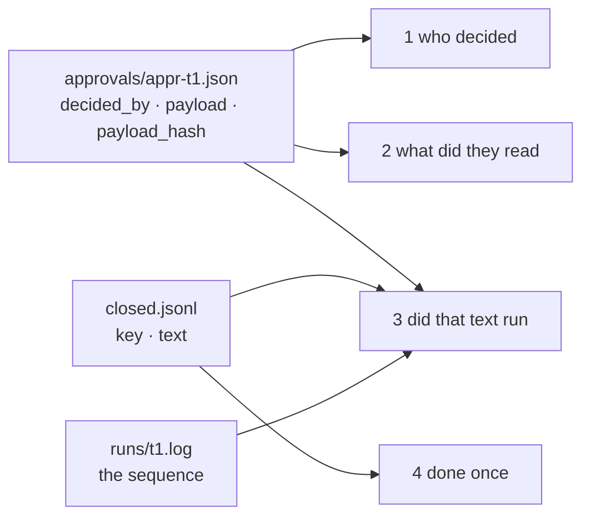

# 4.1 — Four questions, three months later

## One-line answer

An audit trail is not a log you can read — it is a set of specific questions somebody will ask when
everyone has forgotten, and the test of it is whether each question can be answered from rows on
disk with nobody available to interpret them.

## The story

Your washing machine breaks fourteen months after you bought it, and the shop says the guarantee is
two years, so you ring them.

They ask when you bought it. You say around March. They ask for the order number. You look in your
e-mail and find a confirmation, but it is for a different appliance. You remember paying by card, so
you go through the bank app and find a payment to the right shop on the eleventh, but the amount is
wrong because there was a delivery charge on a separate line.

Eventually you find the actual receipt, folded inside the manual, in the drawer under the kettle. It
has the date, the model number, the price and the shop's stamp. Two minutes later the engineer is
booked.

Everything you tried before that was a *trace* of the purchase. Only the receipt was a **record**.
The difference is not how much information it holds — the bank app held more. It is that the receipt
was written to answer this exact question, by someone who knew the question would be asked.

## The idea in plain language

Sections 2 and 3 tested whether the system *survives*. This section tests something different and
easier to skip: whether, afterwards, anyone can find out **what it did**.

The trap is that these feel like the same job. A system that logs plenty looks like a system you can
audit. It usually is not, because logging is written to help the person debugging it *today*, who has
the code open and remembers the deploy. An audit is read by someone who has none of that.

So the honest way to specify an audit trail is not "log the important things". It is to write down
the **questions** first, and then check that each one has an answer. This day uses four, and they are
in a deliberate order, each one narrowing the last:

| # | Question | What it is really asking |
| --- | --- | --- |
| 1 | who decided it | is there an accountable person, not a service account |
| 2 | what exactly did they read | did they see the thing that went out, or a summary of it |
| 3 | did that text run | is the thing they approved the thing that executed |
| 4 | was it done once | did the effect land exactly as many times as it was intended |

Question 3 is the one people miss, and it is the one that has teeth. Questions 1 and 2 are satisfied
by most approval systems. Question 3 asks whether the approval and the execution can be **tied
together after the fact**, and answering it requires that something about the payload was recorded at
decision time and can be compared with what actually ran.

One term, defined once. A **hash** is a short fixed-length string computed from a piece of text, such
that the same text always gives the same string and different text almost never does. Storing the
hash of what the approver read lets you check later that the executed text was the same, without
having to store the text twice or trust that nobody edited it. This day uses the first twelve
characters of a SHA-256 hash, which is short enough to read in a table and long enough that two
different drafts colliding is not a practical concern.

## Why Sutra needs it

The Phase 9 gate says *a human approved the write*. That sentence is a claim about the past, and a
claim about the past is worth exactly what the evidence for it is worth.

Criterion 3 in part 5.3 is this section turned into a command that exits non-zero. Part 4.2 is what
happens when the trail is built the way almost everyone builds it first, and part 4.3 turns the four
questions into a rule for what a record must contain.

It also matters beyond the gate. Day 63 designs the approval policy and Day 64 builds the gate, and
both of them are only as good as the evidence they leave: an approval gate with no audit trail has
moved the decision to a human without recording that it did, which buys the latency and none of the
accountability.

## The mechanism

The audit reads only files. It does not import the runner, it does not ask any running process
anything, and it is given nothing but a ticket id:

```bash
cd days/day-65-kill-it-mid-run/lab
uv run python trail.py
```

**Line by line:**

- `trail.py` first runs a complete, ordinary triage — start, approve, resume, close — so there is a
  real closed ticket to ask about. That run is the subject, not the instrument.
- It then answers the four questions from `state/` alone: the run log, the approval record and the
  close ledger. Nothing it prints comes from memory held over from the run it just did.
- It exits non-zero if any question is unanswerable, which is what makes it usable as criterion 3
  rather than as a report somebody reads.

Measured on 2026-09-06:

```text
approval store: payload stored

  who decided it               answered    operator-a
  what exactly did they read   answered    Ticket 4610: classified auth. See ticket 4588.
  did that text run            answered    hashes match
  was it done once             answered    1 close row(s) for key t1:appr-t1

unanswerable from rows alone: 0 of 4
```

Four answers, and each one comes from a different file, which is the point of keeping three files
rather than one.

**`operator-a`** comes from the approval record, written when the decision was made. Note what it is
not: it is not the identity of the process that performed the close, which is the same for every
close and tells you nothing.

**The draft text** comes from the approval record too, and this is the design decision that part 4.2
exists to defend. The approval stores the payload **itself**, not a pointer to where the payload can
be found.

**`hashes match`** is question 3, and it is a comparison across two files: the hash recorded in the
approval at decision time, against the hash of the text in the close row. This is the check that
would catch an approved draft being swapped for a different one between the decision and the
execution — the attack part 5.2 runs on purpose.

**`1 close row(s) for key t1:appr-t1`** is question 4, and it is the same count part 3.5 argued for,
read the same way: from the effect file, filtered by the key, after the fact.

Here is the record the middle two answers come from:

```bash
cat state/approvals/appr-t1.json
```

**Line by line:**

- One file per approval, named by the approval id, so the audit can find a decision without scanning
  anything. Three months later the id is what a colleague has, usually from a ticket reference.
- It is JSON on disk rather than a row in a database because this is a drill, and the point of the
  next block is that a person can read the whole record without a query tool.

```json
{
  "action": "close_ticket",
  "approval_id": "appr-t1",
  "decided_by": "operator-a",
  "decided_seq": 1,
  "payload": "Ticket 4610: classified auth. See ticket 4588.",
  "payload_hash": "c77a5a66bb50",
  "run_id": "t1",
  "state": "approved",
  "ticket": "4610"
}
```

Every field in that record earns its place against one of the four questions, and a field that
answers no question is a field somebody will delete during a refactor. `decided_by` is question 1.
`payload` is question 2. `payload_hash` is question 3. `run_id` plus `approval_id` compose the key
that question 4 counts. `action` and `ticket` are what make the row findable at all three months
later, when nobody remembers the approval id.



## When it breaks

The trail breaks in a way that produces no error, so it has to be caught by asking the questions
rather than by reading the code — and the honest version of this section is that **this instrument
answers four questions and a real audit asks more than four.**

Three questions this trail cannot answer, stated plainly rather than discovered by a reader:

**"Was the approver allowed to approve this?"** Nothing in the record says what `operator-a` was
entitled to decide. There is a name and no authority behind it. Day 63 designs the policy that would
give that name meaning and Day 68 is where permissions become real; this drill records who, not
whether-they-could.

**"What else did they see on the screen?"** The record stores the payload. It does not store the
evidence that was shown alongside it — the classification, the retrieved neighbour ticket, the
rubric verdict. A reviewer who approved a reply while looking at the wrong neighbouring ticket
approved it for a bad reason, and this trail cannot tell.

**"How long did they look at it?"** `decided_seq` is a counter, not a clock. There is deliberately no
timestamp anywhere in this drill, and the reason is worth knowing: a monotonically increasing counter
gives a reliable **order**, which is what the audit needs to say what happened before what, while
wall-clock times across processes can go backwards and turn an audit into an argument. Day 22 taught
that distinction with the logical-clocks paper. The cost is that this trail can order events and
cannot age them.

The break you can produce on purpose is the interesting one, and it is the subject of the next part:
store a pointer instead of the payload, and two of the four questions stop having answers while the
system carries on working perfectly.

## In production

**What a professional writes instead.** The approval record is an append-only table with the decider,
the payload or its hash, the policy version that required the approval, and the evidence bundle
identifier. It is written in the same transaction as the state change that parks the run, so an
approval cannot exist without a run and a run cannot be resumed without an approval. And it is
**immutable** — a changed decision is a new row, not an edit, because an audit trail you can update
is a suggestion.

**What degrades at scale.** Storing the payload inline is right at this size and wrong at a large
one. Approvals with a full document in each row make the table enormous and slow, so real systems
store the hash inline and the payload in object storage — which is fine, and which reintroduces part
4.2's problem the day somebody sets a retention policy on the bucket without telling the audit team.
The hash survives; the answer to question 2 does not.

**The failure mode that only appears with real traffic.** Log rotation and compaction. The run logs
are the cheapest thing to delete and the first thing an operations team truncates when disks fill,
and they are the file question 3 leans on to reconstruct sequence. The audit keeps working right up
until the retention window passes, and then quietly loses the ability to answer about anything older
than thirty days — which is exactly the age of the incidents anyone investigates.

**The review comment a senior engineer leaves:** *"Your approval row stores who and what. It does not
store why this needed approving — which policy rule fired. In six months you will change the policy,
and then every historical approval becomes uninterpretable, because you will not know whether that
action was gated at the time."*

**The interview question:** *"What does your audit trail need to contain?"* The answer that shows
experience refuses to list fields: *"Whatever answers the questions someone will actually ask, so I
write the questions down first. On the approval path I use four: who decided, what exactly did they
read, is that the thing that ran, and did it happen exactly once. The third is the one people miss —
it needs a hash taken at decision time and compared after execution, because otherwise you can prove
somebody approved something and cannot prove it was this. I made it a check that exits non-zero, so
it fails in the build rather than in an incident review."*

## Check yourself

```bash
cd days/day-65-kill-it-mid-run/lab
uv run python trail.py
cat state/approvals/appr-t1.json
```

Take the field `decided_seq` and say which of the four questions it serves. If your answer is "none",
you have found the argument in part 4.3.

**Out loud, without scrolling up:** state the four questions in order, and say which one most
approval systems fail.

**Next:** [4.2 — The trail that cannot answer](4.2-the-trail-that-cannot-answer.md).
