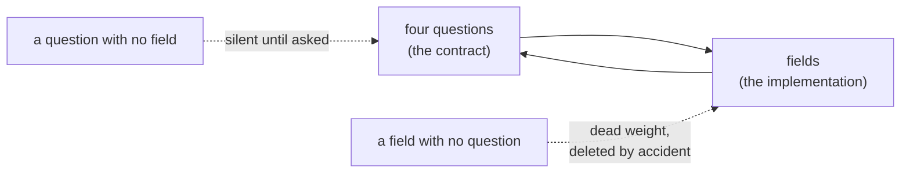

# 4.3 — What a record must contain

## One-line answer

A field belongs in an audit record only if you can name the question it answers, and the rule that
follows — every field maps to a question, every question maps to a field — is what keeps a trail from
thinning one reasonable decision at a time.

## The story

The courier hands over the parcel and holds out a device for you to sign.

He does not ask for your signature because your handwriting proves anything — it is a smear on a
screen that looks nothing like your signature and nobody will ever compare it. He asks because the
device records four things at that moment: a name, the time, the address it was left at, and the fact
that somebody was there to take it.

You know this because of what happens when it goes wrong. The parcel does not arrive, you ring up,
and the first thing they read back is *"signed for by S. Gupta at 14:12"*. That is the whole
conversation. Either you accept it or you say that is not you, and then the address line matters,
because it turns out it was left next door.

Every one of those four fields exists because of a specific argument someone has had before. The
device does not record the weather or the courier's route, not because those are hard to capture but
because no dispute has ever turned on them.

## The idea in plain language

Part 4.1 wrote down four questions. Part 4.2 showed what it costs to drop a field that answers one.
This part turns that into a rule you can apply to a record you have not built yet.

**Every field in an audit record must map to a question somebody will ask. Every question somebody
will ask must map to a field.**

Both halves matter, and they fail in opposite directions.

A field with no question is **dead weight**, and dead weight is not harmless. It makes the record
bigger, it makes the record look thorough, and it is the first thing deleted in a refactor by someone
who cannot tell it apart from the fields that matter — because there is nothing in the code saying
which is which. A record where half the fields are unexplained is a record where the load-bearing
ones are one careless commit from being removed.

A question with no field is the failure of part 4.2: silent until asked.

Applied to this day's approval record, every field earns its place:

| Field | Question it answers |
| --- | --- |
| `decided_by` | who decided it |
| `payload` | what exactly did they read |
| `payload_hash` | did that text run |
| `run_id` + `approval_id` | was it done once (they compose the key) |
| `action` | what kind of thing was being decided |
| `ticket` | how anybody finds this row three months later |
| `state` | whether it was decided at all, and which way |
| `decided_seq` | what order decisions happened in |

The last two are worth a moment because they are the ones a reader would challenge.

`state` looks redundant next to `decided_by` — surely a row with a decider was decided? It is not
redundant, because a **pending** row must exist before anyone decides, and a **rejected** row must be
distinguishable from an approved one. Question 4 asks whether the effect happened as many times as it
was intended, and an intention that was refused is an intention with a correct count of zero.

`decided_seq` answers a question that is not on the list of four, and part 4.1 invited you to notice
that. It is the ordering question: *what happened before what*. It survives the rule because ordering
is what makes the other four answers composable — you can say a decision came after a draft and
before a close. Had it been a wall-clock timestamp it would have answered the same question worse,
because times taken in different processes can disagree and even go backwards, and an audit whose
ordering can be argued with is an audit that gets argued with. Day 22 taught that with the
logical-clocks paper, and this is the smallest possible application of it.

## Why Sutra needs it

Days 63 and 64 build the approval gate, and the record this rule describes is what they must write.
A gate that stops the run and asks a person, and then keeps no evidence of what the person saw, has
paid the entire cost of a human in the loop and bought only the delay.

Section 5 then turns the four questions into a criterion that exits non-zero, and a criterion can
only check fields that exist. The rule in this part is what stops the record from quietly losing a
field between now and then.

## The mechanism

The rule is only useful if it is executable, and here it is a small one: the audit asks its questions
by name, so a missing field is reported as an unanswered **question** rather than as a `KeyError`.

```python
QUESTIONS = (
    "who decided it",
    "what exactly did they read",
    "did that text run",
    "was it done once",
)
```

**Line by line:**

- The questions are a **module-level constant**, written in English, before any field is mentioned.
  That is the rule made structural: the questions exist first and the record is an implementation of
  them.
- It is a tuple rather than a list because the set is fixed for the life of the audit. Adding a fifth
  question is a change to what this gate promises, and it should read like one in a diff.

Each question is then answered from the record, and the answer carries a flag saying whether it is
one:

```python
    return [
        (QUESTIONS[0], str(who), who is not None),
        (QUESTIONS[1], read if not thin else f"{read}  (the text is not here)", not thin),
        (
            QUESTIONS[2],
            "hashes match" if ran else "cannot be checked: no hash was stored",
            ran,
        ),
        (QUESTIONS[3], f"{len(rows)} close row(s) for key t1:appr-t1", len(rows) == 1),
    ]
```

**Line by line:**

- Every entry is `(question, what we can say, is it actually an answer)`. The third element exists
  because the second one is **never blank** — even the failures print something — and part 4.2 showed
  that a plausible-looking string is the dangerous shape. The boolean is what stops the printed text
  from being mistaken for an answer.
- `who is not None` rather than a truth test on `who`: an approval decided by someone whose name
  rendered as an empty string is a broken record, not an unanswered question, and collapsing the two
  would hide it.
- Question 3's failure text is `cannot be checked: no hash was stored` — it names the **missing
  field**, not just the failure. An audit that reports a gap without saying what created it sends
  somebody on a search; naming the field ends the search.
- `len(rows) == 1`, not `>= 1`. Question 4 is *was it done once*, and part 3.5 is the reason both
  directions are failures.
- The whole thing is a list of triples returned from one function, so the printed line, the count at
  the bottom and the exit code all come from the same evaluation. A summary computed separately from
  the detail is a summary that can disagree with it.

Run it once more and read the output as a **specification** rather than as a result:

```bash
cd days/day-65-kill-it-mid-run/lab
uv run python trail.py
```

**Line by line:**

- The four labels on the left are the questions, fixed. They do not change when the record changes,
  which is the whole idea: the questions are the contract and the fields are an implementation of it.
- The right-hand column is what the current record can supply. A change to the record moves this
  column and never the left one.

Measured on 2026-09-06:

```text
approval store: payload stored

  who decided it               answered    operator-a
  what exactly did they read   answered    Ticket 4610: classified auth. See ticket 4588.
  did that text run            answered    hashes match
  was it done once             answered    1 close row(s) for key t1:appr-t1

unanswerable from rows alone: 0 of 4
```

The left column is the durable half of that output. If someone redesigns the approval store next
month, these four lines must still print `answered`, and how they do it is their business.



## When it breaks

The rule breaks the way all documentation-shaped rules break: it is applied once, at design time, and
never again.

The realistic failure is not somebody adding a useless field. It is somebody **changing the meaning
of a field that already exists**, so the mapping quietly stops holding while every name stays the
same. Two concrete versions, both ordinary:

`decided_by` starts as a person and becomes a service. Someone adds automatic approval for low-risk
actions — sensibly, following Day 63's argument that gating everything is the same as gating nothing
— and the auto-approver writes `decided_by: "auto-policy"`. The field is populated, the audit prints
`answered`, and question 1 is no longer being answered, because the question was *is there an
accountable person* and the answer is now no. The check still passes. What was needed was a second
field saying which policy rule decided, and a question to go with it.

`payload` starts as the exact text and becomes a summary. A UI change shows the operator a rendered
preview while the record keeps storing the raw draft, and the two drift apart. Question 2 asks what
they **read**, and the record now holds what the system **had**.

Both are invisible to `trail.py`, because it checks that a field is present and not that it still
means what it meant. That is a real limit of this instrument, and the mitigation is not more code —
it is that the questions live in the document and get re-read when the record changes, which is why
they are written out in part 4.1 in English and not only encoded here.

## In production

**What a professional writes instead.** The questions are a written artefact next to the schema, and
adding a field to an audit table requires naming the question it answers in the change description.
Some teams go further and put the question in the column comment, so a migration that drops it has to
delete the sentence explaining why it exists — which is a small thing that catches a surprising
number of careless deletions.

**What degrades at scale.** Audit records get written by more than one code path. The approval UI
writes one, a bulk operations tool writes another, an admin fixing something by hand writes a third,
and only the first one was designed against the questions. The trail is then complete for most rows
and thin for the ones that came from the unusual path — which are, reliably, the rows an
investigation is about.

**The failure mode that only appears with real traffic.** Volume turns a good record into an
unreadable one. The four questions are answerable per row, and nobody investigating an incident reads
rows: they read aggregates, and an aggregate over a free-text `payload` is useless. Real audit
schemas end up with both — the exact payload for the single-row question, and a small number of
categorical fields for the "how often does this happen" question, which is a fifth question nobody
wrote down at the start.

**The review comment a senior engineer leaves:** *"Tell me, for each column in this table, which
question it answers. If you cannot, delete it — and if you can only answer for six of the nine, the
other three will be deleted by somebody else in a year, and it will be the wrong three."*

**The interview question:** *"How do you decide what goes in an audit log?"* The answer that shows
experience inverts the question: *"By writing down what someone will ask before deciding what to
store, and then keeping the mapping both ways — every field answers a question, every question has a
field. The first half stops the record filling with things nobody can defend, which matters because
unexplained fields are what get deleted in a refactor. The second half is the one that bites: a
question with no field fails silently, and you find out during the incident review. I also keep an
ordering counter rather than a timestamp, because a monotonic sequence gives an order you cannot
argue with and clocks in different processes give one you can."*

## Check yourself

```bash
cd days/day-65-kill-it-mid-run/lab
uv run python trail.py
cat state/approvals/appr-t1.json
```

Go through the record field by field and name the question each one answers. There are nine fields
and four questions on the list — account for the difference.

**Out loud, without scrolling up:** say what is wrong with a field that answers no question, without
using the word "clutter".

**Next:** [5.1 — Criterion 1: it resumes, once](../05-seven-criteria/5.1-it-resumes-once.md).
