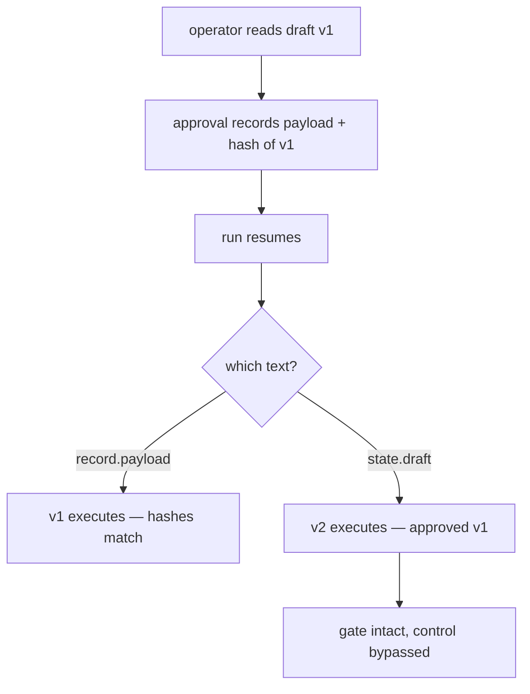

# 5.2 — Criterion 2: the gate cannot be bypassed

## One-line answer

Four attempts to reach the write without a valid decision — pending, rejected, re-decided and
tampered — and the fourth is the one that matters, because approving one text and executing another
is a bypass that leaves the gate looking perfectly intact.

## The story

There is a level crossing on the way to the station. When a train is coming, the barrier comes down
and the lights flash, and everyone waits.

Except there is a gap in the fence about twenty metres along, where a path has been worn through the
grass, and if you are late you can go through the gap, cross the track and come out the other side.
People do it every day. Nobody has ever been hurt on that path, which is exactly why they keep using
it.

The barrier works. It has never failed to come down. The safety report says the barrier was
operational one hundred per cent of the time last year, and it is true.

The barrier is also not what is keeping anybody off the track. The fence is. And nobody inspects the
fence, because the barrier is the safety feature and the fence is just fence.

## The idea in plain language

The second third of the Phase 9 gate is *a human approved the write*. Part 5.1 tested that a write
happens exactly once. This criterion tests that it happens **only after a valid decision**, which is a
different question and fails in different ways.

An approval gate has one job: to stand between an action and its execution such that there is no path
around it. So the criterion is not "does the gate work when used correctly" — it is "is there a way
to the write that does not pass through it". That is a question about paths, and you answer it by
trying them.

Four are worth trying, and they escalate:

| # | Attempt | The real-world version |
| --- | --- | --- |
| 1 | resume a run whose approval is still **pending** | a retry, a supervisor restart, an impatient operator |
| 2 | resume a run whose approval was **rejected** | someone re-running a failed job |
| 3 | **re-decide** an approval that was already decided | asking a second approver until one says yes |
| 4 | **change the draft** after approval, then resume | the payload swap |

The first three are the ones people think of, and they are all guarded by the same simple rule: the
run reads the approval record and refuses unless it says approved. The fourth is different in kind,
and it is the reason this criterion exists as a part rather than a line.

One term, defined once. **Time-of-check to time-of-use** — usually written TOCTOU — is the gap
between checking that something is allowed and doing it. Anything that can change in that gap was not
really checked. Here the gap is between the operator reading a draft and the run executing one, and
if the run executes whatever it currently holds rather than what was approved, the check was
performed on a different object from the action.

## Why Sutra needs it

Day 63 designs which actions need a human, and Day 64 builds the gate on the triage graph's write.
Both of those are investments in a control, and a control with a path around it returns nothing at
all — worse than nothing, because the organisation now believes writes are reviewed.

This criterion is also the day's **red-alarm test**, the check that proves the gate can fail
(Principle 11). Part 5.8 shows the gate running it. If swapping the payload does not turn criterion 2
red, then criterion 2 is the barrier and there is a path through the grass.

## The mechanism

Four attempts, one command:

```bash
cd days/day-65-kill-it-mid-run/lab
uv run python bypass.py
```

**Line by line:**

- Each attempt starts from a clean state directory and builds the exact situation it needs — a
  pending approval, a rejected one, an already-decided one, an approved one whose draft then changes.
- Each attempt reports what it managed to do in terms of **closes**, not in terms of exit codes,
  because a bypass that produced a close is a bypass whatever the process said on the way out.
- It exits non-zero if any attempt got through, which is what makes it criterion 2.

Measured on 2026-09-06:

```text
1 pending      resume exit 2, closes 0  -> held
2 rejected     resume exit 3, closes 0  -> held
3 re-decide    'already rejected by operator-b'  -> held
4 tampered     executed c77a5a66bb50, approved c77a5a66bb50
               -> held

findings: 0
```

Attempts 1 and 2 are held by the run refusing to proceed: exit `2` is *parked, still waiting* and
exit `3` is *rejected, nothing written*. In both cases `closes 0` is the part that matters — the
distinct exit codes are a convenience for the operator, and the zero is the evidence.

Attempt 3 is held by the approval record itself:

```python
def decide(approval_id: str, state: str, by: str, seq: int) -> str:
    """Approve or reject. A decided row never flips: history accretes, it never edits."""
    record = read_approval(approval_id)
    if record is None:
        return f"no such approval: {approval_id}"
    if record["state"] != "pending":
        return f"already {record['state']} by {record['decided_by']}"
```

**Line by line:**

- `if record["state"] != "pending"` is the whole of attempt 3's defence: only a pending row can be
  decided. A rejected row cannot be quietly approved by whoever asks next.
- It returns a **message naming the previous decider** rather than raising or silently doing nothing.
  Someone trying to approve an already-rejected item is usually not an attacker; they are a person
  who does not know it was rejected, and the useful response tells them who to talk to.
- The docstring's second sentence is the design rule and belongs in your own version: history
  accretes, it never edits. A decision that can be overwritten is a decision that cannot be audited,
  because the audit reads the row and the row now says something else.

Attempt 4 is the interesting one, and it is held by a single choice in the runner:

```python
    payload = state["draft"] if trust_state else record["payload"]
```

**Line by line:**

- `record["payload"]` is what the operator read, stored at decision time. `state["draft"]` is what the
  run is holding **now**, rebuilt from its log.
- On the happy path these are the same string, which is exactly why the wrong one is so easy to write
  and so hard to notice. Every test passes either way until something changes the draft between the
  decision and the execution.
- `trust_state` exists so this criterion can be turned off on purpose. It is not a feature; it is the
  ablation switch that lets the gate prove the check is live.

The two hashes on attempt 4's line are the evidence: `executed c77a5a66bb50, approved c77a5a66bb50`.
Same hash, so the text that ran is the text that was approved.



## When it breaks

Turn the check off and watch the gate stay standing while the control disappears:

```bash
uv run python bypass.py --trust-state; echo "exit: $?"
```

**Line by line:**

- `--trust-state` makes the run execute the draft it is currently holding instead of the approved
  payload. Nothing else changes: the approval is still required, still filed, still read, still
  checked for `approved`.

Measured on 2026-09-06:

```text
1 pending      resume exit 2, closes 0  -> held
2 rejected     resume exit 3, closes 0  -> held
3 re-decide    'already rejected by operator-b'  -> held
4 tampered     executed e627ed6d8b56, approved c77a5a66bb50
               -> BYPASSED

findings: 1
  - the executed payload was not the approved payload
exit: 1
```

Read attempts 1, 2 and 3. **Unchanged.** All three still held. A gate test that only tried those
three would report a working control.

The two hashes on line 4 now differ, and that is the entire visible difference between a system where
a human approves the write and a system where a human approves *a* write and a different one goes
out. There is no error, no refusal, no log line at severity warning. The operator's name is still on
the record. The audit from part 4.1 would answer questions 1, 2 and 4 perfectly — and question 3,
*did that text run*, is precisely the question that catches this, which is why it was on the list.

This is also the day's proof that the check is honest. If `--trust-state` produced `findings: 0`, the
comparison would not be happening and criterion 2 would be a barrier with a path round it.

## In production

**What a professional writes instead.** The approved payload is **immutable and content-addressed**:
the approval stores the payload's hash, and the execution path takes the payload *from the approval
record*, so there is no variable holding a second version for anyone to accidentally use. The
strongest form removes the choice entirely — the executing code cannot reach the run's live state,
because it is only given the approval. A check you cannot forget beats a check you must remember.

**What degrades at scale.** More paths to the same effect. This drill has one runner and one write.
A real system grows an admin tool, a bulk re-run script, a support console and a migration job, and
each of them is a new path to the write that was not there when the gate was designed. The criterion
has to enumerate paths, and the number of paths grows faster than anyone's memory of them — which is
why Day 68's structural answer, taking the authority away rather than guarding each route, is the one
that survives.

**The failure mode that only appears with real traffic.** The payload changes for an innocent reason.
Nobody attacks this; a redraft after a rejection, a template update, a re-classification that changes
one sentence. The run resumes and executes the current draft, and it is *almost always* the same
text, so the divergence is rare, silent and impossible to reproduce from the ticket a customer
complains about.

**The review comment a senior engineer leaves:** *"You check that an approval exists and then you
execute `state.draft`. Execute `approval.payload`, or you have built a gate that approves one thing
and ships another, and the audit will show a green tick next to text nobody agreed to."*

**The interview question:** *"What is wrong with checking permission and then doing the thing?"* The
answer that shows experience names TOCTOU without hiding behind it: *"Anything that can change
between the check and the use was not really checked. On an approval gate the object is the payload:
if you approve a draft and then execute whatever the run is currently holding, you have a
time-of-check-to-time-of-use bug with a human in it, and it is invisible because the two are the same
string almost every time. The fix is to execute the approved artefact itself rather than a reference
to something mutable, and to store a hash so the audit can prove afterwards that what ran is what was
agreed. I tested it by swapping the payload after approval — three of my four bypass attempts still
reported held, so a test that only tried the obvious ones would have passed."*

## Check yourself

```bash
cd days/day-65-kill-it-mid-run/lab
uv run python bypass.py; echo "exit: $?"
uv run python bypass.py --trust-state; echo "exit: $?"
```

Three of the four attempts print the same thing in both runs. Say why that is the most important
sentence in this part.

**Out loud, without scrolling up:** describe the payload-swap bypass to someone who has not read this
part, without using the word "hash".

**Next:** [5.3 — Criterion 3: the trail answers from rows](5.3-the-trail-answers-from-rows.md).
