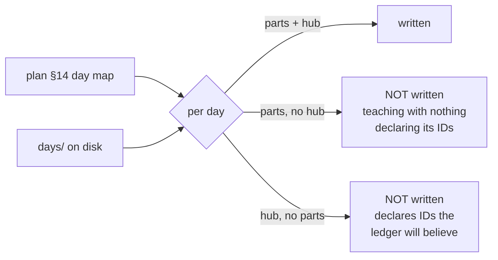

# 5.6 — Criterion 6: every day is written

## One-line answer

A phase cannot be green while a day inside it is unwritten, and the check reads the plan's day map on
one side and the folders on disk on the other — never assuming a day exists because the plan mentions
it.

## The story

You buy a secondhand textbook, and it is a good copy: sound spine, barely any highlighting, twelve
pounds instead of sixty.

Three weeks into term you turn to chapter seven and pages 214 to 240 have been cut out. Cleanly, with
a blade, right at the gutter, so the book still sits flat and looks complete from the outside.

The contents page still lists chapter seven. The index still points at page 219. Every reference to it
from chapters eight and nine still works, in the sense that they still say *see chapter seven*. The
book's own account of itself is entirely intact, and the only way to find out is to turn to the page.

## The idea in plain language

The plan's §15 rule 4 says a day with no `parts/` directory is not written, and a phase containing one
cannot be green.

This sounds like bookkeeping and it is the criterion that catches the most embarrassing kind of
failure: a phase declared finished with a hole in it. It happens because every *other* signal says the
day exists. The plan lists it. The traceability document has a row for it. Later days link to it. The
folder is there on disk, because somebody made the folder before they started writing.

So the check is deliberately blunt about what counts as written. It does not ask whether a day is
*good*. It asks two questions per day, both answerable by looking:

- does the day have a `parts/` directory with documents in it;
- does it have a `LESSON.md` hub.

Both, because either alone is a state a half-finished day actually reaches. Parts with no hub is where
a day stops when the writing is interrupted — the teaching exists and nothing assembles it, so the
day's IDs are undeclared and nothing links the parts. A hub with no parts is a day that was outlined
and never written, and it is the more dangerous of the two, because a hub declares IDs and so it makes
the traceability ledger look complete.

## Why Sutra needs it

`docs/TRACEABILITY.md` is generated from the day hubs. That means an unwritten day is invisible to it
in one direction and misleading in the other, and criterion 7 in part 5.7 reads that same ledger. This
criterion has to come first, because "every ID is declared" is a worthless sentence if a day that
should declare three of them does not exist.

It also protects the curriculum's central promise. Ninety-seven days that build on each other only
work if each one is actually there when a later day links to it. A hole in Phase 9 is a hole under
Days 66 to 96.

## The mechanism

The check reads both sides and prints every row, not only the failures:

```bash
cd days/day-65-kill-it-mid-run/lab
uv run python written.py; echo "exit: $?"
```

**Line by line:**

- `written.py` parses the phase's day numbers out of the plan's §14 day map rather than holding a
  hard-coded list. A hard-coded list is a second copy of the plan, and a second copy is a thing that
  can be quietly wrong — the check would then pass a phase whose day range had been amended.
- For each day it globs `days/day-NN-*` and counts `parts/**/*.md`, and separately tests for
  `LESSON.md`. Resolving the folder **by number and any slug** is what lets a day folder be renamed to
  a better slug without breaking the audit, which plan §17.2 explicitly allows.
- It prints one row per day whether or not it passes. A table of only the failures hides how much was
  checked, and the difference between an audit and a complaint is that an audit tells you the
  denominator.

Measured on 2026-09-06, mid-way through Phase 9 being written:

```text
day  folder                             parts  hub  written
60   day-60-durable-execution           23     yes  yes
61   day-61-pause-resume-checkpoints    11     no   NO
62   day-62-human-in-the-loop           22     yes  yes
63   day-63-approval-gates-design       25     yes  yes
64   day-64-approval-gates-build        21     no   NO
65   day-65-kill-it-mid-run             24     yes  yes

phase 9 days in the plan: [60, 61, 62, 63, 64, 65]
not written yet:          [61, 64]

Plan section 15 rule 4: a phase containing an unwritten day cannot be green.
exit: 1
```

That output is worth reading carefully, because it is a snapshot of a repository that is **moving
while the gate runs**, and this criterion is the one that shows it most plainly.

Look at the `parts` column against the `hub` column. Days 61 and 64 have 11 and 21 part documents on
disk and no hub. That is precisely the half-finished shape described above: the teaching is written
and nothing yet assembles it, so nothing declares those days' IDs and criterion 7 in part 5.7 reports
four of them open.

An earlier run of this same command, taken while this day was itself being written, had **five** rows
saying `NO` — days 61 through 65, with 7, 18, 22, 15 and 19 parts and not one hub between them. Day
65's row flipped when this day's hub landed; 62's and 63's flipped when theirs did. Nobody fixed
anything. The repository moved and the check moved with it, which is the same point part 5.7 makes
about the open-ID list and the reason both criteria are written as *run it and read it*.

The right response is not to wait until it looks better before running the gate. It is to run the
gate, read the row, and understand what the row means — which is the difference between an audit and
a ceremony. Part 5.8 takes the reading and states the verdict from it.



## When it breaks

The check breaks by trusting one source instead of two, and the failure is silent in the flattering
direction.

An earlier and simpler version of this check would iterate over the folders on disk and report on each
one. Every folder it found would have a hub and parts, and it would report green — because a day whose
folder was never created is **not in the list it is iterating over**. The check would be structurally
incapable of noticing the thing it exists to notice.

That is the general failure and it is worth having a name for: **checking a list against itself**. It
appears whenever an audit derives both its expectation and its evidence from the same place, and it
always passes. The fix is that the expectation comes from the plan and the evidence comes from the
disk, and the two are read independently — which is why `written.py` parses §14 rather than globbing
`days/`.

There is a second, quieter break. This check counts files; it does not read them. A day with a
`parts/` directory containing one empty document and a hub declaring three IDs will pass criterion 6
cleanly. That is not an oversight — the depth contract is what judges whether a day is any good, and
`./m depth` is a separate command with a much longer list of complaints. Criterion 6 answers *does it
exist*, `./m depth` answers *is it written properly*, and part 5.8 runs both, because a gate that
confuses the two claims more than it has checked.

## In production

**What a professional writes instead.** This is a completeness check between a specification and an
artefact, and the production version is the same idea with a machine-readable spec: a manifest of
expected components, a scan of what is deployed, and a diff. What makes it useful is the same thing
that makes it useful here — the two sides must have **independent origins**, or the check is a
tautology.

**What degrades at scale.** Existence checks are cheap and completeness checks are not. Six days is a
table; ninety-seven days across sixteen phases needs the check scoped to the phase being gated, which
is what this one does, and needs a whole-repository version that runs less often. The failure at scale
is a completeness report so long that nobody reads it, at which point it has the same value as no
report.

**The failure mode that only appears with real traffic.** Renames. The day map says day 63 and the
folder is `day-63-approval-gates-design`; someone improves the slug to `day-63-approval-policy` and
every check that resolves by full name breaks while every check that resolves by number keeps working.
This one resolves by number, deliberately, because the plan's §17.2 says the number is the identity and
the slug is a label — but any tool that hard-codes a path is a tool that will report a missing day the
first time someone renames a folder, and a false alarm in a completeness check trains people to ignore
it.

**The review comment a senior engineer leaves:** *"This iterates over what exists and reports on it.
Iterate over what is supposed to exist and report the difference, or you will never detect the case
you wrote it for."*

**The interview question:** *"How do you check that something is complete?"* The answer that shows
experience is about where the two lists come from: *"You need an expectation and an observation with
independent origins, or you are checking a list against itself and it will always pass. In my case the
expectation is parsed from the plan's day map and the observation is a scan of the folders, and the
check reports every row rather than only the misses, so the output tells you the denominator. I also
keep 'does it exist' separate from 'is it any good' — they are different questions with different
tools, and a gate that runs one and claims the other is worse than a gate that runs neither."*

## Check yourself

```bash
cd days/day-65-kill-it-mid-run/lab
uv run python written.py; echo "exit: $?"
ls ../../day-61-pause-resume-checkpoints/
```

If the row for day 61 says `NO` while its folder plainly contains work, say exactly which of the two
conditions it is failing and what would have to appear for it to flip.

**Out loud, without scrolling up:** explain why a hub with no parts is more dangerous than parts with
no hub.

**Next:** [5.7 — Criterion 7: no open IDs in the phase](5.7-no-open-ids.md).
