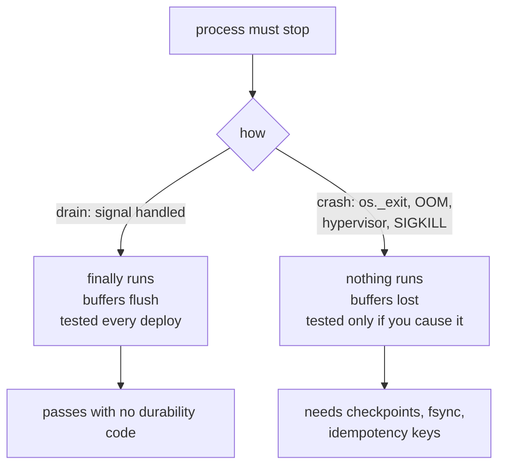

# 6.1 — Draining versus killing, and why you must test the crash

## One-line answer

Real systems stop processes politely almost every time, which is exactly why the polite path is the
only one that ever gets tested — and the ungraceful stop, which is the one that loses data, is met
first in production unless you go and cause it.

## The story

The hospital tests its backup generator on the first Tuesday of every month.

They do not test it by waiting for a power cut. They test it by opening a panel and **cutting the
mains on purpose**, at eleven in the morning, with the engineer standing there and the maintenance
team told in advance. The lights flicker, the generator catches, and somebody writes the date on a
sheet.

It is an odd thing to do to a working hospital. Everything is fine; they break it anyway.

The reason is that the generator has two failure modes and only one of them is visible without
cutting the mains. It might not start — which a monthly no-load run would catch. Or it might start
and not carry the load, and the only way to find that out is to give it the load. A generator that
has been started every month for six years and never asked to power anything is a generator nobody
has tested.

## The idea in plain language

There are two ways a process stops in a real deployment and they are not variations of each other.

A **drain** is a polite stop. The orchestrator sends a signal the process is expected to handle, the
process stops accepting new work, finishes or safely abandons what it is holding, flushes what it has
written, and exits. Rolling deploys, scale-downs and node maintenance are all drains, and they are the
overwhelming majority of process endings.

A **crash** is an ungraceful stop. Out of memory, a hardware fault, a hypervisor pulling the machine,
or the orchestrator's patience running out after the drain took too long. Nothing is flushed, no
handler runs, and whatever was in a buffer is gone. Part 2.2 measured exactly this and the third row
of its table is the whole distinction: `raise` and `sysexit` both let the `finally` block run and both
got the buffered line to the file, while the hard exit reached the file with **nothing**.

Here is the asymmetry that makes this a production section rather than a footnote. The drain path gets
tested constantly and for free — every deploy exercises it, so a bug in it is found within a day. The
crash path is exercised rarely and always at the worst moment, so a bug in it survives for months and
surfaces during an incident, on top of whatever caused the incident.

That is why the four kills in section 3 use `os._exit` and a signal from another process rather than
raising an exception. A test that stops the run by raising is testing the drain.

## Why Sutra needs it

Everything Phase 9 built is machinery for surviving the ungraceful stop. Checkpoints, the durable
`fsync`, the idempotency key, the park-and-exit — none of it is needed if processes always get to run
their cleanup.

So a Phase 9 gate that tested only graceful stops would pass a system with no durability at all, and
would do so consistently, for as long as nothing went wrong. That is the failure this part exists to
prevent, and the mechanism section below shows it happening.

## The mechanism

The drill's own kill is the ungraceful one, and the comment says why:

```python
def _die(where: str) -> None:
    """Stop the process the way a crash stops it: no unwinding, no `finally`, no flush.

    `os._exit` skips every cleanup path Python would normally run. That is the point -
    a `sys.exit` here would let buffers drain and would quietly make the drill easier
    than reality.
    """
    print(f"  [killed at {where}]", flush=True)
    os._exit(KILLED)
```

**Line by line:**

- `os._exit` rather than `sys.exit`. `sys.exit` raises `SystemExit`, which unwinds the stack, runs
  every `finally`, closes open files and flushes their buffers — a drain. `os._exit` terminates the
  process immediately, which is what a crash does.
- `flush=True` on the print is there precisely because nothing else will flush it. Without it the
  drill's own diagnostic line would be lost along with everything else, and the operator would not
  know where the kill landed.
- `KILLED` is `137`, which is the conventional code for a process terminated by signal 9 on Unix. The
  drill uses it as a marker so the summary table can distinguish "we killed this on purpose" from any
  other non-zero exit.

Compare the three endings, measured rather than asserted:

```bash
cd days/day-65-kill-it-mid-run/lab
uv run python deaths.py
```

**Line by line:**

- Three child processes, each writing an unflushed line and then stopping in one of the three ways,
  each with a `finally` that writes a second line.
- The parent reads the file afterwards. It reads the file rather than asking the child, because the
  child is not available for questions — which is the condition every one of this day's failures is
  discovered under.

Measured on 2026-09-06:

```text
how it stopped   exit  what reached the file
raise            1     wrote-but-not-flushed finally-ran
sysexit          9     wrote-but-not-flushed finally-ran
oshard           137   (nothing)

Only the last row is what a crash looks like.
```

Two of the three endings **recovered the unflushed write**, because closing the file on the way out
flushed it. A durability test built on either of them would pass a system that never called `fsync` at
all — and part 2.1's `fsync` line, the one people leave out, would look unnecessary.



## When it breaks

The break is a drain that is really a crash, and it is the most common way this bites a team that
believes it has done everything right.

An orchestrator drains by sending a polite signal and then waiting a **grace period**. If the process
has not exited when the period elapses, it is killed hard. So the ungraceful stop is not a rare
hardware event; it is the routine outcome for any process whose cleanup takes longer than the grace
period, on every single deploy.

Now put that next to a run that parks for a human. A process holding itself open while waiting — part
3.3's `--wait` shape — has cleanup that takes as long as the human does, which is always longer than
the grace period. Every deploy kills those processes hard. The failure is not rare and not random: it
is systematic, it correlates with deploys, and it looks like "we lose a few runs whenever we ship",
which is a sentence teams learn to live with.

There is a second break, and it is one this drill cannot show. Every kill in section 3 kills a process
running **one** run. A real worker holds several, and a hard kill takes them all at once — including
runs at different stages, some of which are inside their effect window. Nothing in this instrument
tests that, and the shared lease that would make concurrent resumption safe does not exist here. It
was named in part 3.3 and again in 3.4, and it is repeated here because it is the honest limit of
what passing this gate proves: the single-run path is sound, and concurrency is untested.

## In production

**What a professional writes instead.** They pick a shutdown model and make the code match it. Either
the process handles the drain signal and finishes fast — measured against the grace period, not hoped
about — or it does no cleanup at all and relies entirely on durable state, which is simpler and is what
this day's runner does. What does not work is the middle: a cleanup handler that is required for
correctness and takes longer than the orchestrator will wait.

**What degrades at scale.** Grace periods interact with fleet size. A rolling deploy across forty
replicas with a thirty-second grace period spends a predictable amount of time in a state where some
process somewhere is being killed hard, and the number of runs caught by that is proportional to
traffic. At small scale it rounds to never; at large scale it is a steady background rate that shows
up as a mysterious floor on your error budget.

**The failure mode that only appears with real traffic.** Out-of-memory kills. They are ungraceful by
definition, they are not triggered by any deploy you can schedule, and they preferentially strike the
processes doing the most work — which are the ones holding the most unfinished runs. A system that has
only ever been drained politely meets its first hard kill during a memory incident, when the durability
path is being exercised for the first time and everyone is already busy.

**The review comment a senior engineer leaves:** *"Your recovery test raises an exception to simulate a
crash. That runs every `finally` in the process and flushes every buffer, so it is testing the deploy
path, not the crash path. Kill the process for real — `os._exit`, or a signal from outside — or delete
the test, because right now it is telling you something you did not ask."*

**The interview question:** *"How do you test that your service survives being killed?"* The answer that
shows experience separates the two endings: *"By distinguishing a drain from a crash and testing the
crash, because the drain is tested by every deploy and the crash is not tested by anything. In practice
that means killing the process without letting it unwind — no `finally`, no buffer flush — and then
checking what is on disk from a different process. I measured the difference on my own runner: an
exception and a `sys.exit` both recovered a write that had never been flushed, because closing the file
flushed it, and only the hard exit lost it. The trap in production is that a graceful shutdown that
exceeds the orchestrator's grace period becomes a hard kill, so anything that waits — a human approval,
a long job — takes the crash path on every deploy rather than rarely."*

## Check yourself

```bash
cd days/day-65-kill-it-mid-run/lab
uv run python deaths.py
grep -n "os._exit" runner.py
```

Change the `os._exit(KILLED)` in `runner.py` to `sys.exit(KILLED)`, re-run `uv run python drill.py`,
and say which criterion notices. Then change it back.

**Out loud, without scrolling up:** explain why a graceful shutdown that takes too long is
indistinguishable from a crash, and which of this day's four kills it most resembles.

**Next:** [6.2 — Rotate the drill](6.2-rotate-the-drill.md).
