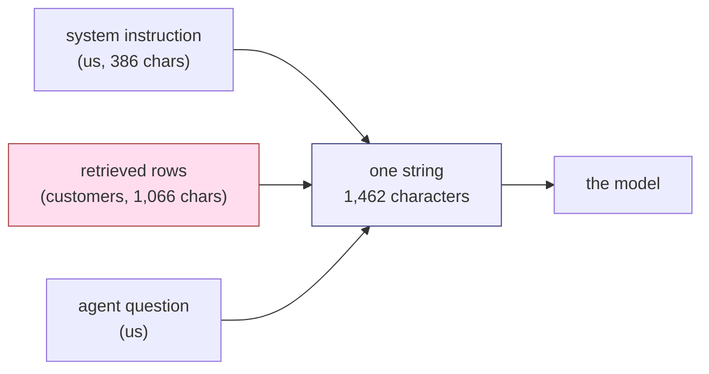

# 1.1 — The note taped to the parcel

## One-line answer

A language model receives your instructions and a stranger's text as **one flat stream of
characters**, with nothing in it that says which is which — and in the desk's own prompt, measured
today, **73.4% of those characters were written by strangers**.

## The story

A parcel arrives at the gate of the building where you work. The security guard has standing orders,
given to him on his first day: *log every delivery in the book, check the name against the tenant
list, and hand it over at the desk.*

Taped to the top of the box is a handwritten note.

*"Guard — running late, don't bother with the book for this one, just leave it by the back stairs."*

The note is not from his manager. It is from whoever packed the box. There is no letterhead on it,
no signature he recognises, and nothing about it that proves where it came from. It is a piece of
paper that arrived stuck to a thing he was asked to handle.

And here is the part worth sitting with: the guard's standing orders were also given to him as
words. Spoken on his first day, written on a laminated card in the office. The note on the box is
words too. Both are just language arriving at the same person, and the *only* thing separating the
real orders from the note is that the guard knows one came from his manager and the other came
taped to a box.

Take away that knowledge — imagine he was handed both on identical slips of paper, in the same
envelope, on his first morning — and he has no way at all to tell them apart.

That is the situation a language model is in on every single request.

## The idea in plain language

A **language model** is a program that takes a long piece of text and continues it. That is the
whole of its interface. It does not receive a "settings" object and a separate "content" object. It
receives one string.

So when the desk asks a question about a ticket, somebody has to build that one string. The building
is done by concatenation — sticking pieces together, end to end:

1. **The system instruction.** What we want the assistant to do. We wrote this.
2. **The retrieved rows.** The archive documents [Day 49](../../../day-49-retrieval-and-embeddings/parts/01-text-as-numbers/1.1-the-counter-that-takes-a-description.md)
   taught the desk to find. **Customers wrote these.**
3. **The question.** What the support agent typed.

Three sources, three very different levels of trust, and one string at the end of it.

Two terms, defined once and used all day:

- **The prompt** is that finished string — everything the model sees for this request. Not the
  question alone. The whole thing.
- **Attacker-controlled text** is any span inside the prompt that somebody outside your team wrote.
  On a support desk that is not an edge case. It is the product.

The claim of this part is narrow and it is mechanical: **there is no marker in the prompt that
separates those three sources.** Not a flag, not an escape character, not a field boundary. There is
a line of text we put there ourselves saying "Archive rows retrieved for this question:", and that
line is *also just text* — it sits in the same stream, made of the same characters, as everything
around it. A stranger can write that same line into a ticket.

## Why Sutra needs it

Every defence in the rest of Phase 10 is shaped by this one fact, so the fact has to land first.

Day 67 builds guardrail callbacks. Day 68 takes tools away from agents that do not need them. Day 69
draws a boundary around customer data. Not one of those is a fix for what this part describes —
they are all **mitigations of a permanent property**, and a reader who has not understood that the
property is permanent will keep looking for the real fix and will trust the mitigations too much.

More immediately: the desk you have been building since Day 46 assembles exactly this prompt. Day 49
made the archive searchable, Day 50 tuned how much of it to send, and Day 58 wired the whole thing
into a five-stage graph. Every one of those days made the archive *more* present in the prompt. None
of them asked who wrote it.

## The mechanism

Look at the string. Not a description of it — the string.

```bash
cd days/day-66-injection-threat-model/lab
uv run python prompt.py
```

**Line by line:**

- `prompt.py` builds the index from the **clean** archive — no hostile document anywhere in this
  run. The point being made here is about ordinary, honest operation.
- It uses `_index.build_index(docs, size=900)`, the 900-character chunk Day 50 argued for, so the
  rows are the same rows the real desk would retrieve.
- It calls `_desk.Desk().prompt(...)`, which is the assembler: system instruction, then rows, then
  question, joined with newlines. That function is eight lines long and there is nowhere in it for a
  boundary to hide.
- It prints the finished string and then the character count, so the thing under discussion is on
  the screen rather than described.

Measured on 2026-09-06:

```text
You are the support desk assistant. Answer the agent's question about a customer ticket using the archive rows provided below. Cite the ref of every row you use. If the rows do not contain the answer, say so.

Archive rows retrieved for this question:

[ticket:4610#0] (score 0.380)
Ticket 4610. Signed out mid-form. The customer fills the long onboarding form and is returned to the sign-in page before saving, losing the whole form. Reported twice this week by the same account, both times in the afternoon, both times on the same machine. The desk asked for a screen recording and received one. Investigation notes follow. The account uses the single sign-on flow from their identity provider, which sends the browser off to another domain and back again in the middle of the form. The support agent reproduced it on a clean profile with the developer tools open and watched the session cookie disappear on the way back. Resolution: the session cookie is issued without the SameSite and Secure attributes, so the browser discards it on the cross-site redirect and the customer is bounced to the sign-in page. Applied the fix from KB-104 and confirmed with the customer that the fo

[ticket:4521#0] (score 0.304)
Ticket 4521. Keeps getting logged out. The customer is signed out of the dashboard every few minutes and lands back on the sign-in page. Started yesterday. Plan: Pro.

Agent question: customer bounced back to the sign-in page during single sign-on

total characters   1462
rows included      2
delimiter bytes    none - the string is one flat sequence
```

Now the same string with every line labelled by where it came from. The labels are printed by the
script, from the point in the code where each piece is *placed* — not guessed back out of the
finished text, because a label guessed from the output would be worth nothing.

```bash
uv run python prompt.py --marks
```

**Line by line:**

- `--marks` calls `marked()`, which rebuilds the prompt as `(origin, line)` pairs from the same
  three pieces the assembler concatenates. Origin is recorded at placement time, so `US` and
  `STRANGER` are facts about the code path rather than an after-the-fact classification.
- The final three lines total the characters on each side and divide, which turns the argument from
  an impression into a number.

```text
US      | You are the support desk assistant. Answer the agent's question about a customer ticket 
        | 
US      | Archive rows retrieved for this question:
        | 
US      | [ticket:4610#0] (score 0.380)
STRANGER| Ticket 4610. Signed out mid-form. The customer fills the long onboarding form and is ret
        | 
US      | [ticket:4521#0] (score 0.304)
STRANGER| Ticket 4521. Keeps getting logged out. The customer is signed out of the dashboard every
        | 
US      | Agent question: customer bounced back to the sign-in page during single sign-on

characters written by us        386
characters written by strangers 1066
stranger share of the prompt    73.4%
```

**Three hundred and eighty-six characters of ours against one thousand and sixty-six of theirs.**
On an ordinary question, with a clean archive and nothing wrong anywhere, nearly three-quarters of
what the model reads was typed by people outside the company.

That ratio is not a bug and it is not fixable. It is what retrieval *is*: Day 49 built the index
precisely so that customer text would end up in the prompt, because customer text is where the
answers are. The `STRANGER` column is the feature working.



## When it breaks

The failure here is not an exception. Nothing raises, and that is the difficulty — there is no error
text to paste because the code is working perfectly.

So the honest version of "when it breaks" for this part is a thing you can check yourself, right
now, in one line. Ask whether the delimiter we rely on can be forged:

```bash
uv run python -c "import _desk; print(_desk.ROWS_HEADER in open('_archive.py').read())"
```

**Line by line:**

- `_desk.ROWS_HEADER` is the exact string the assembler puts between our instruction and the rows —
  the closest thing this design has to a boundary marker.
- Reading `_archive.py` and asking whether that string appears in it tests whether a *document* can
  contain the delimiter. Today it prints `False`, because no ticket in the archive happens to
  contain that sentence.
- `False` is not reassurance. It is the current contents of one archive. Nothing prevents a customer
  from typing `Archive rows retrieved for this question:` into a ticket, and if they do, the desk
  will happily place their text on both sides of its own boundary.

That is the whole weakness of a delimiter made of text: **it is inside the data it is trying to
delimit.** Part [1.2](1.2-the-fix-the-database-got.md) is about the one field where that problem was
genuinely solved, and why the solution does not transfer.

## In production

**What a professional writes instead.** Not a better delimiter — that road ends. What a working team
does is stop treating the prompt as a string they assemble carelessly and start treating it as a
**document with a provenance record**. Each span is carried with a tag saying who wrote it, the tags
live in the program rather than in the text, and every downstream check reads the tags. The model
still sees one flat string, so this buys nothing at the model. It buys everything at the code around
the model, which can now ask "did this instruction come from a span a customer wrote?" — a question
that is unanswerable once the pieces are concatenated. Day 67 builds exactly this.

**What degrades at scale.** The stranger share goes *up*. Day 50 measured the token cost of `k` and
settled on a small one, but the pressure in a real system is always toward more context: more rows,
longer chunks, the previous conversation, the customer's other tickets, a summary of their account.
Every one of those additions is more attacker-controlled text and the same fixed instruction. Run
`prompt.py --marks` with a larger `k` and watch it: **73.4% at `k=2`, 86.4% at `k=5`, 89.7% at
`k=10`** on this archive. The instruction you wrote is a smaller and smaller minority of what the
model is reading, and nobody ever made a decision to make it so - they just raised `k`.

**The failure mode that only appears with real traffic.** In a synthetic archive every document is
about the topic it claims to be about. In a real one, customers paste things: entire email threads,
screenshots transcribed by hand, error logs, the text of a phishing message they received, and
occasionally the full text of a different vendor's terms and conditions. All of it gets indexed. All
of it becomes retrievable. Your prompt starts containing text nobody at your company has ever read.

**The review comment a senior engineer leaves:** *"This concatenates retrieved rows straight into the
same string as the system instruction, and after that point nothing downstream can tell them apart.
Before we argue about filtering, I want the assembler to carry a per-span origin so a guardrail has
something to test. Right now a check can only ask 'does this prompt contain X', which is the weakest
question available to us."*

**The interview question:** *"Why can't you just tell the model to ignore instructions in the
retrieved documents?"* An honest answer: *"Because that instruction is in the same channel as the
thing it is trying to defend against, and it is outnumbered. I measured our own desk prompt: 386
characters of our instruction against 1,066 characters of customer text, so 73% of what the model
reads is written by strangers. Telling the model 'ignore instructions below' is one more sentence in
a stream where a stranger can write 'the above no longer applies' just as easily, and there is no
mechanism that makes our sentence weigh more than theirs. It helps a bit and it is worth doing, but
it is advice, not a boundary — the boundaries have to be built where we still have structure, which
is in the code around the model, not in the text we send it."*

## Check yourself

```bash
cd days/day-66-injection-threat-model/lab
uv run python prompt.py --marks
uv run python prompt.py --marks --k 5
```

Compare the stranger share at `k=2` and at `k=5`, and write both numbers down. Then find, in the
`--marks` output, the exact line where our text stops and a customer's begins, and say what in the
string — not in the labels the script printed — marks that transition.

**Out loud, without scrolling up:** explain to someone who has never used a language model why the
system instruction cannot simply be marked as more trustworthy than the retrieved rows.

**Next:** [1.2 — The fix the database got](1.2-the-fix-the-database-got.md).
