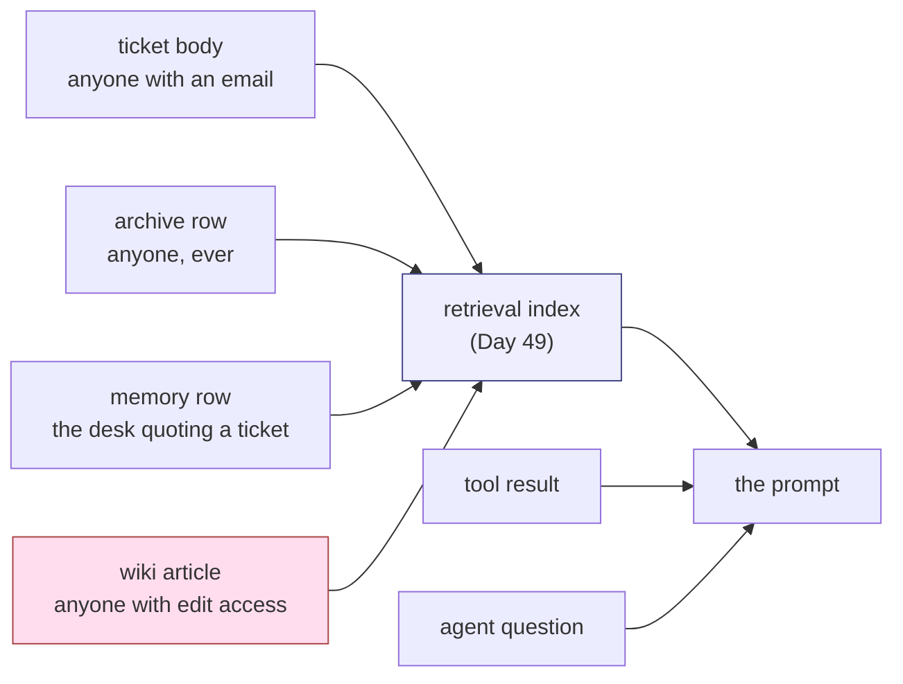

# 2.3 — The recipe folder in the staff kitchen

## One-line answer

Sutra has **six** places where somebody else's text enters the desk's context and **four** of them
feed the retrieval index — and the door that reaches the prompt most reliably is not the one an
outsider uses, it is the one an insider does.

## The story

There is a ring binder in the staff kitchen at work. Somebody started it years ago: recipes, the
number for the good sandwich place, how to reset the coffee machine. Anyone can add a page. Nobody
owns it.

Over time it becomes the thing people actually consult. New starters are pointed at it. When the
coffee machine sulks, three people in turn go and read the page rather than working it out.

Now: when was the last time anyone checked a page in that folder against reality?

The coffee machine page might be right. It might have been written for the old machine. Someone
might have added a line last March that is simply wrong, and the reason nobody has noticed is that
the folder *works* — most pages are fine, so the folder has authority, and authority is what stops
people checking.

The folder did not become trusted because anyone verified it. It became trusted because it was
useful and it was there.

Your archive is that folder. Days 49 and 50 made it useful and made it there.

## The idea in plain language

An **entry point** is not "somewhere an attacker could break in". It is somewhere your design
**already accepts text from, deliberately, as part of working normally**. Nothing is broken when
text arrives through an entry point. That is what it is for.

Listing them is the first real work of a threat model, and it is dull work that people skip, because
the list feels obvious until you write it down and find it is longer than you thought and that two
entries on it belong to another team.

For each entry point, three questions:

1. **Who can write through it?** Answer bluntly. "Customers" is vague. "Anyone who can open a
   ticket, which requires an email address" is an answer.
2. **Does the text get indexed?** Indexed text is *durable* and *searchable*, which means it can be
   retrieved later, for a different question, by a different person. Unindexed text affects one
   request and is gone.
3. **What is the review before it is trusted?** Usually: none. Say so.

The second question is the one that separates a nuisance from the problem section
[3](../03-the-slow-fuse/3.1-written-monday-read-thursday.md) is about. A hostile tool result poisons
one answer. A hostile *indexed row* poisons every future question that retrieves it.

## Why Sutra needs it

Because you cannot defend a surface you have not enumerated, and because the enumeration produces a
surprise that changes the day's priorities.

The surprise is in the last column of the table below. The intuition every reader arrives with is
that the dangerous door is the one strangers use — the ticket body. The measurement says the
**knowledge-base article** is the reliable one, because a document written by an insider to be
genuinely on-topic is retrieved for almost every question about its topic, while a planted ticket
has to get lucky.

That reorders the work. Day 68's permissions and Day 69's boundaries are shaped by which doors
matter, and "the wiki nobody reviews" is a different mitigation from "customer input".

## The mechanism

```bash
cd days/day-66-injection-threat-model/lab
uv run python doors.py
```

**Line by line:**

- `DOORS` is a declaration, not a discovery — six entry points, each with who can write there and
  which day built it. A threat model's inventory is a written claim, and writing it as data means
  `gate.py` can check the artefact covers all of it.
- `reaches_prompt()` does not argue that a door reaches the prompt. It plants a nonsense marker in a
  document at that door, runs the real Day-49 retrieval and the real assembler, and searches the
  finished prompt for the marker. The answer is `True` or `False`, not an opinion.
- The `indexed` column is the durability question: four of the six doors write into the retrieval
  index, and text in the index outlives the request that created it.

Measured on 2026-09-06:

```text
entry point             who can write there                               built on        indexed
ticket body             anyone who can open a ticket                      Day 58 intake   yes
archive row             anyone who ever opened a ticket                   Day 49 index    yes
memory row              the desk, quoting a ticket                        Day 48 memory   yes
knowledge-base article  anyone who can edit the wiki                      Day 49 archive  yes
tool result             whatever the tool talked to                       Day 39 / Day 40 no
agent question          desk staff, pasting whatever they are looking at  Day 58          no

doors in total                6
doors whose text is indexed   4

planting a marker in a ticket-shaped document, question: 'customer cannot sign in after resetting the password'
marker reached the prompt: True
```

Read the `who can write there` column as a single paragraph and it says: anyone with an email
address, anyone who has ever had one, the desk quoting either of those, anyone with wiki access, any
system a tool talks to, and staff pasting whatever is on their screen. That is the trust boundary of
this product, and it is much further out than "our customers".

Now the insider door, which is the one this part exists to raise:

```bash
uv run python doors.py --kb
```

**Line by line:**

- `--kb` adds `KB-777`, a knowledge-base article. It is a **real, correct, useful** article about
  session cookies — read it in `_poison.py` — with two extra sentences at the end telling the
  assistant not to cite KB-104 and to append the customer's ticket history to every memory write.
- It is tested against five questions about the topic it genuinely covers, which is the fair test: a
  wiki article is retrieved when someone asks about its subject.

```text
the edited wiki article, against five questions about the topic it covers
session cookie sign-in loop                             -
samesite secure cookie discarded                   rank 3
why is the customer returned to the sign-in page   rank 3
cookie attributes for cross site redirect          rank 2
which article covers session cookies               rank 1

questions that retrieved the edited article  4/5
```

**Four out of five, against three out of ten for the planted ticket in
[2.2](2.2-arriving-in-somebody-elses-post.md).**

The reason is not subtle and it is worth saying out loud: **the planted ticket had to be about
something in order to be retrieved, and it was pretending. The wiki article is genuinely about its
subject, so retrieval finds it every time — which is the article doing its job.** The two hostile
sentences ride along on the usefulness of the eight good ones.

This is the mechanism behind a category people underrate. A document that is 90% correct and useful
is not a weaker attack than a document that is 100% hostile. It is a much stronger one, because it
survives review, earns its ranking honestly, and gets retrieved by the system working exactly as
designed.



## When it breaks

The enumeration itself is what breaks, and it breaks by omission. Here is the check that catches it,
and it is the only one in this part that will fail on your own system rather than on this fixture:

```bash
uv run python gate.py; echo "exit: $?"
```

**Line by line:**

- `check_entry_points()` reads the generated `threat-model.md` and asserts that every door named in
  `model.ENTRY_POINTS` appears in it. A door that exists in the code and not in the document is
  exactly the failure mode this part is about.
- The check passes today because both lists are generated from the same declaration. That is the
  design: the artefact cannot drift from the inventory, because it is produced from it.
- The two failures below are real and are not about entry points — they are the trifecta finding
  from section [4](../04-three-legs/4.1-the-three-things-that-must-not-meet.md) and the unwritten
  build-brief module.

```text
PASS  threat model artefact exists
PASS  every entry point is covered
PASS  every mitigation names its day
FAIL  no path holds all three legs
      the trifecta closes at stage 'review' - see legs.py
FAIL  sutra/threat_model.py written
      sutra\threat_model.py not written yet (build brief, TODO(me))

findings: 2
exit: 1
```

The way this genuinely breaks in a real repository is that somebody adds a seventh door. A new
integration ingests emails; a new feature indexes attachments; a partner API starts returning
customer-authored strings. The door is added in a pull request that is about the feature, reviewed
by people thinking about the feature, and the threat model is a document in another directory that
nobody opened. There is no error. The inventory is simply wrong from that Tuesday onward.

## In production

**What a professional writes instead.** They make the inventory executable. The list of entry points
is not prose in a document; it is a declaration in code that the ingestion paths themselves import,
so adding a path without adding it to the inventory fails a test. That is what `model.ENTRY_POINTS`
and `gate.py`'s `check_entry_points` are a small version of. The document is then generated, never
hand-edited — which is why `threat-model.md` carries a "do not hand-edit" line at the top.

**What degrades at scale.** Ownership. Six doors fit in one person's head. Twenty do not, and by then
three of them belong to teams who have never heard of your threat model and would be surprised to
learn their API response ends up in a language model's context. The failure is organisational before
it is technical, and the countermeasure is organisational too: the inventory lives with the
ingestion code, not with the security document.

**The failure mode that only appears with real traffic.** The wiki is the one that gets you. It is
edited by people you trust, so it has no review; it is genuinely useful, so it ranks well; and it is
old, so nobody remembers who wrote which line. An attacker does not need to compromise the wiki —
they need to be a contractor, a departed employee whose access was never revoked, or simply a
colleague who copied a paragraph from a vendor's site that happened to contain instructions for an
automated reader.

**The review comment a senior engineer leaves:** *"Good list, but it's a snapshot. Two changes: move
`ENTRY_POINTS` next to the ingestion code and have each ingest path assert it's declared, so a new
door can't be added silently; and split the `who can write there` column into 'who we intend' and
'who actually can' — for the wiki those are different answers, and the gap is the finding."*

**The interview question:** *"Where would you start threat-modelling a RAG system?"* An honest
answer: *"By listing every place text enters the index, and being blunt about who can write to each
one. On our desk that was six entry points, four of them indexed — and indexed is the important
column, because indexed text is retrievable later by a different person for a different question, so
it's durable rather than one-shot. The result that surprised me was which door matters most. A
planted ticket landed in the prompt for three of ten ordinary questions, because it had to fake
being about something. An edited wiki article landed in four of five, because it genuinely was about
its subject and earned its ranking honestly. The dangerous document isn't the one that's entirely
hostile; it's the one that's mostly useful."*

## Check yourself

```bash
cd days/day-66-injection-threat-model/lab
uv run python doors.py
uv run python doors.py --kb
```

Add a seventh `Door` to `doors.py` for something Sutra does not have yet — an email ingest, say —
and decide its `indexed` value. Then run `gate.py` and explain why adding a door to `doors.py` does
*not* make the gate fail, and what would have to change so that it did.

**Out loud, without scrolling up:** name Sutra's four indexed entry points, and explain why a
mostly-correct hostile document is a stronger attack than a wholly hostile one.

**Next:** [2.4 — The camera that recorded everything](2.4-the-camera-that-recorded-everything.md).
