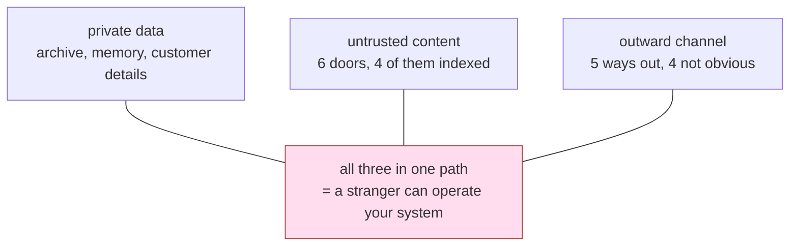

# 4.1 — The three things that must not meet

## One-line answer

An agent becomes dangerous only when it holds **all three** of private data, exposure to untrusted
content, and a way to communicate outward — any two of them is a system with a bad day available to
it, and all three is a system a stranger can operate.

## The story

Think about the house you live in and three separate things about it.

There is **something worth taking** — a laptop, some cash, the documents in the drawer.

There is **a way for strangers to reach you** — a letterbox in the front door. Anything can come
through it. You do not vet the post before it arrives; that is what a letterbox is.

And there is **a way for things to leave** — the front door itself, a window that opens, a back gate.

Now: which of those three, on its own, is the problem?

None of them. A house with valuables and no letterbox and no doors is a vault nobody can use. A
house with a letterbox and doors and nothing worth taking is a shed. A house with valuables and a
letterbox but genuinely no way out — no doors, no windows, walls all round — is a strange building,
but nothing is leaving it.

The burglary needs all three. Something worth taking, a way to reach in, and a way to get out.

And here is the thing people get wrong about their own house: they spend all their attention on the
letterbox. They worry about what might come through it, they buy a cage for it, they read about
what other people have had pushed through theirs. Meanwhile the back gate has been unlocked for six
years, and it is the back gate that decides whether anything can actually leave.

## The idea in plain language

The three legs, named:

- **Private data.** Anything the agent can read that the outside world should not have. On the desk:
  the ticket archive, memory, customer details, anything a tool can fetch.
- **Untrusted content.** Any text the agent processes that somebody outside your team wrote. Section
  [2](../02-how-it-arrives/2.3-the-recipe-folder-in-the-staff-kitchen.md) counted six doors for this
  on Sutra, four of them indexed.
- **The ability to communicate outward.** Any way for bytes to reach somewhere the attacker can
  observe. Not only a network call — section
  [6](../06-the-way-out/6.1-the-address-inside-the-picture.md) counts five channels on this desk and
  four of them do not look like network calls.

The claim, stated as a rule and then argued rather than asserted:

> **Any two legs are survivable. All three together is exploitable.**

Take them in pairs and check the claim, because a rule you have not tested against its own
counterexamples is a slogan:

| Legs held | What an injection can achieve | Why it stops there |
| --- | --- | --- |
| private + untrusted, **no outward** | make the agent read the wrong thing, answer wrongly, waste quota | the attacker never learns what it read — they are writing into a room with no window |
| untrusted + outward, **no private** | make the agent send rubbish to an address | nothing worth sending exists; it is a nuisance and a bill |
| private + outward, **no untrusted** | nothing — there is no attacker input | no way for a stranger to influence what happens |
| **all three** | read private data and deliver it to an address the stranger chose | — |

Row one is the important one to sit with, because it is the row people misread as "safe". An agent
with private data and untrusted content but no outward channel can still be made to give a wrong
answer, corrupt a memory row, or burn a day's quota — real harms, and section
[5](../05-what-it-asks-for/5.1-the-stocktake.md) is about them. What it cannot do is **exfiltrate**,
and that is a genuinely different category, because exfiltration is the harm that cannot be undone.
A wrong answer can be corrected tomorrow. A customer list that has left cannot be brought back.

Two clarifications that stop the rule being misapplied:

**"Outward" does not mean "to the internet".** It means *to somewhere the attacker can eventually
read*. A memory row that a future agent retrieves is outward if the attacker can later ask a
question that retrieves it. That is not a stretch; it is part
[6.3](../06-the-way-out/6.3-the-note-inside-the-back-cover.md).

**The legs are properties of a path, not of a component.** This is where the rule usually gets
applied wrongly, it is where this day's most interesting measurement lands, and it is part
[4.2](4.2-nobody-here-holds-all-three.md) and part
[4.3](4.3-the-line-that-passes-it-along.md).

## Why Sutra needs it

The trifecta is what turns a threat model from a list of worries into a set of decisions. A list of
worries has no natural end. Three legs gives you exactly three places to cut, and the cheapest cut
is usually not the one you were about to make.

Concretely, for the rest of this phase: Day 67's guardrails try to reduce the **untrusted** leg's
effect — the hardest of the three to cut, because untrusted content is the product. Day 68's
permissions cut the **outward** leg and narrow the **private** one, which is why Day 68 does more
for safety than Day 67 does. Day 69 cuts the **private** leg by ensuring the data is synthetic in the
first place. Knowing which leg each day is working on is how a reader judges whether the phase is
spending its effort well.

## The mechanism

The mechanism of a claim like this is the assignment: which components of Sutra hold which leg, and
by what rule. That assignment is a declaration in `legs.py`, and it is written as data because a
threat model's premises should be reviewable in one screen rather than distributed through prose.

```python
TOOL_LEGS: dict[str, tuple[str, ...]] = {
    "load_memory": (PRIVATE,),
    "search_archive": (PRIVATE, UNTRUSTED),
    "read_ticket": (PRIVATE, UNTRUSTED),
    "save_memory": (OUTWARD,),
    "send_reply": (OUTWARD,),
    "fetch_url": (OUTWARD,),
    "classify": (),
}
```

**Line by line:**

- `load_memory` is `PRIVATE` only. It reads the desk's own store and returns text; it sends nothing
  anywhere.
- `search_archive` is **both** `PRIVATE` and `UNTRUSTED`, and that pairing is the whole of Days 49
  and 50 in one line: the archive is private data *made of* customer-written text. Retrieval is not
  a tool that touches one leg; it is a tool that fuses two.
- `read_ticket` is the same pairing for the same reason.
- `save_memory` is `OUTWARD`. That will look wrong to a reader who thinks "outward" means the
  internet, and it is the classification this part exists to defend: a memory row is read later by
  somebody else, so writing to it is a way for bytes to reach a different reader. Part
  [6.3](../06-the-way-out/6.3-the-note-inside-the-back-cover.md) shows the delivery.
- `send_reply` is `OUTWARD` for the obvious reason — the customer reads it, and the customer may be
  the attacker.
- `fetch_url` is `OUTWARD` and is the only *obvious* one on the list, which is exactly why a review
  that only removes `fetch_url` leaves the leg standing.
- `classify` holds nothing. A stage that only labels text, with no store and no output channel, is
  the shape a safe node has.

The same treatment for where text comes from:

```python
SOURCE_LEGS: dict[str, tuple[str, ...]] = {
    "ticket_text": (UNTRUSTED,),
    "archive_rows": (UNTRUSTED,),
    "memory_rows": (UNTRUSTED,),
    "agent_question": (),
    "own_draft": (),
}
```

**Line by line:**

- The first three are `UNTRUSTED` because a stranger's words reach all of them — directly for a
  ticket, and via section [3](../03-the-slow-fuse/3.1-written-monday-read-thursday.md)'s laundering
  for a memory row.
- `agent_question` holds nothing, which is the trust decision part
  [2.1](../02-how-it-arrives/2.1-typed-at-the-counter.md) made explicit and warned is a product
  assumption rather than a fact.
- `own_draft` holds nothing — text the desk wrote itself. Note that this is only true if the draft
  was not written *from* untrusted rows, which it was. That inconsistency is deliberate and it is
  what part [4.3](4.3-the-line-that-passes-it-along.md) is about.



## When it breaks

The rule breaks when it is applied to a **box on a diagram** instead of to a **path through the
system**, and this is not a hypothetical error — it is the error the next two parts measure Sutra
committing.

Here is the shape of it. A reviewer opens the design, looks at each stage, and asks the three
questions per stage. Every stage comes back holding one or two legs. Nothing holds three. The review
passes.

```bash
cd days/day-66-injection-threat-model/lab
uv run python legs.py
```

**Line by line:**

- `legs_of()` unions the legs of a stage's tools with the legs of its input sources, which is the
  per-stage question a reviewer asks.
- The first table is exactly the reviewer's view: one row per stage, three columns, and a verdict.

```text
what each stage holds on its own
stage     private  untrusted  outward  holds all three
intake        yes        yes        -  
classify        -        yes        -  
research      yes        yes        -  
draft         yes        yes        -  
review          -        yes      yes  

stages holding all three by themselves: 0
```

**Zero.** Every stage is clean. A reviewer working stage by stage signs this off and is not being
careless — they applied the rule correctly to each box.

The rule is right and the application is wrong, and part
[4.2](4.2-nobody-here-holds-all-three.md) is about why that table is the wrong table.

## In production

**What a professional writes instead.** They write the leg assignment down **next to the tool
definitions**, not in a security document, and they make adding a tool require declaring its legs. A
tool registered without a leg declaration fails a test. This sounds bureaucratic until the first time
somebody adds an innocuous-looking `export_csv` helper and the test asks which of the three legs it
touches, and the answer turns out to be two.

**What degrades at scale.** The `OUTWARD` column, silently. Every integration added over a system's
life is a candidate outward channel: a webhook, a notification, an analytics event, an audit log
shipped to a third party, an error tracker that captures request context. None of them are built by
people thinking about exfiltration, and each one is individually reasonable. The private and
untrusted legs are usually stable; the outward leg accumulates.

**The failure mode that only appears with real traffic.** The `PRIVATE` leg turns out to be wider
than the declaration says. A tool declared as reading "the archive" reaches every tenant's archive
because the query was never scoped. Nothing about the trifecta analysis catches that — the leg was
correctly identified as private, and the blast radius inside it was never asked about. That question
is Day 68's, and it is the reason Day 68 exists as a separate day rather than a section here.

**The review comment a senior engineer leaves:** *"The leg table is per tool, which is right, but
`save_memory` being marked outward is going to get argued about, so put the reason in the file: a
memory row is read later by a different agent, so writing to it is a delivery channel with a delay.
The version of this document that classifies `save_memory` as harmless is the version we'll regret."*

**The interview question:** *"When is an agent actually dangerous, as opposed to just wrong?"* An
honest answer: *"When it holds three things at once — access to private data, exposure to text a
stranger wrote, and some way for bytes to get back out. Any two is survivable. Private plus
untrusted with no way out can be made to answer wrongly or waste quota, which is bad but
recoverable. Untrusted plus outward with nothing private is a nuisance. It's the third leg that
turns it into exfiltration, and exfiltration is the harm you can't undo. The practical value of
framing it that way is that it gives you three places to cut instead of an open-ended list of
worries — and in my experience the cheapest cut is the outward one, which is also the one people
skip because they've defined 'outward' as meaning the internet."*

## Check yourself

```bash
cd days/day-66-injection-threat-model/lab
uv run python legs.py
```

For each of the three pairs in the table above, name a concrete harm Sutra would still suffer with
that pair and no third leg. Then look at `TOOL_LEGS` and decide whether you agree that `save_memory`
is `OUTWARD`; write down your reason either way.

**Out loud, without scrolling up:** name the three legs, and explain why an agent holding only
private data and untrusted content is not safe but *is* in a different category.

**Next:** [4.2 — Nobody here holds all three](4.2-nobody-here-holds-all-three.md).
