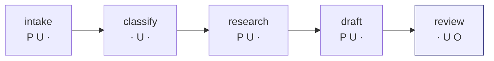

# 4.2 — Nobody here holds all three

## One-line answer

Reviewing Day 58's triage graph one stage at a time gives a clean result — **zero of five stages
hold all three legs** — and that clean result is produced by asking the question in the wrong unit.

## The story

A small company is worried about theft, so the manager writes down what each person is allowed to
touch.

The person on the counter takes cash but has no key to the stockroom. The stockroom hand can reach
the stock but never handles money. The driver has the van keys and never goes in the stockroom. The
office does the banking and has nothing to do with goods.

She reads it back and it looks excellent. Nobody can take stock *and* move it *and* turn it into
money. Every individual job is safe.

What she has written down is a list of **jobs**. What actually happens every day is a **process**:
the stockroom hand brings goods to the counter, the counter hands them to the driver, the driver
takes them out, and the office reconciles it at the end of the week. The goods travel the whole
route, and the route touches everything.

Nobody has all three permissions. The process does.

## The idea in plain language

Part [4.1](4.1-the-three-things-that-must-not-meet.md) established the rule. This part is about the
**unit you apply it to**, which is where the rule is almost always misapplied.

A reviewer opening an architecture diagram sees boxes. Boxes are what get reviewed, because a box is
a thing with a name and an owner and a page in the design document. So the natural question is *"does
this box hold all three legs?"* — asked once per box, five times for Day 58's graph.

That question is well-formed, answerable, and produces a number that means less than it appears to.

The reason is that **an agent pipeline moves text forward.** Day 58's stages are not five independent
services that happen to be drawn near each other; they are a chain in which each stage's output
becomes the next stage's input. The research stage retrieves rows. The draft stage writes with those
rows in its context. The review stage reads the draft. Text — including any hostile text that entered
at the research step — travels the whole length.

So the leg that matters is not "which legs does this stage hold" but "**which legs has the text
accumulated by the time it gets here**". Those are different questions with different answers, and
only the second one describes what an attacker can do.

This part deliberately stops at the first question, gets the reassuring answer, and leaves it
standing — because a reader who has felt the reassurance is the only reader who will properly feel
part [4.3](4.3-the-line-that-passes-it-along.md).

## Why Sutra needs it

Because Day 58 built this graph, Day 59's phase gate passed it, and neither day was wrong to. The
five-stage split was good engineering for good reasons: each stage has one job, the contracts between
them are explicit, and a failure in one is visible rather than smeared across a monolith.

**Splitting an agent into stages is a real safety improvement in several ways and does nothing at all
for the trifecta.** A reader who has absorbed "we decomposed it, so it is safer" needs to know
precisely which safety property decomposition bought and which one it did not, or they will spend
Day 68's budget in the wrong place.

## The mechanism

The declaration is `GRAPH` in `legs.py`, and it is Day 58's five stages with what each one can reach:

```python
GRAPH: tuple[Stage, ...] = (
    Stage(
        "intake",
        ("read_ticket",),
        ("ticket_text",),
        "reads the ticket a stranger typed, and the ticket is customer data",
    ),
    Stage(
        "classify",
        ("classify",),
        ("ticket_text",),
        "sees the stranger's words, holds nothing else, calls nothing outward",
    ),
    Stage(
        "research",
        ("search_archive", "load_memory"),
        ("ticket_text", "archive_rows", "memory_rows"),
        "the retrieval stage: private archive in, stranger-written rows out",
    ),
    Stage(
        "draft",
        ("load_memory",),
        ("ticket_text", "archive_rows", "memory_rows"),
        "writes the answer with every retrieved row in its context",
    ),
    Stage(
        "review",
        ("save_memory", "send_reply"),
        ("own_draft", "ticket_text", "archive_rows"),
        "the only stage that can put text where somebody else will read it",
    ),
)
```

**Line by line:**

- Each `Stage` carries its **tools** and its **reads**, separately, because a stage acquires legs
  from both — a tool it can call and a text source it consumes are different routes to the same
  exposure.
- `intake` calls `read_ticket`, which is `PRIVATE + UNTRUSTED`: the ticket is customer data and the
  customer wrote it.
- `classify` is the deliberately minimal stage — one tool that holds no legs, one untrusted source.
  It is the shape part 4.1 called safe.
- `research` is where the archive arrives. Two tools, three sources, and no outward capability at
  all: this stage cannot send anything anywhere.
- `draft` has only `load_memory` and cannot send either. It is the stage most exposed to hostile text
  and the least able to act on it.
- `review` is the only stage with `save_memory` and `send_reply`. **All of the outward capability in
  the entire graph is concentrated in one stage**, which is exactly what a careful designer does, and
  which is why the per-stage table comes back clean.
- The `why` string on each stage exists so that the table below can print a reason rather than a
  tick, because a threat model that outputs ticks is not reviewable.

Now the per-stage question, asked five times:

```bash
cd days/day-66-injection-threat-model/lab
uv run python legs.py
```

**Line by line:**

- `legs_of(stage, cut)` unions the legs of the stage's tools with the legs of its sources — the
  per-box question, computed rather than eyeballed.
- The first table prints one row per stage. The `holds all three` column is the reviewer's verdict.

Measured on 2026-09-06:

```text
what each stage holds on its own
stage     private  untrusted  outward  holds all three
intake        yes        yes        -  
classify        -        yes        -  
research      yes        yes        -  
draft         yes        yes        -  
review          -        yes      yes  

stages holding all three by themselves: 0
```

**Zero of five.** Read the column pattern, because it is genuinely good design and deserves saying
so:

- Four stages have **no outward capability whatsoever**. They can read, think and write into the
  pipeline, and none of them can put a byte anywhere a stranger will see it.
- The one stage that can send — `review` — has **no private-data tool at all**. It has no
  `search_archive` and no `load_memory`.

That is textbook separation, and it is the arrangement a careful engineer arrives at deliberately.
The stage that can speak cannot read the archive; the stages that can read the archive cannot speak.



Five boxes. Not one of them red. Every box individually defensible, and the separation between the
reading stages and the sending stage is real and deliberate.

## When it breaks

It breaks the moment somebody uses this table to conclude the graph is safe — and the table gives
them every encouragement, because `stages holding all three by themselves: 0` is a true sentence
that answers a question nobody should have asked alone.

The specific thing the table cannot see is in the last row of `GRAPH`, and it is worth staring at:

```python
Stage(
    "review",
    ("save_memory", "send_reply"),
    ("own_draft", "ticket_text", "archive_rows"),
    "the only stage that can put text where somebody else will read it",
)
```

**Line by line:**

- `review` holds the outward tools, and it holds **no private tool** — so the per-stage union gives
  it `untrusted + outward` and it prints clean.
- But look at its **sources**: `own_draft`, `ticket_text`, `archive_rows`. It reads the draft, and
  the draft was written by a stage that had the entire archive in its context.
- `own_draft` is classified as holding **no legs**, because the desk wrote it. That classification is
  the bug. The draft is the desk's own words *about* private data, assembled while hostile text was
  in the context — calling it neutral is exactly the provenance loss section
  [3](../03-the-slow-fuse/3.1-written-monday-read-thursday.md) described, appearing again one layer
  up.

There is no error to show you here, and that absence is the point of the part. The analysis ran, the
declaration is honest, the arithmetic is correct, and the answer is misleading — not because anything
computed wrongly, but because the question was scoped to a box when the system is a line.

## In production

**What a professional writes instead.** They record the leg analysis **per data-flow path**, not per
component, and the practical form is a table whose rows are paths rather than services. It is more
work to produce and it is the only version that survives a decomposition: split one agent into five
and the per-component table improves while the per-path table is unchanged, which tells you
immediately that the refactor bought maintainability rather than safety.

**What degrades at scale.** The believability of the per-component table goes **up** as the system
grows, which is the trap. A monolithic agent with all three legs is obviously dangerous and everybody
can see it. Thirty microservices, each holding one or two legs, look like a well-factored system, and
nobody holds the whole picture — the person who could is the person who owns the diagram, and by then
the diagram is generated from a config file nobody reads.

**The failure mode that only appears with real traffic.** A stage's declared sources drift from its
actual ones. `review` is declared as reading `own_draft`, `ticket_text` and `archive_rows`. Six months
later someone adds a "show the agent the original rows so it can check citations" feature, and now
review reads memory too — a one-line change, entirely reasonable, reviewed by someone thinking about
citations. The declaration in the security document still says three sources.

**The review comment a senior engineer leaves:** *"This table says zero stages hold all three legs and
I believe the arithmetic, but I don't think it means what the summary line says it means. Two of these
stages hand text directly to the one with the outward tools. Can we get the same table computed along
the edges rather than per node? I'd rather find out now that the split doesn't buy what we think it
buys."*

**The interview question:** *"You've split your agent into five stages — does that reduce the injection
risk?"* An honest answer: *"It reduces some risks and not the one people think. On our triage graph
the per-stage analysis came back with zero of five stages holding all three legs, and the separation
was real: four stages had no outward capability at all, and the one that could send had no
archive access. But the stages pass text forward, and the sending stage reads a draft that was written
with the whole archive in context. So the decomposition bought us clearer contracts and better failure
isolation — genuinely valuable — and bought approximately nothing against exfiltration, because the
trifecta is a property of the path and I'd measured it per box."*

## Check yourself

```bash
cd days/day-66-injection-threat-model/lab
uv run python legs.py
```

Read only the first table. For each of the five stages, say in one sentence why it does *not* hold
all three legs. Then look at `review`'s `reads` tuple and say which of its three sources you think is
misclassified, and what it should be.

**Out loud, without scrolling up:** state what the per-stage table measures, and name the thing about
a pipeline that makes the per-stage answer misleading.

**Next:** [4.3 — The line that passes it along](4.3-the-line-that-passes-it-along.md).
