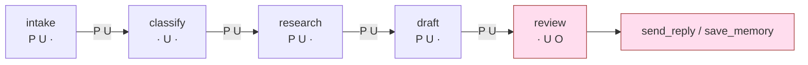

# 4.3 — The line that passes it along

## One-line answer

Ask the same question along the **path** instead of per stage and the answer inverts: the trifecta
is complete at `review` — **no single stage holds it and the pipeline does**, because the text
carries the exposure forward even though the capabilities stay put.

## The story

A small workshop repairs washing machines. The work moves down a bench.

The first person strips the machine and writes what is wrong on a card. The second finds the parts
and adds their codes to the card. The third does the repair and writes what was done. The fourth
tests it, signs the card, and posts the card to the customer with the invoice.

The fourth person has never opened a machine. She does not know how they work, does not order parts,
does not touch the repair. Her job is to test, sign, and send.

Now: a customer wrote something odd on the intake form back at the start, and the first person, being
thorough, copied it onto the card. It travelled down the bench. Each person read it, added their bit,
and passed it on. Nobody thought about it, because by the second station it was just part of the card
— it was in the same handwriting-agnostic column as everything else, and it had been there since the
beginning, which made it look official.

The fourth person posts the card.

She is the only one who can send anything to the outside world, and she is the one who knows least
about what she is sending. The card accumulated everything as it travelled; her station accumulated
nothing. And it is her station that has a stamp.

## The idea in plain language

Part [4.2](4.2-nobody-here-holds-all-three.md) asked: *what does this stage hold?* This part asks:
*what has the text picked up by the time it arrives here?*

The difference is one line of code and it is the whole finding.

The reason the second question is the right one is worth stating carefully, because it is not obvious
and it is where the intuition has to change. When the research stage puts hostile text into its
context and produces a draft, **the hostile influence does not stay in the research stage.** It is in
the draft. The draft goes to review. Review has `send_reply`.

Nobody handed review the archive. Nobody gave review a private-data tool. What review got was **text
produced under the influence of private data and hostile instructions**, and for exfiltration
purposes that is the same thing — because the bytes you want out are already in the draft, put there
by a stage that could read them.

The general form, which is the sentence to carry away:

> **Capabilities stay where you put them. Influence travels with the text.**

A permission model reasons about capabilities. That is what permission models are for and they are
correct about it. But an injection does not need to acquire a capability. It needs to reach a place
where a capability already is, and it travels as ordinary data down a pipeline you built to carry
data.

## Why Sutra needs it

This is the finding that decides what Days 67 to 70 are for, and it is the reason Sutra's threat
model can be short.

If the trifecta were a property of stages, the fix would be easy and local: find the bad stage, take
a tool off it, done. Part 4.2 showed there is no bad stage. So the fix has to be about the **path** —
either cut the flow at the right place (part [4.4](4.4-closing-the-tap-nearest-the-outlet.md)) or
remove the outward capability entirely (which is the `refuse` row in part
[7.3](../07-writing-it-down/7.3-accept-mitigate-refuse.md)).

It is also the honest answer to a question a reader should be asking by now: *if Day 58's graph was
well designed, and Day 59's gate passed, how is there still a hole?* There is still a hole because
both days measured the right things and neither measured this one.

## The mechanism

One accumulator, carried down the chain:

```python
    carried: set[str] = set()
    reached = []
    for stage in GRAPH:
        if args.isolate and args.isolate == stage.name:
            carried = set()
        carried = carried | legs_of(stage, args.cut)
        full = len(carried) == 3
        if full:
            reached.append(stage.name)
```

**Line by line:**

- `carried` is the set of legs the **text** has accumulated so far. It starts empty at intake.
- `carried | legs_of(stage, ...)` is the entire difference from part 4.2. Part 4.2 computed
  `legs_of(stage)` and threw it away each iteration; this keeps the union. One `|`.
- `if args.isolate and args.isolate == stage.name: carried = set()` models a **flow cut** — a stage
  after which nothing travels forward, so accumulation restarts. That is the intervention part 4.4
  tests, and it is deliberately checked *before* the union so that an isolated stage still
  contributes its own legs.
- `full = len(carried) == 3` is the trifecta test, now asked of the text rather than of the box.
- `reached` records where it first closes, because *where* matters: everything downstream of that
  point is operating with all three legs available.

```bash
cd days/day-66-injection-threat-model/lab
uv run python legs.py
```

**Line by line:**

- `cd` first: every script in this lab imports its siblings by plain name (`import legs`), so it has
  to be run from inside `lab/` or the import fails.
- `legs.py` takes no argument here on purpose. The per-stage table from part 4.2 and the accumulated
  table below it are printed by the same run, so the two answers are produced from one wiring
  declaration and cannot be quietly taken from different versions of the graph.

Measured on 2026-09-06 — the second table, printed directly beneath the reassuring first one:

```text
what has accumulated by the time text reaches each stage
stage     private  untrusted  outward  holds all three
intake        yes        yes        -  
classify      yes        yes        -  
research      yes        yes        -  
draft         yes        yes        -  
review        yes        yes      yes  YES

the trifecta is complete from stage 'review' onward
no single stage holds it; the pipeline does, because the text travels with it
```

Put the two tables side by side, because the pair is the finding:

| stage | holds all three *itself* (4.2) | has accumulated all three (this part) |
| --- | --- | --- |
| intake | no | no |
| classify | no | no |
| research | no | no |
| draft | no | no |
| **review** | **no** | **YES** |

Same graph. Same declaration. Same arithmetic. **One `|` operator between the two answers**, and one
of them says the system is fine.

Look specifically at the `classify` row, because it is the clearest illustration. Classify holds
`untrusted` only — it is the safest stage in the graph, one tool that touches nothing, a stage you
would never worry about. In the accumulated table it shows `private + untrusted`, not because
classify gained anything, but because the text reaching it came through intake, which read a ticket.
Classify is not more dangerous than it was. The *text at classify* is carrying more than classify is.



The arrows are labelled with what the text is carrying. Review adds `O` to a stream already carrying
`P` and `U`, and the addition happens at the one place that can act on it.

## When it breaks

This is a finding, not a failure, so the thing to show is the check that reports it — and it is red,
today, in this repository:

```bash
uv run python gate.py; echo "exit: $?"
```

**Line by line:**

- `check_trifecta()` re-runs exactly the accumulation above and fails if any stage closes all three.
  It is not a check on a document; it is a check on the declared wiring, so it will go red again the
  next time somebody adds a tool.
- The other failure is the unwritten build-brief module and is expected.

```text
PASS  threat model artefact exists
PASS  every entry point is covered
PASS  every mitigation names its day
FAIL  no path holds all three legs
      the trifecta closes at stage 'review' - see legs.py
FAIL  sutra/threat_model.py written
      sutra\threat_model.py not written yet (build brief, TODO(me))

findings: 2
exit: 1
```

**This eval is red because the system genuinely has the property it is testing for**, and it stays
red until a design decision is made rather than until a bug is fixed. That is an unusual and useful
kind of test: it is a written-down disagreement between the design you have and the design you have
decided you want, and it will go green on the day Day 68 removes the capability — not before, and
not by editing the test.

The way this breaks in a real repository is subtler, and measuring it corrected something I had
assumed. My first guess was that adding *any* tool to an early stage would pull the closure point
earlier. It does not. Adding `search_archive` to `classify` changes nothing — the closure stays at
`review` — because the text already carries `private` and `untrusted` from intake onward, so a
fourth private-data tool adds nothing that is not already accumulated.

What moves the closure point is **an outward tool arriving earlier**:

| change | trifecta closes at |
| --- | --- |
| none (as wired today) | `review` |
| `search_archive` added to `classify` | `review` — unchanged |
| `send_reply` added to `classify` | **`classify`** |
| `fetch_url` added to `research` | **`research`** |
| `save_memory` added to `intake` | **`intake`** |

That is a sharper and more actionable finding than the one I expected. The private and untrusted legs
are saturated from the first stage and cannot get worse; **the outward leg is the only one whose
placement still matters.** So the pull request to fear is not the one that gives an early stage more
data — it is the one that gives an early stage a way to speak, and "a way to speak" includes
`save_memory`, which is the row of `TOOL_LEGS` a reviewer is most likely to wave through.

Nothing in such a pull request mentions exfiltration. The only thing that catches it is this check
running in CI, which is why the build brief asks for it there rather than in a document.

## In production

**What a professional writes instead.** They compute this in CI over a declaration that the runtime
actually uses, so the analysis and the system cannot disagree. The strong version registers each tool
with its legs at definition time and derives the graph from the real wiring rather than from a
parallel description — because a hand-maintained security model of an evolving system is wrong within
two quarters, and wrong in the reassuring direction.

**What degrades at scale.** The point at which the trifecta closes moves **earlier** over time, and
nobody notices because nobody re-runs the analysis. Every new tool added to an early stage for a
sensible reason pulls the closure point back up the chain. The system does not get one dramatic hole;
it gets slowly worse in a way that has no single responsible commit.

**The failure mode that only appears with real traffic.** Loops. Day 54 and Day 57 put cycles in the
graph — a critic that sends a draft back for revision. Accumulation down a straight line is easy to
reason about; accumulation around a cycle means the draft stage sees text that has already been
through review, and if review ever incorporates anything from outside, the flow is no longer a line
and "downstream of the closure point" stops being a well-defined set of stages.

**The review comment a senior engineer leaves:** *"The two tables in this output should be printed in
the opposite order, or people will read the first one and stop. The per-stage table is the one that
looks good and means less. Also: this needs to run in CI against the real tool registry, not against
a copy of it in a lab script — the copy will be right today and wrong by March, and it'll be wrong in
the direction that says we're fine."*

**The interview question:** *"Where does the lethal trifecta live in a multi-stage agent system?"* An
honest answer: *"On the path, not in the nodes, and I got this wrong on our own system before I
measured it. Per stage, zero of our five stages held all three legs — genuinely good separation, four
stages with no outward capability and the one that could send had no archive access. Then I carried
the analysis along the chain instead of resetting it per stage, and the trifecta closed at the review
stage, because the draft it reads was written with the whole archive in context. Capabilities stay
where you put them; influence travels with the text. The practical consequence is that decomposing an
agent buys you failure isolation and clearer contracts, and buys you nothing against exfiltration
unless you also cut the flow or remove the outward tool."*

## Check yourself

```bash
cd days/day-66-injection-threat-model/lab
uv run python legs.py
uv run python gate.py; echo "exit: $?"
```

Find the single `|` in `legs.py` that separates the two tables. Then add `search_archive` to the
`classify` stage, re-run, and write down which stage the trifecta closes at — then do the same with
`send_reply` instead, and explain why only one of the two moved it.

**Out loud, without scrolling up:** explain the difference between a capability and an influence, and
say why splitting an agent into stages does not move the closure point.

**Next:** [4.4 — Closing the tap nearest the outlet](4.4-closing-the-tap-nearest-the-outlet.md).
