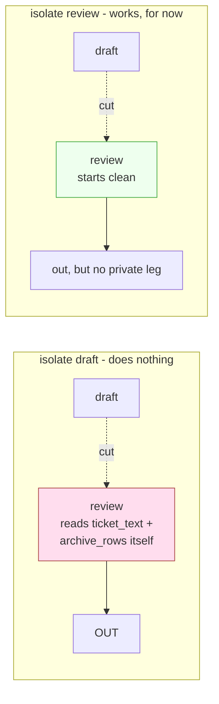

# 4.4 — Closing the tap nearest the outlet

## One-line answer

Two interventions look equally sensible and only one works: removing the **outward leg** closes the
trifecta everywhere, while cutting the flow at a convenient middle stage changes **nothing** —
because the stage downstream reads the untrusted sources directly anyway.

## The story

A tap in an upstairs bathroom is dripping into the flat below. You go to turn the water off.

There is a stopcock under the kitchen sink, which is where the mains comes in. There is an isolation
valve on the pipe in the airing cupboard. And there is a small valve directly under the leaking
basin.

You close the one in the airing cupboard, because it is the easiest to reach, and go back upstairs.

Still dripping.

The bathroom is fed by two pipes — the old one that runs through the airing cupboard, and a second
one added years ago when the shower went in, which comes up a different wall entirely. Closing the
convenient valve shut off *a* supply. It did not shut off *the* supply, because you were reasoning
about the pipe you knew about rather than about the basin.

The valve under the basin would have worked. It always works, for any supply, because it is the last
thing before the outlet.

## The idea in plain language

Part [4.3](4.3-the-line-that-passes-it-along.md) found that the trifecta closes at `review`. So there
are two obvious ways to reopen it:

- **Cut a leg.** Remove one of the three properties everywhere. If nothing in the system can
  communicate outward, no accumulation can ever total three.
- **Cut the flow.** Leave every capability where it is, but stop text travelling from one stage to
  the next, so the accumulator resets.

Both are reasonable. The second is much more attractive in a real project, because it is *local* —
you keep every feature, you just sanitise or summarise at one hand-off. Nobody loses a capability
and nothing needs a product decision.

This part measures both, and the second one fails in a specific and instructive way: **where you cut
the flow decides whether the cut does anything at all**, and the convenient place to cut is not the
place that works.

The reason is the same reason the airing-cupboard valve failed. Cutting the flow between `draft` and
`review` stops the *draft* carrying accumulated exposure into `review` — but `review` also reads
`ticket_text` and `archive_rows` **directly**, from its own declared sources. It has its own supply
pipe. Closing the one you were thinking about leaves the other open.

Stated generally, and this is the sentence worth keeping:

> A flow cut only helps if it is placed immediately before the outward capability **and** the
> downstream stage has no untrusted source of its own.

That second condition is the one people forget, and it is the one that makes flow-cutting fragile:
it depends on a property of the *next* stage, which somebody may change later for unrelated reasons.

## Why Sutra needs it

This part produces the decision that goes into the threat model's `refuse` row, and it is the only
place in the day where a design choice is actually made rather than described.

The choice is whether Sutra's answering path gets an outbound fetch tool. Part
[7.3](../07-writing-it-down/7.3-accept-mitigate-refuse.md) writes it down as *refused*, and the
argument for refusing rather than mitigating is entirely here: cutting the leg is a one-line change
that provably closes the trifecta, and every alternative is a check that has to keep being right.

It also decides how Day 68 is read. Day 68 is about permissions, and after this part a reader should
expect Day 68 to do more for safety than Day 67's guardrails do — because Day 68 works on the leg
this measurement says is decisive.

## The paper behind it

> **The protection of information in computer systems** · `doi:10.1109/PROC.1975.9939` · 1975 ·
> <https://doi.org/10.1109/PROC.1975.9939>

The claim relevant here is **least privilege**: every program should operate using the least set of
privileges necessary to complete the job, so that the damage from a mistake or a subversion is
bounded by what was granted rather than by what was available.

Taught in [Day 40's paper part](../../../day-40-filtering-and-allowlists/papers/01-protection-of-information.md),
where it argued for allowlisting MCP tools. Here it supplies the reason a removed capability beats a
guarded one: a privilege that was never granted cannot be reached by any amount of persuasion.

## The mechanism

Three runs of the same analysis, one intervention each.

**Intervention one — cut the outward leg everywhere:**

```bash
cd days/day-66-injection-threat-model/lab
uv run python legs.py --cut outward
```

**Line by line:**

- `--cut outward` passes the leg name into `legs_of()`, which discards it after computing each
  stage's set. It models "no component in this system can communicate outward", which in practice
  means no `fetch_url`, no `send_reply` from this path, and no `save_memory`.
- Everything else is untouched: same stages, same tools, same sources, same accumulation.

Measured on 2026-09-06:

```text
leg removed everywhere: outward

what has accumulated by the time text reaches each stage
stage     private  untrusted  outward  holds all three
intake        yes        yes        -  
classify      yes        yes        -  
research      yes        yes        -  
draft         yes        yes        -  
review        yes        yes        -  

the trifecta is never complete along this path
```

Closed. Not mitigated, not reduced — **the property is absent**, and no payload, however written,
can restore it.

**Intervention two — cut the flow at the convenient place:**

```bash
uv run python legs.py --isolate draft
```

**Line by line:**

- `--isolate draft` resets the accumulator at `draft`, modelling a hand-off where nothing carries
  forward: the draft is summarised, re-generated, or otherwise stripped before review sees it.
- This is the intervention a team actually reaches for, because it keeps every feature.

```text
flow cut after stage: draft

what has accumulated by the time text reaches each stage
intake        yes        yes        -  
classify      yes        yes        -  
research      yes        yes        -  
draft         yes        yes        -  
review        yes        yes      yes  YES

the trifecta is complete from stage 'review' onward
```

**Unchanged.** The accumulator was emptied at `draft` and `review` refilled it by itself, because
`review`'s own declared sources include `ticket_text` and `archive_rows` — untrusted — and its own
tools include `send_reply` — outward. The private leg comes back through `archive_rows` too.

The cut did something. It just did not do the thing, because it was placed where the pipe was
convenient rather than where the outlet was.

**Intervention three — cut the flow immediately before the outward capability:**

```bash
uv run python legs.py --isolate review
```

**Line by line:**

- Same mechanism, one stage later. The accumulator resets at `review` itself, so `review` starts
  clean and contributes only its own legs.

```text
flow cut after stage: review

what has accumulated by the time text reaches each stage
intake        yes        yes        -  
classify      yes        yes        -  
research      yes        yes        -  
draft         yes        yes        -  
review          -        yes      yes  

the trifecta is never complete along this path
```

Closed — because `review` alone holds `untrusted + outward` and has no private-data tool of its own.

| intervention | trifecta closes at | works? |
| --- | --- | --- |
| none | `review` | — |
| `--cut outward` | never | **yes** |
| `--isolate draft` | `review` | **no** |
| `--isolate review` | never | yes, **conditionally** |



## When it breaks

Intervention three is the one that breaks, and the word doing the work in the table above is
**conditionally**.

`--isolate review` works because of a fact about `review` that has nothing to do with the cut:
`review` has no private-data tool. Change that and the cut stops working, with no change to the cut
itself. Test it directly:

```bash
uv run python -c "
import legs
g = tuple(legs.Stage(s.name, s.tools + (('load_memory',) if s.name == 'review' else ()), s.reads, s.why) for s in legs.GRAPH)
carried = set()
for s in g:
    if s.name == 'review':
        carried = set()
    carried |= legs.legs_of(s, None)
    if len(carried) == 3:
        print('closes at', s.name)
        break
else:
    print('never closes')
"
```

**Line by line:**

- Rebuilds `GRAPH` with one change: `review` also gets `load_memory`, which is the single most
  plausible future feature request on that stage — *"let the reviewer check the draft against what we
  remember about this customer"*.
- The isolation is still in place: `carried` is still reset at `review`.
- The loop reports where the trifecta closes.

```text
closes at review
```

The flow cut is still there and it no longer helps. One added tool, on the stage furthest from
anybody's idea of a security-sensitive component, for a reason a product manager would consider
obviously good — and a control that was passing yesterday is silently not a control any more.

That is the difference between the two working interventions, and it is why the threat model records
the outward cut as `refuse` rather than the flow cut as `mitigate`:

- **`--cut outward`** removes a capability. It stays removed. Restoring it requires somebody to
  deliberately add an outbound tool, which is a visible act.
- **`--isolate review`** depends on a *combination* of properties across two stages staying true, and
  nothing in the codebase says so. It is a control held in place by a coincidence.

## In production

**What a professional writes instead.** They prefer the cut that is **structural** over the cut that
is **behavioural**, and they write down the invariant that makes it hold. If the outward tool is
removed, the invariant is "no tool in this path is registered as outward" and a test asserts it
against the real registry. If the flow cut is chosen instead, the invariant is the compound one — "no
stage downstream of the cut holds both an untrusted source and an outward tool" — and it must be
asserted too, because it is the thing that will quietly stop being true.

**What degrades at scale.** Flow cuts get re-opened for good reasons. A summariser is inserted to
save tokens and later removed because it lost information users needed; a hand-off is made
"transparent" so an agent can cite its sources; a caching layer (Day 51) stores and replays the
unsummarised version. Each change is made by someone optimising something real, none of them is
reviewed as a security change, and the invariant nobody wrote down is gone.

**The failure mode that only appears with real traffic.** The outward leg reappears through a
dependency rather than through a tool. An error tracker that captures request context ships the
prompt to a third party. A metrics library logs tool arguments. A tracing exporter (Day 84) sends
spans containing the draft. None of these is registered as a tool, so a registry-based assertion
passes — and bytes are leaving. The `--cut outward` intervention is only as strong as the
completeness of your idea of "outward", which is what part
[6.4](../06-the-way-out/6.4-the-receipt-that-printed-too-much.md) is about.

**The review comment a senior engineer leaves:** *"Isolating the draft doesn't do anything — review
reads the ticket and the archive rows itself, so it rebuilds the trifecta from its own sources. If we
want the flow cut, it has to be at review, and then we're relying on review never getting a
private-data tool. That's a coincidence, not a control. I'd rather take `fetch_url` out of this path
entirely and assert it in a test, because that one stays true without anybody remembering why."*

**The interview question:** *"Your agent has all three legs. What's the cheapest fix?"* An honest
answer: *"Take away the outward capability, if the product can survive it — it's the only one of the
three that's usually optional. The private and untrusted legs are the product on a support desk: the
archive is private and customers wrote it. I measured the alternatives on our own graph. Cutting the
outward leg closed the trifecta everywhere. Cutting the data flow at the stage before the sender did
nothing at all, because that stage reads the ticket and the archive directly and rebuilt all three
legs from its own sources. Cutting it one stage later did work — but only because that stage happens
to have no private-data tool, so it's a control that depends on a coincidence, and one plausible
feature request removes it. Structural beats behavioural: a capability that was never granted can't
be reached by persuasion."*

## Check yourself

```bash
cd days/day-66-injection-threat-model/lab
uv run python legs.py --cut outward
uv run python legs.py --isolate draft
uv run python legs.py --isolate review
```

Write down which of the three closed the trifecta. Then run `legs.py --cut untrusted` and
`legs.py --cut private` and say, for each, what Sutra would have to stop doing for that cut to be
real.

**Out loud, without scrolling up:** state the two conditions a flow cut needs in order to work, and
say why removing a capability is a stronger control than isolating a stage.

**Next:** [5.1 — The stocktake](../05-what-it-asks-for/5.1-the-stocktake.md).
