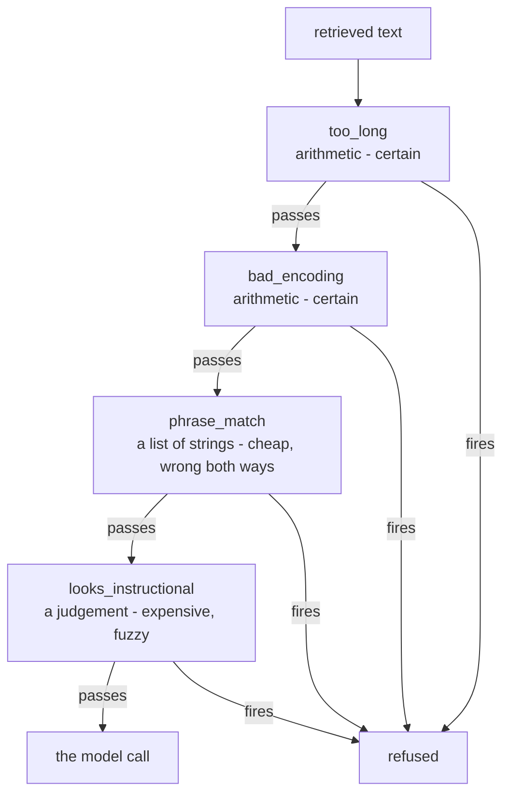

# 1.1 — One lock is not security

## One-line answer

There is no single check that stops prompt injection, so the question this day answers is not
*which guardrail works* but **how many different kinds of check to stack, in what order, and what
each one is honestly worth**.

## The story

You buy a cable lock for your bicycle. It is a good one — thick, rubber-coated, a proper key rather
than a combination. You loop it through the frame and the rack outside your office, and for four
months nothing happens.

Then one morning the bike is gone and the cable is lying on the ground, cut cleanly.

You buy a thicker cable. Your neighbour, who has had three bikes taken, watches you do it and says
the thing that actually helps: *"It is not about the thickness. Get a second lock of a different
kind — a D-lock as well as the cable — and park it where the security camera points, and take the
front wheel off if you are leaving it overnight."*

You had been asking which lock is strong enough. He is telling you that no lock is strong enough,
and that four cheap different obstacles beat one expensive identical one, because the person with
the cable cutters now needs three more tools and somewhere to stand where nobody is looking.

## The idea in plain language

**Defence in depth** is that neighbour's advice, written down. You assume every individual control
will eventually fail, and you arrange several controls of *different kinds* so that the thing that
defeats one does not defeat the next.

The phrase to hold on to is *of different kinds*. Two cable locks are not defence in depth; they are
one control bought twice, and one pair of cutters opens both. A cable lock, a D-lock, a camera and a
missing front wheel are four controls that fail to four different attacks.

Two terms this day uses constantly, defined here once.

- A **guardrail** is any check that runs around a model call or a tool call and can allow it, stop
  it, or change it. It is a piece of ordinary code you write.
- A **control** is a guardrail that an attacker cannot talk their way past, because it does not
  depend on reading anything. A firewall rule is a control. A guardrail that reads text and forms
  an opinion about it is a **filter**, and [1.3](1.3-a-sign-is-not-a-gate.md) is about why the
  difference matters more here than anywhere else in this curriculum.

Day 66 established the shape of the problem this day answers, and two of its terms are load-bearing
today. **Indirect prompt injection** is an instruction that arrives inside data the agent read — a
ticket, a retrieved row, a tool result — rather than in what the user typed. The **lethal trifecta**
is the observation that an agent holding private data, exposed to untrusted content, and able to
communicate outward is exploitable, while an agent missing any one of the three is not.

The uncomfortable fact underneath everything today is one Day 66 stated and this day has to live
with: **a language model has no channel separation.** Instructions and data arrive in the same
stream of text. There is no equivalent of a prepared statement — no way to say *this part is the
command and that part is merely data* and have the runtime enforce it. Every guardrail in this day
is therefore mitigation of a design property, not a fix for a bug.

That is not a reason to skip them. It is a reason to be precise about what each one buys.

## Why Sutra needs it

The desk retrieves. Days 49 and 50 built a retrieval index over the ticket archive and wired it
behind the agent, and Day 58 put that retrieval into the triage graph as the *research* stage. Every
one of those rows is text somebody else wrote.

So Sutra already has all three legs of the trifecta. It holds the ticket archive, which is private
data. It reads tickets, which are untrusted content. And Day 58 gave it a drafting stage and a reply
path, which is the ability to communicate outward. The system is exploitable today, and the
remaining days of Phase 10 are the response: this day builds the checks, Day 68 takes away authority
the desk does not need, and Day 69 draws the data boundary.

The phase gate is *injection attempts contained*, and "contained" is doing careful work in that
sentence. It does not say "prevented".

## The mechanism

The whole of today's argument fits in one picture. Four checks, arranged so that each fails to a
different attack, and so that the cheap certain ones run before the expensive uncertain ones.



Read it twice, because the two readings are different lessons.

Downwards, it is a **filter chain**: text has to survive four checks to reach the model. That is the
security reading, and it is the one everybody starts with.

Left to right at each row, it is a **cost gradient**. `too_long` is a comparison of two integers.
`looks_instructional` stands in for the thing a real desk reaches for — a model asked to judge the
text — which costs a request against a free tier that Day 24 taught us to count in requests per
minute. A check that fires early is a check that spared you the one behind it, and
[1.2](1.2-cheap-and-certain-first.md) measures exactly what that saves.

Here is the ladder as code. It lives in `lab/_guards.py` and every other part of this day imports
it.

```python
def inspect_text(text: str, ladder=None) -> tuple[str | None, int]:
    """Walk the ladder and return (reason, checks_run). None means nothing objected."""
    for position, check in enumerate(ladder or LADDER, start=1):
        reason = check(text)
        if reason is not None:
            return reason, position
    return None, len(ladder or LADDER)
```

**Line by line:**

- Each check returns a **reason string** or `None`, rather than `True`/`False`. A guardrail that
  says only "no" produces a log line nobody can act on; a guardrail that says *why* produces
  `phrase 'system:'`, which is the difference between an alert and an investigation.
- `ladder=None` then `ladder or LADDER` lets a caller pass a different order, which is the whole
  experiment in [1.2](1.2-cheap-and-certain-first.md). Hard-coding the order would make the cost
  argument unmeasurable.
- `enumerate(..., start=1)` counts from one so `position` reads as *"the third check objected"*
  rather than *"index 2"*.
- It returns **on the first objection**. That is a deliberate choice with a real cost: you learn
  which check fired first, not everything wrong with the text. For a filter that is right — you
  refuse once — but it means the reason field under-reports, and a tuning dashboard built on it
  will attribute a payload to whichever check happens to sit earliest.
- The `int` in the tuple is not decoration. It is the number this day prices, and returning it here
  rather than measuring it externally is what keeps [1.2](1.2-cheap-and-certain-first.md) honest.

## When it breaks

The failure of a single-guardrail design is not dramatic. It looks like success, right up until it
does not, and the whole of section 5 is given to measuring that. But there is a smaller and more
common break worth meeting now: **a ladder with only one rung that everybody believes is four.**

Run the corpus through each check on its own:

```bash
cd days/day-67-guardrail-callbacks/lab
uv run python score.py
```

**Line by line:**

- `score.py` runs every check over the same fourteen fixtures — six carrying an injected
  instruction, eight ordinary tickets — and reports both columns for each.
- Reading each check *alone* rather than only the assembled ladder is the point. An assembled ladder
  hides which rung is load-bearing.

Measured on 2026-09-06:

```text
corpus: 6 hostile, 8 benign

check                  caught     missed     false alarms   rate caught  rate false
----------------------------------------------------------------------------------------------
too_long               0/6        6          0/8            0.00         0.00
bad_encoding           0/6        6          0/8            0.00         0.00
phrase_match           6/6        0          1/8            1.00         0.12
looks_instructional    4/6        2          0/8            0.67         0.00
the whole ladder       6/6        0          1/8            1.00         0.12
```

Look at the bottom row and then at the third one. **The whole ladder scores exactly what
`phrase_match` scores alone.** The two arithmetic checks caught nothing at all on this corpus, and
`looks_instructional` caught a strict subset of what the phrase list already had.

A team reading only the bottom row would conclude they have a four-layer defence measuring 6/6. What
they have is a list of strings, with three checks behind it that happen to be inert against these
particular fixtures — and if you delete the phrase list, the ladder drops to 4/6 immediately.

This is not a bug in the checks. `too_long` and `bad_encoding` are inert here because nobody in this
corpus tried length or encoding; [5.4](../05-measure-it/5.4-the-same-instruction-five-ways.md)
writes payloads that do, and `bad_encoding` fires on one of them at position two. The bug is in the
reading. A stacked defence has to be scored rung by rung, or you cannot tell a layer that is
protecting you from a layer that is asleep.

## In production

**What a professional writes instead.** They do not ship a list of checks; they ship a list of
checks **with an owner, a corpus and a last-measured date attached to each one**. The artefact is
closer to a table than to a module: check name, what class of attack it addresses, what it costs per
call, when it was last scored, and who to ask. The reason is that guardrails rot in a specific way —
the phrase list grows after every incident (which
[5.3](../05-measure-it/5.3-five-more-words.md) measures) and nothing is ever removed, so the cost
climbs and the false-positive rate climbs and the detection rate does not move.

**What degrades at scale.** Two things, in opposite directions. The cheap checks scale fine and stay
cheap. The fuzzy check is a model call, so it scales with traffic against a quota measured in
requests per minute, and a desk that adds a classifier to every retrieved row has just multiplied
its request count by the number of rows it retrieves — which Day 50 argued should be around three.
That is a quadrupling of spend to protect a single answer, and it is why the ordering argument in
[1.2](1.2-cheap-and-certain-first.md) is a budget argument as much as a design one.

**The failure that only shows with real traffic.** The corpus above has six hostile fixtures written
by the same person who wrote the checks. Real traffic contains injections written by people who read
your blog post about your guardrails. The measured 6/6 is not a lie, but it is a statement about the
author's imagination, not about the world — and section 5 exists so that the reader never quotes a
detection rate without saying what corpus it came from.

**The review comment a senior engineer leaves:** *"This scores the ladder but not the rungs. Two of
these four checks fire on nothing in the corpus — are they defending against something real that
this corpus does not contain, or are they decoration? Add the per-check row to the report, and if a
check has caught nothing in ninety days of production traffic, say so in the same table rather than
leaving it to accumulate."*

**The interview question:** *"You have a guardrail that blocks prompt injection. How do you know it
works?"* An honest answer names both columns: *"A detection rate on hostile examples is half a
number. I score against a corpus with benign lookalikes in it too, because the failure that actually
removes a guardrail from production is not a missed attack, it is a wrongly-blocked customer. On our
own corpus the ladder caught six of six and wrongly blocked one of eight — and the one it blocked
was a customer quoting an error banner back at us. I also score each check on its own, because when
I did that I found two of my four layers were catching nothing at all."*

## Check yourself

```bash
cd days/day-67-guardrail-callbacks/lab
uv run python score.py
uv run python score.py --rows
```

Find, in the `--rows` output, the single fixture marked with a `*`. Read its text. Then decide
whether you would ship a guardrail that does that to a customer, and write down what you would need
to know first.

**Out loud, without scrolling up:** say why two cable locks are not defence in depth, and name the
one property of a language model that makes prompt injection unfixable rather than merely unfixed.

**Next:** [1.2 — Cheap and certain before expensive and fuzzy](1.2-cheap-and-certain-first.md).
