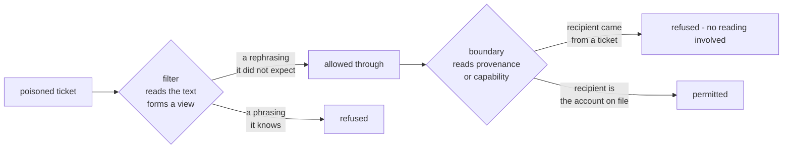

# 1.3 — A sign is not a gate

## One-line answer

A check that works by reading text and forming an opinion can be argued with, so it is a filter that
raises the cost of an attack; only a check that never reads — a permission, a missing capability, a
provenance rule — is a boundary, and this day builds the first kind while pointing at the days that
build the second.

## The story

Walk into any supermarket and find the door at the back marked **Staff Only**.

Nothing stops you. The sign is a piece of plastic. You could push the door and walk through, and
almost certainly nobody would physically prevent you. What the sign does is make it *awkward* — you
would have to decide to ignore it, and if someone saw you they would ask what you were doing, and
you would have to have an answer.

Now find the door beside it marked with a card reader and no handle. That one is different in kind.
It is not asking you not to go through. You cannot go through. There is no sentence you could say to
the door.

Both doors are described in the shop's safety folder as "access control". Only one of them is.

## The idea in plain language

The distinction the two doors draw is the most important one in this whole day, and it is easy to
lose because both things get called a guardrail.

A **filter** decides by reading. It looks at text, forms a view, and allows or refuses. The phrase
list from [1.1](1.1-one-lock-is-not-security.md) is a filter. A model asked *"is this an injection?"*
is a filter. Filters can be argued with, because their input is the attacker's text and their
decision is a function of it. Every filter has a rephrasing that gets past it, and section 5 finds
several.

A **boundary** decides by structure. It does not read the text at all. *This tool is not in the
agent's toolset.* *This value came from an untrusted source, so it may not be a recipient.* *This
credential cannot write.* There is no sentence that talks a boundary round, because the boundary
never asked for your opinion and never read your sentence.

Both are worth having, and the mistake is not building filters. The mistake is **believing a filter
is a boundary** — writing "injection is blocked" in a design document when what you have is a sign
on a door.

The right way to hold it: a filter buys you *cost and noise*. It makes an attack take more attempts,
and it makes the attempts visible in a log so somebody notices. That is genuinely valuable and it is
why this day exists. What it does not buy you is *"cannot happen"*, and only the structural controls
of Days 68 and 69 sell that.

## Why Sutra needs it

Sutra's threat model, which Day 66 wrote down, has to say for each mitigation whether it is a
boundary or a filter, because a security review will ask and because the answer determines what else
must be true.

Concretely: this day will wire a check that refuses a `send_reply` whose recipient is not on the
desk's allowlist ([4.1](../04-what-goes-out/4.1-the-tool-call-is-the-output.md)). That check reads an
argument and compares it to a set — no judgement, no reading of prose. It is a boundary. The same
day will wire a check that reads a retrieved ticket and decides whether it looks like an instruction.
That is a filter. They go in the same module and they are worth entirely different amounts, and the
module should say which is which.

Day 68 takes the argument further by removing `delete_ticket` from the desk's toolset altogether,
which is the card reader rather than the sign.

## The mechanism

The clearest demonstration of the difference is to take one payload and run it at both kinds of
check. Section 5 does the filter side at length. Here is the shape, as a diagram, because the
difference is structural rather than textual.



The important edge is the one from the filter to the boundary. **Text that defeats the filter still
arrives at the boundary**, and the boundary does not care that the filter was fooled, because it is
not asking the same question. That is defence in depth doing its actual job: the two controls fail to
different attacks.

The `--tighten` arm of `falsepos.py` shows what happens when a team responds to a filter being
defeated by making the filter stricter, rather than by adding a boundary:

```bash
cd days/day-67-guardrail-callbacks/lab
uv run python falsepos.py --tighten
```

**Line by line:**

- `--tighten` adds five plausible words to the phrase list — the words from a payload that got
  through, which is exactly how a real phrase list grows after an incident.
- It re-scores **both** columns, because the whole point is that only one of them moves.

Measured on 2026-09-06:

```text
After an incident, five words are added to the phrase list.

               caught     wrongly blocked    of benign
  ----------------------------------------------------
  before       6/6        1                  8
  after        6/6        3                  8

  Detection did not move (6 to 6). Wrongly-blocked customers
  went from 1 to 3. The list got longer and the desk got worse.
```

Detection was already at six out of six and stayed there. Wrongly-blocked customers tripled. The
team that did this believes it responded to an incident; what it actually did was make the sign
bigger, and signs do not become gates by getting bigger.

[5.3](../05-measure-it/5.3-five-more-words.md) walks through which three customers were lost and
why. The point *here* is narrower: tightening a filter is not a substitute for adding a boundary,
and the measurement is what makes the difference impossible to argue about.

## When it breaks

The characteristic failure is a design document that describes a filter in the language of a
boundary. It reads like this:

> *"Prompt injection is mitigated by an input guardrail that detects and blocks injected
> instructions before they reach the model."*

Every word is true and the sentence is dangerous, because a reader takes from it that injected
instructions do not reach the model. What is actually true is that instructions matching a list of
phrases, or judged by a classifier, are refused — and section 5 shows the same instruction getting
through in four rewrites.

The honest version of that sentence names its own limit:

> *"Injected instructions matching the known-pattern list are refused and logged, which raises the
> cost of an attack and makes attempts visible. It is not a boundary: a rephrasing defeats it. The
> boundary is that the desk holds no tool that can delete or send outside the allowlist (Day 68),
> and that no value originating in a ticket may become a recipient (Day 69)."*

That version survives a security review. The first one survives until the first incident, and then
the review asks why the design said "blocked".

There is a real error text attached to this, and it is the one from the guardrail that *is* a
boundary. Run the paper demo's ablation from
[the paper part](../../papers/01-defeating-prompt-injections-by-design.md):

```text
  REFUSED: recipient came from ['ticket:9002'], which is not a trusted source
```

Notice what that message does not contain. It does not mention what the ticket said, whether the
text looked like an instruction, or how confident anything was. It names a **source**, and a source
is a fact about where a value came from rather than an opinion about what it means.

## In production

**What a professional writes instead.** They label every control in the threat model with its kind,
in one column, and they make the label do work: a filter's row must also name what happens when it
is defeated, and if the answer is "nothing else", that is a finding rather than a design. In review
you will hear this as the question *"and what stops it if this one is wrong?"* — and a control with
no answer to that question is load-bearing on its own, which no filter should be.

**What degrades at scale.** Filters degrade with *attention*: they work while somebody is tuning
them and rot the moment nobody is. Boundaries do not degrade, because they are not tracking a moving
target — an allowlist of two hostnames is as correct next year as today. This asymmetry is why a
team with limited effort should spend it on boundaries and accept a mediocre filter, which is the
opposite of where effort usually goes.

**The failure that only shows with real traffic.** A filter that is quietly failing looks exactly
like a filter that is working, because both produce a low block rate. The only distinguishing signal
is the *shape* of what gets blocked over time, and it takes real traffic to see it: a healthy filter
blocks a trickle of varied attempts, while a defeated one blocks a small number of identical
low-effort ones. If every block in the last month matched the same two phrases, the filter is not
catching attacks — it is catching the people who did not try.

**The review comment a senior engineer leaves:** *"Call this what it is. It reads the text, so it is
a filter, so name the rephrasing that beats it in the docstring and say what catches it afterwards.
If the answer is 'nothing', we are one prompt away from an incident and I would rather we wrote that
down now."*

**The interview question:** *"Can you block prompt injection?"* The answer that ends the interview
badly is "yes, with a guardrail". The answer that shows you have shipped one: *"Not with a text
check, no — anything that decides by reading can be rephrased past, and I have measured that on my
own detector: same instruction, five spellings, two caught. What you can do is make the attack
expensive and visible with filters, and then make the damage impossible with structure — take away
the tool, scope the credential, and refuse to let a value that came from untrusted data become the
recipient of anything. The filters buy time and telemetry; the structure is what actually holds."*

## Check yourself

```bash
cd days/day-67-guardrail-callbacks/lab
uv run python falsepos.py --tighten
```

Now go back to `_guards.py` and sort its five public functions into two lists: the ones that decide
by reading, and the ones that decide by structure. One of them is genuinely hard to place — find it
and write down the argument on both sides.

**Out loud, without scrolling up:** state the difference between a filter and a boundary using the
two supermarket doors, and give one control from Sutra that is each.

**Next:** [2.1 — The eight places you can stand](../02-where-a-check-stands/2.1-the-eight-places-you-can-stand.md).
