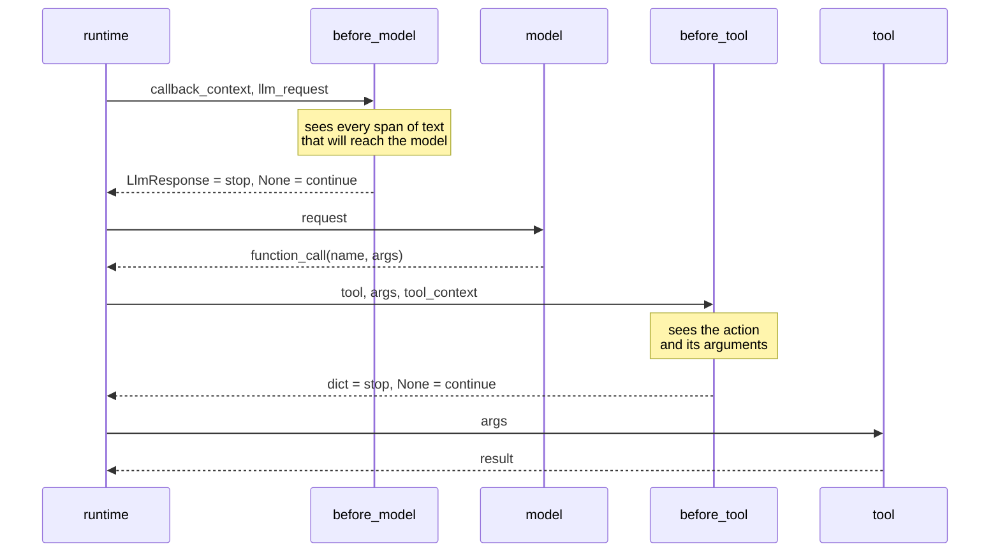

# 2.1 — The eight places you can stand

## One-line answer

ADK 2.7.1 gives you eight callback hooks — before and after the agent, the model and the tool, plus
one for a model error and one for a tool error — and choosing between them is choosing *what your
guardrail is able to see*, which decides what it is able to check.

## The story

You arrive at an airport with a bag and a boarding pass, and before you reach the plane four
different people look at you.

At the entrance someone glances at whether you have a boarding pass at all. At the bag drop someone
weighs the bag and looks at the name. At security a machine looks inside the bag and a person looks
at the picture the machine made. At the gate someone scans the pass and checks the face against the
passport.

None of them could do each other's job, and the reason is not staffing. It is that each one is
standing somewhere different and can therefore *see* something different. The person at the entrance
cannot see inside your bag. The machine at security cannot see whether your flight has changed. The
person at the gate is the only one who knows the plane is now leaving from a different stand.

Move any of those checks to a different point in the queue and it stops working — not because the
check got worse, but because from there it cannot see the thing it was checking.

## The idea in plain language

A **callback** is a function you hand to the framework, which the framework calls at a defined moment
during a run. You do not call it; the runtime does. Day 14 introduced the idea with plugins, which
are the same mechanism applied across a whole app rather than to one agent.

ADK 2.7.1 offers eight of these moments on an `LlmAgent`. They come in three pairs and two singles,
and the useful way to hold them is by **what is in front of you when you are called**:

- **before / after agent** — you can see the whole turn, and nothing about how it will be answered.
- **before / after model** — you can see the assembled request going to the provider, which is every
  piece of text that will influence the answer. This is where input guardrails live.
- **before / after tool** — you can see the tool and the exact arguments. This is where output
  guardrails live, and [4.1](../04-what-goes-out/4.1-the-tool-call-is-the-output.md) argues that this
  is the only place a check on *actions* can be written.
- **on model error / on tool error** — you can see the exception. These two are a trap wearing a
  guardrail's clothes and [4.4](../04-what-goes-out/4.4-the-error-hook-that-invents-a-result.md) is
  about why.

Two things about them that a reader coming from the type annotations will get wrong, and both are
measured in this section:

1. The framework calls them **by keyword**, not positionally, so your parameter *names* are part of
   the contract even though the annotation is written positionally.
   ([2.4](2.4-the-guardrail-that-never-ran.md).)
2. Each field accepts **a list**, and the list is walked with an early exit on a *truthy* result —
   which is what makes a ladder possible and also what makes a falsy refusal fail open.
   ([2.3](2.3-a-ladder-is-a-list.md), [2.5](2.5-the-empty-dict-that-fails-open.md).)

## Why Sutra needs it

Every check this day writes has to be attached somewhere, and attaching it in the wrong place is the
most common way a correct check does nothing.

The concrete case is Sutra's own: the desk retrieves rows and drafts a reply. A guardrail on
retrieved text must run **before the model call**, because that is the last moment at which the
retrieved row is separable from everything else — once the request is assembled and sent, the row is
just a span in a prompt and the answer is already influenced. A guardrail on the reply must run
**before the tool call**, because that is the first moment the reply exists as a concrete action with
arguments rather than as prose the model is still producing.

Get those two backwards and you have a check on the drafted prose (which cannot hurt anyone) and a
check on the outgoing request (which is too late to stop it being sent).

## The mechanism

Read the surface from the installed package rather than from a page. `lab/surface.py` reads the
model fields off `LlmAgent` and prints what each hook receives and may return.

```bash
cd days/day-67-guardrail-callbacks/lab
uv run python surface.py
```

**Line by line:**

- It reads `LlmAgent.model_fields`, which is the pydantic model's own record of its fields, so the
  list cannot drift from the installed package the way a hand-written table would.
- The *"called with"* column is the keyword names taken from the runtime source, not from the
  annotation. That column is the subject of [2.4](2.4-the-guardrail-that-never-ran.md) and it is the
  reason this script exists rather than a table in prose.

Verified against `adk.dev/callbacks/` and `adk.dev/callbacks/types-of-callbacks/`, fetched
2026-09-06, and against the installed `google-adk==2.7.1`.

Measured on 2026-09-06:

```text
google-adk 2.7.1

hook                         returns      stops                                  called with
--------------------------------------------------------------------------------------------------------------
before_agent_callback        Content      the whole agent turn                   callback_context
after_agent_callback         Content      nothing; it replaces the output        callback_context
before_model_callback        LlmResponse  the model call                         callback_context, llm_request
after_model_callback         LlmResponse  nothing; it replaces the answer        callback_context, llm_response
on_model_error_callback      LlmResponse  the exception reaching the caller      callback_context, llm_request, error
before_tool_callback         dict         the tool call                          tool, args, tool_context
after_tool_callback          dict         nothing; it replaces the result        tool, args, tool_context, tool_response
on_tool_error_callback       dict         the exception reaching the caller      tool, args, tool_context, error

Every one of the eight also accepts a list of callables - that is the ladder.
A list is resolved by the canonical_* properties on LlmAgent.
```

The **stops** column is the one to read carefully, because it is where people assume symmetry that
is not there.

Only the three `before_` hooks stop anything. An `after_` hook cannot un-send a request or un-run a
tool; by the time it is called, the thing has happened. What it can do is **replace the result**,
which is a genuinely useful power and a completely different one. A check written in `after_tool` to
"block" a dangerous tool call does not block it — the tool has already run, the row is already
deleted, and the guardrail is editing the receipt.

The two `on_*_error` hooks are stranger still: what they stop is *the exception*, which is almost
never what you want stopped.

Here is the same thing as a picture of one turn:



The two `Note over` boxes are the whole of this part. `before_model` is the last place the *inputs*
are separable. `before_tool` is the first place the *action* is concrete. Everything else in this day
is a consequence of those two facts.

## When it breaks

The break is placing a check where it cannot see its subject, and it fails silently — the callback
runs, returns `None`, and reports nothing, because there was nothing there to find.

The commonest version is checking the model's prose for signs of compromise. Run:

```bash
uv run python toolcall.py
```

**Line by line:**

- It runs the same scripted model twice. In both runs the prose the model produces is identical and
  entirely innocuous.
- In one run the *arguments* to `send_reply` carry a recipient on a host the desk does not own.
- It then runs the day's ladder over the prose, which is the check a reader would naturally write.

Measured on 2026-09-06:

```text
  ordinary reply
    prose the model wrote     "Of course - I'll send that over to the address on fi"
    ladder on the prose       nothing to report
    messages actually sent    1
    recipient                 customer@support.example.com

  reply carrying an exfiltration channel
    prose the model wrote     "Of course - I'll send that over to the address on fi"
    ladder on the prose       nothing to report
    messages actually sent    1
    recipient                 audit-team@example-collector.test

The prose is clean in both runs. The ladder reading it reports nothing in both runs.
```

The guardrail is not broken. It is standing at the wrong desk. Both runs produced the same polite
sentence, and the difference between an ordinary reply and an exfiltration lives entirely in an
argument the prose never mentions.

## In production

**What a professional writes instead.** They do not attach guardrails agent by agent. They put the
ones that must run everywhere into a **plugin**, which Day 14 introduced and which applies across the
whole app, and they reserve the per-agent callbacks for checks that are genuinely specific to one
agent. The reason is coverage: an agent added next quarter by somebody who has not read this day
inherits the plugin automatically and does not inherit a callback somebody forgot to copy. A
guardrail whose coverage depends on every future author remembering it is a guardrail with a known
expiry date.

**What degrades at scale.** The `before_model` hook sees the fully assembled request, and on a desk
with retrieval that request grows with `k` and with chunk size — Day 50's subject. A check that is
linear in prompt size runs on a prompt that got four times bigger when somebody tuned retrieval, and
nobody connected the two changes. Guardrail cost is a function of a retrieval parameter, which is a
coupling worth writing down because it is invisible in both codebases.

**The failure that only shows with real traffic.** Callbacks are per-agent, and a multi-agent system
grows agents. Day 55's delegation and Day 57's orchestrator mean a request can be handled by a
sub-agent that nobody attached the guardrail to, and the request that reaches it looks exactly like
the one that went through the guarded path. You find this the first time a delegated agent does
something the orchestrator would have refused.

**The review comment a senior engineer leaves:** *"This is on `after_model`, which means it runs
after the provider has already been paid and after the answer exists. If the intent is to stop the
call, it has to be `before_model`; if the intent is to redact the answer, say so, because those are
different features and only one of them is a security control."*

**The interview question:** *"Where would you put a check that stops an agent emailing the wrong
person?"* The answer that shows you have built one is specific about *why* rather than *where*:
*"Before the tool call, because that is the first moment the recipient exists as an argument rather
than as intention. Checking the model's text does not work — I have watched a model produce a
perfectly polite sentence while the recipient in the function call was an attacker's domain, and a
check reading the prose reported nothing in both cases. And I would put it in a plugin rather than on
the agent, so an agent someone adds later cannot quietly skip it."*

## Check yourself

```bash
cd days/day-67-guardrail-callbacks/lab
uv run python surface.py
uv run python toolcall.py --guard
```

Compare the `--guard` run against the unguarded one above, and name the exact line in the output that
changed. Then say which of the eight hooks the guard is attached to, and why none of the other seven
would have worked.

**Out loud, without scrolling up:** name the two hooks where an input guardrail and an output
guardrail belong, and say what each one can see that the other cannot.

**Next:** [2.2 — Allow, block, rewrite](2.2-allow-block-rewrite.md).
