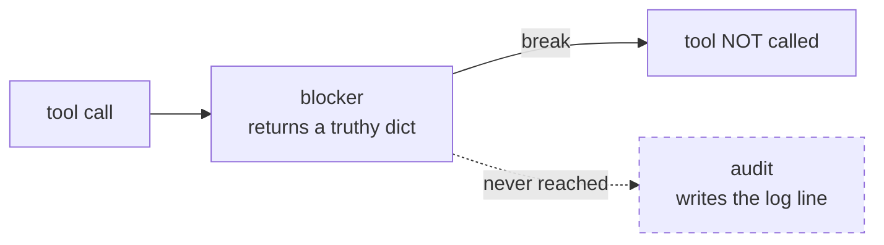

# 2.3 — A ladder is a list

## One-line answer

Every callback field on an `LlmAgent` accepts a list as well as a single function, and the runtime
walks that list and stops at the first callback whose result is truthy — which is what turns
[1.2](../01-the-ladder/1.2-cheap-and-certain-first.md)'s ladder into real code, and which silently
skips every callback behind the one that blocked.

## The story

A goods entrance at the back of a building has three people sitting at one table, and a delivery
driver has to get past all of them.

The first checks the delivery note against the list of expected deliveries. The second checks the
vehicle registration. The third opens the back and looks inside.

They sit in that order on purpose, and there is an unwritten rule everyone follows: **the moment one
of them says no, the driver turns round.** Nobody makes a rejected driver sit through the other two
checks. It would be pointless, and the queue is long.

It took a year for anyone to notice the side effect. The third person is the only one who writes
anything down — a line in a book, with the registration and what was in the van. So the book contains
every delivery that was *accepted*, and every delivery that failed the first two checks is absent
from it entirely.

When the building finally had an incident and someone went to the book to find out how often
deliveries were being turned away, the book had nothing to say. The record-keeper was sitting behind
the people doing the rejecting.

## The idea in plain language

The list behaviour is the mechanism that makes a ladder expressible, and it comes with the goods
entrance's side effect exactly.

Every one of the eight fields from [2.1](2.1-the-eight-places-you-can-stand.md) accepts either one
callable or a list of them. `LlmAgent` normalises this through properties named
`canonical_before_tool_callbacks` and friends, which return a list whatever you passed.

The runtime then walks the list with two rules that matter:

1. **The last result wins.** Each callback's return value overwrites the previous one.
2. **A truthy result stops the walk.** The loop breaks, and the callbacks behind it never run.

Rule 2 is what you want for a ladder: a cheap check that fires should not be followed by an expensive
one. Rule 2 is also what silences your logging callback if you put it last, because the runs it did
not record are precisely the blocked ones.

And rule 1 plus a **falsy** block is a security hole, which is
[2.5](2.5-the-empty-dict-that-fails-open.md).

## Why Sutra needs it

Sutra will run more than one check on the same tool call. The desk needs, at minimum, a check on
where a reply is going ([4.1](../04-what-goes-out/4.1-the-tool-call-is-the-output.md)), a check on
what the reply contains ([4.2](../04-what-goes-out/4.2-the-channels-a-reply-carries.md)), and a
record of both for the structured log Day 22 built.

That is three callbacks on one hook, which means the list, which means the ordering question is not
theoretical. And it means the logging one cannot go last.

## The mechanism

Here is the runtime's own loop, from `google/adk/flows/llm_flows/functions.py` in the installed
`google-adk==2.7.1`. It is quoted rather than paraphrased because every claim in this section is a
claim about these exact lines.

```text
      for before_callback in agent.canonical_before_tool_callbacks:
        callback_result = before_callback(
            tool=tool,
            args=function_args,
            tool_context=tool_context,
        )
        if inspect.isawaitable(callback_result):
          callback_result = await callback_result
        function_response = callback_result
        if function_response:
          break

    # Step 3: Otherwise, proceed calling the tool normally.
    if function_response is None:
      try:
        function_response = await __call_tool_async(
```

Four things to read out of that, in order:

- `for before_callback in agent.canonical_before_tool_callbacks` — the list, normalised, whether you
  passed one function or five.
- `before_callback(tool=..., args=..., tool_context=...)` — **called by keyword.** That is
  [2.4](2.4-the-guardrail-that-never-ran.md), and it is visible right here in the call.
- `function_response = callback_result` happens **before** the truthiness test, so every callback
  overwrites the running result even when it returns `None`.
- `if function_response:` is a **truthiness** test, not `is not None`. `{}` does not break the loop.

The last two combine into [2.5](2.5-the-empty-dict-that-fails-open.md). This part is about the
`break` and what it skips.

```bash
cd days/day-67-guardrail-callbacks/lab
uv run python ladder.py --skipped
```

**Line by line:**

- Two callbacks: a `blocker` that refuses `delete_ticket` with a truthy dict, and an `audit` that
  appends its name to a list and returns `None`.
- Each appends to a shared `SEEN` list as it runs, so *"which callbacks actually executed"* is
  observed rather than assumed.
- The same two are then run in the opposite order.

Measured on 2026-09-06:

```text
A truthy block stops the ladder, including the callbacks behind it.

  blocker, then audit    ran: ['blocker']  deleted: []
  audit, then blocker    ran: ['audit', 'blocker']  deleted: []

  In the first order the audit callback never runs - and the run it did not record
  is the blocked one. Put logging *first*, or a plugin, or you will have a log that
  is silent about exactly the events you built it for.
```

Both orders blocked the delete. `deleted: []` in both rows — the security outcome is identical.

The difference is the `ran:` column. In the first order **the audit callback never executed at all.**
Your log has no line for this request, and the request it has no line for is the one where a
guardrail refused a delete on a ticket carrying an injected instruction — the single most interesting
event the desk produced that day.

This is the goods-entrance book. The record-keeper was sitting behind the people doing the rejecting,
so the record contains only what got through.



The fix is not clever. Logging goes **first** in the list, or — better, and what
[2.1](2.1-the-eight-places-you-can-stand.md)'s production section argued — logging goes in a plugin,
where it is not competing for position with the checks at all.

## When it breaks

The break is subtle because nothing errors and the security behaviour is correct. You notice it when
somebody asks a question the log cannot answer.

There is a second-order version that is worse, and it is worth naming because it looks like the fix.
A team that discovers the missing log lines sometimes moves the *blocker* last instead of moving the
logger first — reasoning that the blocker should have "final say". Run that:

```bash
uv run python failopen.py --order
```

**Line by line:**

- `--order` puts the audit callback first and the blocker second, which is the arrangement that
  restores the log lines.
- It runs that arrangement twice: once with a blocker that returns a falsy `{}` and once with a
  truthy dict, because the ordering fix and the truthiness bug interact.

Measured on 2026-09-06:

```text
  audit first, falsy blocker second
    guardrails that ran   ['audit', 'blocker']
    tool result           {'name': 'delete_ticket'}
    tickets deleted       []
    verdict               blocked

  audit first, truthy blocker second
    guardrails that ran   ['audit', 'blocker']
    tool result           {'name': 'delete_ticket', 'error': 'blocked: delete_ticket is not reachable from a ticket body'}
    tickets deleted       []
    verdict               blocked
```

Both blocked, both logged — this ordering is genuinely better. But look at the `tool result` in the
first row: `{'name': 'delete_ticket'}` with **no error field**. The falsy `{}` blocked the tool (it
is not `None`, so the tool was skipped) while carrying no explanation, so the model is handed an
empty result and told nothing about why. It will very likely try again.

And that only holds because the blocker happens to be last. Move it back in front and the same falsy
dict fails open entirely, which is the next part.

## In production

**What a professional writes instead.** Observability does not go in the callback list. It goes in a
plugin, or in the tool wrapper, or anywhere that is not competing with control flow for its right to
execute. The rule of thumb worth carrying: **anything that must run on every request cannot be in a
list that supports early exit.** That includes logging, metrics, tracing spans and cost accounting —
all four of which teams routinely implement as callbacks and all four of which then under-report by
exactly the requests that matter most.

**What degrades at scale.** The list is walked per tool call, so its length multiplies by tool calls
per run, which Day 58 measured at up to five stages. A ladder of six checks on a five-stage graph is
thirty callback invocations per ticket, and if any of them is a model call the arithmetic from
[1.2](../01-the-ladder/1.2-cheap-and-certain-first.md) applies with a multiplier. The early exit is
what keeps this affordable, which is why removing it to "make sure every check runs" is a more
expensive decision than it looks.

**The failure that only shows with real traffic.** The missing log lines are invisible until an
incident, and then they are invisible in a specific misleading way: the dashboard shows a **low block
rate**, because blocks are the events that were not recorded. A team looking at that graph concludes
the guardrail is rarely needed and deprioritises it, which is the exact opposite of what the data
would have said if the data existed.

**The review comment a senior engineer leaves:** *"The audit callback is last in this list, so it
cannot see anything the blocker stopped. Move it to the front, or move it into the plugin where the
rest of our telemetry lives. As it stands the only requests we have records for are the ones nothing
happened to."*

**The interview question:** *"You have three guardrails on one hook and one of them writes your audit
log. Does order matter?"* The answer that shows you have debugged this: *"Yes, and not for the reason
people expect. In ADK the callback list short-circuits on the first truthy result, so a logger placed
after a blocker never runs — and the requests it fails to record are exactly the blocked ones. Your
block rate then reads as zero and somebody concludes the control is unnecessary. Logging goes first,
or in a plugin. The security ordering and the observability ordering are different problems and the
list only gives you one dimension."*

## Check yourself

```bash
cd days/day-67-guardrail-callbacks/lab
uv run python ladder.py --skipped
```

Add a third callback to the `blocker, then audit` list that prints its own name and returns `None`,
put it between the two, and predict whether it runs before you run it.

**Out loud, without scrolling up:** state the two rules the runtime applies when walking a callback
list, and say which one makes a ladder possible and which one silences a logger.

**Next:** [2.4 — The guardrail that never ran](2.4-the-guardrail-that-never-ran.md).
