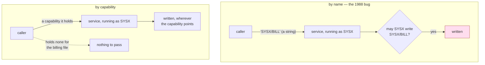

# "The Confused Deputy" (or why capabilities might have been invented)

> *"The Confused Deputy" (or why capabilities might have been invented)* ·
> `doi:10.1145/54289.871709` · ACM SIGOPS Operating Systems Review 22(4), 36–38, October 1988
> · <https://doi.org/10.1145/54289.871709>
>
> Record checked live on 2026-09-06 via `https://api.crossref.org/works/10.1145/54289.871709`; the
> title, journal, volume, issue, pages and year above are copied from that record. The inner
> quotation marks are part of the title as the record prints it.

## One-line answer

Access control had been asking *is this principal allowed to do this?*, and this document showed
that the question has no useful answer when a program holds an authority its caller does not and
does work the caller asked for — because then the program is genuinely allowed, and the caller
chose the target.

## The story

Before this document, the way people thought about protecting a shared computer was a list.

For each thing worth protecting, you write down who may touch it. This file: these people. That
account: those people. The whole discipline was about getting the lists right and checking them at
the moment of access, and it worked, and most of the systems you use today still do exactly this.

Then somebody looked at a program that everybody on the machine used.

The program ran on behalf of whoever started it, and it also had a small job of its own to do:
keeping a record of how much work it had done for each person, so people could be charged for it.
That record was its own. Nobody else could touch it, which was the point — a record of charges that
users can edit is not a record.

So the program had a set of permissions of its own, and it did work that other people asked for.

A user starts it and says: here is my input, and put the output over there. The program does the
work, opens the place the user named, and writes. Everything about that sentence is normal. The
program has always been allowed to write wherever it needs to; that is why it can keep its record.

And one day somebody, out of curiosity, said: put the output over *there* — and named the charging
record.

Nothing malfunctioned. No list was wrong. Nobody's permissions were exceeded, because the program
was writing, and the program was allowed to write that file. The list of who may touch the record
still said exactly one name, and that name was the program, and the program did the writing.

The record was gone, and every rule was followed.

## The idea in plain language

The document's contribution is a diagnosis and a name, and it is worth taking the two separately.

**The name.** A **deputy** is a program that does work on somebody else's behalf while holding
authority of its own. A **confused deputy** is one that has been talked into applying its own
authority to a target the caller chose. It is not compromised, not buggy, and not disobedient. It is
confused about *whose* authority it is exercising, and the reason it is confused is that nothing in
the request tells it.

Part [1.1](../parts/01-the-deputy/1.1-the-errand-and-the-keys-that-went-with-it.md) introduced this
as the shape of an agent, and the whole day has been an argument with it. This document is where the
shape was first named.

**The diagnosis.** The confusion has a precise cause, and it is a property of how the request is
written rather than of the program's code.

When the caller says *write the output to that name*, the name is just a name. It is a string. It
carries no permission with it. The program takes the string and asks the system to open it, and the
system checks the request against **the program's** permissions, because the program is the one
asking. The caller's name for a thing and the caller's right to that thing have been separated: the
caller supplied the designation, and the system supplied the authority, and they came from two
different places.

That separation is what "ambient authority" means — a phrase part
[1.3](../parts/01-the-deputy/1.3-whose-permissions-is-the-tool-using.md) defined for the agent case.
The authority is in the air around the running program, attached to nothing in particular, and it is
applied to whatever name shows up.

**The alternative.** The document's answer is to stop passing names. Instead the caller passes a
**capability**: a reference to a specific object that *carries the permission to use it*. Designation
and authority arrive together, in one thing, and the thing cannot be manufactured — a caller can only
pass on a capability it was already given.

Now run the attack again. The user wants the program to write over the charging record, so the user
must hand the program a capability for the charging record. The user does not have one. There is
nothing to hand over, and there is no string that will do instead, because the program is no longer
accepting strings.

The property this buys is worth stating exactly, because it is the sentence the rest of this day has
been circling: **the deputy can only act where its caller could already have acted.** The deputy's
own authority stops being reachable through the caller's request.

Two terms, defined once:

- **Ambient authority** — permission that comes from *who you are* rather than from *what you were
  handed*, applied automatically to any request you make. The program's ability to write its charging
  record was ambient.
- **Capability** — a reference that is simultaneously the name of an object and the permission to use
  it, unforgeable, and passed from holder to holder. Not "a permission" in the loose sense the rest
  of this day uses the word; specifically a thing you hold.

## Why Sutra needs it

Sutra's support desk is a deputy in the exact sense above, and every element of the 1988 setup has a
counterpart:

| the 1988 program | Sutra's desk |
| --- | --- |
| runs with an authority its users lack | holds `desk-write` and `desk-mail`; customers hold neither |
| does work its users ask it to do | reads, closes and answers tickets |
| takes the target as a **name** | `close_ticket(ticket_id)`, `send_reply(ticket_id, to, text)` |
| the caller chooses that name | the model chooses it, from ticket text |

The last row is the one that makes this a 2026 problem rather than a historical curiosity. In 1988
the caller was a person typing a filename. On the desk, the caller is a model, and the text it is
reading came from whoever opened the ticket — which is Day 66's **indirect prompt injection**, where
instructions arrive inside data the system was asked to process. Put those together and the
attacker does not even need an account on your machine. They need a ticket.

Part [1.1](../parts/01-the-deputy/1.1-the-errand-and-the-keys-that-went-with-it.md) measured it: a
poisoned ticket named `9001` — another tenant's row — and the desk closed it, because
`close_ticket` takes a string and the desk is allowed to close tickets. Every rule was followed,
which is the 1988 sentence word for word.

Part [4.3](../parts/04-the-argument/4.3-the-recipient-who-is-not-the-customer.md) is this document's
remedy, applied honestly and only halfway, and the halfway part is the instructive bit.
`send_reply_bound(ticket_id, text)` deletes the `to` parameter, so the caller no longer designates
the destination at all — the desk resolves it from a record it owns. That is stronger than a
capability for the destination, because the caller cannot even ask. But `ticket_id` is **still a
name**, resolved with the desk's own authority, which is exactly the 1988 structure surviving in the
argument that is left. That is why the scope check of part
[2.2](../parts/02-three-questions/2.2-which-rows-scope.md) is still required, and why removing one
parameter did not end the day.

## The mechanism

Written out as a method rather than paraphrased, the argument has three moving parts and one
substitution.

**The setup.**

1. A service runs under an identity of its own, with permissions attached to that identity. It needs
   them: it has a private record to maintain that its callers must not be able to edit.
2. A caller invokes the service and supplies, as an argument, the **name** of the object to be
   written.
3. The service performs the write. The system checks the write against the **service's** identity,
   because the service is the process making the call.

Step 3 is the whole paper. Nothing in steps 1 or 2 is a mistake, and there is no fourth step where
somebody could reasonably have inserted a check — a check would have to know which writes are "on
behalf of the caller" and which are "the service's own", and the request does not carry that
information anywhere.

**The substitution.** Replace the name in step 2 with a capability: an unforgeable token that
designates one object and confers the right to use it. Then step 3 checks nothing about identity at
all. The service writes through the capability it was handed, and the reach of that write is bounded
by what the caller held, not by what the service is.



The two halves differ in one place: whether the argument is a string the caller typed or an object
the caller was given. Everything else — the service, its identity, the permission check, the file —
is identical.

The consequence for design, and the reason this is a Sutra day rather than a history lesson: **a
parameter that names a resource is a request to exercise your authority on the caller's choice.**
Whenever you see one, the question is not "is this caller allowed to call this function" — they
obviously are, that is why the function is on the list — but "does the caller separately hold the
right to the thing they just named, and if not, what supplies it?"

## The paper in one demo

The contribution, stripped to nothing but itself: **the same service, twice, differing only in
whether its output argument is a filename or a capability.**

```text
days/day-68-least-privilege-tools/lab/papers/confused-deputy/
├── service.py   # the 1988 compiler service, in both spellings
└── demo.py      # one hostile request, run against each, with the exit code as the verdict
```

Two files. No agent, no model, no framework and no network: the paper's claim is about who is
holding which authority when a write happens, and anything else in the directory would be arguing a
different point. Addendum 02 is satisfied trivially — nothing here calls a provider, so there is no
quota, no key and no HTTP 429 to handle.

`service.py` starts with what it is and what the two spellings are:

```python
"""The 1988 compiler service, reduced to the one thing the paper is about.

A service holds an authority its callers do not have: it may write its own billing file. It also
does work on a caller's behalf, and the caller says where the output should go. Those two sentences
are the whole paper.

Two spellings of the same service are here, differing only in what `compile` accepts:

* `compile_by_name` takes a **filename** and opens it with the service's own authority.
* `compile_by_capability` takes a **capability** - an unforgeable permission to write one file,
  which the caller can only pass on if it was given one.

Nothing else differs. Same store, same billing, same output.
"""

from __future__ import annotations

from dataclasses import dataclass

BILLING = "SYSX/BILL"


class Denied(Exception):
    """Raised when a write is attempted without the authority for it."""


@dataclass(frozen=True)
class Capability:
    """An unforgeable permission to write one file, held by whoever was handed it.

    `frozen=True` is the whole point: a holder can pass it on but cannot edit the path inside it
    into a different one.
    """

    path: str
```

**Line by line:**

- `BILLING = "SYSX/BILL"` is the charging record from the story. The name is written in the style of
  the era's file naming, and it is a constant here so that both arms refer to the identical object.
- `Denied` exists so that a refusal is an exception rather than a return value. A refusal that can be
  ignored by a caller who does not check the return value would make the demo's verdict depend on the
  caller's diligence, and the whole point is that it does not.
- `Capability` is a dataclass with exactly one field. That is not a simplification for teaching — it
  *is* the idea. A capability is a reference that designates one object, and holding it is the
  permission.
- **`frozen=True` is the load-bearing token in this file.** A frozen dataclass refuses attribute
  assignment, so a caller holding `Capability("HOME/out.obj")` cannot set `.path` to the billing file.
  Without it, the "unforgeable" in the docstring would be a comment rather than a property, and the
  demo would prove nothing.

The store is the operating system's access list, in four lines:

```python
class Store:
    """Files, and who may write each one."""

    def __init__(self) -> None:
        self.files: dict[str, str] = {BILLING: "acct-77 units=1400\n"}
        # The service may write billing. The caller may write only its own directory.
        self.acl: dict[str, set[str]] = {BILLING: {"SYSX"}, "HOME/out.obj": {"SYSX", "HOME"}}

    def write(self, path: str, text: str, *, actor: str) -> None:
        allowed = self.acl.get(path, {"SYSX"})
        if actor not in allowed:
            raise Denied(f"{actor} may not write {path}")
        self.files[path] = text
```

**Line by line:**

- `acl` is the access-control list the world had before 1988, and it is **correct**. `BILLING` may be
  written by `SYSX` and nobody else, which is precisely the intended rule. The demo does not win by
  giving the list a bug.
- `write` takes `actor` as a keyword-only argument (`*` forces it), so every call site has to say out
  loud whose authority the write is using. That is the question the whole paper is about, and burying
  it in a positional argument would hide it.
- `allowed = self.acl.get(path, {"SYSX"})` defaults an unknown path to service-only. Fail closed: an
  object nobody thought about is not writable by the caller.
- Notice what `write` **cannot** see: whether this write is the service's own bookkeeping or work done
  for a caller. It gets a path, a string and an actor. There is no fourth argument that would let it
  tell, and inventing one is the design that ACL systems never found.

The service itself, holding the authority:

```python
class Service:
    """The deputy. It runs as SYSX, so every write it makes is a SYSX write."""

    ACTOR = "SYSX"

    def __init__(self, store: Store) -> None:
        self.store = store
        self.units = 0

    def _bill(self, units: int) -> None:
        self.units += units
        self.store.write(BILLING, f"acct-77 units={1400 + self.units}\n", actor=self.ACTOR)

    def compile_by_name(self, source: str, output_name: str) -> None:
        """Compile `source` and write the result to `output_name`, whatever it names."""
        self._bill(len(source))
        self.store.write(output_name, f"OBJ<{source}>\n", actor=self.ACTOR)

    def compile_by_capability(self, source: str, output: Capability) -> None:
        """Compile `source` and write the result through a capability the caller already held."""
        self._bill(len(source))
        self.store.write(output.path, f"OBJ<{source}>\n", actor=self.ACTOR)


def caller_capabilities() -> dict[str, Capability]:
    """What the caller was handed at sign-in. It holds no capability for the billing file."""
    return {"HOME/out.obj": Capability("HOME/out.obj")}
```

**Line by line:**

- `ACTOR = "SYSX"` is the ambient authority, and it is a class attribute rather than a parameter for a
  reason: the service does not choose it per request. It *is* SYSX, for everything it does, always.
- `_bill` is why the service needs the authority at all. Delete it and the service could run with no
  permissions and the paper would have no subject. This is the honest version of the setup: the
  dangerous authority exists because a real requirement put it there.
- `compile_by_name(self, source, output_name)` — `output_name: str`. Compare it with
  [1.2](../parts/01-the-deputy/1.2-a-tool-does-its-job-not-your-intention.md)'s reading of
  `close_ticket(ticket_id: str)`. Same signature shape, same problem, thirty-eight years apart.
- `compile_by_capability(self, source, output: Capability)` differs by one type annotation and one
  attribute access, `output.path`. That is the entire fix, and its smallness is the point: the paper
  is not proposing a new subsystem, it is proposing a different kind of argument.
- Both methods call `_bill` first, so both arms bill identically and the billing file is written in
  both runs. The difference in the output is therefore never "one run wrote and the other did not".
- `caller_capabilities()` is the caller's keyring, and what matters is what is **not** in it. One
  entry, for the caller's own output file. No entry for `BILLING`, because nobody ever handed the
  caller one.

`demo.py` is the hostile request and the ablation switch:

```python
"""The confused deputy, and the ablation that turns the paper's idea off.

    python demo.py                  # capabilities on: the caller cannot name the billing file
    python demo.py --by-name        # capabilities off: the 1988 bug, reproduced

Exit code is 1 when the billing file has been destroyed, so the ablation is also an eval.
"""

from __future__ import annotations

import sys

from service import BILLING, Capability, Denied, Service, Store, caller_capabilities

# What a hostile caller asks for. It is a perfectly ordinary request in both spellings: "compile
# this, and put the output there." Only "there" is chosen badly.
SOURCE = "int main(){}"
```

**Line by line:**

- The docstring's last line is Principle 11 in one sentence: the exit code makes the claim
  machine-readable, so this demo is an eval that can go RED rather than a transcript somebody reads.
- `SOURCE = "int main(){}"` is a C program that does nothing, because what is compiled is irrelevant.
  Its only job is to have a length, so that `_bill` has something to bill.
- The comment above it is the sentence to keep: the request is ordinary in both spellings. There is
  no malformed input here and nothing a validator would flag.

```python
def main() -> int:
    by_name = "--by-name" in sys.argv
    store = Store()
    service = Service(store)
    held = caller_capabilities()

    print(f"capabilities: {'OFF (compile takes a filename)' if by_name else 'ON'}")
    print(f"billing before: {store.files[BILLING].strip()!r}")
    print(f"caller holds:   {sorted(held)}")

    if by_name:
        # The caller names the billing file. The service opens it with SYSX authority, because that
        # is the only authority the service has, and the ACL is satisfied.
        service.compile_by_name(SOURCE, BILLING)
        print(f"caller asked to write: {BILLING!r}  -> accepted")
    else:
        # The caller can only pass a capability it holds. There is no capability for BILLING to
        # pass, and the frozen dataclass means it cannot edit one into existence.
        try:
            forged = Capability(BILLING)
            service.compile_by_capability(SOURCE, held[forged.path])
        except KeyError:
            print(f"caller asked to write: {BILLING!r}  -> refused, holds no such capability")
            service.compile_by_capability(SOURCE, held["HOME/out.obj"])
        except Denied as exc:
            print(f"refused: {exc}")

    after = store.files[BILLING].strip()
    print(f"billing after:  {after!r}")
    destroyed = not after.startswith("acct-77")
    print("billing destroyed" if destroyed else "billing intact")
    return 1 if destroyed else 0


if __name__ == "__main__":
    sys.exit(main())
```

**Line by line:**

- `by_name = "--by-name" in sys.argv` is the ablation switch, read once, and it selects a method on
  the same service object. Same `Store`, same `Service`, same `SOURCE`, same caller.
- `caller holds:` is printed **before** either branch, so both runs show the identical keyring. The
  ablation changes what the service accepts, not what the caller has.
- In the `by_name` branch there is no `try`. Nothing raises: the ACL is satisfied, because SYSX is
  writing. That absence is the demonstration — the 1988 bug is not an exception being swallowed, it
  is a permitted operation.
- `forged = Capability(BILLING)` is the attacker's best attempt and it is worth reading twice. The
  object constructs perfectly well. Python does not stop you writing `Capability("SYSX/BILL")`.
- `held[forged.path]` is where it dies, with a `KeyError`, and the reason is the important one: a
  capability is only useful if it was **handed** to you. The attacker can build something that looks
  like a capability; they cannot make it be in their keyring, and the service only accepts what comes
  out of the keyring. In a real capability system that unforgeability is enforced by the kernel or the
  language runtime rather than by a dictionary lookup — the dictionary is this demo's stand-in for it,
  and it is the demo's one modelling assumption.
- After the refusal the run **continues** and compiles to the caller's own file. This matters: the
  arm with capabilities on is not a failed run. The legitimate work still happens, which is the answer
  to "your control just breaks the feature".
- `destroyed = not after.startswith("acct-77")` is the verdict, and it inspects the object the paper
  is about rather than the console output. `return 1 if destroyed else 0` turns it into an exit code.

Run it both ways, from inside the demo's own directory because `demo.py` imports `service` by plain
name:

```bash
cd days/day-68-least-privilege-tools/lab/papers/confused-deputy
uv run python demo.py; echo "exit: $?"
uv run python demo.py --by-name; echo "exit: $?"
```

**Line by line:**

- The two commands differ by one flag. Nothing else about the environment, the store or the request
  changes between them.
- `echo "exit: $?"` prints the exit status of the command just run, which is the demo's verdict:
  `0` means the billing file survived, `1` means it did not.

Measured on 2026-09-06, capabilities **on**:

```text
capabilities: ON
billing before: 'acct-77 units=1400'
caller holds:   ['HOME/out.obj']
caller asked to write: 'SYSX/BILL'  -> refused, holds no such capability
billing after:  'acct-77 units=1412'
billing intact
exit: 0
```

Measured on 2026-09-06, the ablation — capabilities **off**, `compile` takes a filename:

```text
capabilities: OFF (compile takes a filename)
billing before: 'acct-77 units=1400'
caller holds:   ['HOME/out.obj']
caller asked to write: 'SYSX/BILL'  -> accepted
billing after:  'OBJ<int main(){}>'
billing destroyed
exit: 1
```

**What the ablation proves.** Read the two runs against each other line by line. Same `Store`, same
access list, same `Service` running as `SYSX`, same billing file starting at `units=1400`, same
caller holding exactly one capability for its own output, same source, same request — *put the output
in the billing file*. The only difference in the entire program is whether `compile` takes a
`str` or a `Capability`.

With a `str`, the request is accepted and the charging record becomes `'OBJ<int main(){}>'`. Nothing
was bypassed and no rule was broken: `SYSX` is on the access list for that file, and `SYSX` did the
write.

With a `Capability`, the request cannot even be expressed. The attacker's `Capability(BILLING)`
constructs fine and is then useless, because the service accepts only capabilities out of the
caller's keyring and the keyring has one entry. `frozen=True` is what closes the last door: the
caller holds a real capability for `HOME/out.obj` and cannot edit its `path` into the billing file.

And in the capability run, `billing after` reads `'acct-77 units=1412'` rather than
`'acct-77 units=1400'`. The service still billed. It still exercised the authority it legitimately
holds, on its own behalf, in the same run — which is the proof that the fix did not work by taking
the dangerous permission away. The permission is still there. It just stopped being reachable through
the caller's argument.

## When it breaks

The diagnosis is airtight. The proposed cure is where a careful reader should push, and the field
did, for thirty years.

**Revocation is not solved, and it is hard.** A capability is a thing you hold. Once you have handed
one out you have no straightforward way to take it back — the holder has it, and may have passed it
to somebody else. An access list answers revocation trivially: delete the name. Capability systems
answer it with extra machinery, usually an intermediary object that can be broken, which means every
revocable capability is really two objects and a lifecycle. Sutra's own
[6.2](../parts/06-in-production/6.2-grant-is-a-claim-use-is-evidence.md) is a revocation process, and
it works because grants live in a table you can edit.

**It cannot answer the question every audit asks.** *Who has access to this object?* An access list
is a list; you read it. With capabilities the answer is scattered across every holder in the system,
and there is no central place that knows. That is not a small inconvenience. It is the question asked
by compliance reviews, incident response, and the "granted" side of every comparison in
[6.2](../parts/06-in-production/6.2-grant-is-a-claim-use-is-evidence.md). A design that makes it
unanswerable has traded one problem for another.

**Ambient authority is what makes ordinary systems usable.** This is the fairest objection and it is
usually left out. Typing a filename and having it work is ambient authority, and it is *convenient
beyond measure*. Under a strict capability regime, every program must first be handed a reference to
everything it will touch, which pushes work onto whoever assembles the program's environment and
turns a one-line script into a plumbing exercise. The reason mainstream operating systems did not
switch is not that nobody understood the argument.

**It does not help a deputy that is confused about which capability to use.** If the caller hands
over a capability, a caller can hand over the *wrong* capability, and delegation chains make the
question "who ultimately caused this write" harder rather than easier. The structure bounds the
damage to what the caller could already do — a real and large win — and it does not make the deputy
wise.

**And it is an argument, not a measurement.** This is a three-page note in a newsletter. There is no
benchmark, no deployment, no error rate, and no evaluation of the alternative at scale. Anyone
quoting a number from it is quoting something that is not there. Its influence comes from the
diagnosis being correct and memorable, which is a legitimate way for a document to matter and is not
the same thing as evidence for its cure.

## In production

**What survived: the diagnosis, and it survived completely.** This is now the standard explanation of
an entire family of vulnerabilities, and most people who use the reasoning have never read the
document:

| the modern name | the deputy | its ambient authority | the caller's chosen target |
| --- | --- | --- | --- |
| cross-site request forgery | the browser | your session cookie, attached automatically | a URL on another page |
| server-side request forgery | your backend | its position inside the network | a URL in a user-supplied field |
| a `sudo` or setuid wrapper | the wrapper | root | the argument it is passed |
| **an agent calling a tool** | **the desk** | **`desk-write`, `desk-mail`** | **an id or address from ticket text** |

The last row is this day, and the reason the parts kept saying *nothing malfunctioned* is that the
1988 note established that nothing has to.

**What also survived: the specific move.** Passing a scoped, unforgeable reference instead of a name
is everywhere in modern systems, usually without the word "capability" attached:

- a **pre-signed URL** to one object in a bucket, valid for a window — a capability, spelled as a
  string;
- an **OAuth token** minted for particular scopes, which the holder passes to a service that then
  acts only within them;
- a **file descriptor** in Unix, which is a capability in the strict sense: an opened reference,
  unforgeable by an ordinary process, passable to another process, and carrying its own access mode
  — which is exactly the `io.UnsupportedOperation: not writable` that part
  [6.1](../parts/06-in-production/6.1-one-credential-per-tool.md) put on screen;
- and, in this curriculum, the bound recipient of part
  [4.3](../parts/04-the-argument/4.3-the-recipient-who-is-not-the-customer.md), which removes the
  caller's ability to designate the destination at all.

**What did not survive: capability-based operating systems.** The document's own suggestion — that
general-purpose systems should replace access lists with capabilities — did not happen. Research
systems were built, some of them influential, and the mainstream stayed with lists plus ambient
authority, for the three reasons in the section above: revocation, auditability, and the enormous
usability cost of making every authority explicit. What replaced the sweeping version is a **selective
one**: ordinary ACL systems, with capabilities introduced deliberately at the specific boundaries
where a deputy problem exists. Pre-signed URLs did not replace bucket policies; they sit inside them.

**The judgement to carry into a design review.** When you see a function that takes a resource
identifier from an untrusted caller, ask the 1988 question in its modern form: *whose authority
resolves this name?* If the answer is "the service's", you have a deputy, and you have exactly three
moves — remove the parameter so the caller cannot designate at all
([4.3](../parts/04-the-argument/4.3-the-recipient-who-is-not-the-customer.md)); constrain it to a set
your code built ([4.1](../parts/04-the-argument/4.1-the-tool-is-allowed-the-argument-is-not.md)); or
require the caller to present something they already hold, which is this document. What you cannot do
is ask the deputy to be more careful, because it was never careless.

## Check yourself

```bash
cd days/day-68-least-privilege-tools/lab/papers/confused-deputy
uv run python demo.py; echo "exit: $?"
uv run python demo.py --by-name; echo "exit: $?"
```

Now break the unforgeability on purpose. Change `Capability` to `@dataclass` without `frozen=True`,
then in the capability arm build the caller's own capability, assign `BILLING` to its `path`, and pass
it. Record the exit code. Then say, in one sentence, which of the two properties the demo relies on
you just removed — designation-with-authority, or unforgeability — and why the other one alone was not
enough.

Then find the deputy in your own work. Take any function in any codebase you have written that
accepts an id, a path or a URL from a caller, and write down whose authority resolves it. If the
answer is "the process's", you have found one.

**Out loud, without scrolling up:** *what did this document actually claim, and what do we do
differently now?* The claim is that a program holding its own authority, acting on a name its caller
supplied, will apply the wrong authority to the right name, and that no access list can express the
difference. What we do differently is narrower than what it proposed: we did not replace access lists
with capabilities, we kept the lists and pass unforgeable scoped references at the specific boundaries
where a deputy sits.

**Next:** back to the hub, [Day 68](../LESSON.md), and its §11 ledger.
