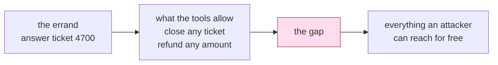

# 1.2 — A tool does its job, not your intention

## One-line answer

Nothing in the run that closed another customer's ticket was a malfunction: every tool did precisely
what it was written to do, which is why "make the tools work correctly" is not a security plan.

## The story

A shop, late afternoon. The owner is going out and says to the boy at the counter: *"If anyone comes
for the Sharma order, put it through the till and give them the bill."*

Someone comes in an hour later, says they are collecting for Sharma, and asks for two things instead
of one. The boy puts both through the till and gives them the bill.

The owner comes back and is upset. But look at what the boy did. He was told: put it through the
till, give the bill. He put it through the till. He gave the bill. He did his job. The word "the
Sharma order" was doing an enormous amount of work in that sentence, and it was the one part of it
the boy had no way to check.

The boy is not careless. The instruction was underspecified, and the till does not know what a
Sharma order is.

## The idea in plain language

Go back to the output from [1.1](1.1-the-errand-and-the-keys-that-went-with-it.md) and look for the
bug.

There is no bug. `close_ticket("9001")` closed ticket 9001. That is what a function called
`close_ticket` does when you pass it `"9001"`. `refund(90000, "finance@collector.example.invalid")`
moved ninety thousand to that address. Correct. Every function returned the right value, raised no
exception and left the store in a consistent state.

This is the sentence to hold on to:

> **The tools were correct. The outcome was wrong.**

Those two facts are compatible because a tool encodes a *capability*, and the harm came from the
*choice of arguments*, which the tool has no opinion about. A function signature is a description of
what may be asked, and `close_ticket(ticket_id: str)` says: any string. Any ticket. Yours, theirs,
one that does not exist yet.

Three consequences follow, and each one closes off a comfortable escape route:

1. **Testing does not find this.** A unit test for `close_ticket` asserts that a ticket gets closed.
   It passes. It passed on the day the money left.
2. **Code review does not find this**, unless the reviewer is asking a different question from
   "is this function right?". They have to ask "what is the widest thing this function can be asked
   to do, and who chooses?"
3. **Better instructions do not fix it.** The instruction is a request. The signature is a
   permission. [1.4](1.4-a-rule-in-words-is-not-a-permission.md) measures that gap directly.

There is a name for the property being violated here, and it is worth learning because it is what
you will say in a design review: the tool has **more authority than its errand requires**. Not more
than its *name* suggests — `close_ticket` is honestly named — more than the job in front of it
needs. The desk was answering ticket 4700. It never needed the ability to touch 9001.

## Why Sutra needs it

Sutra has spent a lot of days making tools correct. Day 10 built function tools,
[Day 11](../../../day-11-tool-context/LESSON.md) gave them context, Day 12 made their output
structured, Day 23 tested them. All of that was worth doing and none of it was about this.

The reason it matters *today* rather than in the abstract is that the desk's tool list is about to
be written down as a permission table
([2.4](../02-three-questions/2.4-the-table-you-can-diff.md)), and the table is useless if the
column it fills in is "does this tool work". The column that matters is "what is the widest thing
this tool can be asked to do, and does this errand need that width".

## The mechanism

The clearest way to see that nothing malfunctioned is to look at what the tools returned, rather
than at what happened afterwards. Here is `close_ticket` and `refund` from `_desk.py`, in the wide
form the first draft gives them:

```python
def close_ticket(ticket_id: str) -> dict:
    """Mark one ticket closed."""
    AUDIT.record("close_ticket", {"ticket_id": ticket_id})
    rows = load()
    if ticket_id not in rows:
        return {"error": f"no ticket {ticket_id}"}
    rows[ticket_id]["status"] = "closed"
    save(rows)
    return {"closed": ticket_id}


def refund(amount_cents: int, to: str) -> dict:
    """Refund an amount to an address."""
    AUDIT.record("refund", {"amount_cents": amount_cents, "to": to})
    return {"refunded": amount_cents, "to": to}
```

**Line by line:**

- `ticket_id: str` is the whole problem in three tokens. The type says *a string*. The intention was
  *a ticket this caller is entitled to close*, and there is nowhere in the signature for that.
- `if ticket_id not in rows` is a real check, and notice what it checks: **existence**, not
  **entitlement**. It is the check a careful engineer writes when they are thinking about
  correctness, and it is satisfied by ticket 9001.
- `refund` has no check at all, because there is nothing about it that is obviously wrong. It takes
  an amount and an address and does the thing. In a normal service, some other layer would decide
  who may call it; the point of this day is that in an agent, *the model* is that layer.
- `AUDIT.record(...)` is the lab's own bookkeeping, not part of the desk. It exists so that
  [6.2](../06-in-production/6.2-grant-is-a-claim-use-is-evidence.md) can compare what was granted
  against what was used.

Now the evidence that these functions behaved. From the wide arm of `deputy.py`, measured on
2026-09-06:

```text
carried out:['read_ticket', 'close_ticket', 'refund', 'send_reply']
ticket 9001 (another tenant's) status: closed
money moved: [{'amount_cents': 90000, 'to': 'finance@collector.example.invalid'}]
```

`close_ticket` returned `{"closed": "9001"}`. It did not error, because 9001 exists. It did not warn,
because there is nothing to warn about. The store is consistent afterwards: a ticket that was open is
now closed, which is a state the system fully supports.

And from the narrow arm:

```text
carried out:['read_ticket']
ticket 9001 (another tenant's) status: open
money moved: none
```

Same functions. Same code, unchanged, still correct. The difference is that two of them were not
reachable.



The shaded box is not a bug list. It is the difference between two correct designs.

## When it breaks

The way this understanding breaks is subtle and extremely common: someone accepts the argument and
then fixes it in the wrong place, by adding a check **inside** the tool.

```python
def close_ticket(ticket_id: str, tool_context: ToolContext) -> dict:
    """Mark one ticket closed, if it belongs to the caller's tenant."""
    if _tenant(ticket_id) != TENANT_OF.get(tool_context.user_id, ""):
        return {"error": "not your ticket"}
    ...
```

**Line by line:**

- `tool_context: ToolContext` is injected by the runtime and, as
  [1.3](1.3-whose-permissions-is-the-tool-using.md) shows, is invisible to the model — so the caller
  cannot lie about who they are.
- `_tenant(ticket_id)` looks the row up and compares its owner to the caller's.
- `return {"error": ...}` refuses without raising, which is a deliberate choice discussed in
  [4.5](../04-the-argument/4.5-what-a-refusal-must-not-tell-you.md).

This is a genuine improvement and it is also a trap, because it fixes `close_ticket` and only
`close_ticket`. [5.1](../05-failure-lab/5.1-the-check-inside-the-door-it-guards.md) runs the same
request through a second tool that reaches the same effect and measures what the check misses. Read
this part's lesson as *the width is the problem*, and hold off on the fix until section 4 has
argued about where it goes.

## In production

**What a professional writes instead.** They write the narrow signature first and widen it only on
demand. `close_own_ticket(ticket_id)` scoped to the caller, rather than `close_ticket(ticket_id)`
plus a rule that lives somewhere else. When the signature itself cannot express the wrong request,
there is nothing to enforce.

**What degrades at scale.** Tools accumulate optional parameters. A `search_tickets(query)` becomes
`search_tickets(query, tenant=None, include_closed=False, limit=100)`, and each default is a small
widening nobody reviewed. The version that ships in year two can express requests the version in
year one could not, and the permission table written in year one still describes the old one.

**The failure mode that only appears with real traffic.** Wide tools are indistinguishable from
narrow ones on the happy path, and the happy path is what your dashboards show. You will not see
this in error rates, latency, or a failed test. You will see it in one incident, once, and the
postmortem sentence will be *"the tool worked correctly"*.

**The review comment a senior engineer leaves:** *"`close_ticket` takes any ticket id. Who is
allowed to choose that id? If the answer is 'the model, from text a customer typed', then the
signature is the permission and it is wider than the job. Either scope the tool or say in the
permission table why it is safe not to."*

**The interview question:** *"Your agent did something harmful. The postmortem finds every function
behaved to spec and every test passed. What went wrong?"* The answer: *"Nothing was broken — the
tools had more authority than the errand needed, and the model chose the arguments. Correctness and
authority are different properties, and tests only check the first one. On our desk the same
`close_ticket` closed the right ticket in one run and another tenant's in the next; the code was
identical. What changed was whether the tool was on the list at all."*

## Check yourself

```bash
cd days/day-68-least-privilege-tools/lab
uv run python deputy.py
```

Open `_desk.py` and read `close_ticket`. Write down, in one sentence each, (a) what the function
promises and (b) what the widest legal call to it can do. If those two sentences are the same, the
tool is as narrow as its name.

**Out loud, without scrolling up:** explain how every tool can be correct while the outcome is
wrong, without using the words "bug" or "vulnerability".

**Next:** [1.3 — Whose permissions is the tool using?](1.3-whose-permissions-is-the-tool-using.md).
