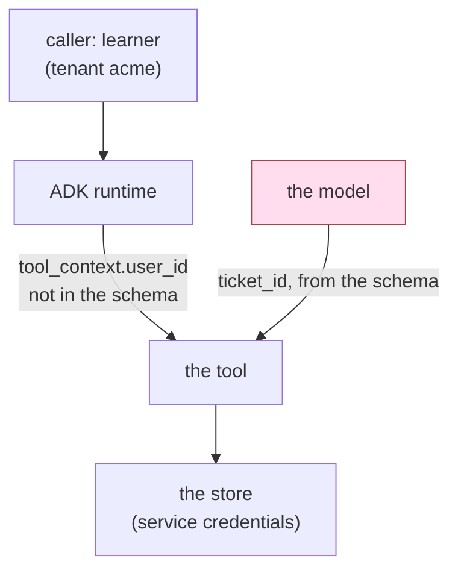

# 1.3 — Whose permissions is the tool using?

## One-line answer

A tool runs with the service's credentials, not the caller's, so unless the tool asks who is calling
and narrows itself, every user of your agent has the agent's reach.

## The story

You check into a hotel and they hand you a card for room 412. It opens 412, and it opens the gym on
the second floor, and it opens the side door after eleven at night, because the same card system
runs all three and the front desk enables all three by default for every guest.

That is fine, and it is deliberate. You are a guest; guests may use the gym.

Then one evening you press it against the reader on a service door near the kitchen, out of idle
curiosity, and it opens. Not because you were upgraded. Because that door was added last year, the
person who installed it set it to accept any card the system knows, and nobody went back through the
guest cards to check.

Your card did not become more powerful. The set of doors grew, and your card was already on the list
for all of them.

## The idea in plain language

When a tool runs inside an agent, there are two identities in the room and it is easy to lose track
of which one is doing the work:

- **The caller.** The person who typed the request, or on whose behalf the run started. In Sutra
  this is a `user_id` on the session.
- **The service.** The process itself, and the credentials it was started with: the database
  connection string in `.env`, the API key, the mail account, the directory it can read.

A tool call is executed by **the service**. The caller is, at best, a value the tool could look at.
By default it does not, and the result is called **ambient authority**: the tool's power comes from
the environment it happens to be running in, rather than from anything the caller presented.

Ambient authority is why this problem is not solved by your existing login system. Your login system
decides *who may talk to the agent*. It says nothing about *which rows the agent then touches*,
because by the time the tool runs, the agent is the one holding the connection.

Two terms you will need for the rest of the day:

- **Tenant** — one customer organisation whose data must never mix with another's. Sutra's archive
  has two: `acme` and `borden`. A **cross-tenant read** is the canonical worst outcome for a support
  product, because it is simultaneously a bug, a breach and a phone call from a lawyer.
- **Scoping** — narrowing a tool from "any row" to "the rows this caller is entitled to", by
  consulting the caller's identity inside the tool or in a check around it.

The good news, and it is genuinely good, is that ADK hands the tool the caller's identity for free.
The bad news is that it is an argument you have to accept and use, and a tool that ignores it looks
exactly like a tool that considered the question and decided it was fine.

## Why Sutra needs it

The desk is a support desk. Support desks are the archetypal multi-tenant product: the whole value
is that one team answers tickets for many customers, and the whole risk is that one customer's
ticket is shown to another.

Days 46–50 built memory and retrieval over the ticket archive. Day 49's index searches *the
archive*, not *this tenant's slice of the archive*, and Day 50 tuned how many rows come back. Those
days were about finding the right row. This one is about which rows were ever eligible.

[2.2](../02-three-questions/2.2-which-rows-scope.md) turns this into one of the three questions a
permission must answer, and [4.5](../04-the-argument/4.5-what-a-refusal-must-not-tell-you.md) deals
with the surprisingly delicate matter of what a refusal is allowed to say.

## The mechanism

`whose.py` builds a desk signed in as `learner`, who belongs to tenant `acme`, and asks it to read
ticket `9001`, which belongs to `borden`.

The wide tool is the one anybody writes first:

```python
def read_ticket_wide(ticket_id: str) -> dict:
    """Return one ticket by id."""
    AUDIT.record("read_ticket_wide", {"ticket_id": ticket_id})
    return load().get(ticket_id) or {"error": f"no ticket {ticket_id}"}
```

**Line by line:**

- `load()` reads the whole archive. There is no tenant in this function anywhere — not in the
  signature, not in the body, not in the store lookup.
- `.get(ticket_id)` is a dictionary lookup over every ticket that exists. The tool is, quite
  literally, a reader of the entire table.
- The `or {"error": ...}` branch fires only when the id does not exist, which is the same
  correctness-not-entitlement check [1.2](1.2-a-tool-does-its-job-not-your-intention.md) pointed at.

```bash
cd days/day-68-least-privilege-tools/lab
uv run python whose.py
```

**Line by line:**

- No flag means the wide reader. The script prints the caller's tenant and the ticket's tenant
  before the result, so the mismatch is on screen next to the thing it should have prevented.

Measured on 2026-09-06:

```text
tool:        read_ticket_wide
signed in as: learner  ->  tenant acme
ticket 9001 belongs to tenant borden
returned:    {'tenant': 'borden', 'customer': 'ops@borden.example.invalid', 'status': 'open', 'body': 'Borden Freight: bulk upload rejects rows with a trailing comma.'}
```

Another company's ticket text, another company's contact address, handed back in full to an agent
serving `acme`.

The scoped version differs by one parameter and one comparison:

```python
def read_ticket_scoped(ticket_id: str, tool_context: ToolContext) -> dict:
    """Return one ticket by id, if it belongs to the caller's tenant."""
    AUDIT.record("read_ticket_scoped", {"ticket_id": ticket_id})
    row = load().get(ticket_id)
    if row is None:
        return {"error": f"no ticket {ticket_id}"}
    caller = TENANT_OF.get(tool_context.user_id, "")
    if row["tenant"] != caller:
        return {"error": f"no ticket {ticket_id}"}
    return row
```

**Line by line:**

- `tool_context: ToolContext` is the whole fix. The runtime injects it; you do not pass it. Verified
  against `adk.dev/tools-custom/mcp-tools/` on 2026-09-06 and against the installed
  `google-adk==2.7.1`, where `ToolContext` subclasses `ReadonlyContext` and therefore carries
  `user_id`, `agent_name`, `invocation_id`, `session` and `state`.
- `TENANT_OF` stands in for the lookup a real desk does against its identity provider. The point is
  not the lookup; it is that the tool consults one at all.
- The two `return` statements are **deliberately identical**. "Not yours" and "not there" must be
  indistinguishable from outside, or the refusal itself becomes a way to discover which ticket ids
  exist. [4.5](../04-the-argument/4.5-what-a-refusal-must-not-tell-you.md) is about this.

```bash
uv run python whose.py --scoped
```

**Line by line:**

- `--scoped` swaps one function for the other. The archive, the caller and the requested id are
  identical, so any difference in the output belongs to the tool and to nothing else.

```text
tool:        read_ticket_scoped
signed in as: learner  ->  tenant acme
ticket 9001 belongs to tenant borden
returned:    {'error': 'no ticket 9001'}
```

There is one more fact worth seeing directly, because it decides whether this fix can be attacked.
The model never sees `tool_context`:

```python
from google.adk.tools.function_tool import FunctionTool
from whose import read_ticket_scoped

print(FunctionTool(read_ticket_scoped)._get_declaration().parameters_json_schema)
```

**Line by line:**

- `_get_declaration()` is what ADK sends to the provider as the tool's schema — the exact shape the
  model is told it may call.
- `parameters_json_schema` is the 2.7.1 spelling, and it is the field the runtime actually
  populates. The older `parameters` attribute is `None` here, so a 1.x-era
  `declaration.parameters.properties` access fails with
  `AttributeError: 'NoneType' object has no attribute 'properties'` — checked by running it.

Measured on 2026-09-06:

```text
{'properties': {'ticket_id': {'title': 'Ticket Id', 'type': 'string'}}, 'required': ['ticket_id'], 'title': 'read_ticket_scopedParams', 'type': 'object'}
```

One parameter. `tool_context` is stripped. The model cannot pass a `user_id`, cannot see that a
`user_id` exists, and cannot argue about it — the identity arrives on a wire the model is not
connected to. That is a real structural property, and it is rare enough in this subject to be worth
noticing: this is one of the few places where the fix is genuinely out of reach of the text.



The shaded box is the only input an attacker controls. Everything the scoped tool needs to refuse
comes down the other arrow.

## When it breaks

The version of this that fails in the field is not the missing check — it is the check that reads
the wrong identity.

A tool that scopes on a tenant taken from **the request text**, or from a state key the model can
write, has scoped on something the attacker supplies. State is shared with the model in ADK: an
agent can write to `ctx.state`, and a later tool reading `state["tenant"]` is trusting a value that
may have come from a poisoned ticket by way of a model that read it.

The rule is: **scope on the identity the runtime gave you, never on a value that has been through
the model.** `tool_context.user_id` is the former. `tool_context.state["tenant"]` is the latter
unless you can prove nothing writes it but your own trusted code.

The other failure is quieter. `TENANT_OF.get(tool_context.user_id, "")` returns `""` for an unknown
user, and `""` matches no tenant, so an unrecognised caller is refused. That is fail-closed, and it
is a choice — the same line written as `TENANT_OF.get(user_id, row["tenant"])` would fail *open* and
would pass every test you are likely to write.

## In production

**What a professional writes instead.** They push the scope down to the query rather than filtering
after the read. `SELECT * FROM tickets WHERE id = ? AND tenant = ?` never loads the other tenant's
row into the process at all, so it cannot leak through a log line, an error message, a cache or a
stack trace. Filtering in Python is the version you can write today; filtering in the query is the
version that survives the day somebody adds debug logging.

**What degrades at scale.** The mapping from caller to tenant is a lookup, and it becomes a lookup
per tool call. Cached, it becomes a stale lookup: a user removed from an organisation on Monday is
still that organisation's for as long as your cache says so. Every entitlement cache is a window in
which revocation has not happened yet, and the length of that window is a security parameter people
usually pick for performance reasons.

**The failure mode that only appears with real traffic.** Cross-tenant bugs are invisible in
single-tenant testing, and almost all local testing is single-tenant, because your fixture has one
customer in it. The Sutra archive has two on purpose. If your test data has one tenant, your test
suite cannot fail this way, and a test suite that cannot fail a class of bug is a test suite that
will not find it.

**The review comment a senior engineer leaves:** *"This tool takes an id and no identity. Who is
the caller, and where in this function is the check that the row belongs to them? If the answer is
'the model only ever passes ids from this tenant's tickets', that is a hope about the model, not a
property of the code."*

**The interview question:** *"An agent serves many customers from one process. What stops customer A
seeing customer B's data?"* A real answer: *"Nothing structural, unless you put it there. The tool
runs with the service's credentials, so the login check at the front door is irrelevant by the time
a tool executes. The identity is available — in ADK the runtime injects a context carrying
`user_id`, and it is stripped from the schema so the model cannot forge it — but the tool has to use
it. I measured our desk with a wide reader: signed in as one tenant, it returned another tenant's
ticket in full. The scoped version is the same function with one extra parameter, and it returns the
same 'no such ticket' for a row that is missing and a row that is not yours, so the error cannot be
used to enumerate ids."*

## Check yourself

```bash
cd days/day-68-least-privilege-tools/lab
uv run python whose.py
uv run python whose.py --scoped
```

Now change `read_ticket_scoped` to return `{"error": "not your ticket"}` instead of
`{"error": f"no ticket {ticket_id}"}` and run it again. The refusal still works. Write down what an
attacker learns from the new message that they did not learn from the old one.

**Out loud, without scrolling up:** define ambient authority, and say why a login system does not
solve it.

**Next:** [1.4 — A rule in words is not a permission](1.4-a-rule-in-words-is-not-a-permission.md).
