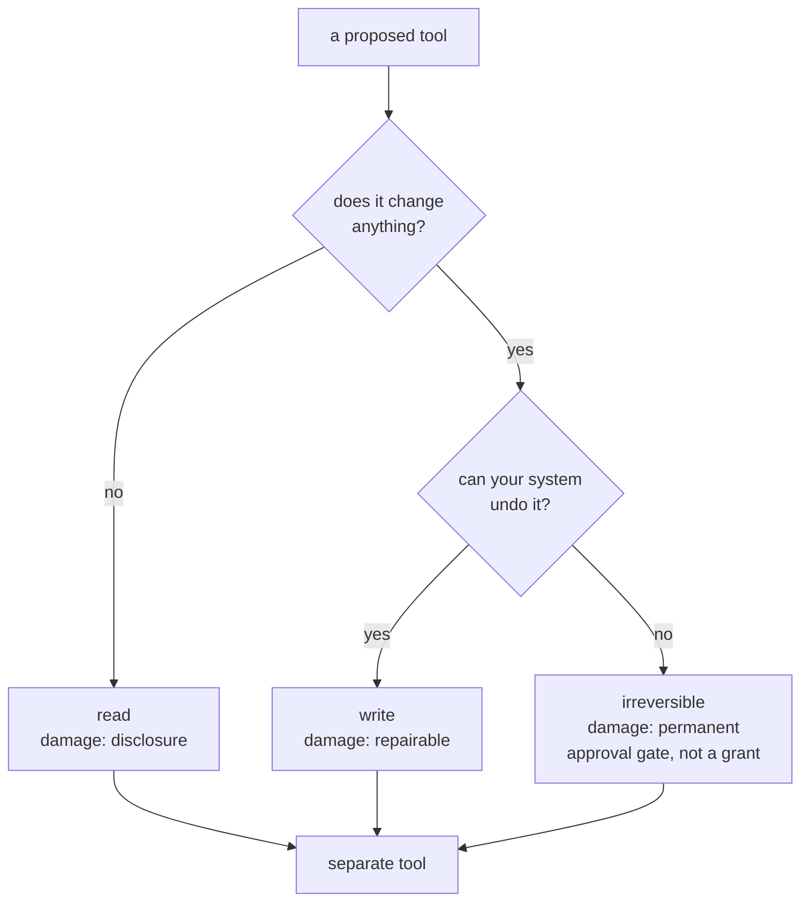

# 2.1 — May it? Capability, and the line between read and write

## One-line answer

The first question a permission answers is *what kind of thing may this tool do*, and the answer is
useless unless reading and writing are counted as different kinds — because one of them can be
undone and the other cannot.

## The story

There is a small steel almirah in the bedroom, and inside it a locker with its own key.

The house key opens the flat. The almirah key opens the almirah. The locker key opens the locker.
Three keys, three locks, and nobody in the family finds this odd, because everyone understands the
difference between *coming inside* and *taking the gold out*.

Now imagine the same house with one key for all three. Nothing is stolen, most days. But when you
lend the key to a cousin who is staying over, you are no longer lending them a place to sleep. You
are lending them the locker, and the only thing standing between them and it is that they were not
looking for it.

The three keys are not about distrust. They are about the fact that a night's stay and a gold chain
are different sizes of mistake.

## The idea in plain language

A **capability** is the kind of effect a tool can cause. It answers *may it?*, and it is the first
of three questions that together make up a permission:

| question | name | example answer |
| --- | --- | --- |
| may it? | **capability** | read · write · write-and-irreversible |
| which rows? | **scope** | tickets of the caller's tenant |
| how many times? | **rate** | 10 per minute |

[2.2](2.2-which-rows-scope.md) takes the second and [2.3](2.3-how-many-times-rate.md) the third.
This part is about the first, and about the one distinction inside it that does most of the work.

**Read and write are not two points on a scale. They are different categories, and the difference is
reversibility.**

- A **read** discloses. Its damage is that somebody now knows something. You cannot un-know it, but
  you also have not changed the world: the ticket is still open, the money is still there, the
  customer has not received anything.
- A **write** changes state. Some writes are cheap to undo — reopen the ticket, set the field back.
- An **irreversible write** cannot be undone by your system at all. The money left. The email
  arrived. The row was deleted and the backup is from last night.

Those three deserve different treatment, and the practical rule that falls out is short:

> Never put a read and a write behind the same tool, and never put a reversible write and an
> irreversible one behind the same tool.

This sounds fussy until you notice what a combined tool costs you. A single `manage_ticket(id,
action)` tool cannot be granted for reading without also being granted for closing, because the
grant is per tool and the action is an argument. You have destroyed your own ability to say *this
agent may look but not touch* — and *look but not touch* is the single most useful permission in an
agent system, because it is what the research stage of the triage graph needs.

There is a second reason, and it is about review. When the capability is in the **tool name**, the
tool list is a readable summary of what the agent can do. `read_ticket, read_note, send_reply` tells
a reviewer something true at a glance. `manage_ticket, ticket_tool, do_action` tells them nothing,
and they will have to read the implementation to find out — which means they will not.

## Why Sutra needs it

The triage graph built on Day 58 has five stages, and they do not need the same authority as each
other. Intake and classify read. Research reads. Draft reads and produces text. Only review, at the
end, causes anything to happen outside the process.

That is four stages that could run with a read-only keyring and one that cannot, and until reads and
writes are separate tools there is no way to express it. The permission table in
[2.4](2.4-the-table-you-can-diff.md) has a capability column, and this part is what lets that column
contain something more useful than the tool's own name repeated.

## The mechanism

The desk's five tools, sorted by the question *what happens if this is called wrongly*:

```text
tool           capability                 rate     credential
read_ticket    read                       60/min   desk-read
close_ticket   write                      20/min   desk-write
send_reply     write, outbound            10/min   desk-mail
read_note      read                       60/min   desk-read
refund         write, irreversible, money 0        none held by the desk
```

That table is not a diagram — it is printed by `table.py`, from `permissions.json` on disk:

```bash
cd days/day-68-least-privilege-tools/lab
uv run python table.py
```

**Line by line:**

- `table.py` writes `permissions.json` on first run and then reads it back, so the thing printed is
  the artefact and not a hard-coded string. [2.4](2.4-the-table-you-can-diff.md) is about why that
  matters.
- The `capability` column is written in words rather than as an enum, because the useful information
  is in the qualifiers: `write, outbound` and `write, irreversible, money` are both writes and they
  are not the same risk.
- `rate` is `0` for `refund`. A rate of zero is how "not granted" is spelled, and the gate script in
  §5 of the hub reads exactly that field.

Two rows repay a second look.

**`send_reply` is `write, outbound`.** It does not change a row in the archive at all — by the
narrow definition it barely writes anything. It is the most dangerous tool on the desk after
`refund`, because its effect leaves the building. A wrong ticket status is an internal
embarrassment; a wrong email is in somebody's inbox for ever. *Outbound* is a capability qualifier
in its own right, and any tool that carries it should be read as irreversible even when the code
looks harmless.

**`refund` is granted nothing.** The desk does not hold a credential for it. That is not a
restriction bolted onto a tool the desk has — it is the decision that the desk does not have the
tool, which is what [Day 63](../../../day-63-approval-gates-design/LESSON.md) reached by a different
route when it classified actions by blast radius and reversibility. Two days, two arguments, the
same row.



## When it breaks

The breakage is the convenience tool, and it arrives with a good argument attached.

Somebody notices that `read_ticket`, `close_ticket` and a future `reopen_ticket` are three tools
doing similar things, and that the model sometimes picks the wrong one. So they merge them:

```python
def manage_ticket(ticket_id: str, action: str) -> dict:
    """Read, close or reopen a ticket."""
    if action == "read":
        return load().get(ticket_id, {"error": "no such ticket"})
    if action == "close":
        return _set_status(ticket_id, "closed")
    if action == "reopen":
        return _set_status(ticket_id, "open")
    return {"error": f"unknown action {action}"}
```

**Line by line:**

- The function is fine. It is short, it validates its action, it returns a structured error for an
  unknown one. A reviewer looking for bugs finds none.
- `action: str` is the capability, moved out of the tool name and into an argument. Everything that
  chose the tool now also chooses the capability, and the thing that chooses is the model.
- The permission table can no longer say anything more precise than `read, write` for this row,
  which means the read-only research stage cannot be given it.

Merging tools is not always wrong — a tool per field would be absurd. The rule is: **merge across
scope, never across capability.** `read_ticket(id)` and `read_note(path)` could reasonably become
one reader. `read` and `close` cannot become one tool without giving up the ability to grant one
without the other.

## In production

**What a professional writes instead.** They give the capability its own credential, so the split is
enforced below the code rather than by it. `desk-read` is a database user with `SELECT` and nothing
else; `desk-write` has `UPDATE` on one table. Then a bug in the read tool cannot write, whatever the
bug is, because the connection it holds has no way to. In the table above the `credential` column is
doing that job, and [6.1](../06-in-production/6.1-one-credential-per-tool.md) is about what it costs
to run it properly.

**What degrades at scale.** Tools multiply, and the read/write line blurs at the edges. Is
`mark_as_seen` a read or a write? Technically a write; practically harmless; and it is exactly the
kind of row where somebody grants the write credential to a read-only agent "just for this", after
which the agent is not read-only any more and the table still says it is.

**The failure mode that only appears with real traffic.** Combined tools fail in the direction of
whatever the model finds easiest to say. With `manage_ticket(id, action)`, the distribution of
`action` values is determined by the wording of tickets, and a class of tickets that phrase things
as *"please close this"* will produce closes. You will not see it until you count the actions, and
nobody counts the actions of a tool that works.

**The review comment a senior engineer leaves:** *"This tool takes an `action` parameter with three
values, one of which writes. That means anything granted this tool is granted the write. Split it,
or tell me which agent needs read-and-write together and why the research stage should have it."*

**The interview question:** *"How do you decide what to make a tool?"* A good answer names this
line: *"One capability per tool, and I treat reversibility as the boundary rather than the noun. A
reader and a writer over the same table are two tools even though they feel like one, because I want
to be able to grant one without the other — the research stage of our graph runs read-only, and that
is only expressible if reads are separate tools. Anything irreversible I do not grant at all; it
goes behind an approval gate, and the permission row for it says rate zero."*

## Check yourself

```bash
cd days/day-68-least-privilege-tools/lab
uv run python table.py
```

Take the five tools and write, for each, the worst sentence a postmortem could contain about it. Then
sort your five sentences by how hard they are to undo. If your order differs from the table's, work
out which of you is wrong.

**Out loud, without scrolling up:** say why read and write must be separate tools, using the word
*reversible* and without using the word *security*.

**Next:** [2.2 — Which rows?](2.2-which-rows-scope.md).
