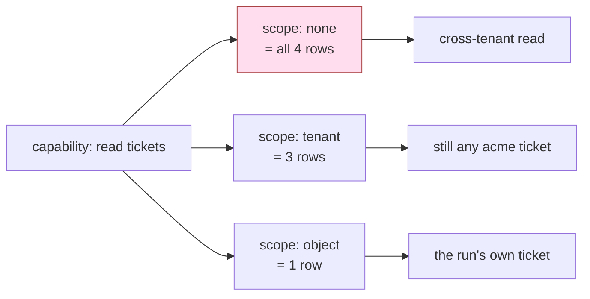

# 2.2 — Which rows? Scope, and the tool that is allowed on everything

## One-line answer

A capability with no scope is a permission on the whole table, and the difference between "may close
a ticket" and "may close *this* ticket" is the difference between a support desk and a way to close
anybody's tickets.

## The story

The school gives every parent a gate pass. It is a card with the school's stamp, and the guard looks
at the stamp.

One afternoon a parent arrives to collect a child who is not theirs — a neighbour's, with the
neighbour's permission, arranged over the phone that morning. The guard looks at the stamp, sees it
is valid, and lets them in.

The stamp answered *may this person come into the school?* It never answered *which child may this
person collect?*, because there is nowhere on the card for a child's name. And so a card that was
designed to control entry ends up controlling nothing about the thing everybody actually cares
about.

The school's fix is not a stricter guard. It is a different card, with a name printed on it.

## The idea in plain language

**Scope** is the second question a permission answers: not *may it?* but *on which rows?*

It is the question that gets skipped, because a capability feels complete on its own. "The desk may
close tickets" sounds like a permission. Read it again with an adversary in mind and it says: *the
desk may close every ticket that exists, including ones belonging to customers it has never heard
of, including ones already closed, including the one your legal team is using as evidence.*

Scope comes in layers, and it is worth having the vocabulary because a review conversation moves
much faster when both people can name the layer they are arguing about:

| layer | what it restricts | example |
| --- | --- | --- |
| **tenant** | which customer's data | tickets where `tenant = acme` |
| **object** | which specific rows | the ticket this run is about, and no other |
| **field** | which columns | the status, but not the customer's email address |
| **window** | which period | tickets opened in the last ninety days |

Sutra's desk needs the first two and should think about the third. The important observation is that
they nest: object scope is stricter than tenant scope, and a tool that has object scope does not
need tenant scope, because there is only one object and you checked it.

That gives the strongest version of the rule, and it is worth stating as a target even though it is
not always reachable:

> The best scope is **one row, chosen by the run and not by the model.**

If the triage graph is answering ticket 4700, then the close tool for that run should be able to
close 4700 and nothing else. Not "tickets in acme". Not "open tickets". That one. When the scope is
fixed by the run, the model's choice of argument stops mattering, because there is no argument left
to choose.

## Why Sutra needs it

[1.3](../01-the-deputy/1.3-whose-permissions-is-the-tool-using.md) measured the tenant layer: a wide
reader handed `acme`'s desk a `borden` ticket in full. That is the layer that produces the breach
notification.

The object layer is what the triage graph needs, and Day 58 built the graph without it. Every stage
of that graph knows exactly which ticket the run is about — it is in the state — and every tool in it
takes a `ticket_id` from the model anyway. The gap between those two facts is where
[5.1](../05-failure-lab/5.1-the-check-inside-the-door-it-guards.md)'s failure lives, and closing it
is one of the hub's build-brief items.

The field layer matters for a reason Day 69 will make concrete: the reply tool takes a `to` address,
and the address on the ticket is not the same thing as an address the model chose.
[4.3](../04-the-argument/4.3-the-recipient-who-is-not-the-customer.md) is that argument.

## The mechanism

The scoped reader from [1.3](../01-the-deputy/1.3-whose-permissions-is-the-tool-using.md) implements
the tenant layer. Here is what the object layer looks like, and notice how much smaller the tool
gets:

```python
def close_this_ticket(tool_context: ToolContext) -> dict:
    """Close the ticket this run is about."""
    ticket_id = tool_context.state.get("ticket_id")
    if not ticket_id:
        return {"error": "this run is not about a ticket"}
    rows = load()
    rows[ticket_id]["status"] = "closed"
    save(rows)
    return {"closed": ticket_id}
```

**Line by line:**

- **There is no `ticket_id` parameter.** That is the entire point, and it is worth pausing on: the
  model is not asked which ticket, so it cannot answer wrongly. Compare the declaration the model
  sees for this tool — no properties at all — with `close_ticket(ticket_id: str)`.
- `tool_context.state` is the run's state, which the graph wrote at intake before any model saw the
  ticket body. It is trusted for the same reason `user_id` was trusted in
  [1.3](../01-the-deputy/1.3-whose-permissions-is-the-tool-using.md): the value did not come through
  the model. That trust is conditional and the *When it breaks* section below is about the condition.
- The `if not ticket_id` branch fails closed. A run with no ticket in state closes nothing, rather
  than falling back to something convenient.

Now the tenant layer, measured. Run the two arms from
[1.3](../01-the-deputy/1.3-whose-permissions-is-the-tool-using.md) again, because they are the
evidence for this part too:

```bash
cd days/day-68-least-privilege-tools/lab
uv run python whose.py
uv run python whose.py --scoped
```

**Line by line:**

- Both arms in one place, because the comparison is the evidence. The first is the tenant layer
  missing, the second is the tenant layer present, and nothing else differs between them.

Measured on 2026-09-06 — the wide arm:

```text
returned:    {'tenant': 'borden', 'customer': 'ops@borden.example.invalid', 'status': 'open', 'body': 'Borden Freight: bulk upload rejects rows with a trailing comma.'}
```

and the scoped arm:

```text
returned:    {'error': 'no ticket 9001'}
```

The capability did not change between those two runs. Both tools may read tickets. Only the scope
moved, and it moved from *every row in the archive* to *rows belonging to the caller*.



## When it breaks

Object scope is the strongest layer and it has one failure mode, which is that **the state it trusts
must not be writable by the model.**

`tool_context.state` is shared. An agent can write to it through `ctx.actions.state_delta`, and any
value a model put there is a value that may have come from a poisoned ticket. If intake writes
`state["ticket_id"] = "4700"` and a later stage is able to overwrite it with `"9001"`, then
`close_this_ticket` has no parameter and still closes the wrong row — and it is now *harder* to
notice, because the tool looks unimpeachable.

The rule: **object scope is only as good as the write-protection on the key it reads.** In practice
that means one of

- writing the key once, at intake, from a value the run was started with rather than from anything
  read afterwards; and
- checking, in the tool, that the key has not changed since — a run id and a ticket id stamped
  together, compared on every call.

There is a second, more ordinary break. Scope checks that run *after* the data is loaded leak
through everything that touched the data on the way. The scoped reader in
[1.3](../01-the-deputy/1.3-whose-permissions-is-the-tool-using.md) does `load()` first and filters
second, which means the other tenant's row was in memory. In this lab that is harmless. In a real
service it is one debug log line away from being in your log aggregator, where it is now a
cross-tenant leak in a system nobody thinks of as holding ticket data.

## In production

**What a professional writes instead.** The scope goes into the query, not into an `if` after it:
`UPDATE tickets SET status = ? WHERE id = ? AND tenant = ?`. Then the row is never loaded, never
logged, never cached and never serialised into an error message. Better still, they use the
database's own row-level security so the scope holds even for code that forgot — the connection
itself cannot see the other tenant's rows, which turns a discipline into a property.

**What degrades at scale.** Object scope needs the object, and pipelines lose track of it. A run
that starts on one ticket, discovers a duplicate, and continues on another has two candidate
objects and a state key that can only hold one. This is where scoping quietly widens: somebody makes
the key a list, then makes it optional, and six months later the tool takes an id again.

**The failure mode that only appears with real traffic.** Tenant scope is fine until two tenants
share a person. A support engineer who works for both `acme` and `borden`, or a reseller managing
several customers, has a legitimate need to see rows across the boundary — and the moment you add
that, `TENANT_OF[user_id]` returns a set instead of a string and every comparison in the codebase
has to change. Systems that discovered this late tend to fix it by widening the check rather than by
changing the model, and widening the check is how you end up back at row one.

**The review comment a senior engineer leaves:** *"This tool takes an id from the model and the run
already knows which ticket it is about. Why is the model choosing? Take the parameter away and read
it from state, and tell me who else can write that state key."*

**The interview question:** *"What is the difference between a permission and a scoped permission?"*
An answer with a system behind it: *"A permission says what kind of thing you may do; a scope says
which rows you may do it to, and without the second one you have granted the whole table. I think in
layers - tenant, object, field, window - and I try to get to object scope, because a tool with no id
parameter cannot be pointed at the wrong row. Our close tool reads the ticket id from run state that
intake wrote, so the model never chooses it. The thing I check in review is who else can write that
state key, because object scope is exactly as strong as that."*

## Check yourself

```bash
cd days/day-68-least-privilege-tools/lab
uv run python whose.py --scoped
```

Add a fifth ticket to `SEED` in `_desk.py` belonging to tenant `borden`, and ask the scoped reader
for it. Then change `TENANT_OF` to map `learner` to `borden` and run again. Write down which of the
two changes was a permission change and which was a data change.

**Out loud, without scrolling up:** name the four scope layers, and say which one makes the model's
choice of argument irrelevant.

**Next:** [2.3 — How many times?](2.3-how-many-times-rate.md).
