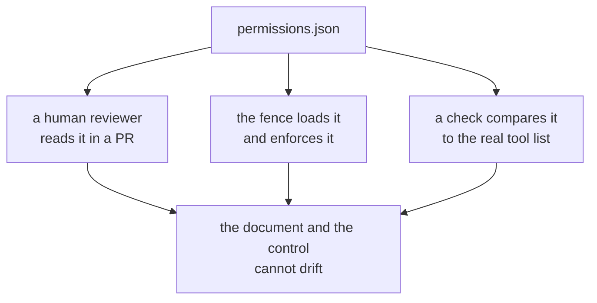

# 2.4 — The table you can diff

## One-line answer

Write the permissions down as data in the repository, one row per tool, because a policy that lives
only in code cannot be reviewed by the person who most needs to review it and cannot be diffed by
anybody at all.

## The story

The society gate has a register. Every visitor writes their name, the flat they are going to, who
they are, and the time.

Nobody reads it, most weeks. Its value is not that the watchman studies it — he is busy, and the
gate is busy. Its value is that it exists in one place, in order, with a line per event, so that on
the one afternoon somebody needs to ask *who came up to 4B on Tuesday*, there is a place to look and
the answer takes a minute.

The alternative is not a worse register. The alternative is asking four people what they remember.

## The idea in plain language

Everything so far has produced facts about tools: this one reads, that one writes, this one is
scoped to a tenant, that one is granted three per run. Those facts currently live in three places —
the tool's signature, a check somewhere, and the head of the person who wrote it.

A **permission table** is those facts written down as data, one row per tool, in the repository next
to the code. For Sutra that is `permissions.json`, and each row answers five questions:

| column | the question it answers |
| --- | --- |
| `capability` | may it? ([2.1](2.1-may-it-capability-and-the-read-write-line.md)) |
| `scope` | which rows? ([2.2](2.2-which-rows-scope.md)) |
| `rate` | how many times? ([2.3](2.3-how-many-times-rate.md)) |
| `credential` | whose authority does it use? ([1.3](../01-the-deputy/1.3-whose-permissions-is-the-tool-using.md)) |
| `blast_radius` | what does the postmortem say if it is wrong? |

Four properties make a table worth having, and each one is a thing you cannot do with policy
expressed as `if` statements:

1. **It can be read by somebody who cannot read your code.** A security reviewer, a compliance
   auditor, the person on call. This is the main one, and it is why the table is prose rather than
   an enum: `write, irreversible, money` tells a non-Python reader more than `Capability.WRITE`.
2. **It can be diffed.** `git diff permissions.json` in a pull request is a sentence about
   authority, not a scattering of changed lines in four modules. A widening becomes visible as a
   widening.
3. **It can be checked against reality.** A script can compare the rows to the tools actually on the
   agent and report the gap in both directions — which is how
   [5.2](../05-failure-lab/5.2-the-tool-that-arrived-without-a-row.md)'s failure gets caught.
4. **It can be enforced.** The same file the reviewer read is the file the plugin loads, so the
   document and the control cannot drift. A table nobody enforces is a document; a table the fence
   reads is a policy.

The last column is the one people leave out and the one that changes decisions. `blast_radius` is
not a severity label — it is a sentence naming the actual harm, written before anything goes wrong.
It is the row you will read out in the incident review, and writing it in advance is how you find
out that you cannot describe the harm, which usually means you have not understood the tool.

## Why Sutra needs it

[Day 63](../../../day-63-approval-gates-design/LESSON.md) produced a policy artefact classifying
Sutra's *actions* by blast radius and reversibility, and Day 64 turned it into a gate. This table is
the same idea one layer down, at the *tool* rather than the action, and the two must agree: an
action Day 63 decided needs a human cannot be reachable through a tool this table grants freely.
`refund` is the row where they meet, and both days independently put it at zero.

The immediate consumer is the hub's build brief. `sutra/permissions.py` loads this table, and the
day's eval checks that the policy is data rather than branches. Section 3 uses it to build the tool
list, and section 4 uses it to check arguments.

## The mechanism

`table.py` writes `permissions.json` and reads it back:

```bash
cd days/day-68-least-privilege-tools/lab
uv run python table.py
```

**Line by line:**

- `write_table()` serialises `ROWS` to `permissions.json`. In the real system the file is checked in
  and the module only reads it; here the script writes it so the lab is self-contained on a fresh
  clone.
- The printed table comes from `json.loads(TABLE.read_text(...))` — from the file, not from the
  Python dict. If the two ever disagree, the file wins, because the file is what the fence loads.
- The last two lines compare the table's row names against the tool functions actually exported by
  `_desk.py`, in **both** directions. A row with no tool is dead policy; a tool with no row is
  ungoverned authority, and they are different problems.

Measured on 2026-09-06:

```text
tool           capability                 rate     credential
read_ticket    read                       60/min   desk-read
close_ticket   write                      20/min   desk-write
send_reply     write, outbound            10/min   desk-mail
read_note      read                       60/min   desk-read
refund         write, irreversible, money 0        none held by the desk

tools on the desk with no row: none
rows with no tool on the desk: none
```

The full row for one tool, as it sits on disk, so the shape is concrete:

```json
{
  "send_reply": {
    "capability": "write, outbound",
    "scope": "the address on the ticket, never an address from its body",
    "rate": "10/min",
    "credential": "desk-mail",
    "blast_radius": "a customer receives a wrong answer; it cannot be unsent"
  }
}
```

Read the `scope` field as an instruction to the reviewer of
[4.3](../04-the-argument/4.3-the-recipient-who-is-not-the-customer.md), because it is: *never an
address from its body* is a claim this table makes and that part is where it gets enforced.



## When it breaks

A permission table breaks by becoming **decoration**, and it happens in a specific order that is
worth recognising early:

1. Someone writes the table. It is accurate on the day it is written.
2. The fence is built to read it. Still accurate.
3. A tool is added and the table is not updated. Now the table is a subset of reality, and the
   check in the mechanism above is the only thing that would say so.
4. Somebody hits a limit during an incident and changes the enforcement code rather than the table,
   because it is late and the table is not the thing running.
5. Much later the table describes a system that no longer exists, everybody knows it, and it is
   still in the repository being shown to auditors.

Step 3 is where it must be caught, which is why the check runs in CI rather than being a thing
somebody remembers. Step 4 is prevented only by making the table the *sole* source: if the fence
reads the file, then changing the limit means changing the file, and the change appears in `git log`
with an author and a date.

The other break is a table with the wrong grain. One row per *tool* is right. One row per *agent* is
too coarse — it cannot express that the research stage may read and not write. One row per *call
site* is too fine, and nobody will maintain it.

## In production

**What a professional writes instead.** They generate half of it. The capability and the credential
can be derived from the code — which connection a tool holds, which SQL verbs that role has — and a
generated column that disagrees with the hand-written one is a finding. The columns that cannot be
generated (`scope` in prose, `blast_radius`) stay hand-written, and that is fine: those are the ones
a human is supposed to think about.

**What degrades at scale.** Tables grow to hundreds of rows across teams, and then the interesting
question stops being *what is in this row* and becomes *who may change it*. A permission table that
anyone can edit in a pull request is a permission table that widens quietly, so the file gets a
`CODEOWNERS` entry and widening changes get a second reviewer. That is the point at which the table
stops being documentation and starts being a control.

**The failure mode that only appears with real traffic.** The `rate` column is written from
expectation and reality disagrees. Nobody finds out until the day a limit binds during a spike, and
the pressure at that moment is entirely towards raising it. The defence is to have measured the real
distribution before setting the number, which is what
[6.2](../06-in-production/6.2-grant-is-a-claim-use-is-evidence.md) is about.

**The review comment a senior engineer leaves:** *"This pull request adds a tool and does not touch
`permissions.json`. Add the row. If you cannot fill in `blast_radius` in one sentence, that is the
review comment, not the row — come back when you can say what the worst outcome is."*

**The interview question:** *"Where do your agent's permissions live?"* The answer that separates a
system from a habit: *"In a checked-in table, one row per tool, with capability, scope, rate,
credential and blast radius. It is data rather than code for three reasons: a security reviewer can
read it without reading Python, a widening shows up as a diff in a pull request, and the same file
the reviewer read is the file the enforcement loads, so the document cannot drift from the control.
There is a CI check comparing the rows to the tools actually registered, in both directions — a tool
with no row is ungoverned, and a row with no tool is policy about something that no longer exists."*

## Check yourself

```bash
cd days/day-68-least-privilege-tools/lab
uv run python table.py
uv run python table.py --drift
```

Now add a row to `ROWS` in `table.py` for a tool that does not exist, and run it again. Then write
down which of the two mismatch lines you would fail a build on, and which you would only warn about.

**Out loud, without scrolling up:** name the five columns, and say which one you would write first
if you were only allowed one.

**Next:** [3.1 — Deny by default, at the toolset](../03-absent-not-forbidden/3.1-deny-by-default-at-the-toolset.md).
