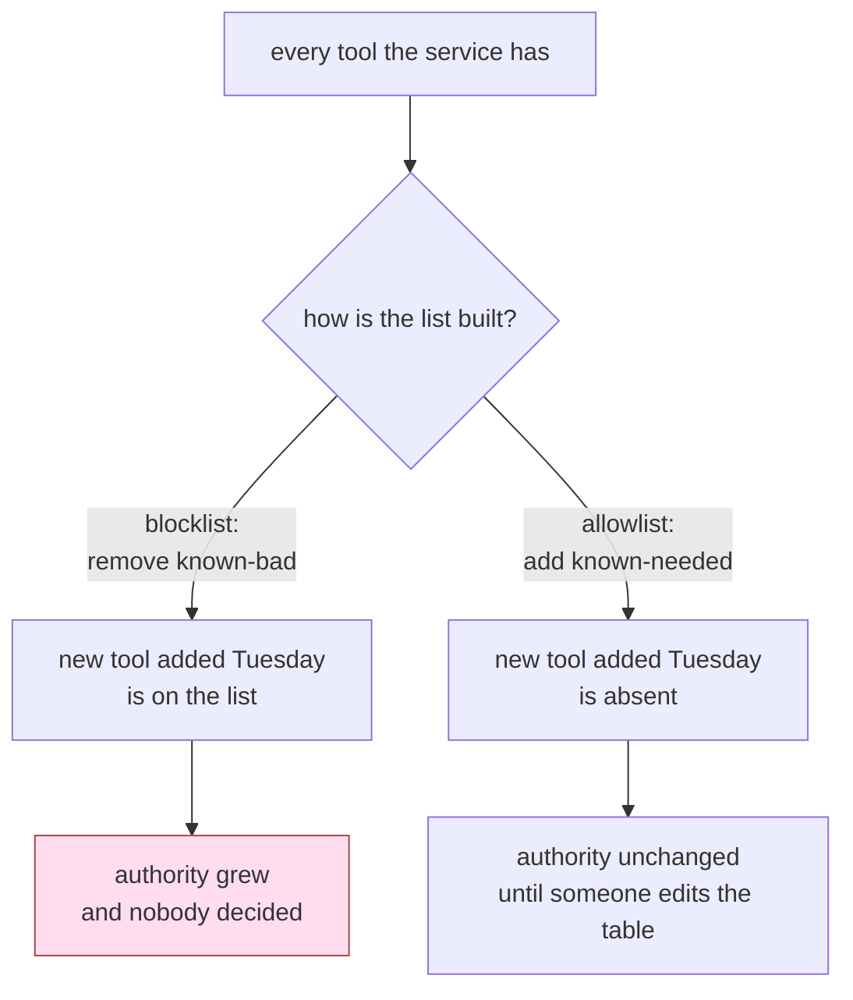

# 3.1 — Deny by default, at the toolset

## One-line answer

Build the agent's tool list from an allowlist rather than trimming a full one, because the two
produce the same list today and diverge the moment somebody adds a tool.

## The story

A wedding, and a man with a clipboard at the entrance. He is not checking anybody's identity. He has
a list of names, and the only question he can answer is whether the name in front of him is on it.

Somebody arrives who is genuinely a cousin of the groom, and is genuinely invited, and is genuinely
not on the list, because the list was printed on Tuesday and the invitation went out on Thursday.
They stand outside while somebody goes to find an uncle.

It is annoying, and it is the system working. The alternative — a man with a list of people who must
be *turned away* — would have let in everybody nobody had thought about, which on that evening is
several hundred people.

## The idea in plain language

There are two ways to decide what an agent may use, and they look identical when you write them and
behave differently for the rest of the system's life.

**Deny by default (an allowlist).** Start from nothing. Add the tools this agent needs, by name. A
tool that nobody named is absent.

**Allow by default (a blocklist).** Start from everything the service has. Remove the ones somebody
thought of. A tool that nobody thought of is present.

The difference is entirely about **what happens to the thing you did not consider**, and the thing
you did not consider is, by construction, the whole risk. On the day you write them both lists have
the same contents. In three months somebody adds `export_all_tickets` to the service, and one list
has grown by a tool and the other has not.

[Day 40](../../../day-40-filtering-and-allowlists/LESSON.md) made this argument for MCP servers and
built the filtering that goes with it — that day is the prerequisite, and this part does not repeat
it. What is new here is the level the list lives at and a distinction that matters more than it
sounds:

> A tool the agent may not use should be **absent from the list it is offered**, not present and
> refused.

Refusing a call is a check, and a check runs after the model has already chosen. Absence means the
model never had the option, never saw it in the schema, never spent tokens on it, and cannot pick it
by mistake or by persuasion. Absence is upstream of the entire conversation.

There is a smaller benefit that turns out to matter in practice: fewer tools make the model better
at choosing among the ones it has. A model offered five tools picks more accurately than one offered
twenty, so narrowing the list improves quality *and* reduces authority. That is unusual — most
security measures cost something — and it is worth saying out loud, because it removes the argument
that this is a trade-off.

## Why Sutra needs it

The desk's five tools were written across Days 10, 34 and 39, in three different contexts, and they
ended up on one agent because that is where tools go. Nobody ever wrote down the sentence *these
five, and no more*.

[2.4](../02-three-questions/2.4-the-table-you-can-diff.md) produced the table that makes such a
sentence writable. This part is where the table becomes the tool list rather than a description of
it, which is the difference between a policy and a comment.

It also sets up the build brief. `sutra/permissions.py` builds the desk's toolset from
`permissions.json`, and the eval in the hub's §5 fails if the policy is a set of branches rather
than data.

## The mechanism

ADK's `BaseToolset` takes a `tool_filter`. `absent.py` defines a toolset over the desk's five tools
and runs one request — a refund — through three different filters.

```python
class DeskToolset(BaseToolset):
    async def get_tools(self, readonly_context: ReadonlyContext | None = None) -> list[BaseTool]:
        return [
            tool
            for tool in (FunctionTool(function) for function in WIDE)
            if self._is_tool_selected(tool, readonly_context)
        ]

    async def close(self) -> None:
        return None
```

**Line by line:**

- `BaseToolset` is the 2.x base class for a collection of tools. Verified against
  `adk.dev/tools-custom/mcp-tools/` on 2026-09-06 and against the installed `google-adk==2.7.1`,
  where `__init__` accepts `tool_filter` and `tool_name_prefix`.
- `_is_tool_selected(tool, readonly_context)` is the framework's own filter application. Reading its
  source is worth a minute: it returns `True` when there is no filter, does a `tool.name in
  self.tool_filter` for a list, and calls the filter for a `ToolPredicate`. Using it rather than
  hand-rolling the comparison means the list form and the predicate form behave identically.
- `get_tools` is `async` and takes `readonly_context`, which is what makes
  [3.2](3.2-the-predicate-that-reads-the-room.md) possible: the list can differ per invocation.
- `close()` is required by the abstract base. A toolset that owns a connection closes it here; this
  one owns nothing.

The `WIDE` list is every tool the desk has. The filter is what turns it into a grant:

```bash
cd days/day-68-least-privilege-tools/lab
uv run python absent.py
```

**Line by line:**

- Three arms, one request each: no filter, an allowlist of two names, and a predicate.
- `declared=` is read off the real `LlmRequest` the runtime built, using
  `llm_request.config.tools`, not off the agent's `tools=` list. Those two are the same until a
  filter makes them differ, and the whole part is about that difference.

Measured on 2026-09-06:

```text
session state: (empty)

   no filter | declared=['close_ticket', 'read_note', 'read_ticket', 'refund', 'send_reply']
             | carried out ['refund']
   allowlist | declared=['read_ticket', 'send_reply']
             | raised ValueError: Tool 'refund' not found.
   predicate | declared=['close_ticket', 'read_note', 'read_ticket', 'send_reply']
             | raised ValueError: Tool 'refund' not found.
```

Read the `declared` column first, because it is the one that shows the control working *before*
anything was attempted. With the allowlist, the string `refund` was never sent to the provider. The
model was not resisted; it was not offered.

The `carried out` column then shows what that bought. Without a filter, the refund happened. With
one, the run raised — which is [3.3](3.3-what-happens-when-it-asks-anyway.md)'s subject.



## When it breaks

The allowlist has a specific and well-known failure: **an empty or mistyped filter that silently
admits everything.**

Look again at `_is_tool_selected` in the installed source:

```text
def _is_tool_selected(self, tool, readonly_context) -> bool:
    if not self.tool_filter:
        return True
    ...
```

That is upstream code, quoted rather than written, so it is fenced as text — reformatting somebody
else's source into this repository's style would defeat the point of quoting it.

`if not self.tool_filter` is true for `None` **and for an empty list**. A configuration bug that
produces `tool_filter=[]` — a missing environment variable, a YAML key that parsed to nothing, a
list comprehension that filtered everything out — does not produce an agent with no tools. It
produces an agent with **all** of them.

Measured on 2026-09-06, an empty filter beside no filter at all:

```text
 empty list | declared=['close_ticket', 'read_note', 'read_ticket', 'refund', 'send_reply'] | refund executed
       None | declared=['close_ticket', 'read_note', 'read_ticket', 'refund', 'send_reply'] | refund executed
```

Identical. A filter that removed every tool and a filter that was never configured produce the same
fully privileged agent, and nothing in either run says so.

That is fail-open, in the framework, in the one place you would most want fail-closed. Day 40 met
the same shape from the MCP side; it is worth knowing that it lives here too. The defence is not to
argue with the framework but to never let the empty list reach it:

```python
def desk_toolset(granted: list[str]) -> DeskToolset:
    """Build the desk's toolset, refusing to construct one with no grant at all."""
    if not granted:
        raise ValueError("empty grant: refusing to build a toolset that would admit every tool")
    return DeskToolset(tool_filter=granted)
```

**Line by line:**

- The guard is at construction, not at call time, so the failure happens at start-up where somebody
  is watching rather than mid-run where nobody is.
- `raise` rather than a default list. A default would be a guess about what the operator meant, and
  the operator meant something that did not parse.
- The one legitimate case for an agent with no tools is a pure text stage, and that agent should be
  constructed with no toolset at all rather than with an empty filter.

## In production

**What a professional writes instead.** The list is not written in the agent's constructor at all —
it is derived from the permission table, per agent, at build time. `tools=[*toolset_for("desk")]`,
where `toolset_for` reads `permissions.json`, filters to the rows granted to that agent, and raises
if a name in the table has no implementation. Then adding a tool to the service does nothing until
somebody edits a file that has a `CODEOWNERS` entry on it.

**What degrades at scale.** Allowlists rot in the safe direction, which is still rot. Tools get
renamed, and a name in the table that matches nothing is a permission for a tool that does not
exist; that is harmless but it hides the one that matters, because now nobody trusts the mismatch
report. `table.py`'s two-way check exists for exactly this, and it has to fail the build or it will
be ignored.

**The failure mode that only appears with real traffic.** The tool that gets added without review is
almost never a dangerous-sounding one. It is `get_account_details`, added for a legitimate flow,
which happens to include the billing contact and the plan tier. Nobody would grant "read billing
data" to a support desk if asked directly; everybody grants a tool whose name sounds like the thing
the desk already does.

**The review comment a senior engineer leaves:** *"This agent takes `tools=EVERY_TOOL`. Which of
these does the triage flow actually call? Build the list from the permission table and let the
build fail if a granted name has no implementation. And show me what happens when the filter list
is empty — I want to see it raise, not admit everything."*

**The interview question:** *"How do you decide which tools an agent gets?"* The answer that shows
scars: *"Deny by default, and the list is derived from a checked-in table rather than written in the
constructor. The reason is not today's list — a blocklist and an allowlist have identical contents
on day one — it is what happens when somebody adds a tool to the service in three months. With a
blocklist the agent silently gained a capability. With an allowlist nothing changed until a human
edited the table. The one thing I check in ADK is the empty-filter case, because `if not
tool_filter` treats an empty list as no filter and admits everything, so I raise at construction
rather than letting a bad config produce a fully privileged agent."*

## Check yourself

```bash
cd days/day-68-least-privilege-tools/lab
uv run python absent.py
```

Change the allowlist arm in `absent.py` from `["read_ticket", "send_reply"]` to `[]` and run it
again. Read the `declared` column and write down what you expected and what happened.

**Out loud, without scrolling up:** say why an allowlist and a blocklist that contain the same tools
today are still different controls.

**Next:** [3.2 — The predicate that reads the room](3.2-the-predicate-that-reads-the-room.md).
