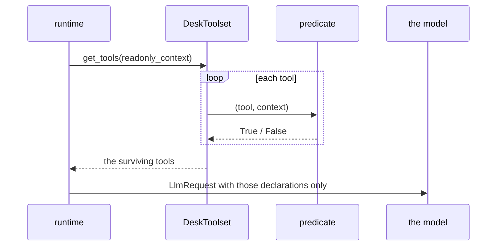

# 3.2 — The predicate that reads the room

## One-line answer

A tool list does not have to be fixed at construction: a predicate is called per invocation with the
run's context, so the same agent can be offered different tools depending on who is asking and what
the run has established so far.

## The story

The counter at the electricity office has a sign: *Bill payments and new connections.* That is what
the clerk does, all day.

Above the counter is a second sign, smaller, that says *Refunds and corrections: with supervisor
approval only.* And there is a supervisor, and she has a key, and when she is at the counter the
clerk can do the second list as well.

She is not standing there giving permission call by call. Her presence *is* the condition. When she
walks away, the counter can do bill payments and new connections again, and nobody has to remember
to switch anything off.

## The idea in plain language

An allowlist written into a constructor answers the question *what may this agent ever do?* A
**predicate** answers a better question: *what may this agent do in this run, right now?*

The mechanism is small. Instead of `tool_filter=["read_ticket", "send_reply"]`, you pass a function.
ADK calls it once per tool per invocation, hands it the tool and a read-only view of the run, and
keeps the tools it returns `True` for.

Two terms, because both are new:

- **`ToolPredicate`** — the protocol ADK expects: a callable taking `(tool, readonly_context)` and
  returning a `bool`. It is a `Protocol` with `@runtime_checkable`, so anything with that shape
  works; you do not have to subclass anything.
- **`ReadonlyContext`** — a view of the invocation the predicate is allowed to read. On the
  installed 2.7.1 it exposes `user_content`, `invocation_id`, `agent_name`, `state`, `session`,
  `user_id`, `run_config` and `custom_metadata`. Read-only is the point: a filter that could mutate
  the run would be a very strange filter.

What makes this worth a part of its own is the class of policy it unlocks. A fixed list can express
*this agent may close tickets*. A predicate can express:

- this agent may close tickets **when the caller is a supervisor**;
- this agent may send replies **only after the review stage has recorded an approval**;
- this agent may use the write tools **only in the second half of the graph**;
- this agent may use no write tools at all **when the run was started from an untrusted channel**.

Every one of those is a sentence about *this run*, and none of them can be said at construction time
because none of them is known then.

The caution that comes with it is the same one as
[2.2](../02-three-questions/2.2-which-rows-scope.md)'s object scope, and it is the thing to check in
review: the predicate reads `state`, and **state is shared with the model**. A predicate that widens
the tool list based on a state key an agent can write has handed the decision back to the thing it
was protecting you from.

## Why Sutra needs it

Day 58's triage graph runs five stages in one process, and the stages need different authority:
intake and classify and research read, draft produces text, review is the only stage that should be
able to send anything. A single tool list on a single agent cannot express that.

The version of the desk this day is building reads its grant from
[2.4](../02-three-questions/2.4-the-table-you-can-diff.md)'s table and narrows it further per run.
That is also how [Day 63](../../../day-63-approval-gates-design/LESSON.md)'s approval decision gets
teeth without a second mechanism: once an approval is recorded in state by trusted code, the
predicate can offer the tool that the approval was for, and not before.

## The mechanism

`absent.py`'s third arm is a predicate:

```python
def refund_needs_senior(tool: BaseTool, readonly_context: ReadonlyContext | None = None) -> bool:
    """A `ToolPredicate`: everything is offered except `refund`, which needs a senior session."""
    if tool.name != "refund":
        return True
    state = readonly_context.state if readonly_context else {}
    return bool(state.get("senior"))
```

**Line by line:**

- The signature is the whole contract. `ToolPredicate` is a `Protocol` in the installed 2.7.1, so a
  plain function matches it — there is no base class to import and no registration step.
- `readonly_context: ... | None = None` with a default is not decoration. `get_tools` may be called
  without a context (during introspection, or by tooling that lists an agent's tools), and a
  predicate that assumes a context will raise there.
- `if tool.name != "refund": return True` is the deny-by-default question inverted, and it is worth
  being uncomfortable about: this predicate *allows* by default and names one exception. In the real
  desk the predicate reads the permission table and the default is `False`. Here it is written this
  way so the one moving part is visible.
- `state.get("senior")` reads session state. The `bool(...)` wrapper makes a missing key, an empty
  string and `None` all mean no.

The two runs differ only in the session's state:

```bash
cd days/day-68-least-privilege-tools/lab
uv run python absent.py
uv run python absent.py --senior
```

**Line by line:**

- `--senior` seeds the session with `{"senior": True}` through `create_session(..., state=...)`. It
  changes nothing about the agent, the toolset, the model or the request.
- Both runs ask for the same thing: a refund of 90000.

Measured on 2026-09-06, without the flag:

```text
session state: (empty)

   predicate | declared=['close_ticket', 'read_note', 'read_ticket', 'send_reply']
             | raised ValueError: Tool 'refund' not found.
```

and with it:

```text
session state: senior=True

   predicate | declared=['close_ticket', 'read_note', 'read_ticket', 'refund', 'send_reply']
             | carried out ['refund']
```

The `declared` list is four tools in one run and five in the other, from one unchanged agent object.
The tool did not become allowed; it became **offered**.



## When it breaks

The predicate runs at **list-building time**, not at call time, and the gap between those two moments
is where the surprise lives.

`BaseToolset` caches. From the installed source:

```text
if (
    self._use_invocation_cache
    and self._cached_prefixed_tools is not None
    and self._cached_invocation_id == invocation_id
):
    return self._cached_prefixed_tools
```

The cache key is the **invocation id**. Within one invocation the tool list is computed once and
reused, which means a predicate whose answer changes mid-invocation does not take effect until the
next one. If an approval is recorded in state at step three of a run, a predicate reading that key
will not offer the tool at step four of the same run — it will offer it on the next invocation.

This is the right default for performance and it is a trap for policy. Two consequences to hold on
to:

1. **A predicate is a good place to express what is true at the start of a run, and a bad place to
   express something that changes during one.** For the latter you want a check at call time, which
   is [4.3](../04-the-argument/4.3-the-recipient-who-is-not-the-customer.md)'s and
   [5.1](../05-failure-lab/5.1-the-check-inside-the-door-it-guards.md)'s territory.
2. **A predicate that widens is more dangerous than one that narrows**, because the cached answer
   outlives the condition. A tool offered because state said `senior` stays offered for the rest of
   that invocation even if the condition is withdrawn.

The other break is the one flagged above and it is worth repeating because it is invisible in
testing: if any agent in the graph can write `state["senior"]`, then the predicate is asking the
model for permission. Trusted code writes that key, or the key is not trusted.

## In production

**What a professional writes instead.** They keep predicates simple and declarative — a lookup
against the permission table and the run's identity, no branching logic — and they log the decision.
A predicate that silently returns `False` produces an agent that mysteriously cannot do its job, and
the debugging session that follows is long, because nothing errored: the tool is just not there. One
log line per excluded tool per invocation, at debug level, turns that into a five-minute
investigation.

**What degrades at scale.** Predicates are called per tool per invocation. A predicate that reads a
database or calls an identity service turns tool-list construction into N round trips on the hot
path of every run. The fix is to resolve the caller's grants **once** at the start of the run, put
the resulting set in state through trusted code, and have the predicate do a set membership test.

**The failure mode that only appears with real traffic.** The condition the predicate reads is
sometimes absent for legitimate reasons — a run started by a scheduled job rather than a person, a
retry that reconstructed the session without the original state, a resumed run
([Day 61](../../../day-61-pause-resume-checkpoints/LESSON.md) is the day that matters here). Those
runs get the narrow tool list and fail in a way that looks like a bug in the flow rather than a
permission decision, and they are rare enough to be dismissed as flakes for a long time.

**The review comment a senior engineer leaves:** *"This predicate widens the tool list based on
`state['senior']`. Who writes that key, and can any agent in this graph write it? If the answer is
'the model could', the predicate is asking the attacker for permission. Also: the toolset caches per
invocation, so this cannot revoke mid-run — is that what you want?"*

**The interview question:** *"Can an agent's tools change while it is running?"* A precise answer:
*"They are computed per invocation, not fixed at construction. In ADK you pass a predicate instead
of a list and it is called with a read-only view of the run, so I can offer write tools only after a
recorded approval, or only to a caller with the right role. Two things I check: the predicate reads
state and state is shared with the model, so the key it reads has to be written by trusted code
only; and the toolset caches on the invocation id, so a predicate cannot revoke a tool part-way
through a run. For anything that has to hold at the moment of the call, I use a check outside the
tool instead."*

## Check yourself

```bash
cd days/day-68-least-privilege-tools/lab
uv run python absent.py
uv run python absent.py --senior
```

Now invert `refund_needs_senior` so it defaults to `False` and names the tools it allows, rather than
defaulting to `True` and naming one it does not. Run both arms again. The output should be
narrower — write down which tools disappeared and whether the desk could still do its job.

**Out loud, without scrolling up:** say what a predicate can express that a fixed list cannot, and
name the one thing it cannot do mid-run.

**Next:** [3.3 — What happens when it asks anyway](3.3-what-happens-when-it-asks-anyway.md).
