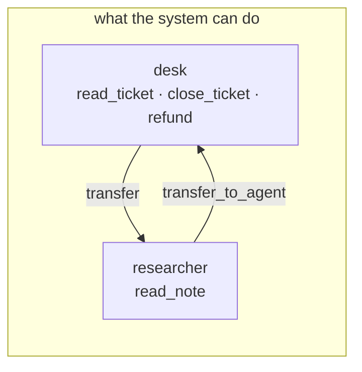

# 3.4 — Whose keyring does a helper carry?

## One-line answer

A sub-agent is offered its own tools and not its parent's, which is the reassuring half; the other
half is that it is also offered a way back to the parent, so the authority of the *system* is the
union of every agent control can reach.

## The story

You send the junior from the office to the bank with the passbook and a filled-in withdrawal slip.

He carries your passbook. He does not carry your chequebook, your card, or the authority to open a
new account, because you did not give him those and the bank will not take his word for it.

But he is also not a sealed envelope. He can come back and say *the clerk needs one more signature*,
and then you sign it, and then the thing that could not be done alone gets done. Nothing was
smuggled. The errand simply had a return path, and the return path leads to somebody who can do more
than he can.

If you are working out what could go wrong with the errand, counting only what is in the junior's
hands is not enough. You have to count what he can come back and ask for.

## The idea in plain language

Day 55 built two ways for one agent to use another, and this part asks the permission question about
both:

- **Transfer** (`sub_agents`) — control moves to the helper and does not automatically come back.
- **Agent-as-tool** — the helper is called like a function and returns a result.

The question is: when the helper runs, what tools is it offered? There are three answers people
assume, and they have very different consequences:

1. *The helper gets the parent's tools too.* Authority flows downhill; a research helper inside a
   desk that can refund is a research helper that can refund.
2. *The helper gets only its own tools.* Each agent is its own grant, and the permission table has
   one row set per agent.
3. *The helper gets the intersection.* Nobody implements this, but people expect it.

The measured answer on ADK 2.7.1 is **the second** — with one addition that turns out to be the
interesting part of the day.

The concept underneath is **authority propagation**, and the useful way to think about it is not
per-agent at all. It is: *given a starting point, what is the set of tools reachable by any sequence
of legal moves?* That set is the system's real blast radius, and it is what a security reviewer is
actually asking about when they point at your architecture diagram.

## Why Sutra needs it

Day 58's triage graph is exactly this shape: an orchestrating desk, a research helper, a drafting
stage, a reviewing stage. Day 55 wired the delegation and Day 57 wired the orchestrator and critic.
None of those days asked what each agent may do.

The permission table from [2.4](../02-three-questions/2.4-the-table-you-can-diff.md) has one row per
tool. Once there is more than one agent, it needs a column — or a row set — per agent, and the
answer measured here is what makes that meaningful: because tools do not flow downhill, a per-agent
grant is a real boundary rather than a suggestion.

## The mechanism

`handover.py` builds a desk holding `read_ticket`, `close_ticket` and `refund`, and a helper holding
only `read_note`, and wires them both ways.

```python
helper = LlmAgent(
    name="researcher",
    model=helper_llm,
    description="Looks things up in the knowledge base.",
    tools=[read_note],
)
desk = LlmAgent(
    name="desk",
    model=desk_llm,
    tools=[read_ticket, close_ticket, refund],
    sub_agents=[helper],
)
```

**Line by line:**

- `tools=[read_note]` on the helper and three different tools on the desk. Two disjoint grants, so
  any overlap in what they are offered is the framework's doing rather than the configuration's.
- `description=` on the helper is not decoration: it is what the desk's model reads when deciding
  whether to hand over, and Day 55 spent a part on why a vague one is a bug.
- `sub_agents=[helper]` is the transfer wiring. The agent-as-tool arm replaces this with
  `AgentTool(agent=helper)` in the desk's `tools=` list.
- Both `ScriptedLlm` instances record `seen_tools` on every call, so the question *what was this
  agent offered* is answered from the real `LlmRequest` rather than from the configuration.

```bash
cd days/day-68-least-privilege-tools/lab
uv run python handover.py
```

**Line by line:**

- The first two blocks run the two wirings and print what each model was offered.
- The third block, `chain()`, is a separate experiment: the helper is scripted to transfer *back* to
  the desk, and the desk is scripted to call `refund` on its second turn.

Measured on 2026-09-06:

```text
sub_agent
  desk was offered:   ['close_ticket', 'read_ticket', 'refund', 'transfer_to_agent']
  helper was offered: ['read_note', 'transfer_to_agent']
agent_as_tool
  desk was offered:   ['close_ticket', 'read_ticket', 'refund', 'researcher']
  helper was offered: ['read_note']

chain (desk -> researcher -> desk)
  tools actually called: ['refund']
```

Three findings, and they should be read in order.

**Tools do not flow downhill.** The helper was never offered `refund`, `close_ticket` or
`read_ticket` in either wiring. A per-agent grant is a real boundary, and the natural way to shrink
an agent's authority is therefore to move work into a helper that does not have the dangerous tools
— which is a genuinely good pattern and the main practical takeaway.

**Transfer adds `transfer_to_agent` to the helper.** The `sub_agent` wiring offered the helper two
tools where its configuration named one. That extra tool is control flow, not data access, and it is
also the return path from the story. The agent-as-tool wiring did not add it: the helper was offered
exactly `['read_note']`, which makes agent-as-tool the **narrower** of the two constructions from a
permission point of view.

**The chain closes the loop.** With the helper scripted to transfer back, `refund` was called. Note
carefully what this does and does not show: the helper did **not** gain the refund tool. Control
returned to an agent that already had it, and that agent then used it. That is not a framework bug —
it is the correct behaviour of a graph with a cycle in it — and it is exactly why counting one
agent's tools is not a threat model.



## When it breaks

The break is a reasoning error rather than a crash, and it is the most common one in multi-agent
design reviews: **treating a helper as a sandbox.**

The argument goes: *the research helper reads untrusted ticket text, so we gave it no write tools;
the untrusted text is contained.* The measurement above says the first two clauses are true and the
third does not follow. If the helper can transfer back to an agent that holds write tools, then text
the helper read can influence what that agent does next — because what the helper says on the way
back is now part of the desk's context.

The precise statement, which is worth writing down somewhere your team will see it:

> An agent's authority is its own tools. A *system's* authority is the union of the tools of every
> agent reachable from the entry point, and untrusted content reaching any of them can reach all of
> that union.

Two mitigations follow, and they are different in kind:

- **Prefer agent-as-tool for anything that touches untrusted content.** It was offered one tool
  rather than two, it returns rather than handing over control, and the caller decides what to do
  with the answer.
- **Do not put the dangerous tool on any agent in the reachable set.** This is the only mitigation
  that is a property rather than a hope. `refund` is not on the desk at all in the shipped design —
  it is behind [Day 63](../../../day-63-approval-gates-design/LESSON.md)'s gate — and the reason the
  chain above is a demonstration rather than an incident is that the lab put it back.

## In production

**What a professional writes instead.** They draw the reachability graph and count the union, once,
in the design document — every agent, its tools, and every edge control can take. The number that
goes in the security review is the union, not the maximum. Then they look for the smallest cut: an
agent that reads untrusted content and has *no* outgoing edge to a privileged agent is a real
boundary, and it is usually one refactor away.

**What degrades at scale.** Edges are added more casually than tools. Nobody adds a refund tool
without discussion; everybody adds a `sub_agents=[...]` entry to make a flow work, and each one may
enlarge the union for every agent upstream of it. The permission table needs to cover edges as well
as tools, and almost none do.

**The failure mode that only appears with real traffic.** Delegation chains get deeper in production
than in testing, because real tickets are messier and orchestrators re-delegate. A chain that is two
hops in your fixtures is five hops on a bad Monday, and the fifth hop is an agent nobody had in mind
when they reasoned about what the first one could reach.

**The review comment a senior engineer leaves:** *"This diagram shows the research agent with no
write tools, and there is an arrow from it back to the desk, which has three. Draw the union. If the
research agent handles untrusted text, either remove that arrow — use agent-as-tool so it returns
instead of transferring — or take the write tools off the desk."*

**The interview question:** *"If you give a sub-agent fewer tools, is it less dangerous?"* The
answer that shows measurement rather than intuition: *"Less dangerous on its own, yes — I checked,
and in ADK 2.7 tools do not flow downhill: a sub-agent is offered its own list and not its parent's.
But that is not the number that matters. With `sub_agents` the helper is also offered
`transfer_to_agent`, so control can go back to an agent that does hold the write tools, and I ran
that: the helper transferred back and the refund executed. So the system's authority is the union
over everything reachable. For anything reading untrusted content I use agent-as-tool instead, which
was offered exactly its own one tool and returns rather than handing over control."*

## Check yourself

```bash
cd days/day-68-least-privilege-tools/lab
uv run python handover.py
```

Change the `chain()` block so the helper is wired as an `AgentTool` instead of a `sub_agent`, and try
to make the same refund happen. Write down what you had to change, and whether the desk or the helper
was the thing that had to change.

**Out loud, without scrolling up:** state the difference between an agent's authority and a system's
authority, and say which of the two constructions is narrower.

**Next:** [4.1 — The tool is allowed, the argument is not](../04-the-argument/4.1-the-tool-is-allowed-the-argument-is-not.md).
