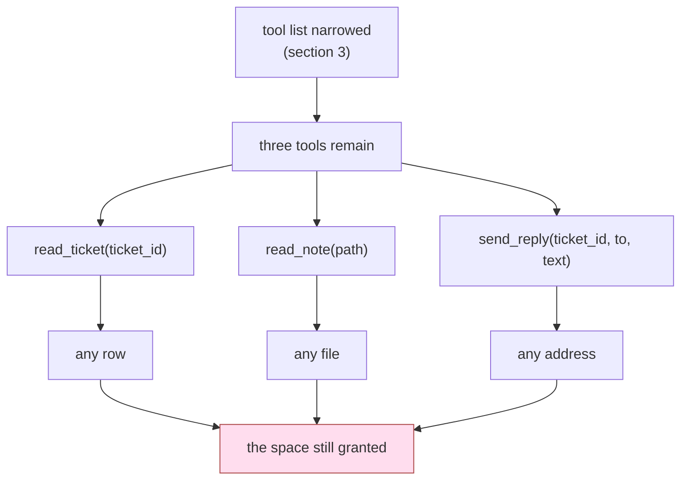

# 4.1 — The tool is allowed, the argument is not

## One-line answer

Once the tool list is right, the remaining authority is in the arguments, and a permission that
stops at the tool name has granted every call that tool can express.

## The story

Somebody asks you to sign a form and says they will fill in the rest afterwards, because the
details are not settled yet and they do not want to trouble you twice.

You know this is a bad idea, and you also know exactly why: your signature is not agreement to the
piece of paper, it is agreement to whatever ends up on it. The form is fine. The signature is fine.
What you have actually given away is the blank space.

The whole of section 4 is about the blank space.

## The idea in plain language

Section 3 got the tool list right: the desk is offered `read_ticket`, `read_note` and `send_reply`,
and not `refund`. That is a real reduction in authority and it is where most teams stop.

Now count what is left. Each of those three tools takes arguments, and the model chooses them:

| tool | argument | what the argument can express |
| --- | --- | --- |
| `read_ticket` | `ticket_id` | any ticket in the archive, any tenant |
| `read_note` | `path` | any file the process can open ([4.2](4.2-a-path-is-a-sentence-about-the-whole-disk.md)) |
| `send_reply` | `to` | any address ([4.3](4.3-the-recipient-who-is-not-the-customer.md)) |

A permission that says *the desk may send replies* has granted the third row entirely. The reply
tool is on the allowlist for a good reason — replying is the desk's job — and the same grant covers
replying to an address that appeared inside a ticket body.

The general statement:

> A tool grant is a grant over **the whole space its signature can express.** Narrowing the tool
> list shrinks the number of spaces. It does not shrink any of them.

There are exactly three ways to shrink one, and it is worth having them as a checklist because
teams usually reach for the third and it is the weakest:

1. **Remove the parameter.** [2.2](../02-three-questions/2.2-which-rows-scope.md)'s
   `close_this_ticket(tool_context)` reads the id from run state, so there is no argument to choose.
   Strongest, and not always possible.
2. **Constrain the type.** An enum instead of a string, an id that must match a pattern the archive
   uses, a `Literal["open", "closed"]` instead of a free-text status. The model can still choose
   wrongly, but only from a set you wrote.
3. **Check the value.** Accept the argument and validate it before the effect. Weakest of the three
   because it is code somebody has to write, remember and place correctly — and *placing it
   correctly* is [4.4](4.4-the-check-that-belongs-outside-every-tool.md)'s subject.

A term for the rest of the day: **argument-level permission**. It is the pairing of a tool name with
a predicate over its arguments, and it is what the `scope` column of
[2.4](../02-three-questions/2.4-the-table-you-can-diff.md)'s table has been describing in prose all
along. *"the address on the ticket, never an address from its body"* is not a comment. It is a
specification for a check.

## Why Sutra needs it

The desk's three surviving tools are the ones it cannot do its job without, so none of section 3's
techniques can help further. Everything left is in the arguments.

This is also where the day stops being about a list and starts being about the specific tools Sutra
ships. `read_note` takes a path, and paths are the oldest argument problem in computing
([4.2](4.2-a-path-is-a-sentence-about-the-whole-disk.md)). `send_reply` takes an address, and the
address is the one field an attacker most wants to control
([4.3](4.3-the-recipient-who-is-not-the-customer.md)). Both are on the desk right now.

## The mechanism

The clearest way to see the space a signature grants is to enumerate a few points in it.
`escape.py --probe` takes four candidate values for `read_note`'s single argument and shows where
each one lands:

```bash
cd days/day-68-least-privilege-tools/lab
uv run python escape.py --probe
```

**Line by line:**

- `--probe` does not call the tool. It resolves each candidate against the notes directory and
  reports the result, so the point can be made without the tool's behaviour getting in the way.
- The four candidates are an ordinary note name, a relative escape with forward slashes, the same
  with backslashes, and an absolute path.
- `is_relative_to` is the question that matters, and it is asked of the **resolved** path rather
  than of the string.

Measured on 2026-09-06. The absolute paths are long, so `LAB` stands for
`.../days/day-68-least-privilege-tools/lab` in the block below and nowhere else:

```text
notes directory: LAB\state\notes

'kb-220.md'
  -> LAB\state\notes\kb-220.md
  inside notes: True

'../private/payroll.csv'
  -> LAB\state\private\payroll.csv
  inside notes: False

'..\private\payroll.csv'
  -> LAB\state\private\payroll.csv
  inside notes: False

'LAB\state\private\payroll.csv'
  -> LAB\state\private\payroll.csv
  inside notes: False
```

One argument name, four values, three of which reach a file the desk has no business reading. The
tool is on the allowlist. The tool is correct. `read_note` reads notes, and `payroll.csv` is a file,
and a file is what it reads.

Now the same shape for the other two tools, without a separate script, because the point is
structural rather than empirical:

- `read_ticket("9001")` was measured in
  [1.3](../01-the-deputy/1.3-whose-permissions-is-the-tool-using.md): a legal call to an allowed
  tool that returned another tenant's data.
- `send_reply(ticket_id, to, text)` accepts any `to`. Nothing in the signature relates `to` to
  `ticket_id`, which is the entire content of
  [4.3](4.3-the-recipient-who-is-not-the-customer.md).



## When it breaks

The argument check that fails in practice is the one written against **the string** rather than
against **the resolved value**.

```python
def read_note_naive_check(path: str) -> dict:
    """Read a note, rejecting anything that looks like an escape."""
    if ".." in path or path.startswith("/") or ":" in path:
        return {"error": "bad path"}
    return {"text": (NOTES / path).read_text(encoding="utf-8")}
```

**Line by line:**

- `".." in path` catches the two relative candidates above and feels decisive.
- `path.startswith("/")` and `":" in path` catch absolute forms on the two platform conventions.
- Every one of those three tests is about **spelling**, and spelling is the attacker's choice. A URL
  encoding (`..%2f`), a Unicode form that normalises to a dot, a symbolic link inside the notes
  directory that points elsewhere, a name with a trailing space that Windows strips — each is a
  different string reaching the same file, and the list of forms is not finite.

This is the same lesson Day 67 reached about text guardrails, arriving from a different direction: a
check that enumerates bad inputs is betting that it thought of them all.
[4.2](4.2-a-path-is-a-sentence-about-the-whole-disk.md) shows the version that does not take that
bet, and the difference is one line.

## In production

**What a professional writes instead.** They make the illegal argument unrepresentable, so there is
nothing to check. A note is identified by an id from an enum of known articles, not a path. A ticket
is identified by an id the run already holds. A recipient is chosen by *role* — `to="customer"` —
and resolved to an address by trusted code that reads the ticket record. Validation is the fallback
for when the type cannot carry the constraint.

**What degrades at scale.** Arguments proliferate. A tool with one parameter has one space to
reason about; a tool with six has a space nobody can hold in their head, and the constraints between
parameters — *this `to` must match that `ticket_id`* — are exactly the ones no type system will
express for you. The tools that survive review are the ones that stayed small.

**The failure mode that only appears with real traffic.** Real arguments come from real text, and
real text contains everything: paths in stack traces customers paste, addresses in forwarded email
headers, ids from a different system that happen to collide with yours. Your fixtures contain the
arguments you thought of. A tool whose argument space you have never sampled from production is a
tool whose behaviour you are guessing at.

**The review comment a senior engineer leaves:** *"The allowlist is good. Now tell me, for each tool
that survived it, what the widest legal argument does. If `read_note` takes a path, it reads any
file this process can open, and 'the model will only pass note names' is a hope. Make it an id, or
resolve and compare."*

**The interview question:** *"You have restricted your agent to three safe tools. What is left?"*
The answer that goes one level deeper than expected: *"The arguments. A tool grant is a grant over
everything its signature can express, so narrowing the list reduces the number of spaces and not
their size. Our reply tool takes a `to` address, which means 'may send replies' also means 'may send
to any address'. I fix it in this order: remove the parameter if the run already knows the value,
constrain the type if it can be an enum or an id, and only then validate — and validation is against
the resolved value, never against the spelling, because the spellings are the attacker's choice and
there is an unbounded number of them."*

## Check yourself

```bash
cd days/day-68-least-privilege-tools/lab
uv run python escape.py --probe
```

Take `send_reply(ticket_id, to, text)` and write down its argument space in one line, the way the
table above does. Then write the narrowest version of that signature you can, and say what the desk
loses.

**Out loud, without scrolling up:** name the three ways to shrink an argument space, in order of
strength, and say why the weakest one is the one people reach for.

**Next:** [4.2 — A path is a sentence about the whole disk](4.2-a-path-is-a-sentence-about-the-whole-disk.md).
