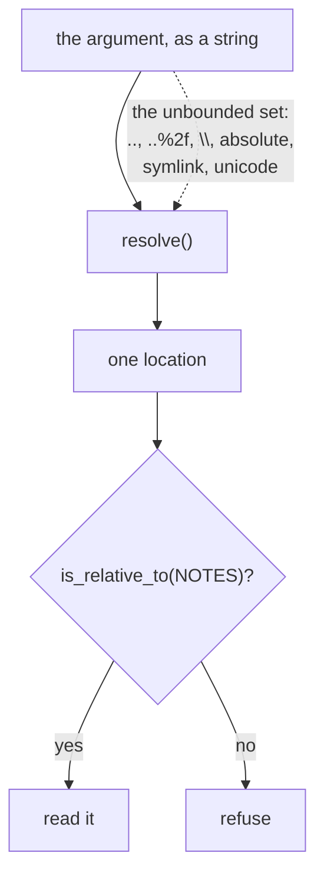

# 4.2 — A path is a sentence about the whole disk

## One-line answer

A tool that takes a path can read anything the process can read, and the only check that survives
every spelling is to resolve the path first and ask whether the result is inside the directory you
meant.

## The story

A courier is given an address written as *"the house behind the temple, near the water tank"*.

He finds it, because he knows the area. A different courier, on a different day, finds a different
house — also behind a temple, also near a tank, three streets away. Both of them followed the
address they were given. The address was not wrong; it was **not specific**, and the thing that made
it work the first time was knowledge that lived in the courier and not on the paper.

An address that only resolves correctly when the reader already knows the answer is not an address.
It is a hint.

## The idea in plain language

`read_note(path)` takes a string and joins it to the notes directory. That join is the whole
vulnerability, and it is worth being precise about why, because "path traversal" is a phrase people
recognise without being able to state.

A path is not a name. It is a **navigation instruction**, evaluated relative to somewhere, with
operators in it. `..` means *go up*. A leading separator means *start from the root*. On Windows a
drive letter means *start from that volume*. Python's `pathlib` implements those operators
faithfully, which is what you want from a path library and is exactly why the join is unsafe:

```python
NOTES / "../private/payroll.csv"
```

is not a note called `../private/payroll.csv`. It is the instruction *from the notes directory, go
up one, then into private, then payroll.csv*, and it is a perfectly ordinary thing for a path
library to do.

So a permission that says *the desk may read notes* has, through this argument, granted **every file
the process can open**. Not every file on the disk — the operating system still applies its own
rules, and that matters — but everything the service's own account can reach, which on a typical
deployment includes configuration, logs, other tenants' data and the `.env` file that holds the
keys.

The check that works has one idea in it: **resolve, then compare.** Do not reason about the string.
Turn the string into an actual location, and ask whether that location is inside the directory you
meant. Every spelling — relative, absolute, encoded, mixed separators — collapses to the same
location, so a check on the location covers all of them at once, including the spellings you have
not heard of.

The property being restored has a name from [Day 40](../../../day-40-filtering-and-allowlists/LESSON.md)'s
paper: **complete mediation**, from *The protection of information in computer systems*. Every
access is checked, at the point of access, against the thing that is actually being accessed — not
against a description of it that was written earlier.

## Why Sutra needs it

`read_note` is on the desk's allowlist and will stay there: looking up a knowledge-base article is
what the research stage does. It survived section 3 precisely because it is necessary, which makes
it the clearest case in the day for argument-level permission.

It also matters more than it looks, because of where the desk's other days put things. The archive
is on disk. Day 61's checkpoints are on disk. `.env` is on disk, and Day 0 put it there
deliberately with a `.gitignore` beside it. A file-reading tool with an unconstrained path is a
credential-reading tool, and that is the shortest route from *a support agent read a ticket* to *the
provider keys are gone*.

## The mechanism

The naive tool is one line of work:

```python
def read_note_naive(path: str) -> dict:
    """Read a knowledge-base note by path."""
    try:
        return {"text": (NOTES / path).read_text(encoding="utf-8").strip()}
    except OSError as exc:
        return {"error": type(exc).__name__}
```

**Line by line:**

- `NOTES / path` is the join, and it is where the authority leaks. `pathlib` will happily evaluate
  `..` segments; that is its job.
- `except OSError` catches a missing file and returns a structured error rather than raising. It is
  good practice and it is irrelevant here — the attack does not produce an error, it produces a
  file.
- `.strip()` is cosmetic, so the printed output fits on a line.

```bash
cd days/day-68-least-privilege-tools/lab
uv run python escape.py
```

**Line by line:**

- No flag runs the naive reader over the four candidate arguments from
  [4.1](4.1-the-tool-is-allowed-the-argument-is-not.md).
- The fourth candidate is built at runtime from `Path(__file__)`, so it is a genuine absolute path on
  the machine the script runs on rather than a string that only works here.

Measured on 2026-09-06:

```text
tool: read_note_naive

'kb-220.md'
  {'text': 'KB-220: set SameSite=None and Secure on the session cookie.'}
'../private/payroll.csv'
  {'text': 'name,monthly\nops-lead,182000'}
'..\\private\\payroll.csv'
  {'text': 'name,monthly\nops-lead,182000'}
'...ivilege-tools\\lab\\state\\private\\payroll.csv'
  {'text': 'name,monthly\nops-lead,182000'}
```

Three different strings, one file, and the file is a payroll table that no ticket has ever mentioned.

The fix is one line, and it is worth reading against the failed version from
[4.1](4.1-the-tool-is-allowed-the-argument-is-not.md):

```python
def read_note_fenced(path: str) -> dict:
    """Read a knowledge-base note by path, refusing anything outside the notes directory."""
    target = (NOTES / path).resolve()
    if not target.is_relative_to(NOTES.resolve()):
        return {"error": "outside the notes directory"}
    try:
        return {"text": target.read_text(encoding="utf-8").strip()}
    except OSError as exc:
        return {"error": type(exc).__name__}
```

**Line by line:**

- `.resolve()` is the whole fix. It evaluates every `..`, follows symbolic links, normalises
  separators and makes the path absolute. After this line there is no spelling left to be clever
  about — there is a location.
- `NOTES.resolve()` resolves the *fence* too. Skipping this is the classic mistake: if the notes
  directory is itself reached through a link, an unresolved fence and a resolved target will never
  match and every legitimate read fails, so somebody deletes the check.
- `is_relative_to` asks the containment question directly, and it is a path-component comparison
  rather than a string prefix. That distinction matters: a naive `str(target).startswith(str(NOTES))`
  would accept a sibling directory called `notes-archive`, because its name starts with the same
  characters.
- The refusal message names the rule, not the path. It says nothing about whether the file exists.

```bash
uv run python escape.py --fenced
```

**Line by line:**

- Same four candidates, same script, one different function. Nothing else changes, so the difference
  in output belongs to `resolve()` and `is_relative_to` alone.

```text
tool: read_note_fenced

'kb-220.md'
  {'text': 'KB-220: set SameSite=None and Secure on the session cookie.'}
'../private/payroll.csv'
  {'error': 'outside the notes directory'}
'..\\private\\payroll.csv'
  {'error': 'outside the notes directory'}
'...ivilege-tools\\lab\\state\\private\\payroll.csv'
  {'error': 'outside the notes directory'}
```

The legitimate note still reads. The three escapes stop, and they stop for the same reason, which is
the property that makes this check worth trusting: it did not need to recognise them individually.



Every arrow on the dotted line arrives at the same resolved location, which is why one comparison
covers them all.

## When it breaks

Three ways, and the third is the one that gets past review.

**The fence is not resolved.** `target.is_relative_to(NOTES)` with an unresolved `NOTES` compares an
absolute path to a possibly-relative one and answers `False` for everything, including good reads.
The symptom is that the tool stops working, somebody removes the check under time pressure, and the
removal is not reverted.

**The check runs and the read does not use its result.** A validator that returns a boolean, followed
by a read that re-joins the original string, checks one path and opens another. This is
time-of-check-to-time-of-use, and Day 64 met it around approvals. The version here is prevented by
construction: `read_note_fenced` reads `target`, the resolved object it checked, and never touches
`path` again after line one.

**The file is created between the check and the read.** `resolve()` follows links *now*. On a
directory an attacker can write to, a name that resolved inside the fence at check time can be
replaced by a link pointing outside it before the read. Sutra's notes directory is not writable by
anybody who can send a ticket, so this does not apply here — but it is the reason production systems
open the file first and check the *file descriptor*, rather than checking a name and then opening
it.

## In production

**What a professional writes instead.** They do not accept a path at all. The tool takes a note
**id** — `read_note(note_id: str)` — and an internal table maps ids to files. Then the argument space
is the set of ids that exist, the traversal question never arises, and the check is a dictionary
lookup that cannot be spelled around. This is
[4.1](4.1-the-tool-is-allowed-the-argument-is-not.md)'s first remedy rather than its third, and it
is available far more often than people assume: most path arguments in agent tools exist because a
path was convenient for the developer, not because the caller genuinely needs to name a location.

**What degrades at scale.** The fenced directory grows and stops being one directory. Notes move to
per-tenant folders, an archive volume appears, a cache directory joins the list, and the single
`is_relative_to` becomes a loop over roots. Each root is a place the check can be wrong, and the day
somebody adds a root that happens to contain a symlink farm, the check is still passing.

**The failure mode that only appears with real traffic.** Real note names contain the things nobody
tests: spaces, non-ASCII characters, a customer's ticket reference pasted in with a trailing
newline. Fences written as string tests reject those and get loosened, one exception at a time,
until the loosening has an `if "kb-" in path` in it and the check means nothing. A resolve-and-
compare fence has no reason to reject any of them, which is a second, quieter argument for it: it
does not create pressure to weaken itself.

**The review comment a senior engineer leaves:** *"This tool takes a path from the model. Two
questions: does it need to take a path at all — could it take an id? And if it must, resolve both
the target and the root before comparing, and read the object you resolved rather than re-joining
the string. Also, this process can read `.env`; that is the real blast radius of this parameter."*

**The interview question:** *"Your agent has a file-reading tool. How do you stop it reading
`/etc/passwd`?"* The answer that shows the general shape: *"First I try to remove the parameter — a
note id and an internal mapping, so there is no path to traverse. Where a path is genuinely needed,
I resolve it and ask `is_relative_to` against a resolved root, and I read the resolved object rather
than re-joining the original string. The reason it has to be resolve-and-compare rather than a
blocklist is that the spellings are unbounded: I measured three different strings — a relative
escape, a backslash version and an absolute path — all reaching the same payroll file, and a
`'..' in path` test only catches two of them. The check that works never looks at the string at
all."*

## Check yourself

```bash
cd days/day-68-least-privilege-tools/lab
uv run python escape.py
uv run python escape.py --fenced
```

Add a fifth candidate to `CANDIDATES` in `escape.py` that reaches `state/private/payroll.csv` by a
spelling not already in the list. Run both arms. If the fenced arm lets it through, you have found
something worth writing down; if it does not, say in one sentence why it could not have.

**Out loud, without scrolling up:** say why a blocklist of path shapes cannot work, and give the two
things that must be resolved before the comparison.

**Next:** [4.3 — The recipient who is not the customer](4.3-the-recipient-who-is-not-the-customer.md).
