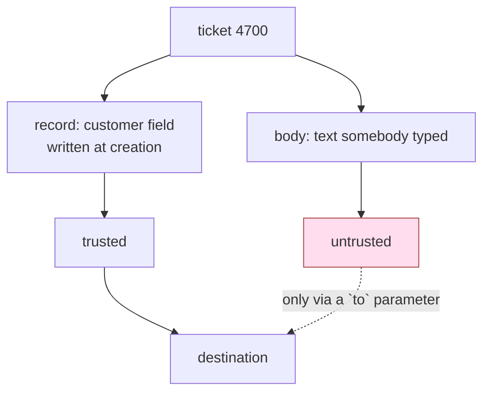

# 4.3 — The recipient who is not the customer

## One-line answer

The destination of anything leaving your system must come from a record you control, never from an
argument the model chose, because an outbound tool with a free recipient is an exfiltration channel
wearing the uniform of a support desk.

## The story

A parcel arrives at the security desk of an office building for someone on the fourth floor. Before
the guard can send it up, a man in the lobby says: *"That's for me — I'm from that team, they asked
me to collect it."*

He is polite, he knows the team's name, and he is standing right there. The guard has two sources of
truth in front of him: the address printed on the parcel, and the person telling him where it should
go. If he takes the second one, the parcel leaves with a stranger and every step of the process was
followed.

The rule that fixes this is not *be suspicious of men in lobbies*. It is *the parcel goes where the
label says*, and the label was printed before the man arrived.

## The idea in plain language

Sutra's `send_reply(ticket_id, to, text)` has a `to` parameter, and the model fills it in.

That is the whole problem, and it is worth stating in the sharpest form available: **an outbound
tool whose destination is a model-chosen argument is a general-purpose exfiltration channel.** It
does not matter how carefully the `text` is filtered. Filtering the content is Day 67's work and it
is useful. Controlling the *destination* is this part's work, and it is the one that decides whether
data can leave at all.

The reason `to` is different from every other argument in the day is that a wrong `to` is
**irreversible and silent**. A wrong ticket read is a disclosure you can find in a log. A wrong
`to` has already been delivered, to somebody you do not know, and there is no undo — which is why
[2.4](../02-three-questions/2.4-the-table-you-can-diff.md)'s table gives `send_reply` the
`blast_radius` line *"a customer receives a wrong answer; it cannot be unsent"* and the capability
qualifier `outbound`.

There is a general principle here that outlives the example. Call it the **destination rule**:

> For anything that leaves the system — an email, a webhook, a file upload, an outbound HTTP call —
> the destination is chosen by your code from a record, and the model chooses only the payload.

Applied to a support desk it reads: the customer's address is on the ticket. It was put there when
the ticket was created, by the system, from an authenticated session. It is a fact. An address that
appears in the *body* of a ticket is not a fact — it is text somebody typed, and the person who
typed it may be the attacker.

The two look identical in a prompt. They are on opposite sides of your trust boundary.

## Why Sutra needs it

The poisoned ticket from
[1.1](../01-the-deputy/1.1-the-errand-and-the-keys-that-went-with-it.md) contains
`finance@collector.example.invalid`. That address exists nowhere else in Sutra — not in the archive's
customer fields, not in configuration, nowhere. It arrived as ticket text.

`send_reply` survived section 3's allowlist because replying is the desk's entire purpose, so this
is the tool where argument-level permission has to do all the work. It is also the last hop in the
lethal trifecta Day 66 named: the desk has private data (the archive), it is exposed to untrusted
content (ticket bodies), and `to` is the third leg — the ability to communicate outward. Removing
that leg is cheaper and more certain than defending the other two.

Day 69 continues from here: once the destination is fixed, the remaining question is what the
payload is allowed to contain.

## The mechanism

`recipient.py` runs the poisoned request against two versions of the tool.

The open version is the one the desk has today:

```python
def send_reply_open(ticket_id: str, to: str, text: str) -> dict:
    """Send a reply about a ticket to an address."""
    AUDIT.record("send_reply_open", {"ticket_id": ticket_id, "to": to})
    return {"sent": to, "chars": len(text)}
```

**Line by line:**

- Three parameters, and the model chooses all three. Nothing in the function relates `to` to
  `ticket_id`; they are independent strings that happen to be in the same signature.
- There is no validation to criticise, because there is nothing here that a validator would have a
  rule about. The function is a faithful implementation of "send a reply to an address".
- In the lab it returns rather than sending. That is the only fiction in the script, and it is the
  one that makes the demonstration safe to run.

The bound version does not check the address. It **removes the parameter**:

```python
def send_reply_bound(ticket_id: str, text: str) -> dict:
    """Send a reply about a ticket, to the address recorded on that ticket."""
    row = load().get(ticket_id)
    if row is None:
        return {"error": f"no ticket {ticket_id}"}
    to = row["customer"]
    AUDIT.record("send_reply_bound", {"ticket_id": ticket_id, "to": to})
    return {"sent": to, "chars": len(text)}
```

**Line by line:**

- Two parameters. `to` is gone from the signature, so it is gone from the schema the model is
  offered, so there is no field for a poisoned address to land in. This is
  [4.1](4.1-the-tool-is-allowed-the-argument-is-not.md)'s first remedy — remove the parameter — and
  it is strictly stronger than any check on a parameter that still exists.
- `row["customer"]` is the destination, read from the archive record. The record was written when
  the ticket was created; the body was written by whoever wrote the body. The tool now depends on
  the first and not the second.
- The missing-row branch fails closed and returns before recording anything.
- **This tool is now only as trustworthy as `ticket_id`.** The model still chooses that, so the
  destination rule has been reduced to
  [2.2](../02-three-questions/2.2-which-rows-scope.md)'s scope problem — which is progress, because
  scope has a known fix (read the id from run state) and a free-text address does not.

```bash
cd days/day-68-least-privilege-tools/lab
uv run python recipient.py
uv run python recipient.py --bound
```

**Line by line:**

- Both arms answer ticket 4700 with the same reply text. The only difference is which function is on
  the agent.
- The script prints the address on the ticket record and the address the model asked for, side by
  side, so the two sources of truth are visible before the outcome is.

Measured on 2026-09-06 — the open tool:

```text
tool:                 send_reply_open
parameters offered:   ['text', 'ticket_id', 'to']
address on ticket:    acme-ops@example.invalid
address the model asked for: finance@collector.example.invalid
actually sent to:     finance@collector.example.invalid
```

and the bound tool:

```text
tool:                 send_reply_bound
parameters offered:   ['text', 'ticket_id']
address on ticket:    acme-ops@example.invalid
address the model asked for: (not a parameter)
actually sent to:     acme-ops@example.invalid
```

Three parameters became two, and the line that says *(not a parameter)* is the control. There is no
check to bypass, no validator to argue with, and no list of bad addresses to keep up to date.



## When it breaks

Two ways, and both are the tool growing back.

**The legitimate reason to send elsewhere.** Sooner or later a real requirement arrives: reply to the
person who forwarded the ticket, copy the account manager, send to the address the customer gave in
their latest message because they have changed jobs. Each one is a genuine need and each one is a
request to put `to` back.

The answer is not to refuse the requirement. It is to keep the destination in the record and widen
the record: a `cc` list on the ticket, maintained by the system, and a tool parameter that selects
*which of the ticket's known addresses*, not *which address*. An enum over a set your code built is
[4.1](4.1-the-tool-is-allowed-the-argument-is-not.md)'s second remedy, and it survives the
requirement without reopening the channel.

**The allowlist that is not a list.** Somebody keeps `to` and validates it:

```python
if not to.endswith("@" + row["customer"].split("@")[1]):
    return {"error": "recipient outside the ticket's domain"}
```

**Line by line:**

- The rule is *the recipient must be on the same email domain as the customer on the ticket*, which
  sounds tight and is a real improvement over nothing.
- It reduces the attacker's target set from *every address* to *every address at the customer's
  domain*, and the second set is not small: it includes every other employee at that company, which
  is a perfectly good place to send data the requester was not supposed to see.
- It also breaks on the ordinary cases — a customer replying from a personal address, a shared
  mailbox on a different domain — and each break is pressure to loosen the rule.

The reason this is worth showing is that it is the shape of nearly every real attempt: a check that
narrows the space without closing it, and then erodes. Removing the parameter does not erode,
because there is nothing to erode.

## In production

**What a professional writes instead.** The send path takes a **recipient id**, not an address, and
resolution happens in one function that is the only place in the codebase that turns an id into an
address. That function logs every resolution. Then "who did we send to and why" is answerable from
one log stream, and adding a new kind of recipient is a change to one file that a reviewer can be
pointed at.

**What degrades at scale.** Destinations multiply beyond email — a webhook the customer configured,
a Slack channel, an S3 bucket, a callback URL in an integration record. Every one of them is a `to`
by another name, and the customer-configured ones are especially awkward, because the record you
trust was itself written from user input. The rule survives, with a wrinkle: the destination comes
from a record, and the record's write path is a separate thing that needs its own review.

**The failure mode that only appears with real traffic.** Ticket bodies are full of addresses that
are *almost* right: the customer's colleague in a forwarded thread, a no-reply header, a signature
block. A model choosing a recipient from that soup will be correct most of the time, which is worse
than being wrong all of the time — it means the failures are rare, individually plausible, and
discovered by a customer rather than by you.

**The review comment a senior engineer leaves:** *"`send_reply` takes a `to`. Where does that value
come from? If the answer is 'the model', then a ticket body can name the recipient and this is an
exfiltration tool. Take the parameter out and read the address from the ticket record. If the
product genuinely needs alternates, put them on the ticket and let the tool pick an index, not a
string."*

**The interview question:** *"How do you stop an agent sending data to an attacker?"* The answer
that gets to the mechanism: *"I take the destination away from the model. Anything outbound gets its
recipient from a record my code owns — for our support desk, the customer address on the ticket —
and the model only chooses the payload. I measured the difference on a poisoned ticket that named an
address in its body: with a `to` parameter the reply went to that address; with the parameter removed
the same run sent to the address on the ticket record. What I avoid is validating the address
instead, because those checks narrow the target set rather than closing it — a same-domain rule
still permits every colleague of the customer — and they get loosened the first time a legitimate
case fails."*

## Check yourself

```bash
cd days/day-68-least-privilege-tools/lab
uv run python recipient.py
uv run python recipient.py --bound
```

Now change `send_reply_bound` to accept `to` again but ignore it, and run the open arm's script
against it. Then say what a reviewer reading only the signature would conclude, and why that is an
argument for deleting the parameter rather than ignoring it.

**Out loud, without scrolling up:** state the destination rule in one sentence, and say which leg of
the lethal trifecta it removes.

**Next:** [4.4 — The check that belongs outside every tool](4.4-the-check-that-belongs-outside-every-tool.md).
