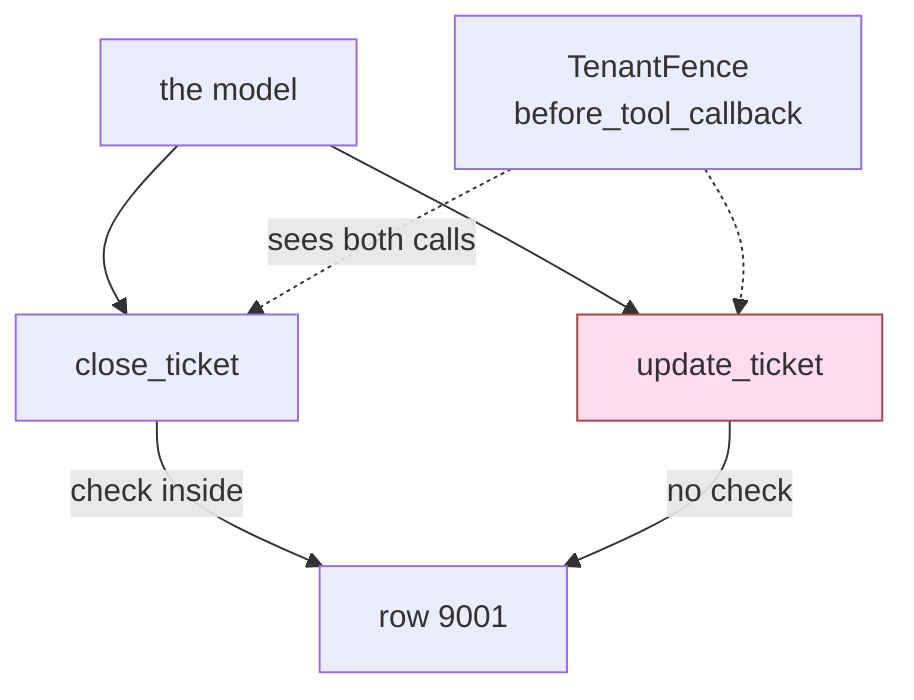

# 4.4 — The check that belongs outside every tool

## One-line answer

A permission check written inside the tool it guards protects that tool and nothing else, so the
rule has to stand outside every tool — in a `before_tool_callback` or a plugin — where it sees every
call instead of one.

## The story

The police have put a barricade on the road into town. A rope across the lane, two constables, and
every car slows to a stop while somebody leans in and looks at the papers.

A little before the rope, a service lane peels off to the left. It runs behind the petrol pump, past
the godowns, and joins the same road again on the far side of the barricade. It was laid so that
lorries could reach the warehouses without going through the middle of town, and everybody who lives
here takes it without thinking about it.

Nothing about the barricade is pretend. The constables are real, the papers are read, and a car that
comes up the main road is genuinely checked. What the check is attached to is *that stretch of tar*,
and there are two stretches of tar into the same town.

## The idea in plain language

[4.3](4.3-the-recipient-who-is-not-the-customer.md) fixed one argument by deleting it. That is the
best fix available and it is not always available. *"Only tickets belonging to the caller's tenant"*
is a rule about a **value**, and a value has to arrive before anybody can judge it, so this rule
cannot be typed away. It is [4.1](4.1-the-tool-is-allowed-the-argument-is-not.md)'s third and
weakest remedy — accept the argument and check it — and 4.1 said why it is the weakest: it is code
somebody has to write, remember and **place correctly**. This part is about the placing.

The natural place is inside the tool, and it is natural for good reasons. You are already editing
that function. You can run it and watch the refusal happen. A reviewer reading the function sees the
check sitting next to the effect it guards, which is exactly where a reviewer wants it.

And the check you have written is attached to a **route**, while the permission you meant is about a
**row**. Those come apart the moment there are two routes to the same row.

| what you wrote | what it means |
| --- | --- |
| a check inside `close_ticket` | *nobody may close another tenant's ticket **through this function*** |
| the permission you meant | *nobody may change another tenant's ticket* |

The second sentence is the one in your permission table. The first one is the one running.

A word for the fix, because you will need it in a design review: a **chokepoint** is a single place
that every call has to pass through, so a rule written there cannot be gone around. Day 13's
[3.1 — The chokepoint restored](../../../day-13-callbacks-four-doors/parts/03-the-tool-doors/3.1-the-chokepoint-restored.md)
built one for the first time; here it is doing security work rather than logging.

There are three places a check can stand, and ADK provides the two above the tool. What separates
them is simply how many tools each one sees:

| where the check stands | how many tools it covers | how many places you must get right |
| --- | --- | --- |
| inside one tool | that one | one per tool, forever |
| the agent's `before_tool_callback` | every tool on that agent | one per agent |
| a plugin on the app | every tool on every agent | one |

A **`before_tool_callback`** is a function ADK calls just before it runs a tool, handing it the tool,
the arguments and the caller's context; Day 13 introduced the six callback doors and this is one of
them. A **plugin** is the same set of doors moved up a layer, registered once on the runner instead
of on each agent — [Day 14](../../../day-14-plugins-one-layer-up/LESSON.md) built that, and
[2.3](../02-three-questions/2.3-how-many-times-rate.md)'s `RateFence` is Day 68's first working
example of one. Both stop the tool by **returning a dict**, which becomes the tool's result.

The counting argument in the right-hand column is the whole case. A rule inside a tool is correct
today and has to be re-decided by every future author of every future tool. A rule at a chokepoint
is decided once, and a new tool arrives already covered by it.

## Why Sutra needs it

The desk has already lived this. [1.2](../01-the-deputy/1.2-a-tool-does-its-job-not-your-intention.md)'s
*When it breaks* showed the tenant check being added to `close_ticket` and called it "a genuine
improvement and also a trap", then deferred the argument to section 4. Since then the desk grew a
second way to change a ticket: `update_ticket`, written later for a field the close tool does not
cover. It is an ordinary, useful tool. It writes the same rows.

[2.4](../02-three-questions/2.4-the-table-you-can-diff.md) gave every tool a `scope` sentence in
`permissions.json` — *which rows may this tool touch*. If each of those sentences is enforced inside
its own function, the table has five implementations scattered across five files and no single place
a reviewer can compare it against. 2.4's fourth property was *"it can be enforced"*: the same file
the reviewer read is the file the fence loads. A fence is what makes that sentence true.

[3.1](../03-absent-not-forbidden/3.1-deny-by-default-at-the-toolset.md)'s toolset filter cannot do
this job, and it is worth being precise about why. `get_tools` runs when the tool list is built,
before the model has chosen anything, so a filter can remove `update_ticket` from the desk entirely
but cannot allow it for ticket 4700 and refuse it for 9001. Filtering decides *which tools*; a fence
decides *which calls*. They are different controls at different moments, and the day needs both.

Forward: [5.1](../05-failure-lab/5.1-the-check-inside-the-door-it-guards.md) is the failure lab for
this exact miss, driven from the attacker's side rather than the author's, and
[6.2](../06-in-production/6.2-grant-is-a-claim-use-is-evidence.md) reuses the same layer to record
what was actually used.

## The mechanism

`where.py` puts the two placements side by side. Both arms run the identical two requests against
the identical two tools; the only thing that moves is where the rule stands.

Here are the two tools, as the desk has them:

```python
def close_ticket(ticket_id: str, tool_context: ToolContext) -> dict:
    """Mark one ticket closed, if it belongs to the caller's tenant."""
    AUDIT.record("close_ticket", {"ticket_id": ticket_id})
    if _tenant(ticket_id) != TENANT_OF.get(tool_context.user_id, ""):
        return {"error": "not your ticket"}
    rows = load()
    rows[ticket_id]["status"] = "closed"
    save(rows)
    return {"closed": ticket_id}


def update_ticket(ticket_id: str, field: str, value: str) -> dict:
    """Set any field on any ticket."""
    AUDIT.record("update_ticket", {"ticket_id": ticket_id, "field": field, "value": value})
    rows = load()
    if ticket_id not in rows:
        return {"error": f"no ticket {ticket_id}"}
    rows[ticket_id][field] = value
    save(rows)
    return {"updated": ticket_id, field: value}
```

**Line by line:**

- `close_ticket` carries the check from 1.2, unchanged and correct. `tool_context` is injected by the
  runtime and stripped from the schema the model sees, so the caller's identity cannot be forged —
  that is [1.3](../01-the-deputy/1.3-whose-permissions-is-the-tool-using.md)'s measurement, and it
  is why this check is worth having at all.
- `_tenant(ticket_id)` reads the row's owner; `TENANT_OF.get(...)` reads the caller's. Unequal means
  refuse, and the refusal is a returned dict rather than an exception — the reason for that choice
  is [4.5](4.5-what-a-refusal-must-not-tell-you.md).
- `update_ticket` has no `tool_context` parameter, so it cannot ask who is calling even if it wanted
  to. Nobody removed the check from it. There was never a check in it, because it was written later,
  by somebody solving a different problem.
- `if ticket_id not in rows` is again the existence test, not the entitlement test. It is satisfied
  by ticket 9001, exactly as 1.2 warned.
- `rows[ticket_id][field] = value` is the effect. `close_ticket` sets `status` to `"closed"` through
  a guarded path; this line sets any field to any value through an unguarded one, and both end in
  the same `save(rows)`.

The same rule, written once, outside both:

```python
class TenantFence(BasePlugin):
    """One rule, outside every tool: no tool may name a ticket the caller does not own.

    `before_tool_callback` returning a dict stops the tool and returns that dict as its result -
    verified against the installed `google-adk==2.7.1` docstring and by running it, below.
    """

    async def before_tool_callback(
        self, *, tool: BaseTool, tool_args: dict[str, Any], tool_context: ToolContext
    ) -> dict[str, Any] | None:
        ticket_id = tool_args.get("ticket_id")
        if ticket_id and _tenant(ticket_id) != TENANT_OF.get(tool_context.user_id, ""):
            return {"error": f"denied: {tool.name} on a ticket outside your tenant"}
        return None
```

**Line by line:**

- `BasePlugin` and `before_tool_callback` are the ADK 2.x plugin surface, verified against
  `adk.dev/plugins/` on 2026-09-06 and against the installed `google-adk==2.7.1`, whose docstring
  reads *"If a dictionary is returned, it will stop the tool execution and return this response
  immediately."*
- The hook is keyword-only (`*`) and receives three things: `tool`, so the rule can name what it
  refused; `tool_args`, the arguments **after** the model chose them; and `tool_context`, the same
  trustworthy caller identity `close_ticket` used. Everything the tool-side check had, one layer up.
- `tool_args.get("ticket_id")` reads the argument by name out of a plain dict. The fence does not
  know which tools exist and does not need to — it asks every call the same question.
- `if ticket_id and ...` skips the rule when the call names no ticket, so a tool like `read_note` is
  not accidentally refused. That leniency is deliberate and it has a cost, measured in *When it
  breaks* below.
- The message names `tool.name`, so the refusal says which route was blocked. Compare that with
  `close_ticket`'s bare `"not your ticket"`: this message is more helpful to an operator and more
  informative to an attacker, which is [4.5](4.5-what-a-refusal-must-not-tell-you.md)'s subject.
- `return None` means *no opinion*, and the call proceeds. A fence that returned a dict by accident
  would refuse everything, which is loud; a fence that returns `None` by accident refuses nothing,
  which is silent. Fail-closed and fail-open, in one method.

```bash
cd days/day-68-least-privilege-tools/lab
uv run python where.py
uv run python where.py --plugin
```

**Line by line:**

- No flag passes no plugins to the runner at all, so the only check running is the one inside
  `close_ticket`.
- `--plugin` passes `[TenantFence("fence")]` to the runner. The tools, the requests, the caller and
  the archive are byte-for-byte the same in both arms — `fresh()` rebuilds the store before each
  request — so any difference in the output is attributable entirely to where the check stands.
- The two requests are the two routes: `close_ticket(ticket_id="9001")` and
  `update_ticket(ticket_id="9001", field="status", value="closed")`. Both aim at one row that
  belongs to another tenant, and both express the same intention.

Measured on 2026-09-06, the check inside `close_ticket`:

```text
check lives: inside close_ticket

  close_ticket() -> {'error': 'not your ticket'}
                ticket 9001 status afterwards: open
 update_ticket(status) -> {'updated': '9001', 'status': 'closed'}
                ticket 9001 status afterwards: closed
```

The first request is the check working. The second is the same forbidden outcome, reached down the
service lane. Ticket 9001 ends up closed, it belongs to `borden`, the caller belongs to `acme`, and
the tenant check ran correctly and refused correctly one request earlier.

The same rule as a `before_tool_callback`:

```text
check lives: in a plugin, outside every tool

  close_ticket() -> {'error': 'denied: close_ticket on a ticket outside your tenant'}
                ticket 9001 status afterwards: open
 update_ticket(status) -> {'error': 'denied: update_ticket on a ticket outside your tenant'}
                ticket 9001 status afterwards: open
```

Both refused, and the ticket is still open at the end of both requests. Nothing about the tools
changed between the arms — `update_ticket` still contains no check, still has no `tool_context`, and
is still perfectly happy to write any field of any row. It was never asked.



The shaded box is the service lane. Adding a check to it would close this particular one; standing
the fence at the junction closes the ones nobody has built yet.

## When it breaks

A fence is not magic, and it fails in a way that is worth meeting now rather than in an incident:
**it recognises the protected resource by an argument name, and argument names are a convention.**

`tool_args.get("ticket_id")` is a string lookup in a dict. Rename `update_ticket`'s first parameter
from `ticket_id` to `id` — a change a reviewer would wave through, because the tool is called
`update_ticket` and `update_ticket(id=...)` reads perfectly well — change the request in `REQUESTS`
to match, and run the plugin arm again.

Measured on 2026-09-06:

```text
check lives: in a plugin, outside every tool

  close_ticket() -> {'error': 'denied: close_ticket on a ticket outside your tenant'}
                ticket 9001 status afterwards: open
 update_ticket(status) -> {'updated': '9001', 'status': 'closed'}
                ticket 9001 status afterwards: closed
```

That is the first arm's outcome with the second arm's fence in place. The rule ran. It ran on the
call. It looked for a key that was not there, found `None`, and returned `None`, which means *no
opinion* — and the leniency that keeps `read_note` working is the same leniency that waves this
call through.

So the coverage a chokepoint buys is real and its **matching** is not free. Three things follow, and
the third is the one that survives:

1. Making the fence fail closed — refuse any call it cannot classify — breaks every tool that
   legitimately names no ticket, starting with `read_note`.
2. Guessing at more names (`id`, `ticket`, `ticket_ids`) is
   [4.1](4.1-the-tool-is-allowed-the-argument-is-not.md)'s spelling trap wearing a different hat: a
   list of forms somebody has to keep complete.
3. The fence should not be guessing at all. The permission row already exists —
   [2.4](../02-three-questions/2.4-the-table-you-can-diff.md)'s table has a line per tool — so the
   row is where the answer belongs: *this tool names its ticket in the `id` argument*. Then a tool
   with no row is a tool the fence refuses outright, and a tool whose row lies about its parameter
   fails a test rather than a customer.

The general shape: a rule at a chokepoint covers everything that passes through it, and what it
covers is only as good as its ability to *recognise* what is passing. Coverage is structural.
Recognition is a contract, and contracts need tests.

## In production

**What a professional writes instead.** They write the check where you did, once, to see it work —
and then they move it. The shipped version is one policy object, loaded from the permission table,
registered on the app, refusing calls by row rather than by function. The tools go back to being
tools: `update_ticket` updates a ticket, and it contains no security code at all. That is worth
saying plainly, because it looks like the less careful design. It is the opposite. Security logic
scattered through business functions cannot be audited, cannot be tested as a unit, and is deleted
by whoever refactors the function next; a fence has one file, one test file and one owner.

**What degrades at scale — the fifth tool.** This is the failure with a schedule. The team ships
`close_ticket` with a check. It ships `update_ticket` and somebody remembers to add the check. It
ships `merge_tickets`, `bulk_reassign`, `export_tickets` — and the fifth one is written by somebody
who joined after the first four, in a hurry, by copying the third one, which happened to be the one
without the check. Nobody removed a control. The control simply never covered a route that did not
exist when it was written, and the number of routes only goes up. A per-tool check is a maintenance
obligation with no end date; a fence is a decision taken once.

**The failure mode that only appears with real traffic.** The unguarded route is almost never a
tool that sounds dangerous. It is a helper added for a support engineer, a background job that
reuses the same function with a service account, a retry path, an admin endpoint, a `dry_run=False`
parameter on something that was read-only in year one. Every one of them arrives with a good reason
and none of them arrives with a review of the tenant rule. You do not see this in error rates,
because nothing errors.

**The review comment a senior engineer leaves:** *"The tenant check is inside `close_ticket`. Grep
the repo for everything else that writes a ticket row and tell me how many of those have it. If the
answer is not 'all of them, enforced in one place', move the check to a `before_tool_callback` and
delete it from the tool. And say in the permission table which argument names the ticket, so the
fence is not guessing at parameter names."*

**The interview question:** *"You have written a permission check. Where does it go?"* The answer
that shows you have been burned: *"Not inside the tool. A check inside a tool guards that tool, and
a permission is about a resource — a ticket row — which usually has more than one tool reaching it.
I measured this on our support desk: the tenant check lived inside `close_ticket`, and a second tool
added later, `update_ticket`, closed another tenant's ticket in the same run. The identical rule as a
`before_tool_callback` refused both calls, with no change to either tool. What I watch for is how
the fence recognises the resource — ours reads `tool_args['ticket_id']`, so a tool that spells the
parameter `id` walks straight past it, and I verified that by renaming it. The fix is to declare the
resource argument in the permission table rather than guessing at names in the fence."*

## Check yourself

```bash
cd days/day-68-least-privilege-tools/lab
uv run python where.py
uv run python where.py --plugin
```

Now add a third tool to `where.py` — anything that writes a ticket row, `reopen_ticket` is fine —
put it on the agent, and add a request for it against ticket 9001. Run both arms without touching
either check. Write down which arm you had to edit to stay safe.

**Out loud, without scrolling up:** say why a check inside a tool is the natural thing to write, and
name the property it does not have.

**Next:** [4.5 — What a refusal must not tell you](4.5-what-a-refusal-must-not-tell-you.md).
