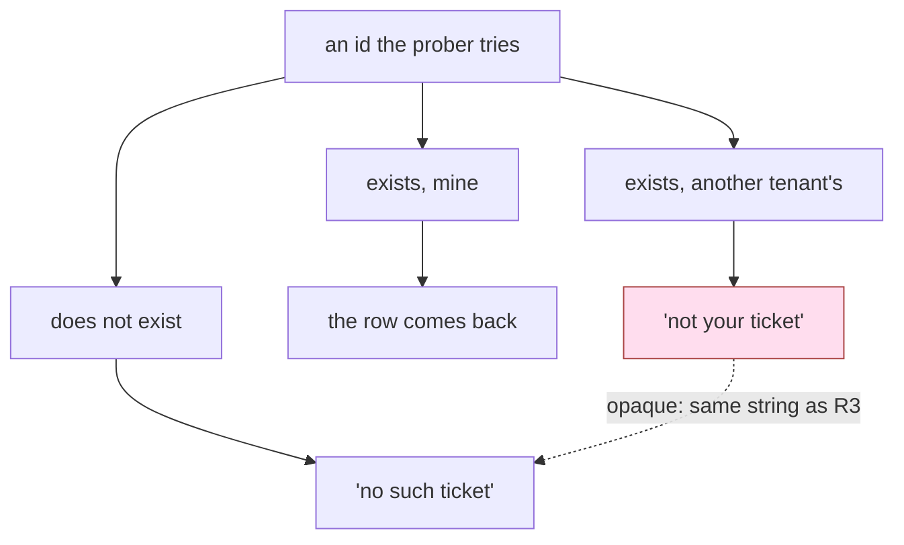

# 4.5 — What a refusal must not tell you

## One-line answer

A refusal is an answer, so a system that says *not yours* where it could have said *not there* has
built a lookup service for other people's records and called it an error message.

## The story

You ring an office and ask for somebody by name.

*"She's not in today, can I take a message?"* You say thank you and ring again tomorrow.

Or: *"Sorry, there's nobody here by that name."* You say thank you and cross the name off.

Both answers are polite, both are true, and the person answering the phone is doing their job well
in both cases. But notice what you now know, in each case, without being told anything and without
being let past. In the first, that name works there. In the second, it does not. Somebody with a list
of two hundred names and an afternoon could ring two hundred times and end up holding an accurate
staff list, having never once been given a single piece of information anybody would call
confidential.

## The idea in plain language

Every check in this day so far has ended in a refusal, and a refusal has been treated as the end of
the story. It is not. A refusal is an **output**, it goes back to whoever made the request, and the
requester chose the input. Anything about the system you can learn by choosing an input and reading
the output is information that has left the building.

Three terms, in plain words, because the rest of the part uses them:

- A **prober** is somebody making requests not to get an answer but to see how the system reacts. In
  Sutra's case that is whoever wrote the poisoned body of ticket 4700, and it costs them nothing to
  try a thousand ids.
- **Enumeration** is building a list of what exists by asking about things one at a time and noting
  which questions get a different reaction. It is how the caller in the story reconstructed a staff
  list from two hundred polite refusals.
- An **oracle** is any part of your system that reliably answers a yes/no question the caller was
  never supposed to be able to ask. An error message that distinguishes two cases is an oracle for
  the question *which case is this?*

Now put a support desk's two refusals side by side:

| the message | what a caller learns from it |
| --- | --- |
| `not your ticket` | this id exists, and it belongs to somebody who is not you |
| `no such ticket` | either it does not exist, or it does and is not yours — no way to tell |

The first row is not a leak of a ticket. It is worse in a quiet way: it is a leak about *every id
the caller cares to try*, one per request, and it is free. Ticket ids in most systems are short and
sequential, so *"which of these ten thousand ids are real tickets belonging to other customers"* is
answerable in ten thousand cheap requests by somebody who never once got past a check.

This is why [1.3](../01-the-deputy/1.3-whose-permissions-is-the-tool-using.md)'s scoped reader has
two `return` statements that are **deliberately identical** — a missing row and a forbidden row give
back the same string. That part promised the reason here, and this is it: the refusal must not
separate two cases the caller is not entitled to separate.

There is a second thing a refusal must not do, and 1.2 pointed here for it too. Look at the shape of
those refusals: `return {"error": ...}`, never `raise`. That is a deliberate choice with two
reasons. First, a policy decision is a **normal outcome**, not a malfunction: the caller asked
something the rules do not allow, the rules worked, and returning a value says so — the same argument
[2.3](../02-three-questions/2.3-how-many-times-rate.md) made about a rate refusal. Second, and more
practically, **an exception is written for engineers and it travels**. A raised error carries a type,
a message, a file path, a line number and very often the offending value, and that bundle ends up in
logs, in error trackers, in a traceback rendered on an error page, and sometimes straight into a
response body. [3.3](../03-absent-not-forbidden/3.3-what-happens-when-it-asks-anyway.md) measured
what an ungranted tool produces — `ValueError: Tool 'refund' not found.` — a string that cheerfully
names a tool the caller was never told existed.

> Raise for a **programming error**, because you want the stack. Return for a **policy decision**,
> because you want the wording.

## Why Sutra needs it

The desk's own code already disagrees with itself, and it is worth seeing rather than tidying away.
[1.3](../01-the-deputy/1.3-whose-permissions-is-the-tool-using.md)'s `read_ticket_scoped` refuses
with `no ticket 9001` whether the row is missing or another tenant's. Then
[4.4](4.4-the-check-that-belongs-outside-every-tool.md)'s fence, added one part ago and covering far
more tools, refuses with `denied: close_ticket on a ticket outside your tenant`. That message is
better for the operator reading a log and worse for everything else: it confirms the id is real, it
confirms the id belongs to another tenant, and it names the tool. Broadening the coverage of a check
is not the same as getting its wording right, and the two moved in opposite directions here.

The wider reason this lands on Day 68 rather than being a general web-security aside: an agent's
tool results are read by a language model that will then talk to the person who wrote the ticket.
Every error string a tool returns is one paraphrase away from being said out loud to whoever asked.
Day 69 takes up what a response may contain; this part is the narrower question of what a *refusal*
may contain, and it comes first because refusals feel harmless.

## The mechanism

`leak.py` takes the desk's archive and probes it the way a prober would: six ids, four that exist
and two that do not, one of the four belonging to another tenant. It counts how many of the six the
caller can correctly classify from the reply alone.

The talkative version is the one that gets written first, because each message answers the question
the author was thinking about at the time:

```python
def read_distinct(ticket_id: str, user_id: str) -> dict:
    """Refuse with the reason: not found and not yours are different messages."""
    row = load().get(ticket_id)
    if row is None:
        return {"error": "no such ticket"}
    if row["tenant"] != TENANT_OF.get(user_id, ""):
        return {"error": "not your ticket"}
    return row
```

**Line by line:**

- Two separate `if` statements, two separate messages. Read as ordinary code this is *better* than
  one combined branch: each condition has its own explanation, and a reader can see exactly which
  rule fired.
- `row is None` is the existence question. `row["tenant"] != ...` is the entitlement question. They
  are genuinely different questions internally, and the mistake is letting that internal difference
  reach the caller.
- Nothing here is a bug in the ordinary sense. Both refusals are accurate, both are polite, and both
  would pass a code review that was looking at correctness. This is
  [1.2](../01-the-deputy/1.2-a-tool-does-its-job-not-your-intention.md)'s lesson arriving one more
  time, at the output rather than the argument.

The quiet version merges the two conditions:

```python
def read_opaque(ticket_id: str, user_id: str) -> dict:
    """Refuse identically: a row you may not see is a row that is not there."""
    row = load().get(ticket_id)
    if row is None or row["tenant"] != TENANT_OF.get(user_id, ""):
        return {"error": "no such ticket"}
    return row
```

**Line by line:**

- One `if`, two conditions, one message. The `or` is the whole change, and it is the same change
  1.3 made by writing the same f-string in two places.
- The rule it encodes is worth memorising as a sentence: **a row you may not see is a row that is
  not there.** From outside, "hidden" and "absent" become the same state, which is exactly the
  distinction the caller has no right to.
- `row is None or ...` short-circuits, so the tenant comparison never runs on a missing row. That is
  ordinary Python and it is the seed of a real problem — the two paths do different amounts of work,
  which *In production* returns to.
- The docstring says what the function refuses to distinguish, not what it does. On a security-shaped
  function that is the more useful docstring, because the next person to edit it needs to know which
  property they must not break.

```bash
cd days/day-68-least-privilege-tools/lab
uv run python leak.py
uv run python leak.py --opaque
```

**Line by line:**

- Both arms probe the same six ids against the same archive as the same caller, `learner` of tenant
  `acme`. The only thing that changes is which function answers, so any difference in what the
  prober works out is attributable entirely to the wording of the refusals.
- The script's `deduced` column is the prober's reasoning, written out: it counts an id as classified
  when the reply pins it down, and as `cannot tell` when the reply is compatible with more than one
  state of the world.

Measured on 2026-09-06, the distinct messages:

```text
tool: read_distinct   (signed in as learner, tenant acme)

  4610  exists: True   says: (returned the ticket)  -> exists, mine
  4633  exists: True   says: (returned the ticket)  -> exists, mine
  4700  exists: True   says: (returned the ticket)  -> exists, mine
  9001  exists: True   says: not your ticket        -> exists, another tenant's
  5000  exists: False  says: no such ticket         -> cannot tell
  9999  exists: False  says: no such ticket         -> cannot tell

ids the desk should not know about: ['9001']
ids the prober could classify:      4 of 6
```

and the identical message for both:

```text
tool: read_opaque   (signed in as learner, tenant acme)

  4610  exists: True   says: (returned the ticket)  -> exists, mine
  4633  exists: True   says: (returned the ticket)  -> exists, mine
  4700  exists: True   says: (returned the ticket)  -> exists, mine
  9001  exists: True   says: no such ticket         -> cannot tell
  5000  exists: False  says: no such ticket         -> cannot tell
  9999  exists: False  says: no such ticket         -> cannot tell

ids the desk should not know about: ['9001']
ids the prober could classify:      3 of 6
```

Now be precise about what those two numbers are worth, because "4 of 6 became 3 of 6" invites both
an overclaim and a shrug.

**Exactly one row moved: 9001.** The other five are unchanged, and each is unchanged for a reason:

- 4610, 4633 and 4700 came back as full ticket rows in both arms. The prober learns they exist and
  are theirs — and that is the desk working, not a leak. These are their own tickets; the product's
  entire job is to hand them over.
- 5000 and 9999 were `cannot tell` in both arms, because a missing row is a missing row either way.
- 9001 exists and belongs to `borden`. The distinct version says so. The opaque version puts 9001 in
  the same bucket as 5000, and the prober cannot separate them.

So the opaque version does **not** stop a caller discovering which of their own ids exist, and it
does not stop them collecting a set of ids they cannot reach. What it stops is the one thing that
matters: splitting that set into *another customer's live records* and *empty space*. One bit per
id — and the reason a single bit deserves a part of its own is that the prober gets one for every id
they try, and ids are cheap. Six probes yielded one such bit here. Ten thousand probes against a
four-digit id space would yield a complete census of another tenant's tickets, obtained entirely
from refusals.



The shaded box is the only box that has to move. Merging it into its neighbour is the whole fix, and
it is one `or`.

## When it breaks

An opaque refusal is genuinely harder to run a support desk on, and pretending otherwise is how this
control gets reverted six months later by somebody with a good reason.

🎬 **The scene:** a customer rings in. *"Your assistant keeps telling me ticket 4680 does not exist,
and I am looking at it in my inbox."* Two things could be true — they mistyped the number, or the
ticket was raised under a different account — and the support engineer, reading the same transcript
the customer read, cannot tell which.

😬 **The naive fix:** put the reason back in the message, just a little — *"that ticket is not
associated with your account"* — because the support engineer cannot answer the customer otherwise.

💥 **Why it fails:** that sentence is `not your ticket` in a nicer suit. The prober reads it the same
way, and the oracle is back.

💡 **The insight:** the reason still has to exist somewhere; the only question is **who reads it**.
The caller gets one message; the log gets the truth; and the response carries a handle that ties the
two together.

Concretely, the desk's refusal grows one field:

```python
def read_opaque_with_ref(ticket_id: str, user_id: str) -> dict:
    """Refuse identically, and leave the reason where a support engineer can find it."""
    row = load().get(ticket_id)
    if row is not None and row["tenant"] == TENANT_OF.get(user_id, ""):
        return row
    ref = secrets.token_hex(4)
    reason = "no such row" if row is None else "cross-tenant"
    log.warning("refused ref=%s user=%s ticket=%s reason=%s", ref, user_id, ticket_id, reason)
    return {"error": "no such ticket", "ref": ref}
```

**Line by line:**

- The happy path is checked first and returns early, so there is exactly one refusal path and it
  cannot drift into two.
- `ref = secrets.token_hex(4)` is a **correlation id**: a short random handle, generated fresh on
  every refusal, whose only job is to be quoted back. It must be random rather than derived from the
  ticket id or the reason — a value computed from the inputs is an oracle again, because two callers
  comparing refusals could tell which ones matched.
- `reason` is the sentence the caller must not see. It is the only place in the system where the two
  cases are distinguished, and it is on the inside.
- `log.warning(...)` writes user, requested id and reason together. Splitting them across log lines
  is the same mistake at a different layer: three lines nobody can join is not an answer either.
- The response is `{"error": "no such ticket", "ref": ref}` — a fixed string plus a handle. The
  handle tells the prober nothing (it is random and changes every call) and tells the support
  engineer everything, because it is what they grep for.

The support conversation then works, and it works without moving the boundary: the customer reads out
the ref, the engineer searches the logs for it, sees `reason=cross-tenant` against a ticket belonging
to a different customer, and now knows the caller mistyped or was probing — a judgement a person
should be making, from data the caller never held.

Two more ways this gets undone, both worth recognising on sight:

1. **The reason moves into a different channel.** Same message, different HTTP status: `403` for
   forbidden and `404` for missing. Or the same message with a different response header, a different
   log level surfaced in a debug pane, a different retry hint. Every one of those is the oracle,
   re-spelled. If the caller can tell the two cases apart by *any* observable, the string was never
   the control.
2. **The refusal is right and a neighbouring surface is not.** The tool says `no such ticket` while
   a search endpoint returns a result count that includes rows the caller cannot open, or an export
   includes an id, or a webhook fires. Opacity is a property of the whole boundary, not of one
   function, and it is only as strong as the chattiest surface.

## In production

**What a professional writes instead.** They decide the refusal wording once, at the boundary,
rather than per function — the same argument [4.4](4.4-the-check-that-belongs-outside-every-tool.md)
made about the check itself, applied to the check's output. One helper produces every refusal, takes
the internal reason, logs it with a correlation id, and returns the single approved shape. Then the
property *"our refusals do not distinguish absent from forbidden"* is testable in one place, and it
is a test that can go red: probe a known other-tenant id and a known missing id and assert the two
responses are byte-identical.

**Timing survives an identical message.** Two code paths that return the same string do not
necessarily take the same route to it. `read_opaque` short-circuits on `row is None` and never runs
the tenant comparison; in a real system that gap is much wider than one comparison — a missing row is
a cache miss and a query returning nothing, while a forbidden row is fetched, deserialised, decorated
and only then thrown away. That difference is measurable from outside, and averaging over many
requests digs it out of the noise. The honest position is that constant-time responses are hard and
rarely achieved: what a professional actually does is make both paths do the same work (fetch first,
decide afterwards), then rely on the fact that a prober needs *many* samples to see through the
noise — which is what the next paragraph is about.

**The signal that actually detects probing is the refusal rate per caller.** No single refusal means
anything; customers mistype ids all day. What is not normal is one caller producing a long run of
refusals across many *distinct* ids in a short window, with a refusal ratio far above everybody
else's. That is the alert worth building, and it pairs with the rate grant from
[2.3](../02-three-questions/2.3-how-many-times-rate.md): opacity raises the cost of a single probe
by removing the information in it, and rate limiting plus refusal-rate alerting caps how many probes
anyone gets to run. Either alone is weak. A silent system with no limits is enumerable given
patience; a chatty system with tight limits leaks a bit per allowed request.

**The failure mode that only appears with an agent in the loop.** Your tool returns
`{"error": "no such ticket"}` and the model turns it into a sentence for the customer. If the
system prompt has told it that the desk serves multiple tenants, a helpful model will happily
write *"that ticket belongs to a different customer account"* — which is the leak, restored, in
prose you never wrote, on a path no test of your error strings covers. The refusal your caller
reads is generated text. What that means in practice is that the string is necessary and not
sufficient: the fact the model must not disclose has to be absent from what the model is given, not
merely absent from one field of it.

**The review comment a senior engineer leaves:** *"These two refusals return different strings. What
does a caller learn by trying ten thousand ids? Make them identical, put the real reason in the log
with a correlation id, and return the ref so support can still answer the phone. Then add the test
that asserts the forbidden response and the missing response are the same bytes — including the
status code."*

**The interview question:** *"Your API returns 403 for a record the user may not see and 404 for one
that does not exist. Is that a problem?"* The answer that shows you have thought past the happy path:
*"Yes — it is an enumeration oracle. The caller chooses the id and reads the reaction, so a different
reaction per case answers 'does this record exist' for every id they care to try, without ever
getting past the check. On our support desk I measured it: with distinct messages a prober classified
four of six probed ids, and the one that moved when we merged the messages was the live ticket
belonging to another tenant. I keep the reason, but I move it — identical response to the caller, the
real reason in the log with a random correlation id that the response carries, so support can still
answer the phone. And I do not stop at the string, because timing still separates the two paths and
because an agent will paraphrase my error into a sentence I never wrote. The control that actually
catches a prober is the refusal rate per caller."*

## Check yourself

```bash
cd days/day-68-least-privilege-tools/lab
uv run python leak.py
uv run python leak.py --opaque
```

Now go back to [4.4](4.4-the-check-that-belongs-outside-every-tool.md)'s `TenantFence` and read its
message again: `denied: close_ticket on a ticket outside your tenant`. Write the version of that
message you would ship, then write the log line that has to exist for the support desk to survive
your new wording. `TODO(me)`: leave the ref-generating helper unwritten until the hub's build brief
asks for it.

**Out loud, without scrolling up:** say what a refusal is allowed to tell the caller, where the real
reason goes instead, and why an identical message is still not the end of the job.

**Next:** [5.1 — The check inside the door it guards](../05-failure-lab/5.1-the-check-inside-the-door-it-guards.md).
