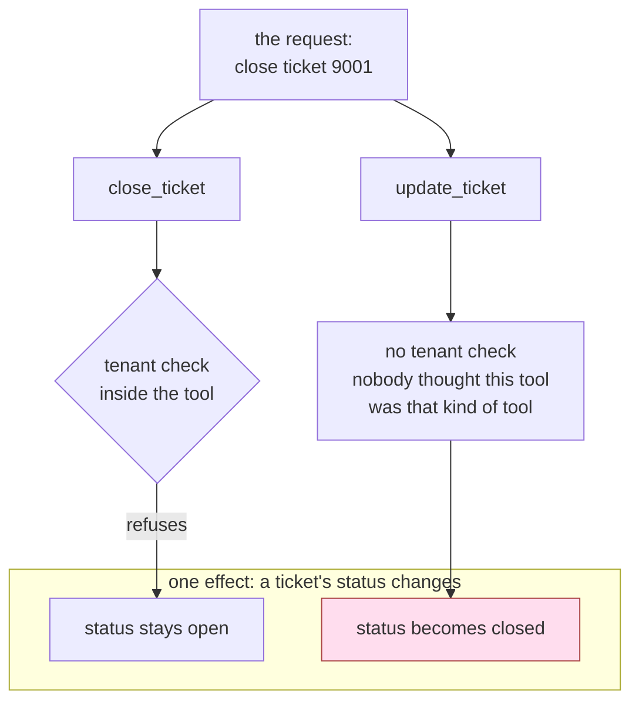

# 5.1 — The check inside the door it guards

## One-line answer

The tenant check inside `close_ticket` is correct, tested and reviewed, and it protects
`close_ticket` — so the same forbidden request walks through `update_ticket`, which reaches the same
effect and was never told about the rule.

## The story

The chemist on the main road has two counters.

At the back is the dispensing counter. The pharmacist stands there and reads every prescription: the
name, the date, whether the paper is signed, whether the strength written matches the packet on the
shelf behind her. She turns people away. She is not rude about it, and she is not careless about it
either — she has been doing this for years and she is good at it.

At the front, by the door, is the till and the open rack. Cough syrup, painkillers, bandages, the
things anybody may pick up. Whatever is on that rack goes over the counter and into a bag.

One afternoon somebody is turned away at the back. They walk the four steps to the front, take the
same tablets off the open rack — the shop keeps them in both places, because the front sells more of
them — pay, and leave.

Nothing the pharmacist did was wrong. She checked everything that came to her, and everything that
came to her was checked. The question nobody in that shop had ever written down is a different one:
*how many ways are there out of here with that packet in your hand, and is somebody standing at each
of them?*

## The idea in plain language

Two words have to be separated before this failure makes sense, because in a tutorial they look like
the same thing.

An **effect** is a change in the world the system can cause: *ticket 9001's status becomes closed*,
*money leaves the account*, *a mail arrives in a customer's inbox*. Effects are what a postmortem is
written about, and what the `blast_radius` column of the permission table in
[2.4](../02-three-questions/2.4-the-table-you-can-diff.md) describes.

A **tool** is one *way* of causing an effect. It is a function with a name and a signature.

The two are not in one-to-one correspondence, and that is the whole of this part. One effect usually
has several tools that reach it, because tools are written by different people at different times to
solve different problems, while the effect underneath stays the same.

Now put the check in. A check written inside a function is a property of *that function*. It runs
when that function runs and at no other moment. So:

> A check inside a tool is a control over the tool. It is a control over the **effect** only if
> that tool is the only way to reach it — and nothing in your codebase records that claim, or
> notices when it stops being true.

The uncomfortable part is that a reviewer will approve the checked tool, and will be right to. Look
at what is in front of them:

1. **The check is correct.** It reads the caller's tenant, compares it to the row's, refuses when
   they differ. It does exactly what it says.
2. **The test is green.** Somebody wrote `test_close_ticket_refuses_other_tenant`, and it passes. It
   will keep passing forever, including on the day the money leaves.
3. **The second door is not in the diff.** `update_ticket` was added in a different pull request,
   for a different reason — the desk needed to set a priority field the close tool does not cover —
   quite possibly by a different person in a different quarter. A reviewer reviews a change. The
   other tool is not part of the change and therefore not part of the review.

Which gives you the way to find this class of bug, and it is not "read the tools more carefully". It
is a change of axis:

**Enumerate the effects, then list the tools that reach each one.** The tool list is the thing you
already have — it is `ALL_TOOLS`, it is the agent's `tools=`, it is `tools/list` on an MCP server.
The effect list is the thing nobody has, and it is the one that makes the missing guard visible,
because it is written as *one line per outcome* and each line has a count next to it.

## Why Sutra needs it

[1.2](../01-the-deputy/1.2-a-tool-does-its-job-not-your-intention.md) ended by showing a tenant
check being added inside `close_ticket`, called it a genuine improvement and a trap, and pointed
here. This is the measurement it promised.

It matters for the artefact this day is building. The permission table has **one row per tool**, and
its `blast_radius` column is written **per effect**. That mismatch is not a flaw in the table — a
table has to be keyed on something you can enumerate mechanically — but it means the table cannot
tell you, on its own, that two rows describe the same harm. Two rows whose `blast_radius` sentences
are near-identical is the shape of this bug, and it is greppable.

[Day 63](../../../day-63-approval-gates-design/LESSON.md) classified Sutra's *actions* by blast
radius and reversibility, and Day 64 built the gate. A policy written at the action grain and
enforced at the tool grain leaks in exactly one place: the action with two tools. `refund` is the
action everybody watched. *A ticket's state changes* is the action nobody wrote down, and it has two
doors.

## The mechanism

`where.py` gives the desk two tools. One carries the tenant check. The other does not, because
nobody writing it thought it was that kind of tool.

```python
def close_ticket(ticket_id: str, tool_context: ToolContext) -> dict:
    """Mark one ticket closed, if it belongs to the caller's tenant."""
    AUDIT.record("close_ticket", {"ticket_id": ticket_id})
    if _tenant(ticket_id) != TENANT_OF.get(tool_context.user_id, ""):
        return {"error": "not your ticket"}
    rows = load()
    rows[ticket_id]["status"] = "closed"
    save(rows)
    return {"closed": ticket_id}


def update_ticket(ticket_id: str, field: str, value: str) -> dict:
    """Set any field on any ticket."""
    AUDIT.record("update_ticket", {"ticket_id": ticket_id, "field": field, "value": value})
    rows = load()
    if ticket_id not in rows:
        return {"error": f"no ticket {ticket_id}"}
    rows[ticket_id][field] = value
    save(rows)
    return {"updated": ticket_id, field: value}
```

**Line by line:**

- `tool_context: ToolContext` is injected by the runtime rather than chosen by the model, which is
  what makes `tool_context.user_id` trustworthy —
  [1.3](../01-the-deputy/1.3-whose-permissions-is-the-tool-using.md) is where that is measured. The
  caller cannot claim to be somebody else, so the check is not fooled; it is simply not consulted.
- `if _tenant(ticket_id) != TENANT_OF.get(tool_context.user_id, "")` is the rule, and it is a good
  one. `_tenant` reads the row off disk, so it compares the *stored* owner rather than anything the
  model said.
- `return {"error": "not your ticket"}` refuses without raising. Whether a refusal should be a
  returned dict or an exception, and how much it may say, is
  [4.5](../04-the-argument/4.5-what-a-refusal-must-not-tell-you.md)'s subject.
- `update_ticket` has a check too — `if ticket_id not in rows` — and it is the *existence* check
  from [1.2](../01-the-deputy/1.2-a-tool-does-its-job-not-your-intention.md), not an entitlement
  check. This is the honest version of how the bug happens: the second tool is not unguarded because
  somebody was lazy. It is guarded against the failure its author was thinking about.
- `rows[ticket_id][field] = value` is the line that makes it a second door. `field` is any string
  and `value` is any string, so `status` is one of the things it can set, and `closed` is one of the
  values it can set it to. Nothing about that was intended; it falls out of a generic signature.
- `AUDIT.record(...)` in both is the lab's bookkeeping from `_desk.py`, so *what actually ran* is
  evidence rather than a claim.

The two requests the script drives are the same forbidden intent, twice, expressed through different
tools:

```python
REQUESTS = [
    ("close_ticket", {"ticket_id": "9001"}),
    ("update_ticket", {"ticket_id": "9001", "field": "status", "value": "closed"}),
]
```

**Line by line:**

- Ticket `9001` belongs to tenant `borden`; the caller is `learner`, whose tenant is `acme`. Both
  requests are asking for the same thing: *close somebody else's ticket*.
- The second entry is not a cleverer attack. It is the same sentence with a different verb, and it
  is the sort of call a model produces on its own when the obvious tool has just refused it.
- Each request runs against a freshly rebuilt store, so the `closed` in the second result cannot be
  left over from the first.

```bash
cd days/day-68-least-privilege-tools/lab
uv run python where.py
```

**Line by line:**

- No flag: the check lives inside `close_ticket`, which is where the person who wrote it could see
  it working.
- The script prints each tool's returned value and then re-reads ticket `9001`'s status **off
  disk**, because the returned dict is what the tool says and the stored status is what happened.

Measured on 2026-09-06:

```text
check lives: inside close_ticket

  close_ticket() -> {'error': 'not your ticket'}
                ticket 9001 status afterwards: open
 update_ticket(status) -> {'updated': '9001', 'status': 'closed'}
                ticket 9001 status afterwards: closed
```

Read the last line first. `closed`. Another tenant's ticket, closed, in a run where the tenant check
was present, correct and enabled.

The first request is the one everybody demonstrates: the rule fired, the refusal came back, the
status stayed `open`. It proves the check works. It also proves nothing at all about the system,
which is the point of running the second request in the same script.



The box at the bottom is the thing you were trying to protect. The check is inside one of the two
arrows that reach it.

## When it breaks

There is no traceback in this failure, and that is the most important sentence in the part. Search
the run for an error and you will find one — in the arm that *worked*:

```text
  close_ticket() -> {'error': 'not your ticket'}
```

The breach itself is a success message:

```text
 update_ticket(status) -> {'updated': '9001', 'status': 'closed'}
```

That is what this class of bug looks like in your logs: a `200`, a well-formed tool result, a normal
latency, a green dashboard. Nothing to alert on. The only signal available is the *shape* of what
happened — a caller in tenant `acme` writing to a row owned by `borden` — and no code in the run was
asking that question.

The smallest fix is to take the rule out of the tool and put it where every tool passes it, which is
[4.4](../04-the-argument/4.4-the-check-that-belongs-outside-every-tool.md)'s subject and its
measurement. This part does not repeat it. What this part adds is the caveat that belongs beside it,
because a failure lab that hands you a fix without its limits has just moved the false confidence:

The fence in `where.py` reads `tool_args.get("ticket_id")`. It covers both tools here for one reason
— they happen to spell the argument the same way. A third tool that calls it `id`, or takes
`ticket_ids` as a list, or takes a filter like `{"tenant": "borden"}` and closes everything
matching, walks past that fence untouched. So does `refund(amount_cents, to)`, which has no
`ticket_id` at all; that one is correct, because a refund is not a ticket effect, but it shows what
the rule is really keyed on.

Read that carefully, because it is a genuinely uncomfortable conclusion: **once the rule lives
outside the tools, your argument naming convention is a security control.** A tool that spells the
ticket differently is a tool outside the fence, and nothing will tell you. The defence is not
cleverness in the fence — it is a rule that new tools name the row the same way, checked in the same
place the drift check of [5.2](5.2-the-tool-that-arrived-without-a-row.md) runs.

## In production

**What a professional writes instead.** They keep an effect list, not just a tool list, and it is a
short file: one line per outcome the system can cause, with the tools that reach it and where the
guard for it lives. It is boring and it is the artefact that makes the second door visible, because
a new tool gets added to a line that already has an entry on it, and the reviewer sees a count go
from one to two. The rule itself sits in one place per effect — a plugin, a repository layer, a
database policy — never once per function.

**How the second path arrives**, and it is always one of a small number of ways:

| the arrival | what it looked like at the time |
| --- | --- |
| a feature request | "the desk needs to set priority as well" → a generic `update_ticket` |
| a bulk endpoint | "one at a time is too slow" → `close_tickets(ids)`, a new signature |
| an admin or back-office tool | "support needs to fix bad rows" → nobody put a check in it |
| an MCP server | a tool list you do not own, which can change between deploys |

The last row is the one that is new in an agent system, and it is why the filtering built on
[Day 40](../../../day-40-filtering-and-allowlists/LESSON.md) matters here: the second door can be
added by another team, in another repository, and appear in your agent because it calls
`tools/list` at start-up.

**What degrades at scale.** The cost of reviewing goes up with the number of tools; the risk goes up
with the number of *paths per effect*. Those two numbers come apart quickly. Forty tools over six
effects is not forty problems, it is six problems with an average of seven doors each, and no
per-tool review process will ever compute that number, because each reviewer only ever sees one
door.

**The failure mode that only appears with real traffic.** The unguarded path is almost never the
main one. It is the migration script, the bulk importer, the admin fixer, the tool written for an
incident last year and never removed — the paths with the least traffic and the least love. In a
demo, traffic goes through the front door and everything looks guarded. In production, an agent that
has just been refused at the front door will try the side door on its own, because trying another
tool is exactly what a competent model does when the first one returns an error.

**The review comment a senior engineer leaves:** *"The tenant check is right, and it is in the wrong
place. What is the full list of tools that can change a ticket's status? I count two in this
repository. Move the rule to where every tool passes it, and add the effect to the list with both
tools named — otherwise the third one will be written next quarter by somebody who has never read
this pull request."*

**The interview question:** *"You added an authorisation check to a tool and it is correct. What is
your next question?"* The answer that shows you have been burned: *"Which other tools reach the same
effect. On our desk the check inside `close_ticket` refused a cross-tenant close, and the identical
request through `update_ticket` — same ticket, `field='status'`, `value='closed'` — succeeded, and
the ticket came back `closed` off disk. Nothing errored; the breach was a normal tool result. So I
stopped auditing tools and started auditing effects: one line per outcome, every tool that reaches
it, and one guard per effect rather than one per function. And I know the guard is keyed on an
argument name, so a tool that spells the ticket differently is outside it — that has to be a
convention the drift check enforces."*

## Check yourself

```bash
cd days/day-68-least-privilege-tools/lab
uv run python where.py
uv run python where.py --plugin
```

Now open `_desk.py` and do the axis change by hand. Write down every **effect** those five tools can
cause — not the tool names, the outcomes — and beside each one list every function in the lab folder
that can bring it about. Then say which effect has more than one door, and where you would put the
one guard for it.

**Out loud, without scrolling up:** explain why a correct, tested, reviewed check inside a tool can
leave the thing it was written to protect completely unprotected, without using the word "bypass".

**Next:** [5.2 — The tool that arrived without a row](5.2-the-tool-that-arrived-without-a-row.md).
