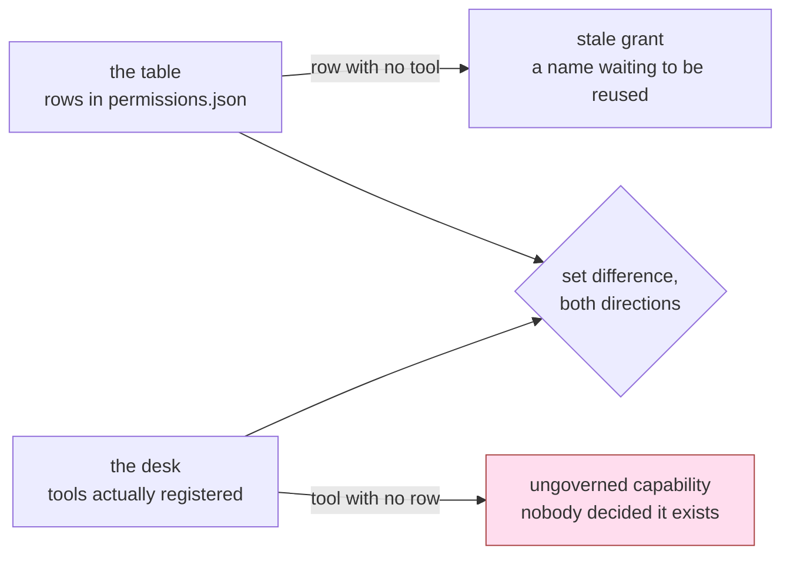

# 5.2 — The tool that arrived without a row

## One-line answer

A permission table becomes a control at the moment a tool with **no row** is refused instead of
allowed, and the gap between the tools the desk offers and the rows the table declares is found by a
diff in the build rather than by anybody being careful.

## The story

The cable operator for the lane keeps a register. A thick notebook, one line per flat: the flat
number, the name, the package, the date the connection was given. It has been kept for years and it
is neat.

A family moves into 302. The technician comes on a Tuesday, opens the junction box on the pole, taps
in a line, waits for the picture, and goes. The television works. It works that evening, it works
all month, it works all year.

Nobody wrote the line in the register.

Nothing is wrong, in the sense that nobody suffers. 302 watches television, and the technician
remembers them, and the money comes in cash at the door. What is wrong is quieter than that: the
notebook and the pole no longer agree, and every question anybody asks gets asked of the notebook.
How many connections are we running? Who is on the premium package? The notebook answers, and its
answer is off by one, and it is not uncertain about it.

It is found the day somebody climbs up and counts the lines coming out of the box. Not by anyone
being careful — by a count.

And the other direction, which people find less alarming and should not. Flat 208 gave up its
connection years ago. The line was pulled. The row is still in the notebook, still saying *208,
premium*. Then new tenants move into 208 and ask for a connection, and the technician looks in the
notebook, sees a line for that flat, and gives them what it says.

## The idea in plain language

The permission table from [2.4](../02-three-questions/2.4-the-table-you-can-diff.md) is a list of
tools with what each one is allowed to do. The desk is a list of tools it actually offers. These two
lists are supposed to be the same list, and they are maintained by different actions: one is edited
by a person writing a row, the other changes whenever anybody writes a function and adds it to the
agent.

**Drift** is the state where those two lists have come apart. It is not a mistake anybody makes on
purpose. It is what happens by default, because adding the tool is the thing that makes the feature
work and adding the row is not.

Here is the sentence that decides whether the table is a document or a control:

> A permission table is a control only if a tool with **no row** is refused. If a tool with no row
> runs, the table is a description of the system, and it is already out of date.

The check that finds drift is a set difference in two directions, and it is worth insisting that the
two directions are **different findings** with different urgency, because reporting them together as
"mismatch: 2" is how they both get ignored:

| the mismatch | what it actually is |
| --- | --- |
| a tool on the desk with **no row** | an **ungoverned capability** — nobody decided it exists |
| a row with **no tool** on the desk | a **stale grant** — policy about something that is not there |

The first is the one that keeps you awake. Nobody wrote its blast radius, nothing bounds its scope
or its rate, and everything derived from the table is now computed over a subset of the real system
— the allowlist section 3 builds, the audit section 6 runs, the review in the pull request, the
number you gave the auditor. It is the failure of the table as a control, and it is strictly worse
than having no table at all, because a table creates the belief that somebody looked.

The second is the one people wave through, and it has two real costs. The obvious one is the name:
grants are keyed on strings, functions get renamed and re-added, and a row that outlives its tool is
a permission sitting in the repository waiting for something to match it. That is flat 208, and it
is why "harmless" is the wrong word for it. The less obvious cost is that it destroys the report.
[3.1](../03-absent-not-forbidden/3.1-deny-by-default-at-the-toolset.md) makes this point about
allowlists rotting in the safe direction: a mismatch report that is *usually* wrong in a harmless
way is a report nobody reads, and it is the same report that would have shown you the first row of
this table.

## Why Sutra needs it

[2.4](../02-three-questions/2.4-the-table-you-can-diff.md) listed four properties that make a table
worth having, and the third — *it can be checked against reality* — pointed here, at the failure
that property exists to catch. This is that failure, run.

It also decides what [3.1](../03-absent-not-forbidden/3.1-deny-by-default-at-the-toolset.md) buys
you. Section 3 builds the desk's tool list **from** the table rather than beside it. Once that is
true, a tool with no row is not merely undocumented — it is absent from the agent, and the flow that
needs it fails. That is the whole trade this part is about, and it only exists because section 3
chose deny by default.

And it is in the hub's build brief. `sutra/permissions.py` loads `permissions.json`; the day's eval
has to be able to go RED, and a drift check is the cheapest eval in the day that can.

## The mechanism

Two lists, read from two places. The table comes off disk. Reality comes from the code:

```python
ALL_TOOLS = [read_ticket, close_ticket, refund, send_reply, read_note]
```

**Line by line:**

- This is the last line of `_desk.py`, and it is *reality* for the purposes of the check: the tools
  the desk actually has. It matters that the check reads this rather than a list somebody typed into
  the test, because a hand-written list of "the tools we have" is a third list that can drift from
  both of the other two.
- In the real system this is the agent's registered toolset or an MCP server's `tools/list`
  response, and the principle is identical: **ask the thing that runs**, never a copy of it.

`table.py` compares that against the rows, and its `--drift` flag is a simulation of the Tuesday
pull request:

```python
def main() -> None:
    write_table()
    on_desk = {tool.__name__ for tool in ALL_TOOLS}

    if "--drift" in sys.argv:
        # A sixth tool arrives on the desk in a Tuesday pull request. Nobody edits the table.
        on_desk = on_desk | {"export_tickets"}
    ...
    print(f"tools on the desk with no row: {sorted(on_desk - set(ROWS)) or 'none'}")
    print(f"rows with no tool on the desk: {sorted(set(ROWS) - on_desk) or 'none'}")
```

**Line by line:**

- `on_desk = {tool.__name__ for tool in ALL_TOOLS}` derives the names from the functions themselves.
  If somebody renames `close_ticket`, this set changes without anybody remembering to change it —
  which is exactly what you want reality to do.
- The `--drift` branch adds `export_tickets` to the desk and does **not** touch `ROWS`. That is the
  whole simulation: a tool exists, and the table does not know. No malice, no bug, one pull request
  that added a function and a test and passed review.
- `on_desk - set(ROWS)` is direction one: on the desk, not in the table. `set(ROWS) - on_desk` is
  direction two: in the table, not on the desk. Two set differences, printed as two separate lines,
  because they are two separate findings.
- `or 'none'` turns an empty list into a word. A check whose healthy output is `[]` trains people to
  skim past it; a check that says `none` reads as an answer.
- The `...` stands for the `--used` arm, which compares the grant against the audit and belongs to
  [6.2](../06-in-production/6.2-grant-is-a-claim-use-is-evidence.md).

```bash
cd days/day-68-least-privilege-tools/lab
uv run python table.py
```

**Line by line:**

- With no flag, the desk and the table agree, because on the day the table was written they did.
  This run is the baseline: it is what a healthy check prints, and it is the reason the drift run
  below is legible.

Measured on 2026-09-06:

```text
tool           capability                 rate     credential
read_ticket    read                       60/min   desk-read
close_ticket   write                      20/min   desk-write
send_reply     write, outbound            10/min   desk-mail
read_note      read                       60/min   desk-read
refund         write, irreversible, money 0        none held by the desk

tools on the desk with no row: none
rows with no tool on the desk: none
```

Now the same script with one tool added to the desk and nothing added to the table:

```bash
cd days/day-68-least-privilege-tools/lab
uv run python table.py --drift
```

**Line by line:**

- `--drift` changes one thing and it is not the table: a sixth name joins the set of tools the desk
  offers. Nothing else in the run differs, which is what makes the last two lines the measurement.

Measured on 2026-09-06:

```text
tool           capability                 rate     credential
read_ticket    read                       60/min   desk-read
close_ticket   write                      20/min   desk-write
send_reply     write, outbound            10/min   desk-mail
read_note      read                       60/min   desk-read
refund         write, irreversible, money 0        none held by the desk

tools on the desk with no row: ['export_tickets']
rows with no tool on the desk: none
```

The printed table is **byte for byte identical**. That is the finding, not a detail of the output
format. The artefact a reviewer reads, the file an auditor is shown, the document that says what
this agent may do — none of it changed, and the agent gained the ability to export tickets.

Only the derived line changed, and it could only change because something compared the table to the
thing that runs.



## When it breaks

What the drift *does* depends entirely on a decision made back in
[3.1](../03-absent-not-forbidden/3.1-deny-by-default-at-the-toolset.md), and the two answers could
not be further apart.

**Deny by default.** The agent's tool list is built from the table, so a tool with no row is not on
the agent at all. The first flow that needs `export_tickets` gets the failure 3.1 measured for a
different name:

```text
   allowlist | declared=['read_ticket', 'send_reply']
             | raised ValueError: Tool 'refund' not found.
```

The string is `Tool '<name>' not found.` with whatever name the model asked for, and it surfaces as
a raised exception through the runtime rather than as a returned error — the ADK 2.x behaviour
[1.1](../01-the-deputy/1.1-the-errand-and-the-keys-that-went-with-it.md) met as `stopped:` and
[3.3](../03-absent-not-forbidden/3.3-what-happens-when-it-asks-anyway.md) works through in full. So
the drift is an **outage**, on the day the tool ships, in the feature that shipped it.

**Allow by default.** The tool list is whatever functions are registered, and the table is consulted
by nobody. Then the drift produces *nothing*. No error, no log line, no different behaviour in any
run. `export_tickets` works perfectly. The only artefact that would ever have mentioned it is the
table, and the table is the thing that does not know.

Which is to say the two failures are: a loud one you cannot ignore, and a silent one you cannot
detect.

**I would choose deny by default, and I would say the cost out loud rather than pretend it is
free.** The cost is a real outage in a real feature, and it is paid by the team that shipped the
tool, on the day they ship it, while they are still holding the context. The fix is a one-row pull
request — and that pull request is the moment somebody has to write the `blast_radius` sentence,
which is the sentence the whole table exists for. Compare the other bill: the allow-by-default cost
is paid by whoever is on call the day the ungoverned tool is used badly, months later, by somebody
who has never heard of it, with no artefact anywhere naming who granted it or why.

There is one thing to watch for, and it is a human failure rather than a technical one. A team that
gets bitten by a ship-day outage will propose making the check a warning. That converts deny by
default into allow by default with extra steps, and it always happens during an incident, when it
sounds like pragmatism. The counter is to make the fix trivially cheap — a row template with the
five columns and a comment saying *fill in the last one properly* — so that adding the row is easier
than arguing about the check.

## In production

**What a professional writes instead.** The check is not a script anybody runs. It is a test, in the
build, on every pull request, and it reads reality from the running system rather than from a list:
build the real agent, ask it for its tools, parse `permissions.json`, and assert both set
differences are empty. Direction one fails the build. Direction two also fails the build, and the
fix is to delete the row — a row nobody is willing to delete is a row somebody is unsure about, and
that uncertainty is the finding.

**Why it belongs in the build and not in a review.** A reviewer sees a diff. This bug is not in any
diff: the pull request that adds `export_tickets` is complete, correct and well tested, and the file
it should have touched is simply absent from it. You cannot review your way to noticing an
*unchanged* file. The build can, because the build looks at the whole system every time, and it does
not get tired on a Friday.

**What degrades at scale.** In this lab, reality is a Python list in a file you own. In a real agent
it is an MCP server's `tools/list` response, over the wire, owned by another team, and it can change
between deploys with no diff anywhere in your repository. The check therefore has to run against the
*deployed* server for each environment, not once at build time against a mock. When it goes red
without anybody on your team changing anything, it has not misfired — your grant genuinely changed
while you were asleep, which is precisely the event you built it to catch. The filtering built on
[Day 40](../../../day-40-filtering-and-allowlists/LESSON.md) is what keeps that event from being an
incident; this check is what makes it visible.

**The failure mode that only appears with real traffic.** Environments drift apart before the table
drifts. Staging gets the new tool first, so the check goes red in staging, and the fastest way to
get a deploy out is to run the check only in production, where it is green because the tool has not
shipped there yet. Now the check is asserting agreement in the one environment where the tool does
not exist, and it will be green on exactly the deploy that introduces it. Run it per environment,
and treat a mismatch in the environment ahead of you as information rather than as noise.

**The review comment a senior engineer leaves:** *"This adds a tool and does not add a row, and the
build passed, which means the drift check is not in the build. Add both. And tell me which direction
of that check fails the build — if the answer is 'neither, it prints a warning', then we do not have
a permission table, we have a document that describes an agent we used to have."*

**The interview question:** *"You have a permission table. How do you know it is true?"* The answer
that separates a control from a document: *"Because a tool with no row does not run. The table
builds the agent's tool list, so drift shows up as the feature failing on the day it ships, not as a
silent capability. And there is a test in CI that asks the built agent for its real tool list and
diffs it against the table in both directions — a tool with no row fails the build because it is an
ungoverned capability, and a row with no tool fails it too because grants are keyed on names and the
next function called that inherits it. I ran the drift case on our desk: the printed table was
identical before and after, which is the point. The only line that changed was the one comparing the
table to the thing that actually runs."*

## Check yourself

```bash
cd days/day-68-least-privilege-tools/lab
uv run python table.py
uv run python table.py --drift
```

Now turn the last two lines of `table.py` into something that can fail. Write a test that builds
`on_desk` from `ALL_TOOLS`, reads the rows from `permissions.json`, and asserts on both set
differences — then decide, and write down, which direction returns a non-zero exit code and which
one only prints. Make the drift case go RED before you make it go green.

**Out loud, without scrolling up:** say what a tool with no row and a row with no tool each mean,
and which of the two you would page somebody about.

**Next:** [5.3 — The helper that handed control back](5.3-the-helper-that-handed-control-back.md).
