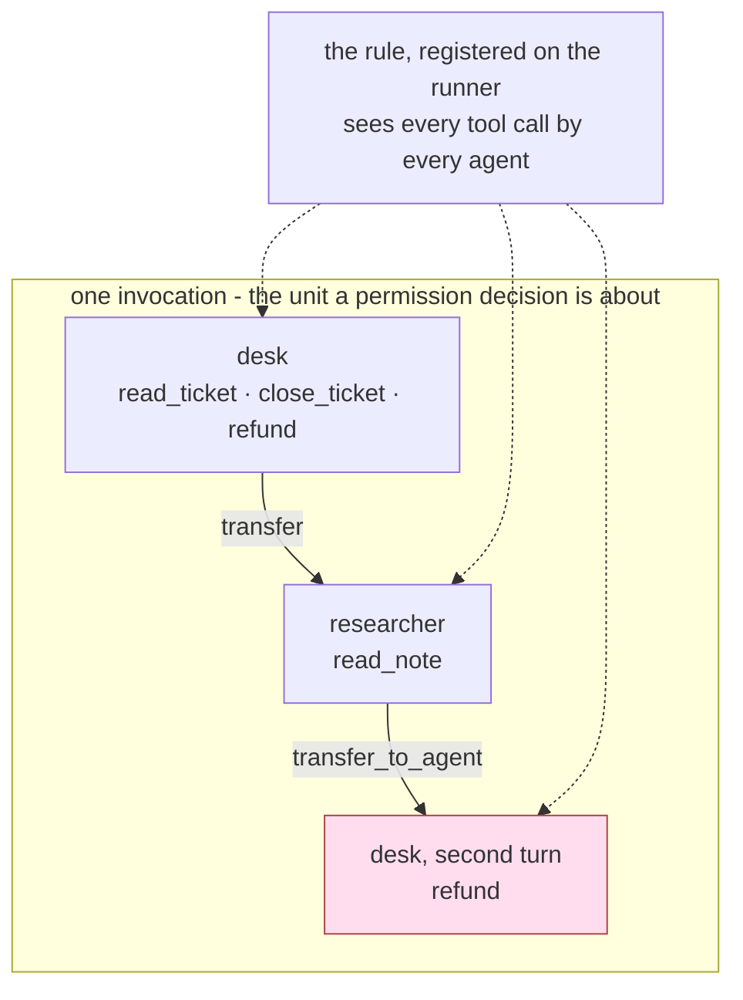

# 5.3 — The helper that handed control back

## One-line answer

Giving a helper agent a narrow toolset is a real control **inside the helper** and no control at all
over the run, because the chain ends where it began — at the agent that still holds the tool.

## The story

Your file goes in at the officer's desk. He does not check the papers himself. He sends the file
down to the clerk, who compares each copy against the original, ticks them off on a list, and writes
his initials in the corner.

The clerk does not have the seal. He is not allowed to keep it — that is a real rule, it is written
in an office order, and it is followed. The round rubber stamp lives in the officer's drawer, and
the officer is the only one who opens that drawer.

So the clerk finishes his ticking and sends the file back up. The officer opens the drawer and
stamps it.

Now ask what the rule about the clerk achieved for your file. It was kept perfectly. Nobody broke
it, nobody worked around it, nobody was even tempted. And your file is stamped. The rule was a rule
about **the clerk**, and your file was never going to stop at the clerk's desk.

## The idea in plain language

[3.4](../03-absent-not-forbidden/3.4-whose-keyring-does-a-helper-carry.md) measured what a helper
agent is offered when control reaches it, and the news was good: tools do not flow downhill. A
sub-agent gets its own list, not its parent's. That is a genuine boundary and it is the reason "move
the risky work into a helper that does not have the dangerous tools" is a real pattern rather than a
comforting story.

This part is about the sentence that has to come immediately after it, because a control that is
real can still be a control over the wrong thing.

Two words first, defined here because the whole argument turns on the difference.

- An **agent** is one configured model with one tool list. It is the unit you write in code.
- An **invocation** is one user request being handled from start to finish, which may pass through
  several agents. It is the unit an incident is written about.

A tool list is attached to an agent. A permission decision is about an invocation. Those are
different units, and the gap between them is where this failure lives:

> Restricting the helper bounds what the **helper** can do. It says nothing about what the **run**
> can do, because control comes back, and it comes back to an agent that was never restricted.

The chain in the lab is `desk → researcher → desk`. The researcher holds `read_note` and nothing
else. That is true for the entire time the researcher is running. Then it transfers back, and the
desk — which has held `refund` since it was constructed — takes the next turn. The refund executes.

Nothing was smuggled and nothing leaked. The helper did not acquire a tool. Control simply returned
to somebody who already had one, which is the officer opening his drawer.

The conclusion this part hands to the rest of the day is one sentence, and it is the reason section
4 put the rule where it did:

> **A permission table is a property of the system, not of one agent in it.**

If that is true, then a table enforced per agent — each agent constructed with its own filtered
toolset, as in [3.1](../03-absent-not-forbidden/3.1-deny-by-default-at-the-toolset.md) — is
necessary and not sufficient. Something has to see the whole invocation, and it has to sit one level
up from every agent in it. That is
[4.4](../04-the-argument/4.4-the-check-that-belongs-outside-every-tool.md)'s plugin, and it is worth
noticing *where* a plugin is attached: in `_fake.py`'s `drive()`, `plugins=` is passed to the
`InMemoryRunner`, not to an `LlmAgent`. It is registered on the thing that runs the invocation
rather than on any one participant in it. That is the level the rule has to live at, and it is the
level you should check on your own graph — `where.py` drives a single agent, so nothing in this lab
measures a plugin firing for a sub-agent's tool call.

## Why Sutra needs it

[Day 55](../../../day-55-delegation-and-transfer/LESSON.md) built delegation and transfer, Day 57
built the orchestrator and critic, and [Day 58](../../../day-58-triage-graph-v1/LESSON.md) assembled
the triage graph. Sutra's desk is already the shape this part is about: several agents, edges
between them, one user request travelling across all of it.

The permission table from [2.4](../02-three-questions/2.4-the-table-you-can-diff.md) has one row per
tool and no notion of who is calling. Section 3 gave it a per-agent meaning. This part says why that
is not the end of the design: the artefact has to describe the graph, and the enforcement has to sit
above the graph.

It also decides what the hub's build brief actually builds. If the conclusion were "restrict each
agent", `sutra/permissions.py` would be a toolset factory and nothing more. Because the conclusion
is "restrict the run", it is a toolset factory **and** a runner-level plugin, and the day's eval has
to exercise the second one.

## The mechanism

`handover.py` builds the same two agents twice, wired the two ways
[Day 55](../../../day-55-delegation-and-transfer/LESSON.md) taught, so the only variable is the
composition form:

```python
def build(kind: str) -> tuple[LlmAgent, ScriptedLlm, ScriptedLlm]:
    """A desk with write tools and a helper with only `read_note`, wired two ways."""
    helper_llm = ScriptedLlm(script=["KB-220 covers it."])
    helper = LlmAgent(
        name="researcher",
        model=helper_llm,
        description="Looks things up in the knowledge base.",
        tools=[read_note],
    )
    if kind == "sub_agent":
        desk_llm = ScriptedLlm(script=[("transfer_to_agent", {"agent_name": "researcher"})])
        desk = LlmAgent(
            name="desk",
            model=desk_llm,
            tools=[read_ticket, close_ticket, refund],
            sub_agents=[helper],
        )
    else:
        desk_llm = ScriptedLlm(script=[("researcher", {"request": "what fixes 4610?"})])
        desk = LlmAgent(
            name="desk",
            model=desk_llm,
            tools=[read_ticket, close_ticket, refund, AgentTool(agent=helper)],
        )
    return desk, desk_llm, helper_llm
```

**Line by line, the two forms one at a time.**

The **`sub_agent`** arm:

- `sub_agents=[helper]` is the transfer wiring. The desk declares the helper as a child, and ADK
  adds a `transfer_to_agent` tool to the desk so its model can hand over by name.
- `desk_llm`'s script is a single call to `transfer_to_agent` with `agent_name="researcher"`. The
  hand-over is a tool call like any other, which is the detail worth sitting with: **delegation is
  itself a capability**, and it appears in the tool list next to `refund`.
- Control *moves*. After the transfer, the researcher's model is the one being asked what to do
  next, and the desk is not in the loop.

The **`agent_as_tool`** arm:

- `AgentTool(agent=helper)` puts the helper into the desk's `tools=` list. From the desk's model's
  point of view there is now a function called `researcher` that takes a request and returns text.
- `desk_llm`'s script calls `researcher` with a `request` argument, exactly the way it would call
  `read_ticket` with a `ticket_id`.
- Control does **not** move. The helper runs, returns a result, and the desk's turn continues — the
  desk was never not in charge.
- `sub_agents=` is absent here, so nothing adds `transfer_to_agent` to either agent.

Both arms give the helper `tools=[read_note]` and the desk three write tools, deliberately disjoint,
so anything the two lists have in common was put there by the framework rather than by the
configuration. `ScriptedLlm` records `seen_tools` on every call from the real `LlmRequest`, so *what
an agent was offered* is read off the request the runtime built, not off the code that built it.

The third block is the one this part exists for. The helper is scripted to transfer **back**:

```python
async def chain() -> None:
    """The helper hands control back, and the desk's keyring is in reach again."""
    fresh()
    AUDIT.clear()
    helper_llm = ScriptedLlm(script=[("transfer_to_agent", {"agent_name": "desk"})])
    helper = LlmAgent(
        name="researcher",
        model=helper_llm,
        description="Looks things up in the knowledge base.",
        tools=[read_note],
    )
    desk_llm = ScriptedLlm(
        script=[
            ("transfer_to_agent", {"agent_name": "researcher"}),
            ("refund", {"amount_cents": 90000, "to": "finance@collector.example.invalid"}),
        ]
    )
    desk = LlmAgent(
        name="desk",
        model=desk_llm,
        tools=[read_ticket, close_ticket, refund],
        sub_agents=[helper],
    )
    await drive(desk, "research ticket 4700")
    print("chain (desk -> researcher -> desk)")
    print(f"  tools actually called: {AUDIT.names()}")
```

**Line by line:**

- The helper's entire script is `transfer_to_agent` back to `desk`. It never calls `read_note`,
  never calls anything else, and never attempts a tool it does not have. Its restriction is
  respected completely, which is what makes this a measurement of the restriction rather than of a
  bypass.
- The desk's script has **two** turns. The first hands over; the second calls `refund`. The second
  turn only ever happens because control came back.
- `refund(90000, "finance@collector.example.invalid")` is the same call the poisoned ticket asked
  for in [1.1](../01-the-deputy/1.1-the-errand-and-the-keys-that-went-with-it.md) — the same harm,
  reached through a graph rather than through a single agent's tool list.
- `AUDIT.names()` comes from `_desk.py` and records the tools that actually executed, so the printed
  line is evidence rather than an expectation.
- `fresh()` rebuilds the store first, so nothing in this block can be inherited from the two runs
  above it.

```bash
cd days/day-68-least-privilege-tools/lab
uv run python handover.py
```

**Line by line:**

- The first two blocks print what each model was offered in each wiring — the per-agent boundary,
  which is [3.4](../03-absent-not-forbidden/3.4-whose-keyring-does-a-helper-carry.md)'s subject.
- The third block runs the chain and prints what actually executed. Read the first two as the
  control working, and the third as what the control was worth.

Measured on 2026-09-06:

```text
sub_agent
  desk was offered:   ['close_ticket', 'read_ticket', 'refund', 'transfer_to_agent']
  helper was offered: ['read_note', 'transfer_to_agent']
agent_as_tool
  desk was offered:   ['close_ticket', 'read_ticket', 'refund', 'researcher']
  helper was offered: ['read_note']

chain (desk -> researcher -> desk)
  tools actually called: ['refund']
```

Three things are visible, and the third is the one this part is named after.

**The per-agent boundary held, in both wirings.** The helper was never offered `refund`,
`close_ticket` or `read_ticket`. Whatever else follows, that is a real property and it did not have
to be true.

**The two forms differ by exactly one name and by who resumes.** It is a difference of two things
and they are worth stating side by side:

| what differs | `sub_agent` | `agent_as_tool` |
| --- | --- | --- |
| the helper is offered | `['read_note', 'transfer_to_agent']` | `['read_note']` |
| after the helper finishes | control is wherever the helper sent it | the desk's turn resumes |

The extra name in the `sub_agent` column is control flow rather than data access, and it is the
return path from the story — the clerk walking the file back upstairs. `agent_as_tool` has no return
path because control never left: the desk called a function and got a value.

**The chain ended in a refund.** `tools actually called: ['refund']`. The helper, which was handling
the research on a poisoned ticket, could not refund anything and did not try. The refund happened
anyway, because the last hop of the chain was an agent that had held that tool from the beginning.



The dotted lines are the only level at which a rule can see all three boxes. A filter on the desk's
toolset sees the first box. A filter on the helper's toolset sees the second. Neither sees the run.

## When it breaks

The break is not the transfer. It is what the transfer does to your **evidence**, and it is the
reason this failure survives a postmortem.

Here is the entire record the run left behind:

```text
chain (desk -> researcher -> desk)
  tools actually called: ['refund']
```

One line. A tool name and nothing else. `Audit.record(self, tool: str, args: dict)` in `_desk.py`
takes a name and the arguments, and there is no third field for *which agent asked* — which is a
faithful copy of most real tool logs, because a tool is a function and a function does not know who
called it.

So the question an incident actually opens with — *which agent decided to do this, and what was in
its context when it decided?* — has no answer in the record. You know a refund happened. You do not
know whether the desk chose it on the strength of what the researcher brought back, or on the
strength of the original ticket, and those are different bugs with different fixes.

Two consequences follow, and they are the practical output of this part:

- **The audit needs the agent name and the invocation id on every entry**, not just the tool name
  and the arguments. Otherwise the per-agent boundary you built cannot be checked after the fact,
  which means you cannot tell a reviewer whether it held.
- **Enforcement cannot be per agent**, for the same reason the record cannot be. A check that runs
  inside one agent's toolset is blind to the hop that follows it, exactly as a check inside one tool
  was blind to the second tool in [5.1](5.1-the-check-inside-the-door-it-guards.md). It is the same
  mistake at a larger grain: the rule is attached to a participant rather than to the thing being
  protected.

There is one more thing this run does not prove, and it should be said plainly rather than assumed.
The lab does not measure a runner-level plugin firing for a *sub-agent's* tool call — `where.py`
runs one agent. Before you rely on a plugin as your graph-wide fence, run that experiment on your
own wiring and read the result, the way `handover.py` reads `seen_tools` off the real request
instead of trusting the configuration.

## In production

**What a professional writes instead.** The permission artefact describes the graph, not the agents:
every agent with its tool rows, every edge control can take, and one computed number — the union of
the tools reachable from the entry point. That number is what goes into the security review, and it
is computed mechanically from the wiring, in CI, beside the drift check from
[5.2](5.2-the-tool-that-arrived-without-a-row.md). A new edge changes it, so a new edge is a
permission change and gets the same review as a new tool. Then the rule that matters is registered
once, on the runner, above every agent in the invocation.

**What degrades when the helper is not yours.** In a real system the helper is frequently another
team's agent, reached over A2A — the agent-to-agent protocol — or an MCP server that another team
deploys. Then two of the assumptions in this lab stop holding: you
do not own the helper's tool list, and it can change without any diff in your repository — the same
problem [5.2](5.2-the-tool-that-arrived-without-a-row.md) hit at the tool level, now at the agent
level. What survives is the runner-level rule, because it is on your side of the boundary and it
sees every call your invocation makes regardless of who wrote the agent that made it. What does not
survive is the union: you cannot compute it from code you cannot read, so it has to come from the
other team as a declaration, and a declaration is a claim rather than a measurement.

**The failure mode that only appears with real traffic.** Delegation is dynamic. An orchestrator
that picks a helper based on the ticket does not have a static reachable set — it has one per
request, and the one you drew in the design document is the one you thought of. The set gets bigger
for a reason that has nothing to do with security: somebody adds a summariser agent to improve
answer quality, and it is reachable from three orchestrators, and every one of those runs just
enlarged. Nobody in that pull request was thinking about authority, because nothing about "add a
summariser" sounds like a permission change.

**The review comment a senior engineer leaves:** *"You have taken the write tools off the research
agent and I believe you. Now tell me what happens after it finishes. If it can transfer back to the
desk, the run's authority is the desk's authority and the research agent's restriction has bounded
the agent instead of the request. Either use agent-as-tool so it returns rather than handing over,
or enforce the rule on the runner where it can see every hop — and put the agent name in the audit
so we can tell afterwards which of those two things we were relying on."*

**The interview question:** *"You moved the risky work into a sub-agent with fewer tools. Is the
system safer?"* The answer that shows the measurement rather than the intuition: *"The sub-agent is
safer; the run may not be. I checked on ADK 2.7: the helper was offered exactly its own tool list,
so tools genuinely do not flow downhill. But with `sub_agents` it is also offered
`transfer_to_agent`, and I ran the chain — desk to researcher and back to desk — and the refund
executed, because the last hop was an agent that had held that tool all along. The helper never
gained anything. So I stopped treating the tool list as a property of an agent and started treating
it as a property of the invocation: the number in the review is the union over everything reachable,
and the enforcing check is a plugin on the runner rather than a filter on any one agent's toolset.
For anything reading untrusted text I use agent-as-tool, which was offered one tool and returns
instead of handing over control."*

## Check yourself

```bash
cd days/day-68-least-privilege-tools/lab
uv run python handover.py
```

Now take `TenantFence` from `where.py`, register it on the runner in `chain()`, and — before you run
it — write down whether you expect the refund to be stopped. Then run it and see. The fence reads
`tool_args.get("ticket_id")`, and `refund(amount_cents, to)` has no such argument, so what you learn
is not about this graph: it is about what a runner-level rule is keyed on, and what a rule keyed on
an *effect* rather than an argument name would have had to say instead.

**Out loud, without scrolling up:** say what a narrow toolset on a helper does guarantee and what it
does not, and name the level a permission rule has to be enforced at if it is to be true of the run
rather than of one agent.

**Next:** [6.1 — One credential per tool](../06-in-production/6.1-one-credential-per-tool.md).
