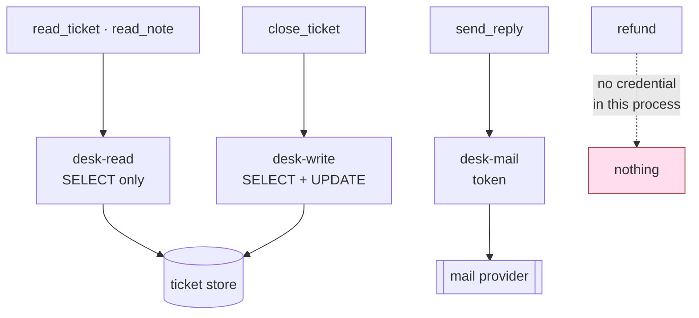

# 6.1 — One credential per tool

## One-line answer

The `credential` column is the one column in the permission table that stops being a policy and
becomes a boundary: a tool holding a read-only credential cannot write however wrong the rules above
it are — and the reason most teams have one credential with a policy on top instead is that the
credentials themselves are real, ongoing, unglamorous work.

## The story

You run one delivery van. For years the arrangement was cash and a sentence: *this money is for
diesel, bring the bills.* Mostly it worked. When it did not, you found out at the end of the month,
from a bill for something that was not diesel, and then there was a conversation.

Then the pump chain offered a card. You put money on it, the driver swipes it, and it works at their
pumps and nowhere else. It will not buy a phone. Not because anybody was told not to buy a phone —
because the card is not accepted at the phone shop.

Two things changed and only one of them is the obvious one.

The obvious one is that a whole category of mistake stopped being possible, and stopped needing
anybody to be careful for it to stop being possible.

The other one is that you now have a card to look after. You top it up. You block it the week the
driver leaves and wait for the replacement. When the second van arrives you apply for a second card,
and now there are two cards and two balances and one of them is always the one that ran out on a
Sunday. The sentence cost you nothing to say. The card costs you something every month, for ever, and
what it buys is that on the bad day it does not depend on anyone having been careful.

## The idea in plain language

A **credential** is the thing a piece of code presents in order to be allowed to do its work: a
database username and password, an API key, a mail account and its token, the operating-system user
that owns a file handle. It is not a note about what the code should do. It is the actual proof of
authority that the other side checks before it acts.

That word **authority** was defined back in
[1.1](../01-the-deputy/1.1-the-errand-and-the-keys-that-went-with-it.md): the set of effects a piece
of code is *able* to cause, independent of what anybody intended. A credential is where authority
physically lives. Everything else in this day has been an argument about authority; this part is
about the place it is actually stored.

Now hold that against what sections 2 to 5 built, because the contrast is the whole point.

Sections 2 to 5 built **checks**. A check is code that receives a request and decides: allow, or
refuse. The scope comparison in [2.2](../02-three-questions/2.2-which-rows-scope.md), the argument
validation in [4.1](../04-the-argument/4.1-the-tool-is-allowed-the-argument-is-not.md), the bound
recipient in [4.3](../04-the-argument/4.3-the-recipient-who-is-not-the-customer.md) — every one of
them is a decision made by your code at the moment of the call.

A decision has three ways to be wrong, and this day has met all three:

1. **It can be wrong.** The logic is subtly incorrect, the comparison is inverted, the default falls
   open instead of closed. [1.3](../01-the-deputy/1.3-whose-permissions-is-the-tool-using.md) showed
   one character of that: `TENANT_OF.get(user_id, "")` refuses an unknown caller and
   `TENANT_OF.get(user_id, row["tenant"])` waves them through, and both pass the tests you would
   naturally write.
2. **It can be bypassed.** The check guards one road and there is a second road to the same effect,
   which is [5.1](../05-failure-lab/5.1-the-check-inside-the-door-it-guards.md)'s entire subject.
3. **It can be in the wrong place.** A check written inside the tool it guards protects that tool
   and nothing else, which is why
   [4.4](../04-the-argument/4.4-the-check-that-belongs-outside-every-tool.md) moves it out.

A credential that does not exist has none of those failure modes, because there is no decision
anywhere to get wrong. If the connection a tool holds is a database user with `SELECT` and no
`UPDATE`, then a bug in that tool cannot write. Not "is unlikely to write" — *cannot*. There is no
branch to invert, no second road, and no file the check could have been put in, because there is no
check.

This is the same move [3.1](../03-absent-not-forbidden/3.1-deny-by-default-at-the-toolset.md) made
one layer higher. There, the control was that the function is not on the agent's tool list, so the
model cannot call it. Here, the control is that the ability the function would need is not in the
process, so the function could not succeed even if it ran. Two layers, one idea: **absent beats
forbidden.**

The day's ladder, in order of how hard each rung is to argue with:

| the control | what it depends on | how it fails |
| --- | --- | --- |
| a rule in the prompt | the model choosing to comply | one persuasive sentence |
| a check in code | the check being right, reachable, and everywhere | wrong, bypassed, wrong file |
| the tool absent from the list | the list being built per errand | somebody adds the tool back |
| the credential not held | nothing at run time | somebody widens the grant, in its own review |

Row one is [1.4](../01-the-deputy/1.4-a-rule-in-words-is-not-a-permission.md), row two is sections 2
to 5, row three is
[3.1](../03-absent-not-forbidden/3.1-deny-by-default-at-the-toolset.md), and row four is this part.
Every rung is worth having. Only the last two hold when the rung above them has already failed.

## Why Sutra needs it

The permission table in [2.4](../02-three-questions/2.4-the-table-you-can-diff.md) has five columns,
and four of them describe intentions. `capability` says what kind of thing a tool may do; `scope`
says which rows; `rate` says how often; `blast_radius` says what the postmortem will read like. All
four are claims about a world that somebody has to keep true.

`credential` is different. It names a thing that either exists in the deployment or does not, and
whether it exists is not a matter of opinion. That is why
[2.1](../02-three-questions/2.1-may-it-capability-and-the-read-write-line.md) ended by pointing
here: it argued that reads and writes must be separate tools so that one can be granted without the
other, and said the professional version gives each capability its own credential so the split is
enforced below the code rather than by it. This part is the "and here is what that costs" it
promised.

There is a second reason, and it is the one that connects this day to the last three. Day 66 wrote a
threat model, and its decision table contains this row:

> | refuse | an outbound fetch tool in the answering path | the trifecta closes without it; nothing we need requires it |

That row is in
[`days/day-66-injection-threat-model/lab/threat-model.md`](../../../day-66-injection-threat-model/lab/threat-model.md),
produced by part
[7.3](../../../day-66-injection-threat-model/parts/07-writing-it-down/7.3-accept-mitigate-refuse.md).
Day 66 reached it by counting exits and finding that the desk's exposure closes into a complete
attack path only when something can carry data outward. Its answer was not to filter the outward
call. Its answer was that the desk does not get one — a capability not held cannot be misused, and
that sentence is true for exactly the same reason a fuel card cannot buy a phone.

Day 69 takes this further at the level of the data itself, and Day 70 adds a router that holds
provider keys — which is a new credential, arriving on a day whose subject is quota rather than
security, which is precisely how credentials accumulate.

## The mechanism

Print the table and look only at the last column:

```bash
cd days/day-68-least-privilege-tools/lab
uv run python table.py
```

**Line by line:**

- `cd` into the lab first: `table.py` imports `_desk` by plain name and resolves `permissions.json`
  next to itself.
- No flag prints the table as it sits on disk. The `credential` column is the rightmost one because
  it is the one a reviewer should still be reading when they have run out of patience for the others.

Measured on 2026-09-06:

```text
tool           capability                 rate     credential
read_ticket    read                       60/min   desk-read
close_ticket   write                      20/min   desk-write
send_reply     write, outbound            10/min   desk-mail
read_note      read                       60/min   desk-read
refund         write, irreversible, money 0        none held by the desk

tools on the desk with no row: none
rows with no tool on the desk: none
```

Four distinct values across five tools, and each one is a promise about the deployment rather than
about the code:

| credential | what it is in the deployed system | what it is denied |
| --- | --- | --- |
| `desk-read` | `SELECT` on the ticket table, read on `state/notes` | every write, every other path |
| `desk-write` | `SELECT` and `UPDATE` on the ticket table | deletes, schema changes, the mail account |
| `desk-mail` | the mail account and its token | the database, entirely |
| `none held by the desk` | there is no payments credential in the process | everything to do with money |

Two tools share `desk-read`, and that is a deliberate choice rather than an oversight. Both are
reads, and a shared credential across tools of the same capability costs you nothing that the
capability split has not already bought — you can still grant `read_ticket` without `close_ticket`,
because those are separate tools on separate rows. The line you must not cross is a credential
shared across *different* capabilities.

The `refund` row is the interesting one, and it is worth reading in the file rather than in the
printed table, because the table's column widths hide how the row is actually written:

```json
{
  "refund": {
    "capability": "write, irreversible, money",
    "scope": "NOT GRANTED - approval gate only",
    "rate": "0",
    "credential": "none held by the desk",
    "blast_radius": "money leaves and does not come back"
  }
}
```

**Line by line:**

- `"credential": "none held by the desk"` is not a polite way of writing `null`. It is a claim about
  the deployed process: there is no payments key in the environment, no client constructed at
  startup, nothing in `.env` that a `refund` implementation could pick up.
- `"rate": "0"` is the same fact expressed for the enforcement code, which reads that field —
  `granted()` in `table.py` treats a rate of `"0"` as not granted. The two fields must agree, and a
  row with a real credential and a rate of zero is a row that will be widened by somebody in a hurry.
- `"scope": "NOT GRANTED - approval gate only"` points at [Day
  63](../../../day-63-approval-gates-design/LESSON.md), which reached the same conclusion about the
  same action from the direction of reversibility. When two independent arguments land on one row,
  that row is probably right.
- `"blast_radius"` is written in the past tense of an incident review on purpose. It is the sentence
  you would have to read out, and it is what justifies paying for a separate credential rather than
  a check.

The shape this describes, drawn out:



Follow any arrow backwards from the store. The only way a write reaches the ticket table is through
`desk-write`, and the only tool holding `desk-write` is `close_ticket`. That is a statement about the
wiring, and you can check it by reading the deployment rather than by reading every line of every
tool.

The simplest honest demonstration of the property needs no database at all, because your operating
system has been doing this since long before anybody wrote an agent. Open a file for reading and try
to write to it:

```bash
cd days/day-68-least-privilege-tools/lab
uv run python - <<'PY'
handle = open("state/notes/kb-104.md", "r", encoding="utf-8")
print(handle.read().strip())
handle.write("overwritten")
PY
```

**Line by line:**

- `open(..., "r", ...)` is a credential in miniature. The mode string is not advice to the programmer;
  it decides what the returned object is able to do.
- The `print` proves the handle works — this is not a broken handle, it is a *read* handle, and the
  distinction is the entire subject of this part.
- `handle.write(...)` is the tool doing the wrong thing. There is no check in this snippet, nothing
  validating the string, and no rule anywhere saying notes are read-only.
- The heredoc (`<<'PY' … PY`) feeds the three lines to Python on standard input, which is why the
  traceback below says `"<stdin>"` rather than a filename. Quoting `'PY'` stops the shell expanding
  anything inside.

Measured on 2026-09-06:

```text
KB-104: clear the site data, then sign in again.
Traceback (most recent call last):
  File "<stdin>", line 3, in <module>
io.UnsupportedOperation: not writable
```

`io.UnsupportedOperation: not writable` is what a boundary sounds like. Nothing decided that the
write was inappropriate. There was simply no writing machinery behind that handle to run.

## When it breaks

It breaks by being expensive, and the expense is not a one-off.

**Rotation.** Every credential has to be replaced periodically, and replacing one is a small
distributed-systems problem: the new secret has to exist before the old one is revoked, the process
has to pick it up without dropping in-flight work, and every place the old value was copied has to
be found. One credential is one of these. Four are four, on four different schedules, and the one
that expires is always the one whose owner left.

**Storage.** Four secrets need somewhere to live that is not the repository — a secret manager, an
injected environment, a mounted file — and the access rules for *that* are a permission problem of
their own. Principle 9 has been in force since Day 2 for a reason. Splitting one secret into four
does not divide the handling work by four; it multiplies it.

**Provisioning.** Somebody has to create the database role with exactly `SELECT`, and somebody has to
create it again in staging, and in the review environment, and on the laptop of the person who joined
last week. Each of those is a place the roles can quietly differ, and the environment where they
differ hardest is the one nobody tests in.

**A new failure mode that did not exist before.** A tool can now fail because its credential is wrong
rather than because its logic is wrong, and the errors are the least helpful in the business. This is
the real text of the smallest version of it, from the read handle above:

```text
Traceback (most recent call last):
  File "<stdin>", line 3, in <module>
io.UnsupportedOperation: not writable
```

Read that as an on-call engineer at eleven at night who has never seen this code. It says what
happened and nothing about why the handle was opened read-only, which decision made it so, or whether
the correct fix is to widen the credential or to stop calling the write. The overwhelmingly available
fix at that hour is to widen it, which is how a boundary becomes a policy again.

**And the failure that matters most: the paperwork without the property.** A team accepts the
argument, creates `desk-read`, `desk-write`, `desk-mail` and `desk-admin`, and — because getting the
grants exactly right per role is fiddly and the deadline is real — gives all four the same rights.
The table now has four values in the credential column. The permission review passes. The property
does not exist at all, and it is worse than having one credential, because the table now says
something false and everybody has stopped looking.

**How to tell one from the other by looking.** Do not count credentials. For each one, write down
what it is **denied**, and compare the deny lists:

- If `desk-read` and `desk-write` have identical deny lists, they are one credential wearing two
  names.
- If a credential's deny list is empty, it is the shared admin credential with a nicer name on it.
- If you cannot produce the deny list without asking somebody, the answer is that nobody knows, and
  the practical answer in that case is that the deny list is empty.

The check is mechanical and it takes one query per role against your database's own catalogue, or one
call to your cloud provider's policy simulator. The column in the table is the claim; the grants on
the role are the fact; and [6.2](6.2-grant-is-a-claim-use-is-evidence.md) is the same comparison
applied to usage rather than to grants.

## In production

**What a professional writes instead.** The credential is not a string the tool reads — it is bound
to the tool at construction, so that no code path exists from a read tool to a write connection:

```python
def make_read_tools(read_conn: Connection) -> list[Callable]:
    """Tools built over a connection whose role has SELECT and nothing else."""

    def read_ticket(ticket_id: str) -> dict:
        return read_conn.fetch_one("SELECT * FROM tickets WHERE id = %s", ticket_id)

    return [read_ticket]
```

**Line by line:**

- `read_conn` arrives as an argument and is captured in the closure. There is no module-level
  connection, no global pool the tool can reach for, and no `get_connection()` helper that might
  return the wrong one — which is the actual mechanism by which a read tool ends up with a write
  connection in a real codebase.
- The name says which credential it is. A reviewer reading `make_read_tools(write_conn)` at the call
  site sees the bug without opening this file, and that readability is most of the value.
- The tool itself contains no permission logic whatsoever. Compare it with the scoped tool in
  [1.3](../01-the-deputy/1.3-whose-permissions-is-the-tool-using.md), which had to consult
  `tool_context.user_id` and compare tenants. Both are worth having, and they fail independently:
  scoping decides *which rows*, the credential decides *which verbs*, and neither can cover for the
  other.

**What this looks like with a real identity provider.** The four names in the table become four
machine identities — a service account or a workload identity per tool group — each with a policy
granting a named set of operations on a named set of resources. Three properties change once you are
there, and all three are improvements:

| property | what it gives you |
| --- | --- |
| **short-lived tokens** | a leaked token has a deadline; a leaked long-lived key does not |
| **scoped tokens** | the narrowing travels with the request instead of living only in the role |
| **an audit trail per identity** | the provider answers "which tool wrote this row", not your code |

The last one matters more than it looks, because it is what makes
[6.2](6.2-grant-is-a-claim-use-is-evidence.md) possible without you building the audit yourself.

**Which tools earn their own credential first.** Principle 13 says blast radius before capability, and
the `blast_radius` column is already written, so the order is not a matter of taste. Sort the table by
how bad the sentence is and work down:

1. **Anything irreversible.** `refund` — already done, by not existing. This is the cheapest
   credential decision available and it is made by not making one.
2. **Anything outbound.** `send_reply` holds `desk-mail`. Outbound is where data leaves the building,
   and Day 66's trifecta closes on exactly this leg. A mail credential that cannot read the database
   means a compromised mail path cannot also be a read path.
3. **The write.** `desk-write` separated from `desk-read`, which is part
   [2.1](../02-three-questions/2.1-may-it-capability-and-the-read-write-line.md)'s line, enforced
   below the code rather than by it.
4. **Everything else.** Reads sharing one credential is fine, and pretending otherwise is how a team
   spends its whole budget of patience on the rows that did not matter.

**What degrades at scale.** Connections stop being free. One credential means one pool; four
credentials mean four pools, each with its own minimum size, on every replica — so a service that ran
comfortably on twenty connections now holds eighty, and the database's connection limit becomes a
capacity problem caused by a security decision. The honest answer is that the tools are grouped by
capability rather than one credential per function, which is what the table above already does with
`desk-read`.

**The failure mode that only appears with real traffic.** The read-only credential is correct until
one query needs a temporary table, or a session variable, or a `SELECT ... FOR UPDATE` that somebody
added for a locking fix. It fails in production, at volume, in a code path that was not exercised in
staging. The change that unblocks it is one grant on one role, applied at speed, and it is applied to
the credential rather than to the query — after which the read-only agent is not read-only and every
document in the repository still says it is. Nothing in your test suite can notice, because the tests
run against a role somebody created by hand months ago.

**The review comment a senior engineer leaves:** *"The table says `read_ticket` uses `desk-read` and
`close_ticket` uses `desk-write`. Show me where those two connections are constructed. If both tools
call the same `get_connection()`, the column is documentation and not a control, and I would rather
the column said `desk-shared` honestly than said `desk-read` aspirationally."*

**The interview question:** *"You have a read-only agent. How do you know it is read-only?"* The
answer that separates having done it from having read about it: *"Because the connection it holds
belongs to a role with `SELECT` and no `UPDATE`, so a bug in a tool cannot write — there is nothing
to get wrong at run time. A check can be wrong, bypassed or put in the wrong file; a grant that does
not exist has none of those failure modes. The cost is honest: four credentials means four rotations,
four sets of secrets, four things to provision in every environment, and a new class of incident
where a tool fails because its role is wrong. So I only pay it where the blast radius earns it —
irreversible first, then anything outbound, then the read/write split — and I group the reads on one
credential rather than pretending each function needs its own. The way I check the property is real
is to write down what each credential is denied. If two of them have the same deny list, they are one
credential with two names, and the table is lying."*

## Check yourself

```bash
cd days/day-68-least-privilege-tools/lab
uv run python table.py
```

Take the four credential values in the last column and, for each one, write the list of operations it
must be **denied** for the row's `blast_radius` sentence to be impossible rather than merely
discouraged. Then find the two rows that share a credential and say, in one sentence, why that
sharing costs you nothing — and what would have to change about those two tools for it to start
costing you something.

**Out loud, without scrolling up:** say why a credential that does not exist is stronger than a check
that refuses, without using the word "secure", and then name the price you pay for it every month.

**Next:** [6.2 — Grant is a claim, use is evidence](6.2-grant-is-a-claim-use-is-evidence.md).
