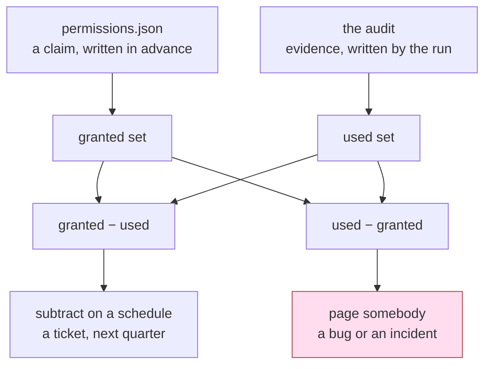

# 6.2 — Grant is a claim, use is evidence

## One-line answer

The permission table says what the desk **may** do and the audit says what it **did**, and the gap
between the two is the only honest way to find a permission nobody needs — which is why least
privilege is not a thing you achieve once but a thing you maintain by subtracting.

## The story

The store room at the back of the office holds the stationery, and it also holds the new laptops
still in their boxes and the spare SIM cards for the field staff.

Twelve people are on the list of who may draw from it. The list was not designed. It grew: when the
new team started, all four of them were added because it was easier than deciding which one would go
for pens. When someone was covering during an illness, they were added. Nobody was ever taken off.

There is also a small book on the shelf where the clerk writes what went out and to whom. Look
through last year's pages and three names appear. The same three, over and over. The other nine have
never drawn a single thing.

Nobody is doing anything wrong here. There is no thief, no incident, no complaint. But nine people
can walk in and leave with a laptop, and the office gets no benefit at all from that being true. The
list is not evidence of who needs the store room. The book is.

## The idea in plain language

Two different kinds of statement have been living in the same day, and it is worth separating them
sharply.

A **grant** is a claim: *this tool may do this.* It is written by a person, in advance, about a
future they are guessing at. Every row of `permissions.json` is a grant, and so is every credential
from [6.1](6.1-one-credential-per-tool.md).

An **audit** is evidence: *this tool was asked to do this, at this time, and here is what happened.*
It is written by the running system, after the fact, about a past that actually occurred.

Grants are guesses and audits are facts, and the useful work is in comparing them. Put the two sets
side by side and there are exactly two ways they can disagree, and the two findings could not be
more different from each other.

**Granted and never used.** A permission exists and nothing has ever exercised it. Nobody is harmed
today. But an unused grant is pure cost: it is authority sitting in the process with no benefit
attached to it, waiting for the day something goes wrong and reaches for it. This is not an alarm.
It is a **subtraction to schedule** — the nine names to take off the list.

**Used and not granted.** Something called a tool that the table does not permit. This is never a
cleanup task. It is one of exactly two things, and both need somebody awake:

- a **bug**: a tool was added and the table was not updated, which is
  [5.2](../05-failure-lab/5.2-the-tool-that-arrived-without-a-row.md)'s failure, and it means the
  table has been describing a system that does not exist since the day of that pull request;
- an **incident**: something in your system is exercising authority nobody wrote down, which is what
  the whole of this day has been about preventing.

You cannot tell those two apart from the audit line alone, and that is precisely why it pages
somebody rather than filing a ticket. The cheapest possible outcome is that it is the bug.

So the comparison is not one report with two columns. It is two reports with two owners, two
urgencies, and two different things to do — and a team that treats them as one thing will either
page itself over stationery or let an incident sit in a backlog.

The last thing to hold on to is why this is unavoidable rather than merely tidy. Every permission in
the table was written from **expectation** — somebody's model of what the desk would need, on the day
they wrote it. Expectations are generous, because being wrong in the generous direction breaks
nothing on the day and being wrong in the strict direction breaks the demo. So a permission table
drifts wide by construction, and nothing in it self-corrects. The audit is the only input that pushes
the other way.

## Why Sutra needs it

The lab has been recording this evidence all day and has not used it yet. `_desk.py` says so
directly:

> Section 6 turns on the gap between this and the permission table: a grant is a claim about what a
> tool may do, and this list is evidence of what it did.

Every tool on the desk calls `AUDIT.record(...)` on its first line, which is why part
[1.1](../01-the-deputy/1.1-the-errand-and-the-keys-that-went-with-it.md) could print `asked for` and
`carried out` as separate lines and let you see that four things were requested and one happened.
That distinction is this part's raw material.

There is also a specific promise to keep. Part
[2.4](../02-three-questions/2.4-the-table-you-can-diff.md) said the `rate` column is written from
expectation and that reality disagrees, and pointed here for the answer. This is it: you do not
guess the numbers better next time. You measure what actually happened and correct the table
afterwards, on a schedule, for ever.

And it is the piece Day 69 will need. Once data boundaries are drawn, the question *which tool has
ever actually touched this class of data* is answerable from the same audit, and the answer is
usually smaller than the grant — which is how a boundary gets tightened without breaking anybody.

## The mechanism

`table.py` already knows what is granted. The grant set comes straight from the file on disk:

```python
def granted() -> set[str]:
    rows = json.loads(TABLE.read_text(encoding="utf-8"))
    return {name for name, row in rows.items() if row["rate"] != "0"}
```

**Line by line:**

- The rows are read from `permissions.json`, **not** from the `ROWS` dictionary in the same module.
  That is deliberate: the file is the artefact a reviewer reads and the fence loads, so an analysis
  that reads the Python object would be answering a question about the wrong thing.
- `row["rate"] != "0"` is how "granted" is spelled. Part
  [2.1](../02-three-questions/2.1-may-it-capability-and-the-read-write-line.md) established that a
  rate of zero means not granted, and this function is the code that depends on it — which is why
  the `refund` row's rate and its `"none held by the desk"` credential must agree.
- It returns a `set`, because everything that follows is set arithmetic and set arithmetic is the
  entire technique. Two sets, two differences, two findings.

The comparison itself is the `--used` branch of `main()`, which is why it is indented:

```python
    if "--used" in sys.argv:
        fresh()
        AUDIT.clear()
        from _desk import close_ticket, read_ticket, send_reply

        read_ticket("4610")
        read_ticket("4633")
        close_ticket("4610")
        send_reply("4610", "acme-ops@example.invalid", "Fixed: see KB-220.")
        used = set(AUDIT.names())
        print(f"granted: {sorted(granted())}")
        print(f"used:    {sorted(used)}")
        print(f"granted and never used: {sorted(granted() - used)}")
        print(f"used and not granted:   {sorted(used - granted()) or 'none'}")
        return
```

**Line by line:**

- `fresh()` rebuilds the store from `SEED` and `AUDIT.clear()` empties the record, so the run
  measures this run and not whatever the previous script left behind. Every arm in this lab starts
  from the same state for the same reason.
- The four calls are a plausible afternoon on the desk: read two tickets, close one, reply to the
  customer. They stand in for the log a real system would already have, and in a real system this
  block is replaced by a query over the audit store rather than by calls.
- `set(AUDIT.names())` collapses the ordered list of calls into the set of tool names used. The order
  and the count are thrown away on purpose — this analysis asks *was it ever needed*, and once is
  enough to answer yes.
- `granted() - used` is **granted and never used**: the subtraction list.
- `used - granted()` is **used and not granted**: the alarm. It is printed with `or 'none'` so the
  empty case prints a word rather than an empty list, because a line that reads `[]` is a line people
  skim past.
- The two differences are computed in both directions from the same two sets, one line apart. That is
  the whole technique, and its cheapness is the argument for running it every week.

Run it:

```bash
cd days/day-68-least-privilege-tools/lab
uv run python table.py --used
```

**Line by line:**

- `cd` into the lab first: `table.py` imports `_desk` by plain name and resolves `permissions.json`
  beside itself.
- `--used` takes the branch above and returns before the table is printed, so the output is the
  comparison and nothing else.

Measured on 2026-09-06:

```text
granted: ['close_ticket', 'read_note', 'read_ticket', 'send_reply']
used:    ['close_ticket', 'read_ticket', 'send_reply']
granted and never used: ['read_note']
used and not granted:   none
```

Four tools granted, three used. `read_note` is the store room's ninth name: it is on the list, it has
a credential (`desk-read`), it is offered to the model in every run, and this afternoon it did
nothing at all.

Notice what the finding is *not*. It is not "delete `read_note`". It is "there is a grant here with no
evidence behind it, and somebody should now say why" — which is a question, asked of a person, with a
default answer of *remove* if nobody can answer it.



The two arrows out of the same pair of sets go to completely different places, and that asymmetry is
the part worth remembering when the sets are gone from your head.

## When it breaks

The objection arrives immediately and it is correct: **a permission used once a quarter looks unused
in a week.**

The store room has this exact problem. One of the nine names belongs to the person who draws the
projector and the spare cables every December for the annual meeting. Look at the book in July, see
eleven months of nothing, take the name off — and in December there is a person standing at the store
room who is now not on the list, on the one day of the year the room is genuinely needed, with an
audience waiting.

This is not a hypothetical in software either. The tools that fire rarely are exactly the tools that
matter: the year-end export, the disaster-recovery restore, the migration path used once per major
version, the refund flow that fires for a handful of tickets a month. A subtraction driven by a short
window removes precisely those.

Three things fix it, and none of them is "use a longer window and hope".

**Pick the window from the business cycle, not from the log retention.** The window has to be longer
than the longest legitimate gap between uses of the tool being judged. For a support desk that means
at least a full quarter for ordinary tools, and **thirteen months** for anything that touches an
annual event — thirteen rather than twelve so that a peak sitting near the boundary is inside the
window whichever week you run the report. Log retention will try to decide this for you, because
ninety days is what the pipeline keeps. Retention is a budget decision, and letting it set your
security window is letting the finance team pick it by accident.

**Ask before you remove, and make the asking cheap.** Every row needs an owner, in the same file as
the row. The report's output is not a revocation; it is a message to the owner of each unused row
saying *this has not fired in thirteen months, may we remove it?* Silence for two weeks is consent —
which is what makes the process survive contact with busy people, because the default has to be
subtraction or nothing ever gets removed.

**Run one window in "allow and shout" before revoking.** Keep the grant, and log loudly every time it
is used. Anything that fires during that window has just proved it was needed, and it proved it
without an outage. This is the same idea as a database migration's dual-write phase, and it converts
the risk of removing a permission from "somebody's December is ruined" into "we got an alert".

And one more, which is the reason teams stop subtracting after the first bad experience: **have a
tested way to put a permission back in minutes.** Not a pull request, a review, a deploy and a
restart — a documented break-glass path that somebody has actually walked through once. Removal is
only safe when it is reversible, which is the same argument
[2.1](../02-three-questions/2.1-may-it-capability-and-the-read-write-line.md) made about writes,
pointed at your own process instead of at the desk's tools.

## In production

**What a professional writes instead.** Not a script somebody remembers to run. A scheduled job —
weekly is the usual cadence — that reads the audit store for the window, reads the checked-in
permission table, and emits the two differences. The unused list opens a pull request against
`permissions.json` with the rows deleted, assigned to each row's owner, so the default outcome of
everybody being busy is that the grant goes away. The other list does not open a pull request; it
raises an alert.

**The same technique, on cloud IAM.** This is not a Sutra invention and you should recognise it in
the tools you already have. Every major cloud provider computes exactly this comparison and exposes
it as a product feature: a "last accessed" or "last used" timestamp per permission on a role, and a
recommendation engine that proposes the narrowed policy. They built it for the same reason — policies
are written from expectation, drift wide, and nobody has ever narrowed one by reading it. The lesson
to carry across is not the specific tool: it is that a role with a permission whose last-used
timestamp is empty is the same finding as `granted and never used: ['read_note']`, and it deserves
the same handling.

**Why the audit must record the attempt, not only the success.** This is the detail that decides
whether the whole exercise is sound, and it is easy to get wrong because logging successes is what
every system does by default.

If you only record what succeeded, then a tool that was *called and refused* looks identical to a
tool nobody wanted. Three consequences follow, and the third is the serious one:

1. You will subtract a grant at the exact moment demand for it exists — the calls were happening, and
   your evidence recorded none of them because a check turned them away.
2. You lose the evidence that your controls fired at all. A refusal is a control working, and
   [5.1](../05-failure-lab/5.1-the-check-inside-the-door-it-guards.md)'s check is unmeasurable
   otherwise: a check nobody logs is indistinguishable from a check nobody wrote.
3. **A run of denied calls is an attack in progress**, and in a success-only log it is invisible.
   Repeated attempts on `refund` — a tool with rate zero, a credential nobody holds, and no way to
   succeed — are the single most informative event this system can produce, and they produce exactly
   zero successful calls.

Day 66 made the same point from the other direction in part
[2.4](../../../day-66-injection-threat-model/parts/02-how-it-arrives/2.4-the-camera-that-recorded-everything.md),
where a refused call is recorded and then sits in the log looking like every other refused call. The
desk's `AUDIT.record(...)` sits on the first line of every tool for this reason: it fires before the
work, so a tool that runs and then returns `{"error": ...}` is still recorded as an attempt. What it
cannot see is a call refused before any tool ran — a name that was not on the agent's tool list at
all. That one shows up as the runtime error from part
[3.3](../03-absent-not-forbidden/3.3-what-happens-when-it-asks-anyway.md), and it has to be captured
there or it is lost.

**What degrades at scale.** The audit becomes the largest thing you store, and the pressure is to
sample it. Sampling destroys this analysis specifically, because the events it is about — the rare
grant, the single denied call — are exactly what sampling drops. The rule is that the entitlement
audit is not sampled, and the way you afford that is to keep the audit records narrow: tool name,
caller, timestamp, allowed or refused. That is four fields, and the argument for the fifth one is
always compelling and always the beginning of a storage problem.

**The failure mode that only appears with real traffic.** The report says `granted and never used` and
the true reason is that the log pipeline dropped a batch, or that retention is ninety days and your
window is thirteen months, or that a code path writes to a different audit sink nobody wired in. The
analysis fails **silently, in the direction of removing permissions that are in use**, which is the
worst direction available. The defence is a canary: exercise one known grant on a schedule and assert
that it appears in the window's report. If your canary is missing, every "unused" finding in that
report is worthless, and you know it before you act on any of them.

**The review comment a senior engineer leaves:** *"This pull request adds `read_note` to the desk.
Fine — but nothing in this repository will ever tell us whether it is still needed in a year. Add the
row to `permissions.json` with an owner, and confirm the tool's audit line fires before the work
rather than after, so a refused call is still recorded. Otherwise we will be reading a log of
successes and calling it usage."*

**The interview question:** *"How do you actually reduce an agent's permissions once it is in
production?"* The answer that shows you have done it rather than read about it: *"By comparing the
grants to the audit, in both directions, on a schedule. Granted and never used is a subtraction — it
opens a pull request against the permission table assigned to the row's owner, and silence is
consent, because otherwise nothing is ever removed. Used and not granted is the opposite kind of
finding: it is a bug or an incident and it pages someone. The two things people get wrong are the
window and the log. The window has to come from the business cycle — thirteen months for anything
annual, not ninety days because that is what retention keeps — and the audit has to record the
attempt, not the success, or a permission that is being called and refused looks exactly like a
permission nobody wants, and a run of denied calls on the one tool we deliberately do not grant is
invisible. On our desk the report is one line of set arithmetic: granted minus used gave
`['read_note']`, and used minus granted gave nothing, which is the answer you want on that side."*

## Check yourself

```bash
cd days/day-68-least-privilege-tools/lab
uv run python table.py
uv run python table.py --used
```

Now make the second finding appear. Add a call to `refund(1, "someone@example.invalid")` inside the
`--used` branch, before `used = set(AUDIT.names())`, and run it again. Write down which of the two
output lines changed, whether what you are looking at is a bug or an incident, and how you would tell
the difference at three in the morning with only that line in front of you.

Then take the honest version of the same question: `read_note` is granted and unused. Write the
message you would send to that row's owner, and say what you would do if they did not reply.

**Out loud, without scrolling up:** say why *granted and never used* and *used and not granted* are
not two halves of one report, and name the different person each one wakes up.

**Next:** the day's parts are done. Now read the paper they came from —
[The Confused Deputy — the paper](../../papers/01-the-confused-deputy.md).
