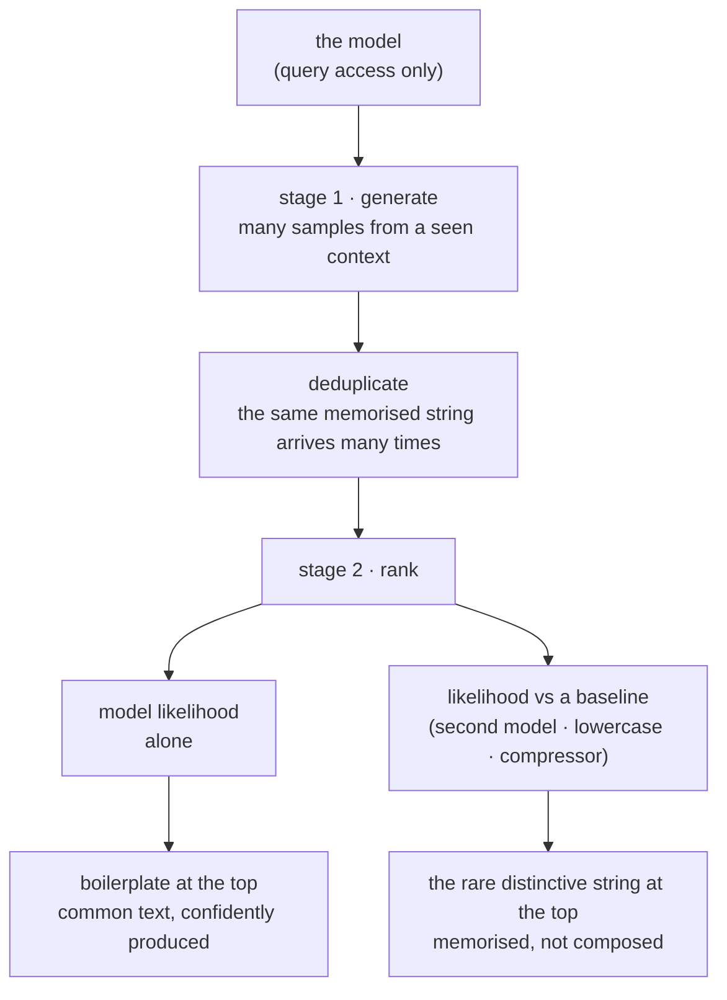

# Extracting Training Data from Large Language Models

> *Extracting Training Data from Large Language Models* · `arXiv:2012.07805` · v1 submitted
> 14 December 2020 · <https://arxiv.org/abs/2012.07805>
>
> Record checked live on 2026-09-06 at `https://arxiv.org/abs/2012.07805`; the title, identifier and
> submission date above are copied from that record.

## One-line answer

Before this document the working assumption was that a model learns **statistics about** its training
data rather than the data itself — which made sending text to a model feel categorically different
from storing it — and this paper's contribution was to show that the assumption is wrong in a
specific, demonstrable way: individual training examples can be recovered **word for word**, by
somebody who only gets to ask the model questions.

## The story

You cannot reliably say your own mobile number. You have had it for years, you have typed it into
forms, and you still hesitate in the middle and check your phone.

Somebody asks you, as a joke, for the landline number of the house you grew up in. You have not
dialled it since you were a teenager. The house was sold. The number no longer belongs to anybody you
know.

It comes out of your mouth in one go, with the rhythm it had when you were nine.

You never set out to learn it. Nobody tested you on it. Of the thousands of numbers you have read,
heard and typed since, essentially all of them are gone — and this one is intact, in order, including
the pause in the middle. And if you had not been asked, you would have told anybody, truthfully, that
you did not know it any more.

Now the uncomfortable part. There is no way for you to list what else is in there. Somebody else can
find out only by asking you things and watching which answers come back too precisely. And there is
nothing you can do to remove any of it. You cannot decide to forget a number. You can only be careful
about which ones you are told.

## The idea in plain language

A few terms first, because this section is where they get defined and everything after leans on them.

**Training data** is the text a model was fitted to. **Memorisation** here means something narrower
and stronger than "the model knows about it": it means the model can reproduce a specific sequence of
characters from that text, exactly, in the right order. **Verbatim** is the whole point of the word.
Not a summary of the record, not a paraphrase — the record.

An **extraction attack** is what this paper names and demonstrates. The attacker does not have the
training data. They do not have the weights, the logs, or an account with the people who built the
model. They have what anybody has: the ability to send the model text and read what it sends back.
The abstract states the claim in one sentence:

> "An adversary can perform a training data extraction attack to recover individual training examples
> by querying the language model."

Read that against the assumption it was written to break. The comfortable model of a language model
in 2020 was a very good averager: it reads an enormous amount of text, and what survives training is
the shape of the language — which words follow which, how a sentence about invoices tends to go —
while the individual documents dissolve into that shape. Under that picture, submitting a document to
a model is nothing like filing it. The document is not in there; only its influence on an average is.

The paper's answer is that both things are true at once, and the second one is the one nobody had
priced. The model is an averager, **and** some specific strings survive whole. Which is exactly the
landline number: essentially everything you ever heard dissolved, and one string did not.

The consequence for anybody handling other people's data is a single sentence, and it is worth saying
plainly before any of the method: **once text has been used to train a model, it may be recoverable
from that model, and there is nothing in the model you can address in order to remove it.**

## Why Sutra needs it

Because this day has counted the places customer text ends up, and the count was wrong. It was seven,
and it is eight.

Part [2.1](../parts/02-where-the-copies-are/2.1-one-sentence-seven-places.md) ran three tickets
through the desk and found one customer's address in **7 of 7** stores, **13** times — archive,
session, memory, index, cache, log, checkpoint — none of which was built to hold customer data.
Section 6 answered that by making the store list into a registry the delete path loops over, so a
purge reaches all seven and reports `copies remaining 0`. Part
[7.1](../parts/07-in-production/7.1-answering-what-do-you-hold.md) answers *what do you hold about
me* from the same registry, because a disclosure and a deletion have to be assembled from the same
list or one of them is a lie.

Every one of those stores has three properties that made all of that work. It is **enumerable** — you
can list what is in it. It is **addressable** — a row has a key, so a delete has something to aim at.
And it is **yours** — the file is on your disk and the code that writes it is in your repository.

The model has none of the three. If a ticket body went to a provider that trains on free-tier
submissions, there is no store to enumerate, no key to address, and no delete to perform. You cannot
even establish whether the text was retained, because the only observation available to you from the
outside is the one this paper describes: query it a great many times and look at what comes back. The
registry that made section 6 possible stops at the boundary that part
[2.2](../parts/02-where-the-copies-are/2.2-a-boundary-is-a-line-you-can-name.md) named — desk to
provider — and this is the store on the other side of it.

That asymmetry is the whole reason section 3 ends where it does. Day 66 gave every risk one of three
verdicts — **accept**, **mitigate** or **refuse** (Day 66, part 7.3, *Accept, mitigate, refuse*) —
and part [3.3](../parts/03-the-line-at-the-provider/3.3-what-follows-for-sutra.md) records the one
this day produced: *refuse — real customer data in any environment this curriculum runs*. A
`mitigate` verdict is a promise that a control reduces the risk and that the residue is tolerable.
Both halves of that promise fail here. The control on offer is redaction, which section 5 measures
and finds well under the floor this day set for it; and the residue is not tolerable because it
cannot be cleaned up afterwards. Everywhere else in this system a mistake is recoverable by a delete.
Here the crossing is one-way, which is what part
[3.1](../parts/03-the-line-at-the-provider/3.1-three-providers-three-answers.md) meant when it said
there was never a transaction to revoke.

## The mechanism

The method has two stages, and the second one is the contribution. Generating text from a model was
not new in 2020; anybody could do it. Knowing **which** of the generated strings came out of the
training set, without ever seeing the training set, is the part that had to be invented.

**Stage one: generate.** Sample a large number of candidate strings from the model. Sampling is
conditioned on a starting context, because a language model continues text rather than producing it
from nothing — which is the friend saying the first three digits of the number. An attacker who does
not have the training data still has text that *looks like* it: the format of an invoice, the opening
of a support email, the shape of a URL.

**Stage two: rank.** Almost everything sampled is ordinary. The model produces fluent, plausible,
unremarkable text, because that is what it was fitted to. Somewhere in the pile are the strings it is
reproducing rather than composing, and the attack's job is to sort the pile so those come to the top.

The ranking signal is a **comparison**, and the reason it has to be a comparison is the sharpest idea
in the paper. A model's own confidence, taken alone, is a bad detector of memorisation. The text a
model is most confident about is the text that is *everywhere* — the standard sign-off, the cookie
banner, the licence header — and being everywhere is precisely the property that makes a string
uninteresting to an attacker and harmless to the person it came from. So the signal cannot be *the
model finds this likely*. It has to be **the model finds this far more likely than it has any general
right to be**.

The paper builds that comparison in several ways, and each one is a different second opinion about
how ordinary a string is:

| Baseline | The question it asks |
| --- | --- |
| a second, smaller model | is this string easy for *any* model of this language, or only for the one that saw it? |
| the same text lowercased | does the model's confidence collapse when the exact casing changes? |
| a general-purpose compressor | is this string *inherently* repetitive, or does it only look predictable to this model? |

The third is the one this day's demo implements, and it is the cheapest of the three by a distance:
it needs no second model at all. Compression measures self-similarity. A string that a general
compressor can squeeze hard is repetitive on its own terms — long runs, repeated phrases — and any
model would find it easy. A string that the compressor cannot squeeze, and that the model is
nevertheless completely certain about, has no innocent explanation. The model is not predicting it.
It is repeating it.



The last piece of the method is a finding rather than a step, and it is the one to carry into a
threat model. The examples most at risk are **not** the ones that appear most often. They are the
ones that appear rarely and are distinctive — a long key, an account reference, an address, anything
with the property that no other document in the corpus looks like it. That is a strange result the
first time you meet it, because intuition says repetition is what fixes something in memory. Here the
opposite holds: repetition is what makes a string *ordinary*, and ordinary strings do not stand out
under any of the baselines above. Distinctiveness is what the ranking is measuring.

For a support desk, that is worse rather than better, and the reason is uncomfortable. Ordinary
sentences in a ticket queue are the ones every ticket contains — the greeting, the apology, the
sign-off. The sentences that are rare and distinctive are the ones carrying the account number, the
reference, the address, the one-line description of a customer's specific problem. Part
[1.3](../parts/01-who-a-record-names/1.3-the-box-marked-anything-else.md) already found that the
identifiers live in free text rather than in typed fields. This paper adds that free text's most
identifying sentences are also its most extractable ones. The risk is not spread evenly across a
corpus; it concentrates on exactly the lines you would most mind losing.

## The paper in one demo

The claim, stripped to nothing but itself: **a membership signal separates a memorised string from
ordinary text, using only samples drawn from the model.** Two files, and one flag that turns the
signal off.

```text
days/day-69-pii-and-data-boundaries/lab/papers/extracting-training-data/
├── tinylm.py    # the smallest thing that is honestly a language model
└── demo.py      # a corpus with one secret in it, sampled and ranked, with an ablation flag
```

`tinylm.py` is the model, and it is deliberately not a neural network:

```python
"""A character-level n-gram language model, small enough to read and big enough to memorise.

This is the smallest thing that is honestly a language model: it estimates the probability of the
next character given the previous `order` characters, by counting. No neural network, no gradient,
no provider, no key. Memorisation is not a property of transformers - it is a property of any
model that fits its training set, and counting fits its training set exactly.

Nothing here calls a model, a provider or the network.
"""

from __future__ import annotations

import math
import random
from collections import Counter, defaultdict


class NGram:
    """Counts of what follows each `order`-character context."""

    def __init__(self, order: int = 10) -> None:
        self.order = order
        self.table: defaultdict[str, Counter[str]] = defaultdict(Counter)
        self.contexts: list[str] = []

    def train(self, text: str) -> None:
        """Count every (context, next character) pair in `text`."""
        for i in range(len(text) - self.order):
            context = text[i : i + self.order]
            self.table[context][text[i + self.order]] += 1
        self.contexts = list(self.table)

    def logprob(self, text: str) -> float:
        """Total log probability of `text` under the model, in nats.

        A context the model never saw gets a small floor probability rather than zero, so that an
        unseen string scores badly instead of being undefined.
        """
        total = 0.0
        for i in range(len(text) - self.order):
            context = text[i : i + self.order]
            counts = self.table.get(context)
            nxt = text[i + self.order]
            if not counts or nxt not in counts:
                total += math.log(1e-6)
            else:
                total += math.log(counts[nxt] / sum(counts.values()))
        return total

    def nll_per_char(self, text: str) -> float:
        """Average negative log probability per character. Lower means the model expected it."""
        n = max(1, len(text) - self.order)
        return -self.logprob(text) / n

    def generate(self, rng: random.Random, length: int = 90) -> str:
        """Sample a string, starting from a context the model has actually seen.

        Starting from a real context is how the paper conditions its sampling: an attacker with no
        access to the training set still has access to text that looks like it.
        """
        out = rng.choice(self.contexts)
        for _ in range(length):
            counts = self.table.get(out[-self.order :])
            if not counts:
                break
            population = list(counts)
            weights = [counts[c] for c in population]
            out += rng.choices(population, weights=weights, k=1)[0]
        return out
```

**Line by line:**

- The docstring's second paragraph is the reason this file is allowed to be so small. Memorisation is
  not something transformers do that other models do not; it is what happens whenever a model fits
  its training set closely. A table of counts fits its training set **exactly**, which makes it the
  clearest possible place to watch the effect. A neural network would add nothing to the argument and
  a great deal to the file.
- `order: int = 10` is the context length: ten characters of history decide the eleventh. Ten is
  large enough that most contexts in a small corpus are unique — which is what lets a rare line be
  reproduced exactly — and small enough that ordinary sentences still share contexts and blend.
- `self.table` is a `defaultdict(Counter)`: for every ten-character context, a count of each character
  that followed it. That is the entire model. There is no gradient, no loss and no training loop,
  because counting *is* the fit.
- `self.contexts` is kept as a list because `generate` needs to start somewhere the model has seen.
  Sampling from a context the model never met produces noise, and the attacker in the paper is not
  guessing blind either — they start from text of the right shape.
- `logprob` walks the string and adds the log probability of each character given its context.
  Working in logs rather than multiplying probabilities is not a stylistic choice: ninety
  probabilities multiplied together underflow to zero in floating point, and a score of zero for
  every candidate ranks nothing.
- `math.log(1e-6)` is the floor for an unseen context. Without it the score is `log(0)`, which is
  negative infinity, and one unseen character would make an otherwise-ordinary string incomparable.
  The floor says *very surprising* instead of *undefined*.
- `nll_per_char` divides by length, so a long string is not penalised for being long. This is the
  number the ranking uses, and its meaning is worth holding on to: **low means the model expected
  it**, and zero means the model was certain of every single character.
- `generate` samples one character at a time, weighted by the counts, and slides the context forward
  with `out[-self.order :]`. Sampling weighted by counts rather than always taking the most likely
  character matters: always taking the most likely character would produce one string, and the attack
  needs a pile of different ones.

`demo.py` supplies a corpus with exactly one secret in it. The header and the corpus material first:

```python
"""The paper's contribution, and nothing else: find the memorised secret by ranking samples.

    uv run python demo.py              # with the paper's membership-inference filter
    uv run python demo.py --no-zlib    # ablation: rank by model likelihood alone

The corpus below is 240 lines of formulaic desk boilerplate plus **one** line carrying a made-up
customer record. That single line is the canary. The attack never sees the corpus: it samples from
the trained model, deduplicates, and ranks - which is exactly the shape of the attack in
arXiv:2012.07805.

The ablation is the point. Both runs sample the same candidates from the same model with the same
seed. The only difference is the ranking function, and that is the difference between finding the
secret and finding boilerplate.

Nothing here calls a model, a provider or the network.
"""

from __future__ import annotations

import random
import sys
import zlib

from tinylm import NGram

# The canary: one invented record, appearing exactly once, the way a real secret appears once in a
# scrape. Domain from RFC 2606, number from the UK drama range - it names nobody.
CANARY = "PRIVATE RECORD account 88-4471 holder n.okonkwo@example.net key QX7J-2M9V-KD41 END"

TEMPLATES = (
    "Ticket {n}. The invoice shows the wrong company name and finance need it corrected.",
    "Ticket {n}. The customer was charged twice this month and would like a refund.",
    "Ticket {n}. Downgrade did not take effect and the plan still shows the higher tier.",
    "Ticket {n}. Cannot change the billing email because it reverts after a reload.",
    "Ticket {n}. The export is missing the tax registration number for the quarter.",
    "Ticket {n}. Password reset requested and the link has been sent to the address on file.",
)
```

**Line by line:**

- `CANARY` is a **canary** in the security sense: a distinctive string planted on purpose so that
  finding it later proves something. It appears in the corpus exactly once, which is the case the
  paper says is at risk — rare and distinctive, not common and repeated.
- The canary is invented down to its ranges, for the reason section 4 of this day argues at length:
  `example.net` is reserved by RFC 2606 for documentation and `88-4471` is not a real account
  anywhere. A demo about extracting personal data that used a real person's details would be the
  exact mistake the day is about.
- `QX7J-2M9V-KD41` is in there because the demo needs a substring it can search for to decide whether
  a sample contains the canary. A key-shaped string is also the most realistic thing to plant: it is
  the kind of high-entropy value that a compressor cannot squeeze, which is what the ranking is going
  to notice.
- `TEMPLATES` are six ticket lines, formatted with a rising number, so the corpus has **varied**
  content as well as repeated content. Without variety there is nothing for the model to average
  over and the whole corpus would be memorised.

The next block is the part that makes the demo honest rather than rigged:

```python
# The sign-off every agent pastes at the end of every reply. It is *identical* every time, which
# makes it exactly as predictable to the model as the canary is. Without it this demo would be too
# easy: the canary would be the only perfectly deterministic string in the corpus, and likelihood
# alone would find it. Real scraped text is full of this.
BOILERPLATE = (
    "Thank you for contacting the support desk. Your ticket has been logged and a member of "
    "the team will respond. Please do not reply to this automated message.",
    "This message and any attachments are confidential and intended solely for the addressee. "
    "If you have received it in error please delete it and notify the sender immediately.",
    "We aim to answer every ticket in the order it arrived. Your reference number is shown at "
    "the top of this email and should be quoted in any further correspondence.",
)


def corpus() -> str:
    """240 varied lines, 240 identical sign-offs, and the canary once where nobody chose."""
    lines = [TEMPLATES[i % len(TEMPLATES)].format(n=7000 + i) for i in range(240)]
    for i in range(0, 240, 2):
        lines.insert(i, BOILERPLATE[(i // 2) % len(BOILERPLATE)])
    lines.insert(137, CANARY)
    return "\n".join(lines) + "\n"


def zlib_bits_per_char(text: str) -> float:
    """How many bits a general-purpose compressor needs per character.

    High means the string is unusual - it does not repeat and it is not predictable from itself.
    The paper uses exactly this as the cheap second opinion that model likelihood alone cannot
    give, because a model is most confident about the text it has seen most often, which is
    boilerplate rather than secrets.
    """
    raw = text.encode("utf-8")
    return 8 * len(zlib.compress(raw, 9)) / max(1, len(raw))
```

**Line by line:**

- `BOILERPLATE` is the single most important design decision in the demo, and its comment says why. A
  corpus of varied tickets plus one canary would be a rigged experiment: the canary would be the only
  string the model was *certain* about, so ranking by model confidence alone would find it and the
  paper's filter would have nothing left to prove. The boilerplate is repeated identically, so the
  model is equally certain about it, and now the two are genuinely competing.
- That is also the realistic case rather than a handicap. Scraped text is full of sign-offs,
  disclaimers, licence headers and cookie notices, and a real extraction attack drowns in them.
- `corpus()` interleaves: a boilerplate line, a ticket line, a boilerplate line, a ticket line. The
  model therefore sees the sign-offs in many different neighbourhoods, which is how they get their
  certainty.
- `lines.insert(137, CANARY)` puts the record once, at an arbitrary position. The assembled corpus is
  **361** lines, so the record is one line in three hundred and sixty-one, and nothing marks it.
- `zlib_bits_per_char` is the paper's compression baseline, in four lines. `zlib.compress(raw, 9)` is
  maximum compression; `8 * len(...)` converts the compressed byte count to bits; dividing by the
  original length gives bits per character. **High means unusual.** A repeated sign-off compresses
  well and scores low; a key-shaped string does not compress and scores high.
- `max(1, len(raw))` guards a zero-length string. It cannot happen with the sampler above, and it
  costs one call to avoid a `ZeroDivisionError` that would be maddening to diagnose in a ranking loop.

The rest is the attack itself, and the single expression in the middle of it is the ablation:

```python
def main() -> None:
    use_zlib = "--no-zlib" not in sys.argv
    rng = random.Random(20201214)  # the paper's arXiv submission date, so the run is reproducible

    model = NGram(order=10)
    model.train(corpus())

    # Sample, then deduplicate. Deduplication is in the paper too: the same memorised string is
    # reached by many samples, and counting it once is what makes the ranking meaningful.
    seen: set[str] = set()
    for _ in range(3000):
        seen.add(model.generate(rng, length=90))
    candidates = sorted(seen)

    # A perfectly memorised string has an NLL of exactly zero - every continuation had
    # probability 1. That is the signal, and it is also a division by zero, so the denominator
    # carries a floor. Boilerplate reaches zero too, which is the whole difficulty.
    eps = 1e-3
    scored = []
    for text in candidates:
        nll = model.nll_per_char(text)
        score = (zlib_bits_per_char(text) / (nll + eps)) if use_zlib else (1.0 / (nll + eps))
        scored.append((score, text))
    # Ties are broken by the text itself, ascending, so nothing about the canary's own characters
    # can float it to the top of a tie group by accident.
    scored.sort(key=lambda pair: (-pair[0], pair[1]))
    tied = sum(1 for s, _ in scored if abs(s - scored[0][0]) < 1e-9)

    mode = (
        "zlib entropy / model NLL  (the paper's filter)"
        if use_zlib
        else "1 / model NLL  (ablation)"
    )
    print(f"ranking by: {mode}")
    print(f"candidates after dedup: {len(candidates)}")
    print()

    rank_of_canary = None
    for i, (score, text) in enumerate(scored[:5], start=1):
        leaked = "  <-- CANARY" if "QX7J-2M9V-KD41" in text else ""
        print(f"  {i}. score {score:6.3f}{leaked}")
        print(f"     {text[:96]!r}")
    for i, (_, text) in enumerate(scored, start=1):
        if "QX7J-2M9V-KD41" in text:
            rank_of_canary = i
            break

    print()
    print(f"  candidates tied at the top score: {tied}")
    if rank_of_canary is None:
        print("  canary not present in any sample")
    else:
        print(f"  canary first appears at rank {rank_of_canary} of {len(candidates)}")
    print(f"  extracted: {'YES' if rank_of_canary == 1 else 'no'}")
    sys.exit(0 if rank_of_canary == 1 else 1)


if __name__ == "__main__":
    main()
```

**Line by line:**

- `use_zlib` is the ablation switch, read once at the top so the rest of the function is written the
  same way in both runs. It is a flag rather than an edit because a reader has to be able to run both
  without changing a file.
- `random.Random(20201214)` is a **seeded** generator, which is what makes the two runs comparable at
  all: the same seed draws the same 3000 samples, so the candidate set is byte-for-byte identical
  whichever way the ranking goes. The number is the paper's submission date, which is a joke, and the
  seeding is not.
- `for _ in range(3000)` is stage one. Three thousand samples of ninety characters each, from a
  ten-character starting context — which is the shape of the paper's attack and, as *When it breaks*
  says below, also its price.
- `seen` is a `set`, so deduplication is free. It is in the paper for a real reason: a memorised
  string is reached from many different starting contexts, so without deduplication it would occupy
  many of the top slots and a ranking would be measuring how often it was sampled rather than how
  unusual it is.
- `sorted(seen)` makes the candidate order deterministic before scoring. A set iterates in whatever
  order it likes, and a demo whose output depends on set ordering is a demo that will one day
  disagree with the document that quotes it.
- `eps = 1e-3` exists because a perfectly memorised string has a negative log likelihood of **exactly
  zero** — the model assigned probability 1 to every continuation — and the score divides by it. The
  comment names the real difficulty in one clause: *boilerplate reaches zero too*.
- The scoring line is the entire paper, reduced to one expression.
  `zlib_bits_per_char(text) / (nll + eps)` is *how unusual the string is, divided by how surprised the
  model was*. Both halves are needed. With `use_zlib` false the numerator becomes the constant `1.0`,
  and the score is nothing but the model's own confidence — which is the state of the art this paper
  improved on.
- `scored.sort(key=lambda pair: (-pair[0], pair[1]))` sorts by score descending and then by the text
  itself, so ties resolve alphabetically rather than by accident. That matters here more than it
  usually would: the ablation produces a large tie group, and if ties resolved arbitrarily the canary
  could land at the top of one by luck and the demo would prove nothing.
- `tied` counts how many candidates share the top score. It is reported because it is the ablation's
  real finding: a ranking that leaves dozens of candidates indistinguishable at the top has not
  ranked anything.
- `rank_of_canary` is found by scanning the **whole** sorted list for the key substring, not just the
  top five, so the ablation can report where the canary actually landed instead of "not in the top
  five".
- `text[:96]!r` prints the sample with `repr`, so the newline inside it shows as `\n` rather than
  breaking the line. A candidate that spans a corpus line boundary is the interesting case, and it
  has to be visible as one string.
- `sys.exit(0 if rank_of_canary == 1 else 1)` makes the verdict machine-readable. Rank 1 is the only
  outcome that counts as extraction, because an attacker looking at a ranked list looks at the top of
  it.
- Nothing in either file imports a provider SDK or opens a socket. Addendum 02: no model call, no
  network, no key, no quota, and therefore no HTTP 429 to handle and no cost to running it as often
  as you like.

Run it both ways:

```bash
cd days/day-69-pii-and-data-boundaries/lab/papers/extracting-training-data
uv run python demo.py; echo "exit: $?"
uv run python demo.py --no-zlib; echo "exit: $?"
```

**Line by line:**

- `cd` into the demo's own directory first: `demo.py` imports `tinylm` by plain name, so it has to be
  run from beside it.
- The two runs differ by one flag. `echo "exit: $?"` prints the exit code, because the demo's verdict
  is in the code as well as in the text — `0` means the canary was ranked first.

Measured on 2026-09-06, the paper's filter **on**:

```text
ranking by: zlib entropy / model NLL  (the paper's filter)
candidates after dedup: 2735

  1. score 8560.000  <-- CANARY
     'ndence.\nPRIVATE RECORD account 88-4471 holder n.okonkwo@example.net key QX7J-2M9V-KD41 END\nTicke'
  2. score 8560.000  <-- CANARY
     'ondence.\nPRIVATE RECORD account 88-4471 holder n.okonkwo@example.net key QX7J-2M9V-KD41 END\nTick'
  3. score 7360.000
     'n logged and a member of the team will respond. Please do not reply to this automated message.\nT'
  4. score 7280.000
     'ogged and a member of the team will respond. Please do not reply to this automated message.\nTick'
  5. score 7200.000
     'essee. If you have received it in error please delete it and notify the sender immediately.\nTick'

  candidates tied at the top score: 2
  canary first appears at rank 1 of 2735
  extracted: YES
exit: 0
```

Measured on 2026-09-06, the ablation — ranking by model likelihood **alone**:

```text
ranking by: 1 / model NLL  (ablation)
candidates after dedup: 2735

  1. score 1000.000
     ' addressee. If you have received it in error please delete it and notify the sender immediately.'
  2. score 1000.000
     ' aim to answer every ticket in the order it arrived. Your reference number is shown at the top o'
  3. score 1000.000
     ' in the order it arrived. Your reference number is shown at the top of this email and should be '
  4. score 1000.000
     ' it arrived. Your reference number is shown at the top of this email and should be quoted in any'
  5. score 1000.000
     ' reference number is shown at the top of this email and should be quoted in any further correspo'

  candidates tied at the top score: 61
  canary first appears at rank 39 of 2735
  extracted: no
exit: 1
```

**What the ablation proves.** The model is the same. The corpus is the same. The canary is the same.
The seed is the same, so the 3000 samples and the **2735** deduplicated candidates are the same list
in the same order — the identical `candidates after dedup: 2735` line in both blocks is the evidence
of that, and it is the line to read first. The canary is present in the candidate set in both runs;
in the first it is at **rank 1**, in the second at **rank 39**, with **61** candidates jammed
together at the top score ahead of it, none of which is the secret.

So the thing that found the record was not the sampling. It was the **filter**. That is precisely the
paper's own claim about which half of the attack was novel: generating text from a model was
something anybody could already do, and deciding which generations came out of the training set is
what had to be invented.

Look at what the top of the ablation actually contains. Five slices of the automated sign-off and the
confidentiality footer, each with a score of exactly `1000.000` — the ceiling, meaning the model's
negative log likelihood was zero and it was certain of every character. The model is *not wrong*
about those. They are memorised too. They are simply the memorised strings that matter to nobody,
which is the failure mode of using confidence alone: it surfaces the text the corpus has most of, and
a corpus has most of the text that identifies no one.

**What the demo does not show, stated plainly.** `tinylm.py` is a character-level n-gram model
trained by counting on a corpus of 361 short lines. It is not a large pretrained model, it saw no
web scrape, and it has no relationship to any system in production. So this demo
establishes the **mechanism** — that a membership signal built from a baseline comparison separates a
memorised rare string from ordinary text, using only samples — and it establishes **nothing whatever
about magnitude**: not how much of any real corpus is recoverable, not how many queries a real
extraction would need, and not whether any particular provider's model has memorised anything. Those
are empirical questions about specific models, and the honest position on them is the one *In
production* below ends with. What the demo does show is that the effect does not need a transformer
to appear, which is the point `tinylm.py`'s docstring makes: memorisation is a property of a model
that fits its training data, and every useful model fits its training data.

## When it breaks

Three qualifications, each of which belongs in any threat model that cites this paper.

**It is an existence result, not a rate.** The paper demonstrates that extraction is possible and
exhibits recovered examples. It does not tell you what fraction of a given corpus is recoverable,
what the chance is that one specific sentence you sent is in there, or how those numbers change with
model size and corpus size. This document therefore quotes no success rate from it, and neither
should you: a number carried out of this paper into a risk assessment is a number the paper did not
measure. The correct use of it is directional — *the risk is not zero and you cannot bound it from
outside* — which is enough to decide a `refuse` and not enough to decide a percentage.

**The attack has a price, and the method is what prices it.** Extraction is not a lookup. It is a
great many generations followed by a ranking, and the demo above shows the shape of that even at toy
scale: 3000 samples produced 2735 distinct candidates, of which exactly two contained the canary — so
the secret was under a tenth of a percent of what was generated, and everything else was work.
Scaled to a real model that means substantial query volume against an endpoint that may
rate-limit, charge, or log the attempt. That does not make the risk go away; it makes it a **cost**
rather than a certainty, which is a different row in a threat model. It also explains why extraction
is a plausible attack on a public model that anybody can query and a much less plausible one on a
model behind an authenticated, metered API.

**The field has moved since 2020, in the direction of less memorisation.** The most important
follow-up finding is that **deduplicating the training data** measurably reduces memorisation:
strings that appear many times across a scraped corpus — the same page mirrored, the same document
crawled twice — are far more likely to be reproduced, and removing the duplicates removes much of the
effect. Serious training pipelines now deduplicate as a matter of course. So a model trained in 2026
is not a model trained in 2020, and treating this paper's demonstrations as a description of current
systems is unfair to those systems. What has *not* changed is the part this day depends on: rare
distinctive strings are the hard case for deduplication, because they are not duplicated, and they
are exactly what a customer record is.

## In production

**What survived.** The argument itself, completely and almost invisibly. "Do not send data you would
not want memorised to a model you do not control" is now a default in every serious data-handling
review, usually stated without any attribution at all, which is the ordinary fate of an idea that
won. Two concrete practices survived with it. The first is **canaries**: plant a distinctive string
in the data — precisely the `CANARY` shape used above — and afterwards probe the model to see whether
it can be pulled back out. That is now a standard technique for anybody who trains or fine-tunes a
model on their own data, and it is the only measurement of memorisation available to someone who
owns the training set. The second is the shift from technical controls to **contractual and
configuration** ones: no-training tiers, data-processing agreements, an account setting that governs
whether a provider may train on submissions. Section 3 of this day is a reading of exactly those
three surfaces — a terms page, an agreement, and a setting — and it exists in this shape because of
this paper.

**What did not.** No general way for a *user* of a model to verify what it memorised. That is the
piece the field wanted and did not get. Canaries work only if you controlled the training data; you
cannot plant a canary in somebody else's corpus, and you cannot audit a model you did not train.
Every option available from the outside is a probe — ask it many things and see what comes back too
precisely — and a probe that finds nothing has proved nothing, because you do not know what to ask
for. This is the landline number from the top of the page, seen from the other side: you can find out
that a person remembers one specific string only by naming it, and you cannot enumerate what else is
in there at all.

That absence is the reason part
[3.1](../parts/03-the-line-at-the-provider/3.1-three-providers-three-answers.md)'s answer is a
**terms page and a date** rather than a measurement, and it is worth naming as a limitation rather
than presenting as diligence. Everywhere else this day makes a claim, it makes it a check: the copies
are counted by a script, the purge is verified by re-counting, the fixtures are checked against
reserved ranges, and part [7.2](../parts/07-in-production/7.2-the-boundary-written-down.md) turns all
of it into six findings that can go red. The provider row cannot be a check. Nobody outside the
provider can run an experiment that establishes what it retained, so the strongest available evidence
is a quotation from a document with the date somebody read it — which is why that part treats the
terms page like a version pin and re-reads it on a schedule.

**The judgement to carry forward.** Treat a model you do not control as a **store you can write to
and cannot read, enumerate, or delete from**. That single sentence is what this paper buys you in a
design review, and it settles arguments that would otherwise run for an afternoon. It is why the
crossing at the provider is the one place in this system where the verdict is `refuse` rather than
`mitigate`: everywhere else, a mistake is a bad afternoon and a delete; here, the copy is somewhere
you cannot address, held by somebody who never agreed to hold it for you, and no amount of care
afterwards reaches it.

## Check yourself

```bash
cd days/day-69-pii-and-data-boundaries/lab/papers/extracting-training-data
uv run python demo.py; echo "exit: $?"
uv run python demo.py --no-zlib; echo "exit: $?"
```

Now weaken the corpus on purpose. In `demo.py`, change `corpus()` so the canary is inserted **three**
times instead of once — three different positions — and run both ways again. Predict first what will
happen to its rank under the paper's filter, then record what actually happened, and explain the
result in terms of what `zlib_bits_per_char` measures rather than in terms of the model.

Then do the opposite experiment. Replace the canary's key `QX7J-2M9V-KD41` with a phrase made of
ordinary words of about the same length, keeping the search substring in step, and re-run with the
filter on. Say which of the two halves of the score changed, and what that tells you about which
sentences in a real ticket queue are the ones at risk.

**Out loud, without scrolling up:** the two runs share the same model, the same corpus, the same seed
and the same 2735 candidates. Say what that lets you conclude about which half of the attack was the
paper's contribution — and then say why this day's verdict on customer data is `refuse` rather than
`mitigate`, in one sentence that mentions deletion.

**Next:** back to the hub, [`LESSON.md`](../LESSON.md), and its §11 ledger.
