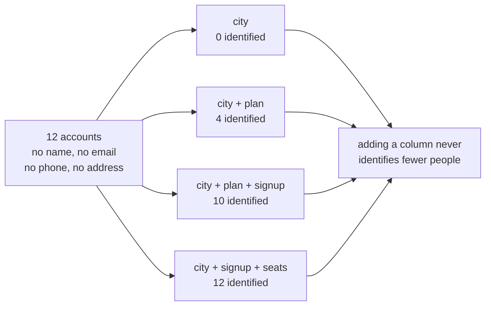

# 1.2 — Three columns that name one person

## One-line answer

A table with the name, the address, the telephone number and the email all removed still names
**ten of its twelve accounts** once you look at three ordinary columns together, because
identification is a property of combinations and not of fields.

## The story

A delivery driver rings you. He has a parcel and he cannot find the house.

You do not give him the number, because you cannot remember whether the sign is still on the gate.
You say: it is the road with the corner shop, we are opposite the shop, the door is blue, and there
is usually a small dog barking at the window.

He finds it immediately.

Think about what you actually told him. Thousands of roads have a corner shop. Thousands of houses
are opposite one. Blue doors are common and so are small dogs. Every single fact you gave him is
shared with an enormous number of other households, and not one of them is your address.

Together they are your address. You did not give him a partial answer; you gave him a complete one
in four pieces, and each piece looked harmless on the way out of your mouth.

## The idea in plain language

The pieces have a name: **quasi-identifiers**, introduced in
[1.1](1.1-the-list-of-fields-is-not-the-answer.md). A quasi-identifier is a value that describes a
lot of people on its own and progressively fewer as you add another one beside it.

The mechanism is arithmetic and it is worth being able to do in your head. Suppose a column has
three possible values, spread evenly. It splits a population into three groups. A second column with
four values splits each of those into four, so two columns give twelve groups. A third with five
gives sixty. The population does not grow while you do this — so at some point the number of groups
overtakes the number of people, and groups start containing exactly one person.

That point arrives much sooner than people expect, for two reasons.

**Values are not spread evenly.** Real populations clump. Most of your customers are on the common
plan in the big city, which means the ones who are not are in tiny groups from the first column
onward. The unusual combinations are exactly the ones that go unique first, and unusual people are
disproportionately the ones somebody is trying to find.

**The columns are not independent.** Signup month and plan are correlated, because a plan that
launched in 2021 cannot have a 2019 signup. Correlation does not slow this down; it produces empty
groups and concentrates everybody into fewer, which makes the surviving groups smaller.

The word for the opposite property is **k-anonymity**: a table is *k*-anonymous if every combination
of quasi-identifiers is shared by at least *k* rows. `k = 1` means somebody is alone in their group,
which is the same sentence as "this row is identified". The measurement below is a count of rows at
`k = 1`.

One more definition, because it is the thing people reach for and it does not work: **de-identified**
is not a state you achieve by deleting the obvious columns. It is a claim about a *specific* table
against a *specific* set of things an attacker might already know, and it has to be measured against
that set. A table with the names removed and nothing else done to it is not de-identified; it is a
table with the names removed.

## Why Sutra needs it

Day 48 made `holder` the field that makes erasure possible
([4.2](../../../day-48-memory-design/parts/04-privacy-and-erasure/4.2-you-cannot-delete-what-you-cannot-address.md)),
and Day 22 built structured logs whose whole purpose is to be queried
([1.2](../../../day-22-structured-logging/parts/01-a-line-you-can-query/1.2-one-json-object-per-line.md)).
Both of those are good decisions and both of them produce rows full of attributes.

The tempting move, on any of the days from here to the observability phase, is to say: *we will not
log the customer's text, we will log the metadata* — the plan, the region, the account age, the
number of seats. That sounds like the careful choice. This part is the measurement that says
metadata is not the safe half, and the number is not close.

## The mechanism

`lab/_archive.py` carries a twelve-row customer table with no name, no email, no telephone number
and no address in it. Only `city`, `plan`, `signup` and `seats`.

```bash
cd days/day-69-pii-and-data-boundaries/lab
uv run python quasi.py --show
```

**Line by line:**

- `quasi.py` takes every combination of those four columns — singles, pairs, triples and the full
  set — and counts how many rows are the **only** row carrying their own value of that combination.
- A row alone in its group is a row at `k = 1`, which is the definition above made countable.
- `--show` then lists the accounts that `city + plan + signup` isolates, so the count is not an
  abstraction.

Measured on 2026-09-06:

```text
12 accounts, no name / email / phone / address in the table

  columns                            accounts named exactly
  city                                  0 of 12
  plan                                  0 of 12
  signup                                0 of 12
  seats                                 3 of 12  ###
  city + plan                           4 of 12  ####
  city + signup                         6 of 12  ######
  city + seats                          8 of 12  ########
  plan + signup                         2 of 12  ##
  plan + seats                          3 of 12  ###
  signup + seats                        6 of 12  ######
  city + plan + signup                 10 of 12  ##########
  city + plan + seats                   8 of 12  ########
  city + signup + seats                12 of 12  ############
  plan + signup + seats                 6 of 12  ######
  city + plan + signup + seats         12 of 12  ############
```

Read the first three rows first, because they are the ones that make people relaxed. `city` alone
identifies nobody. `plan` alone identifies nobody. `signup` alone identifies nobody. Each of those
three columns is, on its own, exactly as harmless as it looks.

Then read the row four lines from the bottom. **`city + plan + signup` names ten of the twelve
accounts.** Three columns that were individually worthless are jointly decisive for five out of
every six people in the table.

And `city + signup + seats` reaches **twelve of twelve**. Every single account is alone in its
group. There is no anonymity left in the table at all, and there was never a name in it.

The `--show` block says which accounts, so the claim is inspectable rather than statistical:

```text
  isolated by city + plan + signup:
    88-4471  Bristol   Pro   2019-03
    88-4472  Bristol   Team  2019-03
    88-4473  Leeds     Pro   2019-03
    88-4474  Bristol   Pro   2021-11
    88-4476  Cardiff   Free  2022-01
    88-4478  Cardiff   Pro   2019-03
    88-4479  Bristol   Free  2022-01
    88-6120  Leeds     Pro   2021-11
    88-6121  Cardiff   Team  2022-01
    88-6122  Bristol   Team  2020-07
```

`88-4471` is *the* Bristol Pro account that opened in March 2019. If you know that much about a
company — and a competitor, a former employee or anybody who read a case study does — you have their
account number, and from
[1.1](1.1-the-list-of-fields-is-not-the-answer.md) the account number is how the whole system looks
people up.

Notice the two accounts that survive: `88-4475` and `88-4477` are both Leeds, Team, 2020-07. They
are protected by each other and by nothing else. Add `seats` — 4 and 9 — and they separate, which
is the bottom row of the table reaching twelve of twelve.



That last box is the property worth carrying away: this number **only goes up**. Every attribute
anybody adds to a log line, a metrics label or an analytics export moves the table further right on
that chart, and no attribute has ever moved it back.

## When it breaks

The break is not in the code. It is in the sentence somebody writes in a design document, and it
usually reads: *"we only store anonymised metadata."*

Here is the specific version this repository could produce. Day 22's logger writes one JSON object
per line. Somebody, being careful, decides not to log the ticket text and to log attributes instead:

```text
{"event": "ticket.handled", "city": "Bristol", "plan": "Pro", "signup": "2019-03", "ms": 412}
```

There is no name in that line, no address, no account number and no customer text. It looks like the
cautious version, and by the table above it is `88-4471` written in a way that will not trip any
search for personal data — including your own. A log-retention policy that keeps these lines for a
year has kept a year of identified customer activity while believing it kept none.

The second break is worse because it involves nobody doing anything wrong at all. Two exports, from
two teams, each individually fine: one carries `city + plan` and a hashed account, the other carries
`city + plan + signup` and a support outcome. Neither is identified. Join them on `city + plan` and
the second table's `signup` column identifies rows in the first. **Anonymity is not preserved by
joins**, and nobody reviews the join, because each half passed its own review.

## In production

**What a professional writes instead.** They pick the quasi-identifiers deliberately and then do
one of three things to each: **drop it**, **generalise it** (region instead of city, year instead of
month, a bucket instead of a seat count) or **accept it and treat the store as identified data** with
the retention and access controls that follow. The third option is legitimate and is usually the
right one — the mistake is not keeping identifying data, it is keeping identifying data in a store
whose rules were written on the assumption that it was anonymous.

**What degrades at scale.** Generalisation buys less than it appears to. Widening `city` to `region`
raises `k` for the common values and barely moves it for the rare ones, because the customer in the
only town you serve in that region is still alone. The rows that stay unique after generalisation
are disproportionately the large, unusual, identifiable accounts — the ones you would most regret.

**The failure mode that only appears with real traffic.** Time is a quasi-identifier and almost
nobody counts it. A log with a millisecond timestamp and a plan is close to unique per event,
because two customers rarely act in the same millisecond. Every trace this project produces from the
observability phase onward carries precise timestamps, and they are an identifying column that no
schema review flags because it is called `ts`.

**The review comment a senior engineer leaves:** *"This dashboard groups by city, plan and signup
cohort. On our customer counts most of those cells contain one account, so this is not aggregate
data, it is a per-customer report with the name column hidden. Either enforce a minimum cell size or
put it behind the same access control as the customer table."*

**The interview question:** *"You have removed names and emails from a dataset. Is it anonymous?"*
The answer that shows you have done this: *"No, and I can put a number on why. I measured a customer
table with no name, email, phone or address in it — four ordinary columns — and three of them
together uniquely identified ten of twelve accounts, while any one of them identified none. That is
the whole trap: every column passes review on its own. What I do now is measure `k` on the actual
combination the store will hold, decide per column whether to drop, generalise or accept, and
write down which attacker knowledge I assumed — because de-identification is a claim about a
specific table against a specific outsider, not a property you get from deleting a name column."*

## Check yourself

```bash
cd days/day-69-pii-and-data-boundaries/lab
uv run python quasi.py
uv run python quasi.py --show
```

Open `lab/_archive.py`, change one row so that `88-4471` shares its `city + plan + signup` with
another account, and re-run. Write down how many of the twelve are still identified, and say which
account you protected and which you did not.

**Out loud, without scrolling up:** explain to somebody why deleting the name column does not make a
table anonymous, using a number from the run you just did.

**Next:** [1.3 — The box marked "anything else"](1.3-the-box-marked-anything-else.md).
