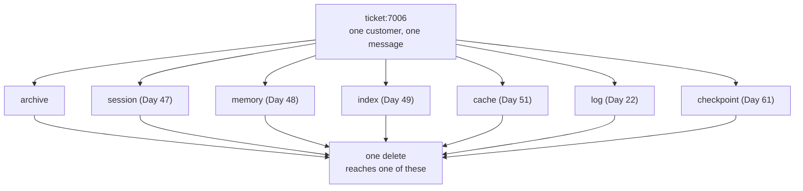

# 2.1 — One sentence, seven places

## One-line answer

One ordinary run of the desk leaves one customer's email address in **all seven** of its stores,
**thirteen** times, and not one line of code in the previous twenty days was written to copy
customer data.

## The story

You apply for a parking permit at a council office.

You fill in one form and hand it over. The clerk takes it, and before you have left the counter she
has photocopied it: one for the file, one for the permits team, one for the finance desk because
there is a fee. The original goes in a tray.

Later that week somebody in permits copies theirs again to attach to a query. Finance scans theirs
into a system. The file copy gets bound into a folder that goes into a basement.

Ask any one of those people how many copies of your form exist and they will tell you about theirs.
Every one of them made a copy for a reason you would agree with if they explained it. Nobody set out
to distribute your address around a building.

A year later you ask for your details to be removed, and the honest answer is that nobody in the
building knows where they all are.

## The idea in plain language

A store gets built for a reason. It solves a problem, the problem was real, and the person who built
it was thinking about that problem and not about what the store now contains.

That is the entire mechanism, and it is worth stating without any drama: **copies of personal data
are not created by carelessness, they are created by features.** Every store in this project exists
because an earlier day argued for it and the argument was good.

| Day | What it added | Why |
| --- | --- | --- |
| 22 | a structured log | so a run can be queried after it has finished |
| 47 | a persisted session | so a restart does not lose the conversation |
| 48 | a memory store | so the desk remembers what mattered |
| 49 | a retrieval index | so a question can find a prior ticket |
| 51 | a response cache | so the same question does not spend a second request |
| 61 | a checkpoint | so a killed run can resume where it stopped |

Six features, six stores, six good arguments, and one property nobody was tracking: each of them
takes a copy of the text it was handed.

The word that matters here is **derived**. A derived store is one whose contents are computed from
another store rather than written directly. An index is derived from the archive. A cache is derived
from prompts. A checkpoint is derived from a run. People do not think of derived stores as holding
data, because they think of them as holding *structure* — an index feels like it holds terms and
pointers, a cache feels like it holds results.

They hold the text. [2.3](2.3-the-copy-nobody-calls-a-copy.md) is about why, and it is not an
implementation accident that could be tidied away.

The consequence is that the question *"where is this customer's data?"* has an answer that grows
every time the system gains a capability, and the growth is invisible in code review, because the
review is about the capability.

## Why Sutra needs it

Day 48 spent a whole section on privacy and erasure, and every part of it reasoned about **the
memory store**: what enters it
([4.1](../../../day-48-memory-design/parts/04-privacy-and-erasure/4.1-redact-before-you-write.md)),
how a row is addressed
([4.2](../../../day-48-memory-design/parts/04-privacy-and-erasure/4.2-you-cannot-delete-what-you-cannot-address.md)),
and why erasure outranks the rest of the policy
([4.3](../../../day-48-memory-design/parts/04-privacy-and-erasure/4.3-erasure-is-an-obligation.md)).

That reasoning was correct and it was scoped to one store, because on Day 48 there was one store to
reason about. Day 49 added an index, Day 51 added a cache and Day 61 added checkpoints. Section 6 is
what happens when Day 48's erasure path meets the six stores that arrived after it was written.

## The mechanism

`lab/_desk.py` runs three tickets through a desk that writes to every store the previous days asked
for. There is no model in it — a recorded reply stands in for the generation, because what gets
written down is identical either way.

```bash
cd days/day-69-pii-and-data-boundaries/lab
uv run python copies.py --files
```

**Line by line:**

- `copies.py` calls `run()`, which handles three tickets end to end and leaves seven real files under
  `lab/state/`.
- It then counts, for one needle, how many times that string appears in each store as raw text on
  disk. Counting the text rather than parsing the structure is deliberate: a value that is present
  is present, whatever field it is in.
- The default needle is `lin.zhou@example.com`, the address from `ticket:7006`.
- `--files` lists the files afterwards, so the stores are things on a disk rather than an argument.

Measured on 2026-09-06:

```text
after one run of the desk, 'lin.zhou@example.com' appears in:

  store        times  written because
  archive          2  it is the ticket
  session          2  Day 47 persisted the conversation
  memory           2  Day 48's policy kept a memo
  index            2  Day 49 stored the chunk it indexed
  cache            2  Day 51 cached the prompt and reply
  log              1  Day 22 logged an excerpt
  checkpoint       2  Day 61 saved the run state

  stores holding it   7 of 7
  total copies        13

  on disk:
    lab\state\archive.json          2667 bytes
    lab\state\session.json          1274 bytes
    lab\state\memory.json            764 bytes
    lab\state\index.json            1840 bytes
    lab\state\cache.json            1061 bytes
    lab\state\log.jsonl              571 bytes
    lab\state\checkpoint.json       1118 bytes
```

**Seven of seven. Thirteen copies.** Three tickets.

Read the `written because` column again, because it is the whole argument. Not one of those rows
says "somebody was careless". Every row names a day, and every one of those days was doing the right
thing.

The count is higher than the number of stores because several stores hold the value twice. In the
archive it is in the sender field and in the sign-off, which is
[1.3](../01-who-a-record-names/1.3-the-box-marked-anything-else.md)'s point arriving again. In the
session it is in the user turn and again in the stored copy of the ticket. In the cache it is in the
prompt **and** in the response, which is
[2.4](2.4-the-reply-is-personal-data-too.md).

Now run it for the name rather than the address:

```bash
uv run python copies.py --needle "Lin Zhou"
```

**Line by line:**

- `--needle` swaps the string being counted. Nothing else about the run changes.
- The name is worth counting separately because no field anywhere in this system is called `name` —
  it exists only inside prose, so every copy of it is a copy somebody made of a paragraph.

```text
  stores holding it   7 of 7
  total copies        10
```

Ten copies of a customer's name, across seven stores, and there is no name column in the entire
system.



## When it breaks

The break is a data map that was accurate when it was written.

🎬 **The scene:** somebody writes `docs/DATA_BOUNDARY.md` — the document the build brief asks for
today. It lists the archive, the session store and the memory store, says what each holds and how
long it keeps it. It is careful, correct, and reviewed.

😬 **The naive fix:** keep it up to date. Add a line to the pull-request template asking whether this
change touches personal data.

💥 **Why it fails:** the question in the template gets answered honestly and wrongly. A pull request
adding a response cache is not, in the author's mind, a change that touches personal data — it is a
change that touches *quota*, and it was written to solve a quota problem. The map goes stale not
because anybody skipped the question but because the question requires the author to notice something
about their own change that the change is not about.

💡 **The insight:** a map maintained by intention will drift. The count above is not an argument for
being more careful; it is an argument for making the count **runnable**, so that the map is checked
by a script rather than remembered by a person. That is what `copies.py` is, in miniature, and it is
why [6.3](../06-the-delete-that-did-not/6.3-the-loop-over-a-list-somebody-kept.md) turns the store
list into a registry that code iterates rather than a list a human reads.

There is a second break, in the opposite direction, and it is the reason this part does not end with
"so store less". Somebody reads a count like thirteen and proposes removing the cache. That trades a
privacy problem for a quota problem, and Day 51 measured the quota problem: the response cache saves
54 requests out of 120 against a free tier of 20 a day. Deleting the store is a real option and it
has a real price, and the honest version of this work is to know both numbers rather than to be
frightened by one of them.

## In production

**What a professional writes instead.** They keep a **data inventory as code**: a registry, in the
repository, naming every store, its owner, what it holds, its retention and — crucially — the
function that deletes from it. Then a test walks the registry and fails when a store exists that the
registry does not know about. The document is generated from the registry rather than written beside
it, because a document written beside code is a document that will disagree with it.

**What degrades at scale.** The list stops being seven. Real systems have backups, replicas, a data
warehouse, a search cluster, message queues holding undelivered payloads, CDN caches, error-tracking
services holding request bodies, and a laptop somebody exported a CSV to. Each is a store by the
definition here, most of them are outside the repository, and several are outside the company. The
count in this lab is small because the lab is small, not because the shape is different.

**The failure mode that only appears with real traffic.** Retention periods diverge. The archive
keeps tickets for two years, the log for thirty days, the cache for an hour, the backups for seven
years. Now a customer's data has *four* different lifetimes in one system, the longest one lives in
the store nobody thinks of as a store, and the shortest one is the one quoted in the privacy notice.

**The review comment a senior engineer leaves:** *"This adds a cache keyed on the prompt. The prompt
contains the ticket body. That makes this a new store of customer text with a new retention period,
so it needs a row in the data inventory and a delete function before it ships — not after, because
after means the first erasure request we get is answered wrongly."*

**The interview question:** *"Where does customer data live in your system?"* The answer that shows
you have done this: *"More places than the design document says, and I can tell you how I found out.
I wrote a script that runs one ticket through the system and then greps every store on disk for the
customer's address. It came back in seven of seven — archive, session, memory, index, cache, log and
checkpoint — thirteen copies from three tickets. None of those stores was built to hold customer
data; they were built for restarts, retrieval, quota and resumption. That is the point. The fix was
not to be more careful, it was to put the store list in a registry that the delete path iterates, so
that adding a store without a delete function fails a test."*

## Check yourself

```bash
cd days/day-69-pii-and-data-boundaries/lab
uv run python copies.py --files
uv run python copies.py --needle "88-4471"
cat state/index.json
```

Open `state/cache.json` and find the customer's address in it twice. Say which of the two is the
prompt and which is the reply, and why the second one is there at all.

**Out loud, without scrolling up:** name three stores in this system that hold customer text and were
not built to hold customer text, and say what each one was built for.

**Next:** [2.2 — A boundary is a line you can name](2.2-a-boundary-is-a-line-you-can-name.md).
