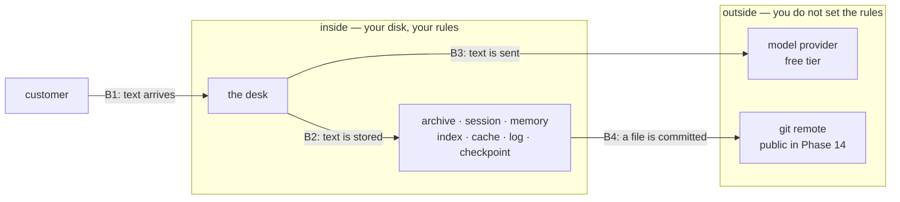

# 2.2 — A boundary is a line you can name

## One-line answer

A data boundary is not a feeling about what is sensitive; it is a **named line with a rule attached**,
and until you can say where the line is and what may cross it, you have a preference rather than a
control.

## The story

There is a counter in a pharmacy, and behind it a doorway with a strip curtain.

In front of the counter you can pick things up, read the boxes, put them back. Behind it are the
shelves where the prescription medicines are, and you do not go back there. Not because a sign
forbids it — there may not be a sign — but because everybody, including you, knows where the line is
and knows it is the line.

Now imagine the pharmacist tells you the shop takes privacy very seriously and that staff are careful
with medicines. That is true, and it is not the counter. If somebody asks *"who is allowed to walk to
the back shelves?"* the answer "we are careful" tells them nothing, and the answer "staff only, and
the curtain is the line" tells them everything, including how to notice when it has been broken.

The counter works because it is in one place, everybody can point at it, and there is one rule about
crossing it.

## The idea in plain language

A **trust boundary** is a line in a system with a different set of rules on each side. The
definition needs three concrete things, and a boundary that is missing any of them is not one.

1. **A name and a location.** Not "our data is protected" but "the process boundary between the desk
   and the provider", or "the disk under `lab/state/`". Somebody must be able to point at it in the
   code or the deployment.
2. **A statement of what may cross, in which direction.** Boundaries are directional. Text flowing
   *out* to a model provider is a completely different question from text flowing *in* from a
   customer, and a rule that does not say which way it is talking about is ambiguous exactly where it
   matters.
3. **A place where the crossing happens** — one function, one callback, one queue — so that the rule
   has somewhere to live. This is the same argument Day 40 made about tool filtering: a check is only
   a check if there is exactly one door
   ([1.3](../../../day-40-filtering-and-allowlists/parts/01-the-list-you-agreed-to/1.3-the-filter-is-on-your-side.md)).

The reason to insist on all three is that boundaries are what make the rest of this subject
tractable. Once a line is named, you can ask a question with a yes-or-no answer: *does this value
cross it?* Without a named line, every conversation about privacy becomes a conversation about how
sensitive something feels, and those conversations do not converge.

It also changes what a fix looks like. If the boundary is "text going to the provider", then the fix
is a function on that path, and it is testable. If the boundary is "we are careful", the fix is
training.

Sutra has four lines worth naming, and they are not equally interesting.

- **Customer → desk.** Text arriving. Untrusted, and Day 66 through 68 are about what it can make
  the agent *do*. Today's interest is different: this is where personal data enters, and it is the
  only point at which you can decline to hold it at all.
- **Desk → its own stores.** The seven files from
  [2.1](2.1-one-sentence-seven-places.md). Crossing this line means the data now has a lifetime, a
  backup and an erasure obligation.
- **Desk → the model provider.** The one that leaves the building. Section 3 is entirely about it,
  because the rule there is not written by you.
- **Desk → the repository.** Day 48 named this one
  ([4.4](../../../day-48-memory-design/parts/04-privacy-and-erasure/4.4-the-store-that-must-not-be-committed.md)):
  git keeps everything, and this repository goes public.

## Why Sutra needs it

The build brief asks for `docs/DATA_BOUNDARY.md`, and this part is the reason it is a document rather
than a paragraph in a README. A boundary that lives in somebody's head cannot be reviewed, cannot be
tested and cannot be handed over.

It is also what makes section 3 decidable. When the provider's terms say *do not submit personal
information to the unpaid services*, that sentence is unusable until you know which line it applies
to. With the four lines above, it applies to exactly one, and the engineering that follows is a check
on one path rather than an anxiety about the whole system.

## The mechanism

The boundary map for this desk, drawn from the stores
[2.1](2.1-one-sentence-seven-places.md) actually found:



Four crossings, and the rules on them are not the same shape:

| | Crossing | Rule | Enforced where |
| --- | --- | --- | --- |
| **B1** | customer → desk | accept, but decide immediately what is kept | the intake stage |
| **B2** | desk → stores | redact before the write (Day 48's rule) | one write path per store |
| **B3** | desk → provider | **synthetic data only** on the free tier | the model call path |
| **B4** | stores → git | never; `days/*/lab/` and `state/` are ignored | `.gitignore` |

B4 is the one already enforced, and it is worth checking rather than believing:

```bash
cd days/day-69-pii-and-data-boundaries/lab
uv run python copies.py > /dev/null
git check-ignore -v state/archive.json
```

**Line by line:**

- `copies.py > /dev/null` runs the desk so the files exist; the output is discarded because the count
  is [2.1](2.1-one-sentence-seven-places.md)'s subject, not this one.
- `git check-ignore -v` asks git which rule, if any, excludes a path, and prints the file and line
  number of the rule. It exits `0` when the path is ignored and `1` when it is not, which makes it
  usable in a check rather than only readable by a person.

Measured on 2026-09-06:

```text
.gitignore:34:days/*/lab/	state/archive.json
```

Line 34 of `.gitignore` is what stands between thirteen copies of a customer's address and a public
repository. That is a boundary in the sense this part means: named, located, and with a rule you can
run.

Now compare it with B3, which is not enforced anywhere yet. Today's build brief asks for
`sutra/data_boundary.py`, and `gate.py` fails until it exists:

```bash
uv run python gate.py; echo "exit: $?"
```

```text
  - sutra/data_boundary.py does not exist (cannot check its behaviour)
  - docs/DATA_BOUNDARY.md does not exist - the boundary is not written down
  - tests/test_data_boundary.py does not exist
  - redactor free-text recall is 69% (9/13), below the 90% floor

findings: 4
exit: 1
```

Three of those four findings are the same finding stated three ways: **there is no door on B3.** The
rule exists — Addendum 02 has said "never feed real personal data through free endpoints" since it
was written — and there is nowhere for it to live.

## When it breaks

The break is a boundary that exists in prose and not in a code path.

🎬 **The scene:** the team agrees that real customer data must never go to the free tier. Everybody
means it. It goes in the onboarding notes.

😬 **The naive fix:** rely on the agreement, and on the fact that the archive is synthetic anyway, so
the situation cannot arise.

💥 **Why it fails:** the situation arises through a path nobody was thinking about. Someone debugging
a production issue pastes a real ticket into a local script to reproduce it. The script calls the
same agent, which calls the free tier. No policy was broken by anybody who knew they were making a
decision, because the decision was made by a script that had been written for a different purpose,
and the boundary had no door for it to fail at.

💡 **The insight:** an unenforced boundary is a boundary you will cross by accident, in a way that
leaves no trace, on a day when you are busy with something else. The value of putting the check on
the path is not that it stops a determined person; it is that it converts a silent crossing into a
loud one.

The second break is a boundary drawn in the wrong place. Putting the redaction inside the desk's
reply-formatting code looks like it protects B3, and it protects one route to the provider. The
retrieval path, the summarisation path and the eval harness each call the model too. This is Day
40's argument again and Day 59's argument again: a check placed inside one of the things it guards is
not a boundary, it is a habit. The door belongs on the model call path itself, which in ADK is a
plugin — and that is what the build brief asks for.

## In production

**What a professional writes instead.** They enumerate crossings rather than stores, and they attach
each rule to a **choke point** in the code. In an ADK application the natural choke point for B3 is
a plugin's `before_model_callback`, because every model call in the process passes through it
whatever agent or node made it. `adk.dev/safety/` names this pattern directly, describing a plugin
"created to redact personally identifiable information before it's processed by a tool or sent to an
external service" (page fetched 2026-09-06). The signature on the installed `google-adk==2.7.1` is
`before_model_callback(self, *, callback_context, llm_request)` — verified by
`python -c "import inspect; from google.adk.plugins.base_plugin import BasePlugin;
print(inspect.signature(BasePlugin.before_model_callback))"` — and `llm_request.contents` is where
the text about to leave lives.

**What degrades at scale.** Choke points multiply. A second service, a batch job, a notebook and an
eval harness each acquire their own path to the provider, and a plugin installed on one runner does
not cover the others. The organisational version of the fix is to make the provider credential
available only through a wrapper that carries the check, so that the boundary is enforced by *how you
get a client* rather than by everyone remembering to install a plugin.

**The failure mode that only appears with real traffic.** Boundaries drift under incident pressure.
During an outage somebody adds verbose logging that includes the full request body, ships it to get
visibility, and the temporary change outlives the incident. B2's rule is intact in the code that was
reviewed and broken in the code that is running.

**The review comment a senior engineer leaves:** *"`DATA_BOUNDARY.md` lists our stores. It does not
say what crosses out of them, which is the half that matters. Give me the four crossings, the rule on
each, and the file and line where each rule is enforced — and if a crossing has no enforcement point,
say so in the document rather than leaving the row blank."*

**The interview question:** *"How do you stop customer data reaching a third-party model provider?"*
The answer that shows you have done this: *"By naming the crossing and putting one door on it. In our
case that was a plugin on the model-call path, because every agent and every node in the process goes
through it, and a redactor inside one agent only covers one route. Before that we had the rule
written down and nothing enforcing it, which meant the way we were going to break it was somebody
reproducing a bug locally with a real ticket — no decision, no trace. The check turned a silent
crossing into a loud one. I would also say what the document has to contain: the crossing, the
direction, the rule, and the file and line where it lives. A boundary without a location is a
preference."*

## Check yourself

```bash
cd days/day-69-pii-and-data-boundaries/lab
uv run python copies.py > /dev/null
git check-ignore -v state/archive.json; echo "exit: $?"
uv run python gate.py; echo "exit: $?"
```

Write down the four crossings from the table above and, for each, the file that would enforce it in
this repository. Two of them have an answer today. Two of them are the build brief.

**Out loud, without scrolling up:** give the three things a boundary needs before it counts as one,
and say which of the three "we are careful with customer data" is missing.

**Next:** [2.3 — The copy nobody calls a copy](2.3-the-copy-nobody-calls-a-copy.md).
